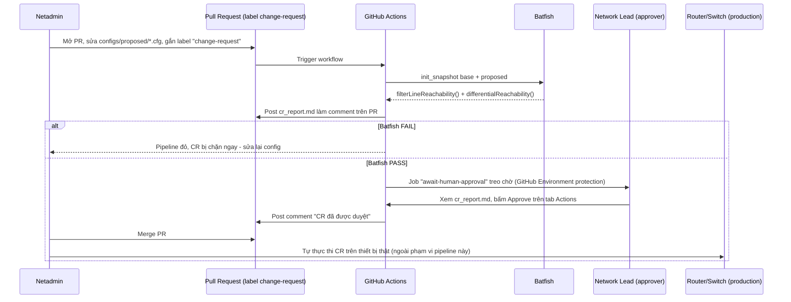

# Mô hình 5: Change Request Gate — Batfish Pre-approval

Khác với [Mô hình 3](../3-validation-canary-rollback/) (Batfish pass → tự động rollout canary luôn), mô hình này **chèn thêm một cổng chờ con người duyệt** giữa bước Batfish pass và bước netadmin được phép thực thi. Dùng cho các Change Request (CR) có rủi ro/impact cao — ví dụ sửa ACL biên, đổi BGP neighbor — nơi tổ chức yêu cầu sign-off của network lead trước khi động vào production, dù Batfish đã báo an toàn.

**Batfish chỉ trả lời "thay đổi này có an toàn về mặt kỹ thuật không". Việc "có nên làm bây giờ không" (đổi giờ bảo trì, thông báo trước cho ai, rollback plan...) vẫn cần con người quyết định — đó là lý do cần bước approve thủ công.**

---

## Luồng vận hành



Điểm mấu chốt: **pipeline không tự động push config lên thiết bị.** Nó chỉ làm 2 việc — (1) chặn CR có lỗi kỹ thuật rõ ràng, (2) tạo bằng chứng + cổng duyệt trước khi netadmin được phép tự tay thực thi (qua Ansible mô hình 1, hoặc thao tác thủ công theo quy trình MOP nội bộ).

---

## Cấu trúc

```text
5-change-request-gate/
├── README.md
├── cr_gate.py              # Script Batfish CR gate
└── configs/
    ├── base/                # Config production hiện tại (golden) - KHÔNG sửa trong PR
    └── proposed/            # Config đề xuất - netadmin sửa file ở đây khi mở CR
```

`configs/base` và `configs/proposed` demo sẵn một CR có 2 lỗi kinh điển (cùng bộ config dùng ở [`batfish/`](../../batfish/) script 03 & 04):
1. **ACL shadowed rule** trên `fw-edge`: dòng `permit tcp 10.10.10.0 ...` bị che khuất bởi dòng `deny ip any 10.20.20.0/24` đứng trước.
2. **Mất reachability** App Server (`10.10.10.50`) → DB Server (`10.20.20.100:5432`) do hệ quả của lỗi ACL trên.

---

## Chạy thử local

```bash
# 1. Khởi động Batfish server
docker run -d --name batfish -p 9997:9997 -p 9996:9996 batfish/allinone

# 2. Cài dependency
pip install pybatfish

# 3. Chạy CR gate
cd cicd-network-config/5-change-request-gate
python cr_gate.py
```

Kỳ vọng: script in báo cáo ra `cr_report.md`, phát hiện đúng 2 lỗi trên, `exit(1)`.

Muốn thấy trường hợp PASS: sửa `configs/proposed/fw-edge.cfg` để bỏ lỗi ACL (đảo lại thứ tự dòng `permit`/`deny` giống `configs/base/fw-edge.cfg`), chạy lại `python cr_gate.py` — kỳ vọng `exit(0)`, báo cáo ghi PASS.

---

## Thiết lập một lần trên GitHub (không cấu hình được bằng YAML)

Workflow [`network-cicd-5-change-request.yml`](../../.github/workflows/network-cicd-5-change-request.yml) dùng job `await-human-approval` gán `environment: cr-approval` để GitHub tự treo job chờ duyệt. Cần cấu hình tay 1 lần:

1. Repo Settings → **Environments** → **New environment** → đặt tên đúng `cr-approval`.
2. Tick **Required reviewers** → chọn account/team đóng vai trò network lead.
3. (Tuỳ chọn) Giới hạn branch được phép deploy vào environment này = `main`.

Sau bước này, mọi lần job `await-human-approval` chạy tới, GitHub sẽ tạm dừng và gửi thông báo cho reviewer bấm Approve/Reject trên tab **Actions** của PR — đúng nghĩa "chờ approve thủ công trước khi netadmin thực thi CR".
