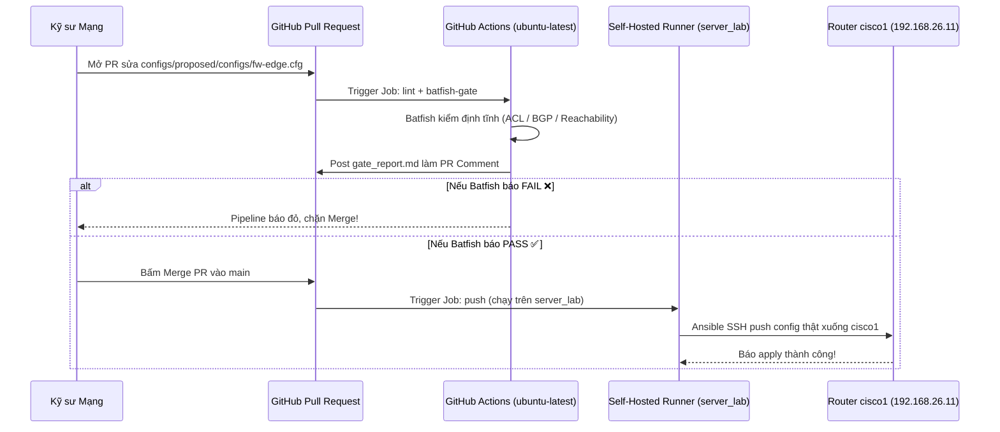

# 🧪 Hướng Dẫn Demo: Từ PR Trên GitHub Tới Triển Khai Tự Động Xuống Cisco1

Tài liệu này hướng dẫn chi tiết kịch bản thiết lập và thực hành **Demo luồng CI/CD NetDevOps (Validate-then-Push)** khi thay đổi cấu hình trên GitHub Pull Request và tự động đẩy xuống thiết bị thật `cisco1` trên Server Lab.

---

## 📐 1. Luồng vận hành hệ thống



---

## 🌐 2. Lưu ý quan trọng về Mạng (Server Lab KHÔNG CẦN IP Public)

- **Cơ chế hoạt động**: GitHub Actions Self-Hosted Runner hoạt động theo cơ chế **Outbound Long-Polling / WebSocket (HTTPS Port 443)** từ `server_lab` ra `github.com`.
- **Không cần IP Public / No Inbound Port**: GitHub Cloud **không bao giờ** gọi ngược hay SSH vào server lab của bạn. 
- **Quy trình**:
  1. Runner daemon (`./svc.sh`) trên `server_lab` giữ kết nối outbound tới GitHub.
  2. Khi PR được merge vào `main`, GitHub gửi thông báo tới Runner daemon.
  3. Runner tự kéo code về `server_lab` và gọi Ansible thực thi cục bộ.
  4. Ansible kết nối qua IP nội bộ (`192.168.26.11`) để push cấu hình xuống container `cisco1`.

---

## ⚙️ 3. Thiết lập Self-Hosted Runner trên Server Lab (Chỉ làm 1 lần)

1. Access GitHub Repository Settings:
   - Vào [https://github.com/networkthucchien/config1/settings/actions/runners/new](https://github.com/networkthucchien/config1/settings/actions/runners/new)
   - Chọn OS: **Linux** | Architecture: **x64**.
   - Copy token hiển thị trong lệnh `./config.sh --token <TOKEN>`.

2. Chạy lệnh đăng ký trên `server_lab` (`clab.9ping.cloud`):
   ```bash
   mkdir -p ~/actions-runner && cd ~/actions-runner
   curl -o actions-runner-linux-x64-2.322.0.tar.gz -L https://github.com/actions/runner/releases/download/v2.322.0/actions-runner-linux-x64-2.322.0.tar.gz
   tar xzf actions-runner-linux-x64-2.322.0.tar.gz
   ./config.sh --url https://github.com/networkthucchien/config1 --token <YOUR_TOKEN> --unattended
   sudo ./svc.sh install
   sudo ./svc.sh start
   ```

3. Xác nhận trên GitHub: **Settings ➔ Actions ➔ Runners** thấy runner `clab` hiện màu xanh **Idle**.

---

## 🎬 4. Kịch bản Demo thực hành từng bước

### 🛑 Kịch bản A: Mở PR sửa cấu hình lỗi (Batfish tự động chặn Push)

1. Trên máy cá nhân, tạo branch mới:
   ```bash
   git checkout -b feature/demo-bad-acl
   ```

2. Mở file `configs/proposed/configs/fw-edge.cfg` và chèn 1 dòng lỗi ACL shadow (`deny ip any 10.20.20.0 0.0.0.255` trước dòng permit):
   ```cisco
   ip access-list extended SEC-ACL-IN
    deny ip any 10.20.20.0 0.0.0.255
    permit tcp 10.10.10.0 0.0.0.255 10.20.20.0 0.0.0.255 eq 5432
   ```

3. Commit & Mở Pull Request trên GitHub:
   ```bash
   git add configs/proposed/configs/fw-edge.cfg
   git commit -m "test: add bad ACL rule for firewall"
   git push -u origin feature/demo-bad-acl
   gh pr create --title "test: bad ACL policy change" --body "PR thử nghiệm Batfish Gate"
   ```

4. **Kết quả kỳ vọng**: 
   - GitHub Actions chạy `batfish-gate` trên Cloud Runner (`ubuntu-latest`).
   - Batfish phát hiện lỗi ACL bị shadow ➔ Post comment `:x: FAIL` trực tiếp làm PR comment.
   - Pipeline báo đỏ, chặn nút Merge. Cấu hình lỗi **tuyệt đối không bị đẩy xuống `cisco1`**.

---

### 🚀 Kịch bản B: Fix PR ➔ Merge ➔ Tự động Push xuống `cisco1`

1. Sửa lại file `configs/proposed/configs/fw-edge.cfg` (xoá dòng `deny ip any...` bị thừa).

2. Commit & Push lại:
   ```bash
   git commit -am "fix: remove shadowed ACL rule"
   git push origin feature/demo-bad-acl
   ```

3. **Kết quả kỳ vọng**:
   - Batfish re-check ➔ Post comment `:white_check_mark: PASS` khẳng định cấu hình an toàn.
   - Bấm **Merge Pull Request** vào `main` (hoặc gõ `gh pr merge --merge`).
   - Sự kiện `push` to `main` kích hoạt job `push` trên **Self-Hosted Runner** (`server_lab`).
   - Ansible chạy `ansible-playbook -i ansible/inventory.yml ansible/push_config.yml` đẩy cấu hình mới trực tiếp xuống `cisco1`.

---

## 🔍 5. Kiểm tra kết quả trực tiếp trên Router `cisco1`

Trên `server_lab`, chạy lệnh kiểm tra running-config thực tế của `cisco1`:

```bash
docker exec -it clab-cicd_simple_validate_push_lab-cisco1 vtysh -c "show ip access-lists SEC-ACL-IN"
```

Hoặc sử dụng Ansible:
```bash
cd ~/lab6-simple-validate-then-push/ansible
ansible -i inventory.yml all -m cisco.ios.ios_command -a "commands='show ip access-lists SEC-ACL-IN'"
```
