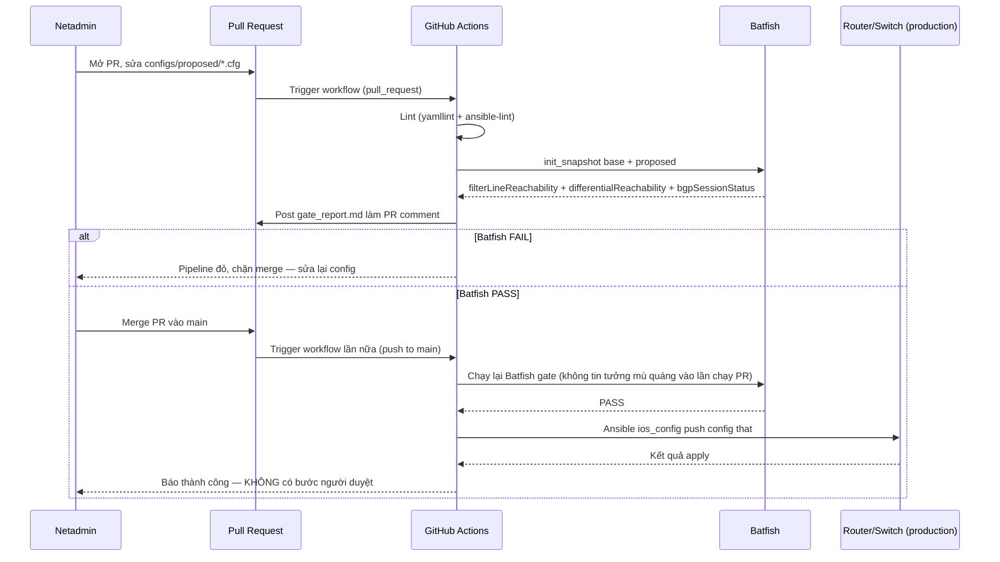

# Lab 6 — Simple Validate-then-Push

Ví dụ **kết hợp Mô hình 1 (GitOps Push) + Batfish gate**, không canary/rollback (khác [Mô hình 3](../3-validation-canary-rollback/)), không cổng chờ người duyệt (khác [Mô hình 5](../5-change-request-gate/)). Đúng nghĩa đen: **netadmin mở PR → GitHub kiểm tra bằng Batfish → Batfish PASS thì CI tự động push xuống thiết bị thật, không cần ai bấm approve.**

> **Tự chứa hoàn toàn**: chỉ cần `cd` vào thư mục này là chạy được — không cần file nào ở `batfish/` hay `network-automation/`. `config/cisco.config.partial`, `docker-compose.yml`, `requirements.txt` đều đã copy sẵn vào đây.

---

## Luồng vận hành



Điểm khác biệt cốt lõi so với 5 mô hình gốc: job Batfish gate **chạy lại trên chính sự kiện `push` vào `main`**, không chỉ trên `pull_request`. Nghĩa là pipeline tự enforce "phải kiểm tra trước khi push" ngay trong cùng 1 workflow run — không phụ thuộc hoàn toàn vào cấu hình branch-protection của GitHub (dù vẫn nên bật thêm để chặn merge trực tiếp không qua CI).

Workflow CI tương ứng: [`.github/workflows/network-cicd-6-simple-validate-push.yml`](../../.github/workflows/network-cicd-6-simple-validate-push.yml).

---

## So sánh nhanh

| | Mô hình 1 (Push) | Mô hình 3 (Validate+Canary) | Mô hình 5 (CR Gate) | Lab 6 (lab này) |
| :--- | :--- | :--- | :--- | :--- |
| Batfish validate | Không | Có | Có | Có |
| Canary + rollback | Không | Có | Không (chưa tới bước push) | Không |
| Người duyệt (approve) | Không | Không | **Có, bắt buộc** | Không |
| Auto push khi PASS | Có (không validate) | Có (lên digital-twin/canary) | **Không** (netadmin tự thực thi ngoài CI) | **Có, thẳng ra thiết bị** |

---

## Cấu trúc

```text
6-simple-validate-then-push/
├── README.md
├── topology.clab.yml         # 4 node cisco_iol (fw-edge, r1-core, r2-core, sw-dist1), standalone
├── docker-compose.yml        # Batfish server (batfish/allinone) — chạy local, tự chứa
├── requirements.txt          # pybatfish, pandas, tabulate, rich
├── config/
│   └── cisco.config.partial  # startup-config dùng chung cho containerlab (copy sẵn, không tham chiếu ra ngoài)
├── configs/
│   ├── base/                 # config production hiện tại (golden) — KHÔNG sửa trong PR
│   └── proposed/             # config đề xuất — netadmin sửa file ở đây khi mở PR
├── batfish_gate.py           # Script Batfish gate — 3 kiểm tra, không có bước approve
└── ansible/
    ├── inventory.yml         # 4 host, creds lấy từ biến môi trường
    ├── requirements.yml      # collection cisco.ios
    └── push_config.yml       # push raw config từ configs/proposed/ xuống thiết bị
```

`configs/base` và `configs/proposed` dùng chung bộ dữ liệu demo với [`batfish/`](../../batfish/) và [Mô hình 5](../5-change-request-gate/) (đã copy nguyên văn vào đây): 2 lỗi kinh điển có sẵn trong `configs/proposed/`:

1. **ACL shadowed rule** trên `fw-edge`: dòng `permit tcp 10.10.10.0 ...` bị che khuất bởi dòng `deny ip any 10.20.20.0/24` đứng trước.
2. **BGP neighbor IP typo** trên `r2-core`: `neighbor 1.1.1.99` (đúng phải là `1.1.1.1`) → session BGP không thể lên.

Hệ quả: App Server (`10.10.10.50`) mất kết nối tới DB Server (`10.20.20.100:5432`).

---

## Chạy thử local

### 1. Batfish gate — demo FAIL

```bash
pip install -r requirements.txt
docker compose up -d
python batfish_gate.py
```

Kỳ vọng: `exit 1`, `gate_report.md` liệt kê đủ 3 mục — ACL shadow, mất reachability App→DB, BGP session disconnect trên `r2-core`.

### 2. Sửa config — demo PASS

Sửa `configs/proposed/fw-edge.cfg`: bỏ dòng `deny ip any 10.20.20.0 0.0.0.255` và remark lỗi phía trên nó (khôi phục giống `configs/base/fw-edge.cfg`).

Sửa `configs/proposed/r2-core.cfg`: đổi `neighbor 1.1.1.99` → `neighbor 1.1.1.1` ở cả 2 dòng (khôi phục giống `configs/base/r2-core.cfg`).

```bash
python batfish_gate.py
```

Kỳ vọng: `exit 0`, PASS.

### 3. Deploy digital-twin và push thật

```bash
sudo containerlab deploy -t topology.clab.yml
docker exec -it clab-cicd_simple_validate_push_lab-fw-edge cli   # kiểm tra `show ip interface brief` trước khi push

export LAB_DEVICE_PASSWORD=<mật khẩu lab>
export LAB_ENABLE_PASSWORD=<enable password lab>

ansible-galaxy collection install -r ansible/requirements.yml

cd ansible
ansible-playbook -i inventory.yml push_config.yml --check --diff   # dry-run trước
ansible-playbook -i inventory.yml push_config.yml                  # apply thật
```

### 4. Verify trên thiết bị

```bash
docker exec -it clab-cicd_simple_validate_push_lab-fw-edge vtysh -c "show ip access-lists SEC-ACL-IN"
docker exec -it clab-cicd_simple_validate_push_lab-r2-core vtysh -c "show running-config | section router bgp"
```

> Nếu `vtysh` không hoạt động trên `cisco_iol` khi bạn deploy thật (quirk tuỳ phiên bản image), dùng `ansible -i ansible/inventory.yml all -m cisco.ios.ios_command -a "commands='show running-config'"` thay thế.

---

## Cách CI vận hành

- Mở PR sửa file trong `configs/proposed/` → job `lint` (yamllint + ansible-lint), sau đó job `batfish-gate` spin Batfish server, chạy `batfish_gate.py`, post `gate_report.md` làm PR comment.
- Batfish FAIL → pipeline đỏ, PR bị chặn.
- Batfish PASS → PR có thể merge. Khi merge vào `main`, workflow trigger lại: job `batfish-gate` chạy lại (an toàn, không tin lần chạy PR trước), rồi job `push` (self-hosted runner có network reach tới lab) tự động `ansible-playbook push_config.yml` — **không có bước chờ người duyệt**.

---

## Giới hạn của lab

- `topology.clab.yml` không khai báo `links:` (giống mọi lab khác trong repo) — 4 node đứng độc lập trên mạng mgmt. Batfish validate topology **logic/giấy** (dựa trên nội dung file `.cfg`); containerlab ở đây chỉ chứng minh cơ chế push raw config lên CLI IOS thật hoạt động, **không** thể hiện OSPF/BGP hội tụ sống giữa các node.
- Không canary, không rollback: nếu Batfish bỏ sót một loại lỗi nào đó (nằm ngoài 3 check đã viết), config sai sẽ được áp thẳng lên toàn bộ 4 thiết bị cùng lúc.
- Không người duyệt: phù hợp cho thay đổi rủi ro thấp, đã được test kỹ ở dạng automated check. Với thay đổi rủi ro cao (đổi ACL biên, đổi BGP neighbor ở quy mô lớn), nên dùng [Mô hình 3](../3-validation-canary-rollback/) (thêm canary+rollback) hoặc [Mô hình 5](../5-change-request-gate/) (thêm người duyệt).

## Dọn lab

```bash
sudo containerlab destroy -t topology.clab.yml
docker compose down
```
