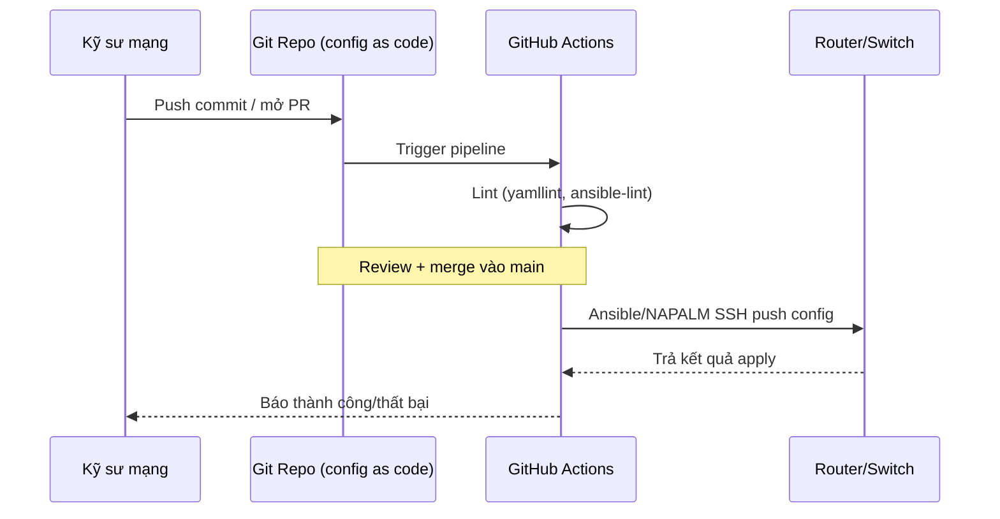
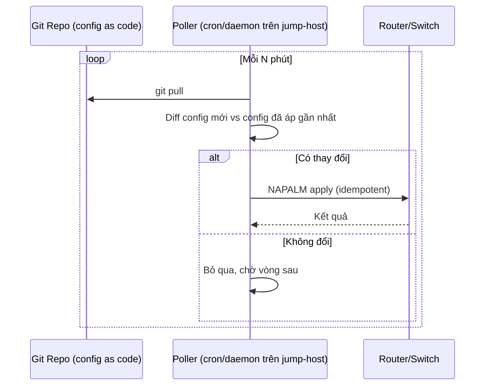
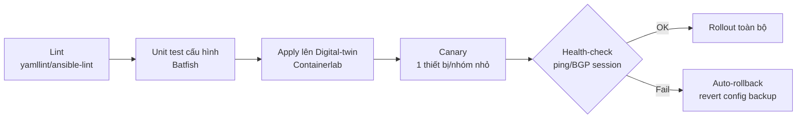
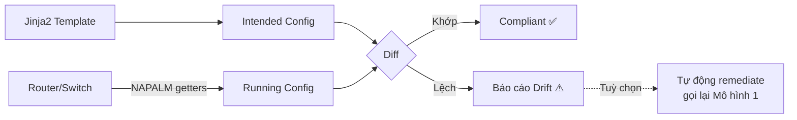
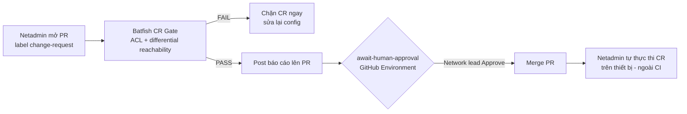
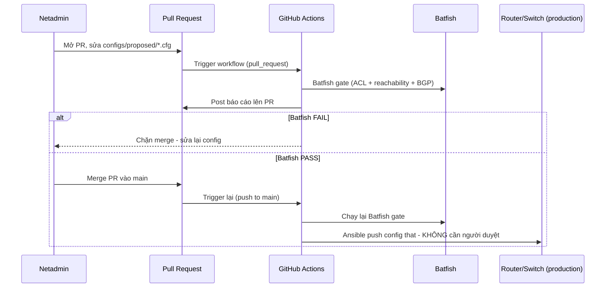

# 🔄 CI/CD cho Network Config — NetDevOps Deployment Models

Chào mừng bạn đến với module **CI/CD cho Network Configuration**! Đây là nơi hệ thống hóa các **mô hình triển khai CI/CD dành riêng cho cấu hình thiết bị mạng** (router, switch, firewall...) — khác với CI/CD cho ứng dụng, network config đụng tới trạng thái sống của hạ tầng, sai một dòng ACL/route có thể sập cả site.

Toàn bộ nội dung tập trung vào **open-source stack** (Ansible, NAPALM, Containerlab, Batfish...), có lab thực hành đi kèm cho từng mô hình để bạn tự chạy trên máy cá nhân.

---

## 1. Vì sao network config cần CI/CD?

| Cách làm truyền thống | Vấn đề |
| :--- | :--- |
| SSH tay vào từng thiết bị, gõ lệnh config | Không có review, không audit trail, dễ gõ nhầm lệnh |
| Copy-paste config giữa các thiết bị "giống nhau" | Config drift — thiết bị dần lệch nhau theo thời gian |
| Thay đổi trực tiếp trên production, không test trước | Không rollback được nhanh khi lỗi, outage kéo dài |
| Không ai biết ai đã đổi gì, khi nào | Debug sự cố mất hàng giờ vì thiếu lịch sử thay đổi |

Software engineering đã giải quyết các vấn đề tương tự bằng CI/CD: mọi thay đổi qua Git (review, audit), pipeline tự động test trước khi deploy, rollback nhanh khi có lỗi. **NetDevOps** áp dụng đúng triết lý đó cho network config — chỉ khác ở chỗ "unit test" của network không phải `pytest` mà là kiểm tra BGP session lên hay ACL có đúng ý đồ không.

---

## 2. Năm mô hình triển khai — toàn cảnh

| # | Mô hình | Cơ chế cốt lõi | Độ phổ biến | Độ phức tạp |
| :--- | :--- | :--- | :--- | :--- |
| 1 | **GitOps Push** | CI chủ động SSH/API đẩy config xuống thiết bị khi merge | ⭐⭐⭐⭐⭐ Rất phổ biến | Thấp |
| 2 | **GitOps Pull** | Agent/poller trên thiết bị (hoặc jump-host) tự kéo Git về áp dụng | ⭐⭐ Ít gặp | Trung bình |
| 3 | **Validation-first / Digital-twin** | Pipeline nhiều tầng kiểm định trước khi chạm production, có canary + rollback | ⭐⭐⭐⭐ Phổ biến ở tổ chức lớn | Cao |
| 4 | **Golden-config / Drift-detection** | So sánh liên tục intended config vs running config, báo cáo/tự sửa lệch | ⭐⭐⭐ Đang tăng | Trung bình |
| 5 | **Change Request Gate** | Batfish phân tích tĩnh CR + bắt buộc con người approve trước khi netadmin thực thi | ⭐⭐⭐ Ở tổ chức yêu cầu sign-off | Trung bình |

> 💡 5 mô hình này **không loại trừ nhau**. Thực tế production thường kết hợp: Push hoặc Validation-pipeline để *triển khai thay đổi*, Golden-config chạy song song để *phát hiện lệch* do ai đó sửa tay ngoài luồng CI, Change Request Gate chèn thêm bước *sign-off* cho các CR rủi ro cao.

---

## 3. Mô hình 1: GitOps Push

CI/CD server (GitHub Actions) đóng vai trò chủ động: khi PR merge vào `main`, pipeline SSH/NETCONF thẳng vào thiết bị để đẩy config. Đây là mô hình gần nhất với "CD" truyền thống trong software.

**Stack open-source:** Ansible (hoặc NAPALM/Netmiko trực tiếp) + GitHub Actions self-hosted runner (cần runner có network reach tới thiết bị, hoặc tới jump-host).

**Ưu điểm:** đơn giản, dễ hiểu, hội tụ ngay lập tức (config lên thiết bị ngay khi CI chạy xong), audit trail rõ ràng qua Git history.

**Nhược điểm:** CI server phải có quyền truy cập mạng (SSH/API) vào toàn bộ thiết bị → bề mặt tấn công lớn nếu CI bị compromise; nếu CI down thì không đẩy được config mới nhưng thiết bị vẫn chạy bình thường (không phải nhược điểm nghiêm trọng).

**Khi nào dùng:** mặc định cho hầu hết tổ chức — đơn giản, đủ tốt cho quy mô vừa và nhỏ.

📂 Lab thực hành: [`1-gitops-push-ansible-github-actions/`](./1-gitops-push-ansible-github-actions)

---

## 4. Mô hình 2: GitOps Pull

Khác với Kubernetes (nơi ArgoCD/Flux chạy như một controller pull liên tục), **thiết bị mạng truyền thống không chạy được "agent"** như kubelet. Nên pull model cho network thường phải mô phỏng qua một trong hai cách:

1. **Poller trên jump-host**: một service (cron job hoặc daemon) chạy trên máy trung gian, định kỳ `git pull` repo config, diff với trạng thái hiện tại, rồi tự áp dụng (idempotent) lên thiết bị qua NAPALM/Netmiko.
2. **Golden-config remediate loop**: biến thể của Mô hình 4 — phát hiện drift rồi tự động "kéo" intended config về áp lại.

**So sánh Push vs Pull:**

| Tiêu chí | Push | Pull |
| :--- | :--- | :--- |
| Ai chủ động kết nối | CI → thiết bị | Poller (nội bộ) → Git (ra ngoài) |
| Bề mặt tấn công | CI cần quyền SSH vào mọi thiết bị | Thiết bị/jump-host chỉ cần ra ngoài đọc Git (HTTPS), không cần mở SSH vào từ CI |
| Độ trễ hội tụ | Ngay lập tức khi CI chạy | Trễ theo chu kỳ poll (vài phút) |
| Độ phức tạp vận hành | Thấp | Cao hơn — phải tự quản lý poller, state |

**Khi nào dùng:** môi trường bảo mật cao, network segment không cho phép CI server SSH trực tiếp vào (ví dụ OT/ICS network, mạng air-gapped có jump-host).

📂 Lab thực hành: [`2-gitops-pull-poller/`](./2-gitops-pull-poller)

---

## 5. Mô hình 3: Validation-first / Digital-twin pipeline

Mô hình an toàn nhất — không đẩy config thẳng vào production mà đi qua nhiều tầng kiểm định, dùng **digital twin** (bản sao ảo bằng Containerlab) để test trước khi chạm thiết bị thật, rồi rollout dần qua canary.

| Stage | Mục đích | Tool |
| :--- | :--- | :--- |
| Lint | Bắt lỗi cú pháp/style sớm | `yamllint`, `ansible-lint` |
| Unit test | Kiểm tra logic config (routing loop, ACL conflict...) mà không cần thiết bị thật | Batfish |
| Digital-twin apply | Test trên bản sao ảo giống hệt topology thật | Containerlab |
| Canary | Áp lên 1 thiết bị/site nhỏ trước, giảm blast radius | Ansible limit host |
| Health-check | Xác nhận thay đổi không phá vỡ dịch vụ | ping, kiểm tra BGP session/interface state |
| Rollback | Nếu health-check fail, tự động revert | NAPALM `get_config` backup trước khi apply |

**Khi nào dùng:** thay đổi rủi ro cao (routing, ACL/firewall), môi trường production quy mô lớn, nhiều site.

📂 Lab thực hành: [`3-validation-canary-rollback/`](./3-validation-canary-rollback)

---

## 6. Mô hình 4: Golden-config / Drift-detection

Không triển khai thay đổi mới — mà **liên tục giám sát** để phát hiện khi running-config thực tế lệch khỏi "golden" (intended) config, thường do ai đó sửa tay ngoài quy trình CI.

Chạy theo lịch (cron/`schedule` trong GitHub Actions), không cần trigger bởi commit. Đây là "lưới an toàn" bổ trợ cho Mô hình 1-3, vì CI không thể ngăn được ai đó SSH tay vào sửa config trực tiếp — chỉ có thể phát hiện sau đó.

**Khi nào dùng:** kết hợp bắt buộc với bất kỳ mô hình nào ở trên, để đảm bảo compliance liên tục.

📂 Lab thực hành: [`4-golden-config-drift-detection/`](./4-golden-config-drift-detection)

---

## 7. Mô hình 5: Change Request Gate — Batfish Pre-approval

Khác Mô hình 3 ở chỗ Batfish pass **không** tự động rollout. Sau khi Batfish phân tích tĩnh CR (ACL/security + differential reachability) và báo PASS, pipeline dừng lại chờ một job được gán GitHub **Environment protection rule** — job này bị treo cho tới khi người có thẩm quyền (network lead) bấm Approve trên tab Actions. Chỉ sau khi được duyệt, netadmin mới merge PR và tự thực thi CR trên thiết bị (việc thực thi nằm ngoài phạm vi pipeline).

**Khi nào dùng:** CR có rủi ro/impact cao cần sign-off rõ ràng (đổi ACL biên, đổi BGP neighbor, thay đổi ảnh hưởng nhiều site) — nơi "Batfish báo an toàn" chưa đủ để tự động triển khai, tổ chức muốn giữ quyết định cuối cùng ở con người.

📂 Lab thực hành: [`5-change-request-gate/`](./5-change-request-gate)

---

## 8. Ví dụ kết hợp: Model 1 + Batfish Gate, không cổng duyệt

5 mô hình ở trên là các khối cốt lõi độc lập — thực tế nhiều đội bắt đầu bằng cách **ghép 2 khối đơn giản nhất lại**: lấy cơ chế push của Mô hình 1, thêm một bước Batfish gate mỏng (không canary/rollback như Mô hình 3, không cổng chờ người duyệt như Mô hình 5) làm điều kiện *duy nhất* để tự động push. Đây là điểm khởi đầu thực dụng trước khi tổ chức cần tới độ phức tạp của Mô hình 3 hoặc yêu cầu sign-off của Mô hình 5.

| | Mô hình 1 | Mô hình 3 | Mô hình 5 | Ví dụ này |
| :--- | :--- | :--- | :--- | :--- |
| Batfish validate | Không | Có | Có | Có |
| Canary + rollback | Không | Có | Không | Không |
| Người duyệt (approve) | Không | Không | **Có** | Không |
| Auto push khi PASS | Có (không validate) | Có (lên digital-twin) | **Không** | **Có, thẳng ra thiết bị** |

📂 Lab thực hành: [`6-simple-validate-then-push/`](./6-simple-validate-then-push)

---

## 9. Bảng công cụ open-source tổng hợp

| Công cụ | Vai trò |
| :--- | :--- |
| **Ansible** | Configuration management, đẩy config qua SSH (idempotent) |
| **NAPALM / Netmiko** | Thư viện Python giao tiếp đa vendor (get/apply config, getters) |
| **Nornir** | Framework tự động hóa Python thay thế/bổ sung Ansible cho task phức tạp |
| **GitHub Actions** | CI/CD engine — trigger theo push/PR/schedule |
| **Containerlab** | Dựng digital-twin topology bằng container (đã dùng ở `network-automation/containerlab/`) |
| **Batfish** | Phân tích tĩnh cấu hình mạng — phát hiện lỗi logic mà không cần thiết bị thật |
| **pyATS / Genie** | Framework test mạng của Cisco, parse output, health-check |
| **Jinja2** | Template engine sinh config từ dữ liệu (golden config) |

---

## 10. Lab thực hành

| Lab | Mô hình | Trạng thái |
| :--- | :--- | :--- |
| [`1-gitops-push-ansible-github-actions/`](./1-gitops-push-ansible-github-actions) | GitOps Push | ✅ Đã có |
| [`2-gitops-pull-poller/`](./2-gitops-pull-poller) | GitOps Pull | ✅ Đã có |
| [`3-validation-canary-rollback/`](./3-validation-canary-rollback) | Validation & Canary/Rollback | ✅ Đã có |
| [`4-golden-config-drift-detection/`](./4-golden-config-drift-detection) | Golden-config / Drift-detection | ✅ Đã có |
| [`5-change-request-gate/`](./5-change-request-gate) | Change Request Gate | ✅ Đã có |
| [`6-simple-validate-then-push/`](./6-simple-validate-then-push) | Ví dụ kết hợp Model 1 + Batfish Gate | ✅ Đã có |

Mỗi lab dùng chung nền tảng topology Containerlab (`cisco_iol`, theo mẫu ở `network-automation/containerlab/`), chỉ khác cơ chế triển khai — để bạn dễ so sánh trực tiếp giữa các mô hình.

> 💡 **Đóng góp:** Nếu bạn có kinh nghiệm thực chiến với mô hình khác (ví dụ tích hợp Nautobot/NetBox, Cisco NSO...), hãy mở PR chia sẻ nhé!
