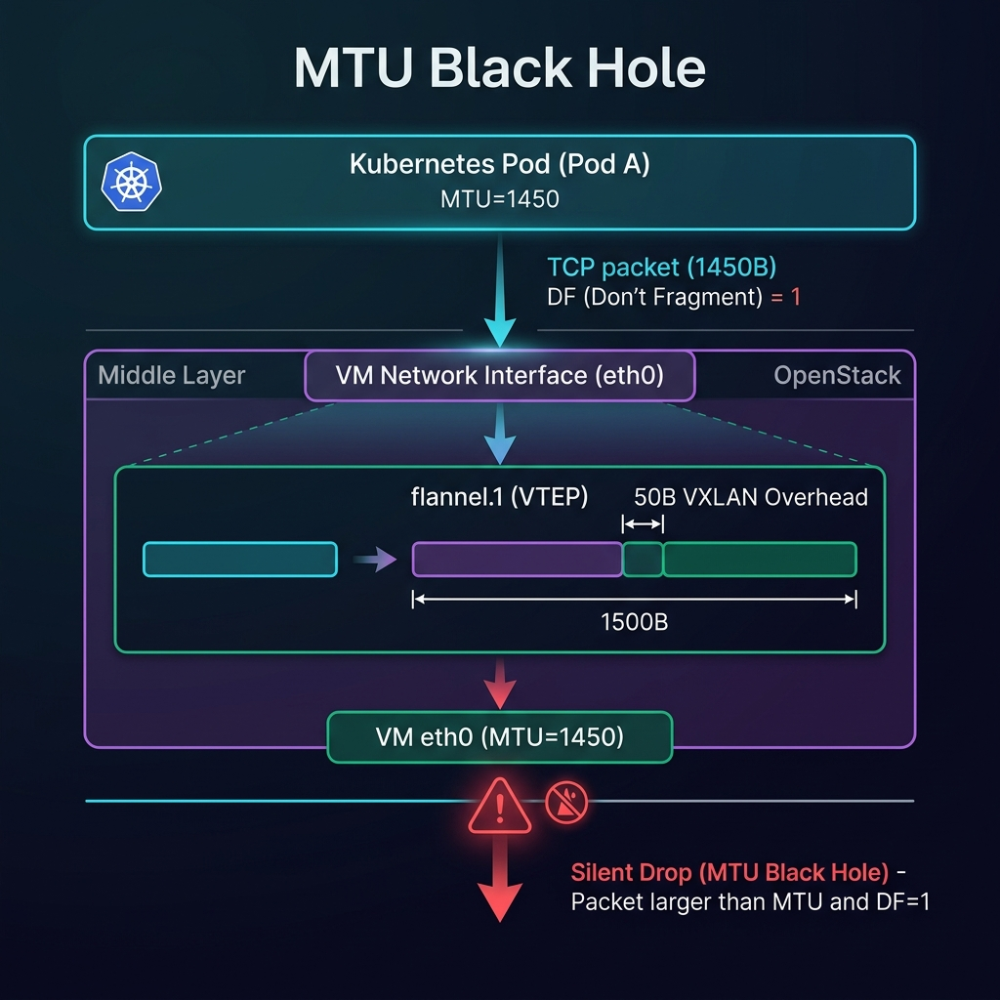
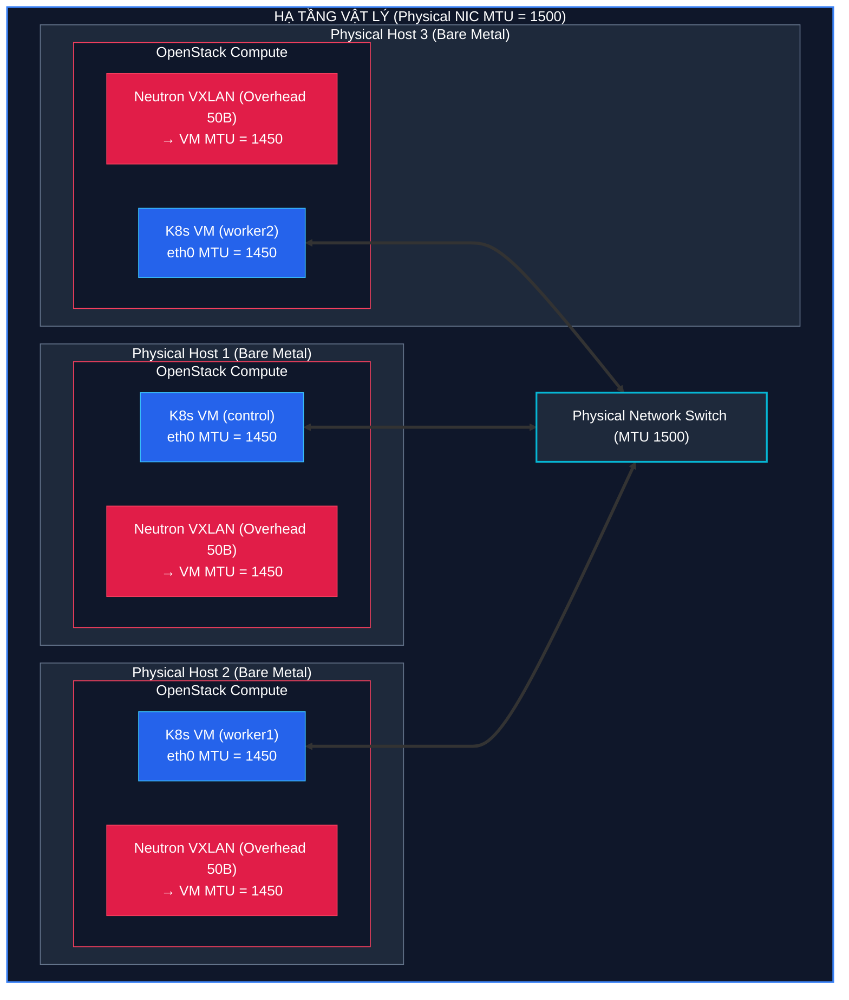
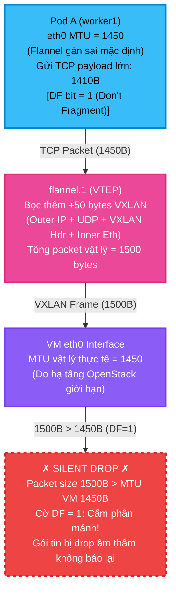

# Lab Tập 7: VXLAN Backend — Soi packet thực tế với tcpdump và Giải mã MTU

Tập này chúng ta sẽ dùng công cụ `tcpdump` để "soi" sâu vào bên trong đường hầm VXLAN tunnel, xác minh toàn bộ lý thuyết 50-byte overhead bằng thực nghiệm thực tế, và tìm hiểu cách hệ điều hành đàm phán kích thước gói tin nhằm tối ưu hóa đường truyền mạng.

---

## 🧭 Cấu trúc byte-by-byte của VXLAN Packet trên đường truyền

Khi gói tin đi trên dây cáp mạng vật lý (on the wire) giữa hai node, nó được bọc thành nhiều lớp L2/L3 lồng ghép cực kỳ chặt chẽ:

```
+---------------------------------------------------------------------------------------------------+
|                                      PHYSICAL ETHERNET FRAME                                      |
+----------------------+------------------+-----------------+---------------------------------------+
|  Outer Ethernet (L2) |  Outer IP (L3)   | Outer UDP (L4)  |            VXLAN HEADER               |
|      14 Bytes        |    20 Bytes      |    8 Bytes      |              8 Bytes                  |
| [Src Node MAC |      | [Src Node IP |    | [Src Port: Var  | [Flags (8b) | Reserved (24b) |        |
|  Dst Node MAC]       |  Dst Node IP]    |  Dst Port: 8472 |  VXLAN Network Identifier VNI (24b)   |
|                      |  Protocol: UDP   |  Length | Csum] |  Reserved (8b)]                       |
+----------------------+------------------+-----------------+---------------------------------------+
|                                  ENCAPSULATED INNER POD FRAME                                     |
+-----------------------------------------------------------+---------------------------------------+
|                    Inner Ethernet (L2)                    |             Inner IP (L3)             |
|                          14 Bytes                         |               20 Bytes                |
|               [Src Pod MAC | Dst Pod MAC]                 |       [Src Pod IP | Dst Pod IP]       |
+-----------------------------------------------------------+---------------------------------------+
|                       Inner L4 Header                     |                 PAYLOAD               |
|                    e.g. ICMP (8B) or TCP (20B)            |                 e.g. 64 Bytes         |
+-----------------------------------------------------------+---------------------------------------+
```

### 🧮 Công thức tính toán 50-byte Overhead:
* **Outer IP Header**: `20 bytes` (Định vị IP vật lý giữa Node nguồn và Node đích).
* **Outer UDP Header**: `8 bytes` (Chứa Source Port ngẫu nhiên để load-balancing và Destination Port cố định `8472`).
* **VXLAN Header**: `8 bytes` (Chứa trường VNI - VXLAN Network Identifier = 1 để định danh mạng).
* **Inner Ethernet**: `14 bytes` (Địa chỉ MAC ảo giữa Pod nguồn và VTEP đích).
* **Tổng cộng**: `20 + 8 + 8 + 14 = 50 bytes`.

---

## 🧭 Cơ chế Tự động Tối ưu hóa TCP MSS (Maximum Segment Size)

Bạn có thể tự hỏi: "Nếu MTU của Pod bị hạ xuống 1450, liệu ứng dụng có bị chậm đi do hệ điều hành phải liên tục chia cắt các packet lớn hay không?"

Câu trả lời là **Không**, nhờ vào cơ chế tự động đàm phán **TCP MSS**:
1. Khi một ứng dụng bên trong Pod thiết lập một kết nối TCP (ví dụ gửi một HTTP request), nó sẽ bắt đầu bằng quá trình bắt tay 3 bước (3-way handshake).
2. Khi gửi gói tin `SYN` khởi tạo, TCP stack trong nhân Linux của Pod sẽ kiểm tra MTU của interface ảo `eth0` (được gán mặc định là `1450`).
3. TCP stack sẽ tự động tính toán kích thước Payload tối đa cho một phân đoạn TCP, gọi là **MSS**:
   `TCP MSS = MTU − IP Header (20b) − TCP Header (20b) = 1450 − 20 − 20 = 1410 bytes`
4. Pod sẽ gửi thông số `MSS = 1410` này trong cờ SYN tới Server đích. Server nhận được thông số này và cam kết **chỉ** gửi các gói TCP có payload tối đa là `1410` bytes.
5. Khi gói tin này ra tới host và được VTEP bọc thêm `50` bytes VXLAN overhead, tổng kích thước gói tin vật lý sẽ là đúng:
   `1410 (TCP payload) + 20 (TCP header) + 20 (Inner IP) + 50 (VXLAN overhead) = 1500 bytes`
   Con số `1500` này khớp hoàn hảo với MTU chuẩn của hạ tầng vật lý, giúp gói tin đi qua các router trung gian trơn tru mà không bao giờ bị phân mảnh (fragmentation) ở mức vật lý!

---

## 🛠 Yêu cầu chuẩn bị
- Cụm K8s với Flannel VXLAN đang chạy (Tập 6).
- `pod-a` trên `worker1`, `pod-b` trên `worker2` (nếu chưa có, tạo lại từ Tập 6).

---

## 🔬 Thí nghiệm 1: Bắt VXLAN traffic với tcpdump — Xem tận mắt 2 tầng IP

**Mở 3 terminal song song.**

**Terminal 1 — SSH vào `worker1`, bắt gói VXLAN:**
```bash
multipass shell worker1
sudo tcpdump -i eth0 -n udp port 8472 -v
```
*Để terminal chạy — đang chờ gói tin.*

**Terminal 2 — SSH vào `worker1`, xem VNI của VTEP để đối chiếu:**
```bash
multipass shell worker1
ip -d link show flannel.1 | grep vxlan
```
*Ghi lại VNI (thường là `id 1`).*

**Terminal 3 — SSH vào `controlplane`, kích hoạt traffic:**
```bash
multipass shell controlplane
POD_B_IP=$(kubectl get pod pod-b -o jsonpath='{.status.podIP}')
echo "IP pod-b: $POD_B_IP"
kubectl exec pod-a -- ping -c 5 $POD_B_IP
```

**Quan sát Terminal 1 — tcpdump sẽ in 2 dòng cho mỗi gói:**
```
IP 192.168.64.11.xxxxx > 192.168.64.12.8472: VXLAN, flags [I] (0x08), vni 1
IP 10.244.1.X > 10.244.2.Y: ICMP echo request, id X, seq 1, length 64
```

*Giải mã:*
- Dòng 1: **Outer frame** — địa chỉ vật lý Node nguồn → Node đích, cổng 8472, VNI = 1
- Dòng 2: **Inner packet** — địa chỉ Pod thực sự bên trong tunnel
- VNI `1` khớp với output `ip -d link show flannel.1` ở Terminal 2

---

## 🔬 Thí nghiệm 2: Chứng minh 50 bytes overhead bằng length field

**Terminal worker1 — Bắt gói lọc theo dòng length:**
```bash
sudo tcpdump -i eth0 -n udp port 8472 -v 2>/dev/null | grep "length"
```

**Terminal controlplane — Gửi ping payload cố định 64 bytes:**
```bash
POD_B_IP=$(kubectl get pod pod-b -o jsonpath='{.status.podIP}')
kubectl exec pod-a -- ping -c 3 -s 64 $POD_B_IP
```

**Đọc hiệu số từ tcpdump output:**

| Layer | Tính | Kết quả |
|-------|------|---------|
| ICMP payload | 64 bytes | |
| + ICMP header | + 8 bytes | = 72 bytes |
| + Inner IP header | + 20 bytes | = **92 bytes** (inner packet) |
| + VXLAN overhead (20+8+8+14) | + 50 bytes | = **142 bytes** (outer packet) |

tcpdump sẽ in `length 142` ở outer và `length 92` ở inner. Hiệu số **142 − 92 = 50 bytes** — đúng lý thuyết.

---

## 🔬 Thí nghiệm 3: Đo MTU thực tế bằng DF bit (Don't Fragment)

**Trên `controlplane` — Kiểm tra MTU interface eth0 của pod-a:**
```bash
kubectl exec pod-a -- ip link show eth0
```
*Kết quả:* `mtu 1450` — Pod gửi tối đa 1450 bytes.

**Test 1 — Payload 1422 bytes (tổng = 1422 + 20 IP + 8 ICMP = 1450 bytes, vừa đúng giới hạn):**
```bash
POD_B_IP=$(kubectl get pod pod-b -o jsonpath='{.status.podIP}')
kubectl exec pod-a -- ping -s 1422 -M do -c 2 $POD_B_IP
```
*Kết quả mong đợi:* Ping thành công.

**Test 2 — Payload 1423 bytes (tổng = 1451, vượt 1 byte):**
```bash
kubectl exec pod-a -- ping -s 1423 -M do -c 2 $POD_B_IP
```
*Kết quả mong đợi:* Lỗi tức thì tại nguồn:
```
ping: local error: message too long, mtu=1450
```

*Nhận xét:* Cờ `DO` (Don't Fragment) ép kernel từ chối gói tại nguồn thay vì phân mảnh. Khi MTU host thực tế thấp hơn 1500 nhưng cờ DF không được đặt, kernel sẽ gửi packet và router trung gian drop âm thầm — đó là nguyên nhân MTU Black Hole ở Troubleshooting phía dưới.

---

## 🔬 Thí nghiệm 4: Benchmark throughput VXLAN với iperf3

**Trên `controlplane` — Deploy iperf3 server trên worker2:**
```bash
kubectl run iperf3-server \
  --image=networkstatic/iperf3 \
  --overrides='{"spec":{"nodeName":"worker2"}}' \
  -- -s
kubectl wait --for=condition=Ready pod/iperf3-server --timeout=60s
IPERF_IP=$(kubectl get pod iperf3-server -o jsonpath='{.status.podIP}')
echo "iperf3 server IP: $IPERF_IP"
```

**Chạy client từ worker1 (30 giây):**
```bash
kubectl run iperf3-client \
  --image=networkstatic/iperf3 \
  --restart=Never \
  --overrides='{"spec":{"nodeName":"worker1"}}' \
  -- -c $IPERF_IP -t 30 -i 5
kubectl wait --for=jsonpath='{.status.phase}'=Succeeded pod/iperf3-client --timeout=90s
kubectl logs iperf3-client
```

*Ghi lại throughput (Gbits/sec) — đây là baseline VXLAN để so sánh với host-gw ở Tập 8.*

**Dọn dẹp:**
```bash
kubectl delete pod iperf3-server iperf3-client
```

---

## 💥 Thực hành Khắc phục Sự cố (Troubleshooting)

### 🔍 Sự cố 1: Sự cố "MTU Black Hole" (Ping gói tin nhỏ thì thông, kết nối HTTP/API lớn thì treo vĩnh viễn)

#### Mô hình hạ tầng gây ra sự cố

Dưới đây là sơ đồ chi tiết về mô hình hạ tầng mạng vật lý kết hợp ảo hóa OpenStack gây ra hiện tượng **MTU Black Hole**:



##### Sơ đồ Khối Hạ Tầng (Mermaid Render):



##### Sơ đồ Khối Hạ Tầng (Unicode Art):

```
╔═════════════════════════════════════════════════════════════════════════════════════════╗
║                      HẠ TẦNG VẬT LÝ (Bare Metal) — Physical NIC MTU = 1500              ║
║                                                                                         ║
║  ┌───────────────────────┐   ┌───────────────────────┐   ┌───────────────────────┐      ║
║  │    Physical Host 1    │   │    Physical Host 2    │   │    Physical Host 3    │      ║
║  │ ┌───────────────────┐ │   │ ┌───────────────────┐ │   │ ┌───────────────────┐ │      ║
║  │ │ OpenStack Compute │ │   │ │ OpenStack Compute │ │   │ │ OpenStack Compute │ │      ║
║  │ │ ┌───────────────┐ │ │   │ │ ┌───────────────┐ │ │   │ │ ┌───────────────┐ │ │      ║
║  │ │ │    K8s VM     │ │ │   │ │ │    K8s VM     │ │ │   │ │ │    K8s VM     │ │ │      ║
║  │ │ │ (controlplane)│ │ │   │ │ │   (worker1)   │ │ │   │ │ │   (worker2)   │ │ │      ║
║  │ │ │  eth0         │ │ │   │ │ │  eth0         │ │ │   │ │ │  eth0         │ │ │      ║
║  │ │ │  MTU = 1450   │ │ │   │ │ │  MTU = 1450   │ │ │   │ │ │  MTU = 1450   │ │ │      ║
║  │ │ └───────┬───────┘ │ │   │ │ └───────┬───────┘ │ │   │ │ └───────┬───────┘ │ │      ║
║  │ │         │         │ │   │ │         │         │ │   │ │         │         │ │      ║
║  │ │   Neutron VXLAN   │ │   │ │   Neutron VXLAN   │ │   │ │   Neutron VXLAN   │ │      ║
║  │ │   Overhead 50b    │ │   │ │   Overhead 50b    │ │   │ │   Overhead 50b    │ │      ║
║  │ │  → VM MTU = 1450  │ │   │ │  → VM MTU = 1450  │ │   │ │  → VM MTU = 1450  │ │      ║
║  │ └─────────┬─────────┘ │   │ └─────────┬─────────┘ │   │ └─────────┬─────────┘ │      ║
║  └───────────┼───────────┘   └───────────┼───────────┘   └───────────┼───────────┘      ║
║              │                           │                           │                  ║
╚══════════════╪═══════════════════════════╪═══════════════════════════╪══════════════════╝
               ▼                           ▼                           ▼
    ┌─────────────────────────────────────────────────────────────────────────────┐
    │                     Physical Network Switch (MTU 1500)                      │
    └─────────────────────────────────────────────────────────────────────────────┘
```

#### Tại sao xảy ra MTU Black Hole?

##### Sơ đồ Luồng Đóng Gói và Lỗi Hủy Gói Tin (Mermaid Render):



##### Sơ đồ Luồng Đóng Gói (Unicode Art):

```
Trên K8s VM (worker1) — eth0 MTU = 1450 (do OpenStack đã chiếm 50b)

  ┌─────────────────── Pod A ──────────────────────────────────────────────┐
  │  Interface eth0: MTU = 1450  (Flannel gán sai vì giả định host MTU=1500)│
  │  Hành động: Gửi TCP data = 1450 bytes (IP+TCP+Payload)                  │
  │  Cờ đặc biệt: [DF bit = 1] - Không cho phép phân mảnh                  │
  └────────────────────────────────────┬───────────────────────────────────┘
                                       │
                                       ▼  (Gửi ra interface ảo)
                            ┌─────────────────────┐
                            │   flannel.1 (VTEP)  │
                            │  Bọc +50 bytes      │  (20b Outer IP + 8b UDP
                            │  VXLAN Overhead     │   + 8b VXLAN + 14b Inner Eth)
                            └──────────┬──────────┘
                                       │
                                       ▼  (Kích thước mới)
                            ┌─────────────────────┐
                            │  VXLAN Packet: 1500B│
                            └──────────┬──────────┘
                                       │
                                       ▼  (Chuyển sang card mạng vật lý)
  ┌────────────────────────────────────┴───────────────────────────────────┐
  │  VM Interface eth0: MTU = 1450                                         │
  │  Trạng thái: 1500 bytes > 1450 bytes                                   │
  │  Điều kiện: [DF bit = 1] (Cấm phân mảnh)                               │
  └────────────────────────────────────┬───────────────────────────────────┘
                                       │
                                       ▼
                            ❌   SILENT DROP   ❌
                (Hủy gói tin âm thầm, không có ICMP error báo về!)

  Hậu quả thực tế:
  • ping -s 64   ────────> THÔNG (Kích thước nhỏ: 84 bytes < 1450 bytes MTU)
  • curl / gRPC  ────────> TREO CỨNG VĨNH VIỄN (Packet lớn > 1450 bytes bị hủy)
```

* **Triệu chứng**: Bạn đứng từ `pod-a` ping sang `pod-b` thấy phản hồi rất nhanh và thông suốt. Tuy nhiên, khi bạn thực hiện gọi API lớn, `curl` lấy file HTML hoặc gửi dữ liệu qua `gRPC`/`HTTP` thì kết nối bị treo cứng (hoặc báo `Connection timed out` sau một thời gian dài).
* **Nguyên nhân**: Cụm K8s của bạn chạy trên một hạ tầng ảo hóa (ví dụ chạy VM lồng nhau trong AWS/GCP, hoặc hạ tầng OpenStack doanh nghiệp) mà bản thân hạ tầng này đã dùng mạng Overlay sẵn. Do đó, MTU vật lý của card `eth0` trên Host của bạn không phải là `1500` mà chỉ là `1450` hoặc thấp hơn.
  Khi Flannel VXLAN mặc định cấu hình MTU cho Pod là `1450` (giả định MTU host là 1500), các packet ICMP nhỏ (~84 bytes) truyền bình thường. Nhưng khi gửi dữ liệu TCP lớn, packet đạt ngưỡng MTU `1450` bytes của Pod. Ra đến Host, VTEP bọc thêm 50 bytes thành `1500` bytes và phát ra card `eth0` (với MTU vật lý thực tế chỉ là `1450`). Do gói tin có cờ cấm phân mảnh **DF (Don't Fragment)**, Router vật lý sẽ âm thầm hủy gói tin đó (silent drop) mà không báo lại cho Pod. Đây gọi là hiện tượng **MTU Black Hole**.
* **Cách khắc phục**:
  1. Xác định MTU vật lý thực tế bằng cách ping cấm phân mảnh từ Host này sang Host khác:
     ```bash
     ping -s 1422 -M do <IP_WORKER2_VẬT_LÝ>
     ```
     Nếu bị lỗi `message too long`, hãy hạ nhỏ dần kích thước `-s` (ví dụ `1372`) cho đến khi ping thành công. MTU thực tế của Host = (kích thước ping thành công) + 28 bytes (IP/ICMP header). Ví dụ ping thành công ở `1372` → MTU Host thực tế là `1400`.
  2. Cấu hình lại MTU của Flannel Pods: MTU Pod = MTU Host − 50 bytes = 1400 − 50 = **1350 bytes**.
  3. Sửa ConfigMap `kube-flannel-cfg`:
     ```bash
     kubectl edit configmap kube-flannel-cfg -n kube-flannel
     ```
     Trong phần `net-conf.json`, bổ sung cấu hình MTU:
     ```json
     {
       "Network": "10.244.0.0/16",
       "Backend": {
         "Type": "vxlan",
         "MTU": 1350
       }
     }
     ```
  4. Khởi động lại DaemonSet Flannel:
     ```bash
     kubectl rollout restart ds kube-flannel-ds -n kube-flannel
     ```
  5. **⚠️ CỰC KỲ QUAN TRỌNG:** Bạn phải xóa và khởi động lại toàn bộ các Pod ứng dụng hiện tại của mình để chúng nhận diện và tự áp dụng MTU mới (`1350`) từ CNI bridge.

### 💡 Trường hợp thực tế: Hạ tầng chạy trên OpenStack VM (Host MTU = 1450)

Đây là trường hợp cực kỳ phổ biến trong môi trường doanh nghiệp khi chạy K8s trên các máy ảo (VM) do OpenStack cấp phát. Bản thân hạ tầng OpenStack bên dưới đã sử dụng sẵn mạng overlay (VXLAN/GENEVE) dẫn tới card mạng ảo `eth0` của VM Host chỉ có MTU là `1450` bytes.

Nếu gặp phải trường hợp này, các thông số sẽ được tính toán lại chính xác như sau:

#### 1. Bảng tính toán thông số tối ưu:
* **MTU VM Host thực tế**: `1450 bytes`
* **VXLAN Overhead (Flannel)**: `50 bytes`
* **MTU cấu hình cho Pod**: `1450 − 50 =` **`1400 bytes`** (Giảm bớt $50$ bytes để dành chỗ cho outer VXLAN header của Flannel).
* **TCP MSS của Pod**: `1400 − 20 (IP) − 20 (TCP) =` **`1360 bytes`** (Hệ điều hành trong Pod tự động đàm phán khi thực hiện bắt tay TCP SYN).
* **Ping Payload tối đa từ trong Pod (DF=1)**: `1400 − 20 (IP) − 8 (ICMP) =` **`1372 bytes`** (Để thực hiện ping kiểm tra đường truyền Pod-to-Pod).

#### 2. Các bước cấu hình thực tế:

* **Bước 1: Kiểm tra thực tế MTU của VM Host (từ Host này sang Host khác):**
  ```bash
  ping -s 1422 -M do <IP_VM_HOST_2>
  ```
  *(Nếu thành công ở payload `1422` và báo lỗi ở `1423`, MTU thực tế của Host đúng bằng `1422 + 28 = 1450`)*.

* **Bước 2: Cập nhật ConfigMap của Flannel:**
  ```bash
  kubectl edit configmap kube-flannel-cfg -n kube-flannel
  ```
  Sửa trường `"MTU"` trong cấu hình `net-conf.json` thành **`1400`**:
  ```json
  {
    "Network": "10.244.0.0/16",
    "Backend": {
      "Type": "vxlan",
      "MTU": 1400
    }
  }
  ```

* **Bước 3: Khởi động lại Flannel DaemonSet:**
  ```bash
  kubectl rollout restart ds kube-flannel-ds -n kube-flannel
  ```

* **Bước 4: Tái khởi động Pod ứng dụng:**
  Xóa và chạy lại toàn bộ các Pod ứng dụng của bạn để card `eth0` ảo nhận MTU mới = **`1400`**.
  ```bash
  kubectl delete pod --all -n <namespace_cua_ban>
  ```

* **Bước 5: Xác minh trong Pod:**
  SSH hoặc Exec vào Pod bất kỳ và chạy lệnh ping cấm phân mảnh để test đường truyền Pod-to-Pod:
  ```bash
  # Ping thành công
  ping -s 1372 -M do <IP_POD_DICH>
  
  # Báo lỗi "message too long" tại nguồn ngay lập tức (chứng minh MTU Pod đã giới hạn ở 1400)
  ping -s 1373 -M do <IP_POD_DICH>
  ```

---

## ✅ Tổng kết

Bài lab chứng minh bằng thực nghiệm:
1. **VXLAN = UDP tunnel**: Outer packet chứa Node IP, inner packet chứa Pod IP — tcpdump thấy cả hai.
2. **50 bytes overhead = thực**: Kernel enforce MTU 1450 để nhường chỗ cho 50 bytes bọc ngoài.
3. **TCP MSS tự đàm phán**: Pod tự tính MSS = 1410 trong SYN handshake — không cần can thiệp thủ công, không bao giờ bị fragmentation.
4. **Benchmark VXLAN baseline**: throughput đo được bằng iperf3 — ghi lại để so sánh với host-gw ở Tập 8.
