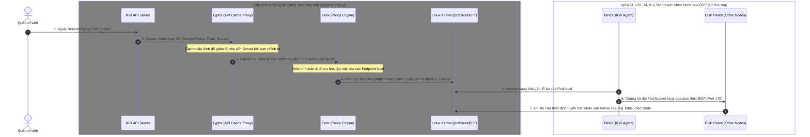

# Lab Tập 10: Kiến trúc Calico — Felix, BIRD, Typha

Tập này giải phẫu từng thành phần của Calico và trace luồng từ NetworkPolicy CR → iptables rule trên Node.

### Sơ đồ luồng đồng bộ cấu hình trong cụm Calico:




## 🛠 Yêu cầu chuẩn bị
- Cụm K8s với Calico đang chạy (từ Tập 9).
- `calicoctl` chưa cài — sẽ cài trong lab này.

---

## 🔬 Thí nghiệm 1: Xem Felix log real-time

**SSH vào `controlplane`:**

```bash
multipass shell controlplane
```

1. Mở 2 terminal:

   **Terminal 1 — Watch Felix log trên worker1:**
   ```bash
   POD_NAME=$(kubectl -n calico-system get pods -l k8s-app=calico-node --field-selector spec.nodeName=worker1 -o jsonpath='{.items[0].metadata.name}')
   kubectl -n calico-system logs -f $POD_NAME -c calico-node 2>&1 | grep -i "policy\|endpoint\|felix"
   ```

2. **Terminal 2 — Apply NetworkPolicy mới:**
   ```bash
   multipass shell controlplane
   kubectl apply -f - <<'EOF'
   apiVersion: networking.k8s.io/v1
   kind: NetworkPolicy
   metadata:
     name: test-policy
   spec:
     podSelector:
       matchLabels:
         app: frontend
     ingress:
     - from:
       - podSelector:
           matchLabels:
             app: backend
   EOF
   ```

3. **Quay lại Terminal 1**, quan sát Felix log xử lý policy update trong ms:
   ```
   policy update: processing 1 policy update(s)
   Finished applying policy update in <X>ms
   ```
   *Nhận xét:* Felix event-driven — nhận update ngay khi K8s API thay đổi, không polling.

4. Dọn dẹp:
   ```bash
   kubectl delete networkpolicy test-policy
   ```

---

## 🔬 Thí nghiệm 2: Xem iptables chains Felix tạo

**SSH vào `worker1`:**

```bash
multipass shell worker1
```

1. Liệt kê tất cả Calico chains:
   ```bash
   sudo iptables -L | grep "^Chain cali"
   # Chain cali-FORWARD (1 references)
   # Chain cali-INPUT (1 references)
   # Chain cali-OUTPUT (1 references)
   # Chain cali-from-host-endpoint
   # Chain cali-from-wl-dispatch
   # Chain cali-to-host-endpoint
   # Chain cali-to-wl-dispatch
   # Chain cali-fw-<endpoint-id>   ← Per-endpoint from-workload rule
   # Chain cali-tw-<endpoint-id>   ← Per-endpoint to-workload rule
   ```

2. Xem cali-FORWARD (policy dispatch):
   ```bash
   sudo iptables -L cali-FORWARD -n --line-numbers
   ```

3. Xem chi tiết một chain cụ thể (thay `<hash>` bằng giá trị thật):
   ```bash
   sudo iptables -L cali-tw-<hash> -n --line-numbers
   # Thấy ACCEPT/DROP rules tương ứng với NetworkPolicy
   ```

---

## 🔬 Thí nghiệm 3: Cài và dùng calicoctl

**Trên `controlplane`:**

1. Cài calicoctl:
   ```bash
   curl -L https://github.com/projectcalico/calico/releases/download/v3.32.0/calicoctl-linux-amd64 \
     -o calicoctl && chmod +x calicoctl && sudo mv calicoctl /usr/local/bin/
   ```

2. Xem workload endpoints (Pods được Calico quản lý):
   ```bash
   calicoctl get workloadendpoint
   # WORKLOAD    NODE      NETWORKS        INTERFACE
   # frontend    worker1   10.244.1.5/32   cali<hash>
   ```

3. Xem IP pools:
   ```bash
   calicoctl get ippool
   # NAME                  CIDR           SELECTOR
   # default-ipv4-ippool   10.244.0.0/16  all()
   ```

4. Xem Felix configuration:
   ```bash
   calicoctl get felixconfig default -o yaml | head -30
   ```

5. Xem node status (BGP và health):
   ```bash
   calicoctl node status
   # Calico process is running.
   # IPv4 BGP status: ...
   ```

---

## 🔬 Thí nghiệm 4: Kiểm tra Typha

**Trên `controlplane`:**

1. Kiểm tra Typha có đang chạy không:
   ```bash
   kubectl -n calico-system get pods | grep typha
   # calico-typha-xxxxx   1/1   Running
   ```

2. Xem số Felix instances kết nối đến Typha:
   ```bash
   kubectl -n calico-system logs deployment/calico-typha 2>/dev/null | grep -i "connections" | tail -5
   ```

3. Xem Tigera Operator quyết định dùng Typha khi nào:
   ```bash
   kubectl -n tigera-operator get installation default -o yaml | grep -A5 typhaDeployment
   ```
   *Nhận xét:* Tigera Operator tự động bật Typha khi node count > 3. Lab 3 nodes có thể có Typha tùy version.

---

## ✅ Tổng kết

1. **Felix event-driven:** Policy update → Felix nhận trong ms → iptables update < 100ms — không cần restart gì.
2. **Chain hierarchy:** `FORWARD → cali-FORWARD → cali-from-wl-dispatch → cali-fw-<id>` (egress) và `cali-to-wl-dispatch → cali-tw-<id>` (ingress).
3. **calicoctl = kubectl cho Calico objects:** Dùng để debug workload endpoints, IP pools, BGP sessions.
4. **Typha = cache layer:** Chỉ cần thiết khi > 50 nodes để giảm tải K8s API server. Nhỏ hơn = không cần.
