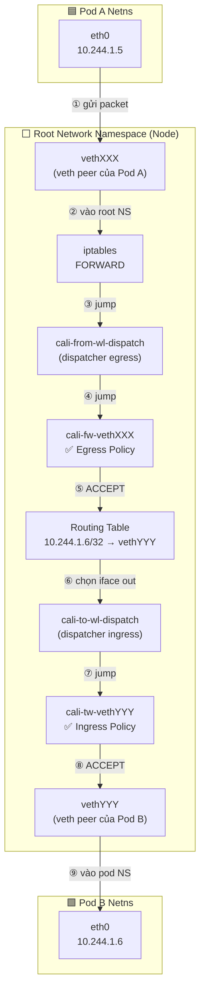

# Lab Tập 12: Packet Flow qua Calico — veth pair & conntrack

Tập này dùng iptables LOG để trace từng packet qua các Calico chains và quan sát conntrack state machine.

### Sơ đồ Packet Flow di chuyển qua các thành phần của Calico:

#### 1. Trường hợp cùng một Node (Same-Node Packet Flow)



> **Ghi chú chain và Thuật ngữ viết tắt:**
> - **`wl` (Workload)**: Chỉ các Pod/Container chạy ứng dụng (được Calico gọi chung là Workload).
> - **`fw` (From Workload)**: Chiều dữ liệu đi **từ** Pod ra ngoài (Egress check). Ví dụ: `cali-from-wl-dispatch`, `cali-fw-<iface>`.
> - **`tw` (To Workload)**: Chiều dữ liệu đi **vào** Pod (Ingress check). Ví dụ: `cali-to-wl-dispatch`, `cali-tw-<iface>`.
> - `FORWARD → cali-FORWARD → cali-from-wl-dispatch → cali-fw-<iface>` — kiểm tra **egress** Pod nguồn.
> - `cali-to-wl-dispatch → cali-tw-<iface>` — kiểm tra **ingress** Pod đích.
> - Cả 2 check xảy ra trong cùng 1 lần đi qua FORWARD hook.

---

#### 2. Trường hợp khác Node (Cross-Node Packet Flow)


> **Ghi chú mode:**
> - **VXLAN mode** (default Calico): bước ⑤-⑩ dùng `vxlan.calico` tunnel, port UDP 4789
> - **BGP mode** (Calico với bird): không có encap, bước ⑤-⑩ là IP routing thuần, không qua VTEP

## 🛠 Yêu cầu chuẩn bị
- Cụm K8s với Calico đang chạy iptables mode (không phải eBPF) từ Tập 9.
- > ⚠️ **QUAN TRỌNG:** Nếu anh vừa hoàn thành **Tập 11 (eBPF mode)**, anh bắt buộc phải hoàn trả hệ thống mạng về **iptables mode** và khôi phục `kube-proxy`. Nếu không làm bước này, cụm K8s sẽ bị mất NAT dịch vụ khiến Calico CNI không thể liên lạc với API Server (`10.96.0.1:443`), dẫn đến lỗi `FailedCreatePodSandBox (i/o timeout)` khi deploy Pod mới.
  >
  > Thực hiện hoàn trả theo đúng 3 bước sau trên `controlplane`:
  >
  > 1. **Tắt eBPF mode của Calico:**
  >    ```bash
  >    kubectl patch felixconfiguration default --type merge --patch '{"spec":{"bpfEnabled":false}}'
  >    ```
  > 2. **Khôi phục kube-proxy DaemonSet** (xóa label `non-calico=true` khỏi nodeSelector):
  >    ```bash
  >    kubectl patch ds kube-proxy -n kube-system --type=json \
  >      -p '[{"op":"remove","path":"/spec/template/spec/nodeSelector/non-calico"}]'
  >    ```
  >    > ⚠️ Không dùng strategic merge patch (`-p '{"spec":...}'`) cho bước này — nó chỉ **merge** key chứ không **xóa** `non-calico=true`. Kết quả sẽ báo `patched (no change)` và DESIRED vẫn bằng 0.
  > 3. **Đợi toàn bộ các Pod `kube-proxy` ở trạng thái `Running`:**
  >    ```bash
  >    kubectl get pods -n kube-system -l k8s-app=kube-proxy -w
  >    ```
  >    *(Khi toàn bộ Pod kube-proxy đã Running, bấm `Ctrl+C` để thoát và bắt đầu làm Lab).*
  >
  > 💡 **Mẹo xử lý sự cố (Troubleshooting):**
  > Nếu anh chạy lệnh ở bước 3 mà **không thấy bất kỳ Pod `kube-proxy` nào xuất hiện** trong danh sách:
  > - Hãy kiểm tra xem DaemonSet `kube-proxy` có tồn tại trong cụm không bằng lệnh: `kubectl get ds -n kube-system kube-proxy`.
  > - Nếu cột `DESIRED` và `CURRENT` hiển thị bằng `0`: nodeSelector vẫn còn key `non-calico=true` mà các node không có label đó. Kiểm tra: `kubectl get ds kube-proxy -n kube-system -o jsonpath='{.spec.template.spec.nodeSelector}'` — nếu thấy `non-calico`, chạy lại lệnh JSON patch ở Bước 2 để xóa nó.
  > - Nếu báo lỗi `NotFound`, có thể DaemonSet `kube-proxy` đã bị xóa trước đó. Hãy cài đặt lại hoặc khôi phục cấu hình DaemonSet gốc của cụm Lab.
  > - **Sau khi `kube-proxy` đã Running**, nếu Pod mới vẫn báo lỗi CNI, hãy restart lại Calico-node để dọn dẹp cache kết nối lỗi cũ: `kubectl rollout restart daemonset calico-node -n calico-system` (hoặc `-n kube-system`).

---

## 🔬 Thực nghiệm 1: Setup — Deploy pods cùng node và cài LOG rule

**SSH vào `controlplane`:**

```bash
multipass shell controlplane
```

1. Deploy 2 pods trên cùng `worker1`:
   ```bash
   kubectl apply -f - <<'EOF'
   apiVersion: v1
   kind: Pod
   metadata:
     name: trace-src
     labels:
       app: src
   spec:
     nodeName: worker1
     containers:
     - name: net
       image: nicolaka/netshoot
       command: ["sleep", "infinity"]
   ---
   apiVersion: v1
   kind: Pod
   metadata:
     name: trace-dst
     labels:
       app: dst
   spec:
     nodeName: worker1
     containers:
     - name: net
       image: nicolaka/netshoot
       command: ["nc", "-lk", "-p", "8080"]
   EOF
   kubectl wait --for=condition=Ready pod/trace-src pod/trace-dst --timeout=60s
   ```

2. Ghi lại IPs:
   ```bash
   SRC_IP=$(kubectl get pod trace-src -o jsonpath='{.status.podIP}')
   DST_IP=$(kubectl get pod trace-dst -o jsonpath='{.status.podIP}')
   echo "Source: $SRC_IP  Dest: $DST_IP"
   ```

---

## 🔬 Thực nghiệm 2: Insert LOG rules và trace packet

**SSH vào `worker1`:**

```bash
multipass shell worker1
```

1. Thêm LOG rule để trace mọi packet qua FORWARD chain:
   ```bash
   sudo iptables -t filter -I FORWARD 1 \
     -j LOG --log-prefix "CALICO-TRACE: " --log-level 4
   ```

2. Theo dõi kernel log (Terminal 1):
   ```bash
   sudo dmesg -w | grep "CALICO-TRACE" &
   DMESG_PID=$!
   ```

3. **Từ controlplane (Terminal 2):** Gửi traffic:
   ```bash
   kubectl exec trace-src -- nc -zv $DST_IP 8080
   ```

4. **Quay lại worker1**, log sẽ hiện:
   ```
   CALICO-TRACE: IN=veth<src> OUT=veth<dst> SRC=10.244.1.X DST=10.244.1.Y
                 PROTO=TCP SPT=XXXXX DPT=8080 SYN
   ```
   *Nhận xét:* Thấy veth pair interface tên (`IN=veth<hash>` và `OUT=veth<hash>`), source/dest Pod IP, protocol và port.

5. Dừng và cleanup LOG rule:
   ```bash
   kill $DMESG_PID 2>/dev/null
   sudo iptables -t filter -D FORWARD 1
   ```

---

## 🔬 Thực nghiệm 3: Quan sát conntrack entries

**Trên `worker1`:**

1. Cài conntrack tools nếu chưa có:
   ```bash
   which conntrack || sudo apt-get install -y conntrack
   ```

2. **Watch conntrack events trước, rồi gửi traffic:**
   ```bash
   # Terminal 1 (worker1) — bắt event realtime:
   sudo conntrack -E -p tcp -s $SRC_IP 2>/dev/null | grep "8080" &
   CONNTRACK_PID=$!

   # Terminal 2 (controlplane) — gửi traffic:
   kubectl exec trace-src -- nc -zv $DST_IP 8080
   ```
   *Kết quả trên worker1:*
   ```
   [NEW]  tcp ESTABLISHED src=10.244.1.X dst=10.244.1.Y sport=XXXXX dport=8080 ...
   [UPDATE] tcp ESTABLISHED ...
   [DESTROY] tcp ...
   ```
   *Nhận xét:* conntrack lưu cả 2 chiều (request và expected response). Dùng `-E` thay `-L` để tránh race condition (nc -zv disconnect nhanh, `-L` có thể miss entry đã DESTROY).

3. Dừng conntrack watch:
   ```bash
   kill $CONNTRACK_PID 2>/dev/null
   ```

---

## 🔬 Thực nghiệm 4: Demo DROP và conntrack không có ESTABLISHED

**Từ Terminal 2 (controlplane):**

1. Apply policy chặn ingress đến trace-dst:
   ```bash
   kubectl apply -f - <<'EOF'
   apiVersion: networking.k8s.io/v1
   kind: NetworkPolicy
   metadata:
     name: deny-trace-dst
   spec:
     podSelector:
       matchLabels:
         app: dst
     policyTypes:
     - Ingress
   EOF
   ```

**Từ Terminal 1 (worker1):**

2. Cắm cờ theo dõi (LOG và Conntrack events chạy ngầm):
   ```bash
   # Thêm LOG rule vào FORWARD chain tiêu chuẩn
   sudo iptables -t filter -I FORWARD 1 -j LOG --log-prefix "CALICO-PRE-DROP: " --log-level 4
   
   # Bật dmesg chạy ngầm
   sudo dmesg -w | grep "CALICO-PRE-DROP" &
   DMESG_PID2=$!

   # Bật màn hình theo dõi conntrack realtime chạy ngầm:
   sudo conntrack -E -p tcp 2>/dev/null | grep "8080" &
   CONNTRACK_PID2=$!
   ```
   > **Lưu ý:** LOG rule này nằm ở đầu `FORWARD` chain — fires TRƯỚC khi Calico xử lý. Mục đích là chứng minh packet **có tới node**, nhưng DROP thực sự xảy ra sâu bên trong `cali-tw-<vethYYY>` (ingress policy chain của Pod đích).

**Từ Terminal 2 (controlplane):**

3. Thử kết nối (lệnh sẽ bị treo vì gói tin bị DROP):
   ```bash
   kubectl exec trace-src -- nc -zv -w 3 $DST_IP 8080
   # (timeout sau 3 giây)
   ```

**Từ Terminal 1 (worker1):**

4. Xem kết quả tự động nổ ra màn hình:
   Ngay khi lệnh `nc` vừa chạy, anh sẽ thấy Terminal 1 in ra 2 dòng sự kiện cùng lúc.
   
   Từ lệnh `dmesg` (Gói tin đã đến node):
   ```
   CALICO-PRE-DROP: ... DPT=8080 ... SYN
   ```
   
   Và từ lệnh `conntrack -E` (Bị kẹt vĩnh viễn ở trạng thái SYN_SENT):
   ```
   [NEW] tcp      6 120 SYN_SENT src=10.244.1.X dst=10.244.1.Y sport=XXXXX dport=8080 [UNREPLIED] ...
   ```
   *`[UNREPLIED]` là dấu hiệu chính: không có response về = packet bị DROP trước khi tới Pod đích, conntrack không thể chuyển sang ESTABLISHED. Việc dùng `-E` giúp chúng ta bắt được sự kiện này ngay lập tức trước khi nó bị Linux xóa khỏi bảng trạng thái.*

5. Cleanup (Dọn dẹp worker1):
   ```bash
   kill $DMESG_PID2 $CONNTRACK_PID2 2>/dev/null
   sudo iptables -t filter -D FORWARD 1
   ```

**Từ Terminal 2 (controlplane):**

6. Cleanup (Dọn dẹp cluster):
   ```bash
   kubectl delete networkpolicy deny-trace-dst
   kubectl delete pod trace-src trace-dst
   ```

---

## ✅ Tổng kết

1. **Packet path cùng node:** `Pod-A eth0 → vethXXX → cali-FORWARD → routing → cali-FORWARD → vethYYY → Pod-B eth0`.
2. **Zero Trust — 2 lần check:** `cali-from-wl-dispatch` (egress Pod nguồn) jump sang `cali-fw-<iface>` (policy chain), sau đó `cali-to-wl-dispatch` (ingress Pod đích) jump sang `cali-tw-<iface>` — dispatcher chain → per-interface policy chain.
3. **conntrack = stateful firewall:** Chỉ cần allow ingress port 8080 — response tự động được allow vì conntrack ESTABLISHED.
4. **DROP không tạo ESTABLISHED:** Khi Calico DROP packet, conntrack không ghi nhận ESTABLISHED → TCP sender biết bị từ chối sau timeout.
