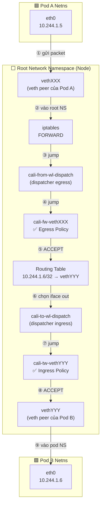
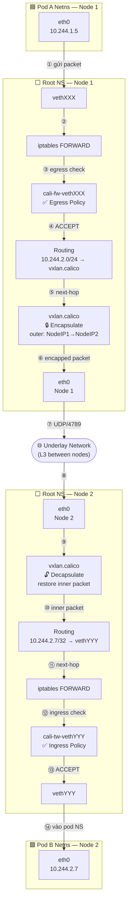

# Lab Tập 12: Packet Flow qua Calico — veth pair & conntrack

Tập này dùng iptables LOG để trace từng packet qua các Calico chains và quan sát conntrack state machine.

### Sơ đồ Packet Flow di chuyển qua các thành phần của Calico:

#### 1. Trường hợp cùng một Node (Same-Node Packet Flow)



> **Ghi chú chain và Thuật ngữ viết tắt:**
> - **`wl` (Workload)**: Chỉ các Pod/Container chạy ứng dụng (được Calico gọi chung là Workload).
> - **`fw` (From Workload)**: Chiều dữ liệu đi **từ** Pod ra ngoài (Egress check). Ví dụ: `cali-from-wl-dispatch`, `cali-fw-<iface>`.
> - **`tw` (To Workload)**: Chiều dữ liệu đi **vào** Pod (Ingress check). Ví dụ: `cali-to-wl-dispatch`, `cali-tw-<iface>`.
> - `FORWARD → cali-FORWARD → cali-from-wl-dispatch → cali-fw-<iface>` — kiểm tra **egress** Pod nguồn.
> - `cali-to-wl-dispatch → cali-tw-<iface>` — kiểm tra **ingress** Pod đích.
> - Cả 2 check xảy ra trong cùng 1 lần đi qua FORWARD hook.

---

#### 2. Trường hợp khác Node (Cross-Node Packet Flow)



> **Ghi chú mode:**
> - **VXLAN mode** (default Calico): bước ⑤-⑩ dùng `vxlan.calico` tunnel, port UDP 4789
> - **BGP mode** (Calico với bird): không có encap, bước ⑤-⑩ là IP routing thuần, không qua VTEP

## 🛠 Yêu cầu chuẩn bị
- Cụm K8s với Calico đang chạy iptables mode (không phải eBPF) từ Tập 9-11.
- Nếu đang ở eBPF mode, chạy: `kubectl patch felixconfiguration default --type merge --patch '{"spec":{"bpfEnabled":false}}'`

---

## 🔬 Thí nghiệm 1: Setup — Deploy pods cùng node và cài LOG rule

**SSH vào `controlplane`:**

```bash
multipass shell controlplane
```

1. Deploy 2 pods trên cùng `worker1`:
   ```bash
   kubectl apply -f - <<'EOF'
   apiVersion: v1
   kind: Pod
   metadata:
     name: trace-src
     labels:
       app: src
   spec:
     nodeName: worker1
     containers:
     - name: net
       image: nicolaka/netshoot
       command: ["sleep", "infinity"]
   ---
   apiVersion: v1
   kind: Pod
   metadata:
     name: trace-dst
     labels:
       app: dst
   spec:
     nodeName: worker1
     containers:
     - name: net
       image: nicolaka/netshoot
       command: ["nc", "-lk", "-p", "8080"]
   EOF
   kubectl wait --for=condition=Ready pod/trace-src pod/trace-dst --timeout=60s
   ```

2. Ghi lại IPs:
   ```bash
   SRC_IP=$(kubectl get pod trace-src -o jsonpath='{.status.podIP}')
   DST_IP=$(kubectl get pod trace-dst -o jsonpath='{.status.podIP}')
   echo "Source: $SRC_IP  Dest: $DST_IP"
   ```

---

## 🔬 Thí nghiệm 2: Insert LOG rules và trace packet

**SSH vào `worker1`:**

```bash
multipass shell worker1
```

1. Thêm LOG rule để trace mọi packet qua FORWARD chain:
   ```bash
   sudo iptables -t filter -I FORWARD 1 \
     -j LOG --log-prefix "CALICO-TRACE: " --log-level 4
   ```

2. Theo dõi kernel log (Terminal 1):
   ```bash
   sudo dmesg -w | grep "CALICO-TRACE" &
   DMESG_PID=$!
   ```

3. **Từ controlplane (Terminal 2):** Gửi traffic:
   ```bash
   kubectl exec trace-src -- nc -zv $DST_IP 8080
   ```

4. **Quay lại worker1**, log sẽ hiện:
   ```
   CALICO-TRACE: IN=veth<src> OUT=veth<dst> SRC=10.244.1.X DST=10.244.1.Y
                 PROTO=TCP SPT=XXXXX DPT=8080 SYN
   ```
   *Nhận xét:* Thấy veth pair interface tên (`IN=veth<hash>` và `OUT=veth<hash>`), source/dest Pod IP, protocol và port.

5. Dừng và cleanup LOG rule:
   ```bash
   kill $DMESG_PID 2>/dev/null
   sudo iptables -t filter -D FORWARD 1
   ```

---

## 🔬 Thí nghiệm 3: Quan sát conntrack entries

**Trên `worker1`:**

1. Cài conntrack tools nếu chưa có:
   ```bash
   which conntrack || sudo apt-get install -y conntrack
   ```

2. **Watch conntrack events trước, rồi gửi traffic:**
   ```bash
   # Terminal 1 (worker1) — bắt event realtime:
   sudo conntrack -E -p tcp -s $SRC_IP 2>/dev/null | grep "8080" &
   CONNTRACK_PID=$!

   # Terminal 2 (controlplane) — gửi traffic:
   kubectl exec trace-src -- nc -zv $DST_IP 8080
   ```
   *Kết quả trên worker1:*
   ```
   [NEW]  tcp ESTABLISHED src=10.244.1.X dst=10.244.1.Y sport=XXXXX dport=8080 ...
   [UPDATE] tcp ESTABLISHED ...
   [DESTROY] tcp ...
   ```
   *Nhận xét:* conntrack lưu cả 2 chiều (request và expected response). Dùng `-E` thay `-L` để tránh race condition (nc -zv disconnect nhanh, `-L` có thể miss entry đã DESTROY).

3. Dừng conntrack watch:
   ```bash
   kill $CONNTRACK_PID 2>/dev/null
   ```

---

## 🔬 Thí nghiệm 4: Demo DROP và conntrack không có ESTABLISHED

**Trên `controlplane`:**

1. Apply policy chặn ingress đến trace-dst:
   ```bash
   kubectl apply -f - <<'EOF'
   apiVersion: networking.k8s.io/v1
   kind: NetworkPolicy
   metadata:
     name: deny-trace-dst
   spec:
     podSelector:
       matchLabels:
         app: dst
     policyTypes:
     - Ingress
   EOF
   ```

2. **Trên worker1** — thêm LOG rule trong cali-FORWARD:
   ```bash
   sudo iptables -t filter -I cali-FORWARD 1 \
     -j LOG --log-prefix "CALICO-DROP: " --log-level 4
   sudo dmesg -w | grep "CALICO-DROP" &
   DMESG_PID2=$!
   ```

3. **Từ controlplane** — thử kết nối (sẽ bị DROP):
   ```bash
   kubectl exec trace-src -- nc -zv -w 3 $DST_IP 8080
   # (timeout)
   ```

4. **Trên worker1** — xem log:
   ```
   CALICO-DROP: ... DPT=8080 ... SYN
   ```
   Và conntrack **không có** ESTABLISHED (chỉ có SYN_SENT không chuyển sang ESTABLISHED):
   ```bash
   sudo conntrack -L -p tcp 2>/dev/null | grep "8080"
   # (trống hoặc chỉ thấy SYN_SENT, không phải ESTABLISHED)
   ```

5. Cleanup:
   ```bash
   kill $DMESG_PID2 2>/dev/null
   sudo iptables -t filter -D cali-FORWARD 1
   kubectl delete networkpolicy deny-trace-dst
   kubectl delete pod trace-src trace-dst
   ```

---

## ✅ Tổng kết

1. **Packet path cùng node:** `Pod-A eth0 → vethXXX → cali-FORWARD → routing → cali-FORWARD → vethYYY → Pod-B eth0`.
2. **Zero Trust — 2 lần check:** `cali-from-wl-dispatch` (egress Pod nguồn) jump sang `cali-fw-<iface>` (policy chain), sau đó `cali-to-wl-dispatch` (ingress Pod đích) jump sang `cali-tw-<iface>` — dispatcher chain → per-interface policy chain.
3. **conntrack = stateful firewall:** Chỉ cần allow ingress port 8080 — response tự động được allow vì conntrack ESTABLISHED.
4. **DROP không tạo ESTABLISHED:** Khi Calico DROP packet, conntrack không ghi nhận ESTABLISHED → TCP sender biết bị từ chối sau timeout.
