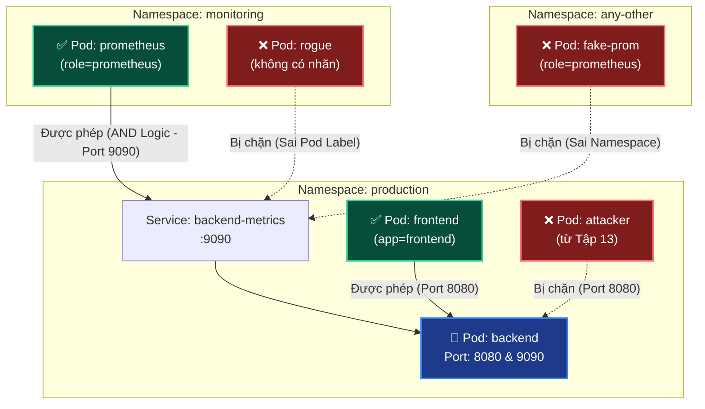

# Lab Tập 14: Cross-namespace Policy — AND vs OR

Tập này chứng minh sự khác biệt sống còn giữa AND và OR logic trong NetworkPolicy YAML bằng cách demo rogue pod vào được hay không.

## 📖 Đề bài & Kịch bản thực tế
Hệ thống `backend` của bạn đang chạy an toàn trong namespace `production`. Bây giờ, đội vận hành (Ops) yêu cầu bạn mở một chính sách tường lửa chéo (Cross-namespace) để hệ thống giám sát **Prometheus** (nằm ở namespace `monitoring`) có thể truy cập vào cổng `9090` của backend nhằm thu thập số liệu (metrics).

**Yêu cầu an ninh từ Giám đốc bảo mật (CISO):**
- Chỉ cấp quyền truy cập một cách cực kỳ khắt khe (AND logic): **CHỈ CÓ** Pod mang nhãn `role: prometheus` **VÀ** bắt buộc phải nằm trong namespace `monitoring` mới được phép truy cập.
- Hệ thống phải miễn nhiễm với các Pod giả mạo (Rogue Pod): Ví dụ một Pod lạ trà trộn vào namespace `monitoring` nhưng không có nhãn prometheus, hoặc một Pod có nhãn prometheus nhưng nằm ở namespace khác đều tuyệt đối không được phép lọt qua.

Một đồng nghiệp của bạn vừa viết xong một đoạn YAML NetworkPolicy và khẳng định nó rất an toàn. Nhiệm vụ của bạn là kiểm chứng xem file YAML đó có thực sự chặn được các Pod giả mạo hay không, tìm ra lỗ hổng và học cách viết lại cho chuẩn xác nhất!

**Mô hình mục tiêu:**


## 🛠 Yêu cầu chuẩn bị
- Cụm K8s với Calico từ Tập 9.
- Không có NetworkPolicy nào đang active trong `production`.

---

## 🔬 Thí nghiệm 1: Deploy môi trường test

**SSH vào `controlplane`:**

```bash
multipass shell controlplane
```

1. Tạo namespaces và label:
   ```bash
   kubectl create namespace production 2>/dev/null || true
   kubectl create namespace monitoring 2>/dev/null || true

   # BẮT BUỘC: label namespace để namespaceSelector hoạt động
   kubectl label namespace monitoring name=monitoring --overwrite
   kubectl label namespace production name=production --overwrite
   ```

2. Deploy backend với metrics endpoint và Service trong production:
   ```bash
   kubectl apply -n production -f - <<'EOF'
   apiVersion: v1
   kind: Pod
   metadata:
     name: backend
     labels:
       app: backend
   spec:
     nodeName: worker1
     containers:
     - name: app
       image: nicolaka/netshoot
       command: ["nc", "-lk", "-p", "9090"]
   ---
   apiVersion: v1
   kind: Service
   metadata:
     name: backend-metrics
   spec:
     selector:
       app: backend
     ports:
     - port: 9090
       targetPort: 9090
   EOF
   ```

3. Deploy prometheus và rogue trong monitoring:
   ```bash
   kubectl apply -n monitoring -f - <<'EOF'
   apiVersion: v1
   kind: Pod
   metadata:
     name: prometheus
     labels:
       role: prometheus
   spec:
     nodeName: worker2
     containers:
     - name: prom
       image: nicolaka/netshoot
       command: ["sleep", "infinity"]
   ---
   apiVersion: v1
   kind: Pod
   metadata:
     name: rogue
   spec:
     nodeName: worker2
     containers:
     - name: shell
       image: nicolaka/netshoot
       command: ["sleep", "infinity"]
   EOF
   ```

4. Chờ tất cả ready:
   ```bash
   kubectl -n production wait --for=condition=Ready pod/backend --timeout=60s
   kubectl -n monitoring wait --for=condition=Ready pod/prometheus pod/rogue --timeout=60s
   ```

5. Verify baseline — chưa có policy, tất cả đều kết nối được:
   ```bash
   kubectl -n monitoring exec prometheus -- nc -zv backend-metrics.production.svc.cluster.local 9090
   # Connection succeeded! ✅ (default allow — chưa có policy)

   kubectl -n monitoring exec rogue -- nc -zv backend-metrics.production.svc.cluster.local 9090
   # Connection succeeded! ✅ (default allow — chưa có policy)
   ```

---

## 💥 Thí nghiệm 2: Apply OR policy (buggy) và chứng minh lỗ hổng

**Trên `controlplane`:**

1. Apply default deny cho production:
   ```bash
   kubectl apply -n production -f - <<'EOF'
   apiVersion: networking.k8s.io/v1
   kind: NetworkPolicy
   metadata:
     name: default-deny
   spec:
     podSelector: {}
     policyTypes:
     - Ingress
   EOF
   ```

2. Apply policy OR (buggy) — dấu `-` tạo 2 items riêng biệt:
   ```bash
   kubectl apply -n production -f - <<'EOF'
   apiVersion: networking.k8s.io/v1
   kind: NetworkPolicy
   metadata:
     name: allow-prometheus-OR-bug
   spec:
     podSelector:
       matchLabels:
         app: backend
     policyTypes:
     - Ingress
     ingress:
     - from:
       - namespaceSelector:
           matchLabels:
             name: monitoring
       - podSelector:              # ← Dấu "-" này = ITEM MỚI = OR!
           matchLabels:
             role: prometheus
       ports:
       - protocol: TCP
         port: 9090
   EOF
   ```

3. Test: Rogue pod phải bị chặn nhưng thực ra KHÔNG:
   ```bash
   kubectl -n monitoring exec rogue -- nc -zv backend-metrics.production.svc.cluster.local 9090
   # Connection succeeded! ← BUG! Rogue vào được vì match namespace monitoring
   ```

4. Test: Prometheus cũng vào được (đúng, nhưng vì lý do sai):
   ```bash
   kubectl -n monitoring exec prometheus -- nc -zv backend-metrics.production.svc.cluster.local 9090
   # Connection succeeded! ✅ (nhưng lý do thông mạng là sai)
   ```
   > **Phân tích bản chất:** Prometheus vào được thực tế là do điều kiện thứ nhất (`namespaceSelector` match namespace `monitoring`) mở toang cho tất cả, chứ không phải do điều kiện thứ hai match được nó! Trong K8s NetworkPolicy, luật `- podSelector` khi viết độc lập (không đi kèm `namespaceSelector` trong cùng một phần tử danh sách) sẽ chỉ áp dụng kiểm tra Pod có nhãn đó chạy **ở nội bộ namespace của Policy đó** (ở đây là namespace `production`). Nó không có tác dụng kiểm tra Pod ở namespace khác!

---

## 🔬 Thí nghiệm 3: Fix thành AND và verify

**Trên `controlplane`:**

1. Xóa policy buggy:
   ```bash
   kubectl delete -n production networkpolicy allow-prometheus-OR-bug
   ```

2. Apply policy AND (correct) — không có dấu `-` trước podSelector:
   ```bash
   kubectl apply -n production -f - <<'EOF'
   apiVersion: networking.k8s.io/v1
   kind: NetworkPolicy
   metadata:
     name: allow-prometheus-AND-correct
   spec:
     podSelector:
       matchLabels:
         app: backend
     policyTypes:
     - Ingress
     ingress:
     - from:
       - namespaceSelector:
           matchLabels:
             name: monitoring
         podSelector:              # ← KHÔNG có dấu "-" = CÙNG ITEM = AND!
           matchLabels:
             role: prometheus
       ports:
       - protocol: TCP
         port: 9090
   EOF
   ```

3. Test kết quả:
   ```bash
   # Prometheus được vào ✅
   kubectl -n monitoring exec prometheus -- nc -zv backend-metrics.production.svc.cluster.local 9090
   # Connection succeeded!

   # Rogue bị chặn ✅
   kubectl -n monitoring exec rogue -- nc -zv -w 3 backend-metrics.production.svc.cluster.local 9090
   # (timeout) ← Đúng! Rogue không có role=prometheus
   ```

---

## 🔬 Thí nghiệm 4: Verify namespace labels

**Trên `controlplane`:**

1. Xem labels của namespace:
   ```bash
   kubectl get namespace monitoring --show-labels
   # NAME        LABELS
   # monitoring  name=monitoring   ← OK
   ```

2. Thử xóa label và xem policy break:
   ```bash
   kubectl label namespace monitoring name-
   # Label bị xóa

   kubectl -n monitoring exec prometheus -- nc -zv -w 3 backend-metrics.production.svc.cluster.local 9090
   # (timeout) ← Policy không match nữa! namespaceSelector không có label để match
   ```

3. Restore label:
   ```bash
   kubectl label namespace monitoring name=monitoring
   kubectl -n monitoring exec prometheus -- nc -zv backend-metrics.production.svc.cluster.local 9090
   # Connection succeeded! ✅ Label restore → policy hoạt động lại
   ```

---

## 🧹 Dọn dẹp

```bash
kubectl -n production delete networkpolicy --all
kubectl -n production delete pod backend service/backend-metrics 2>/dev/null || true
kubectl -n monitoring delete pod prometheus rogue 2>/dev/null || true
```

---

## ✅ Tổng kết

1. **AND vs OR phụ thuộc vào dấu `-`:** Cùng `from` item (không có dấu `-` riêng) = AND. Dấu `-` riêng = item mới = OR.
2. **Hậu quả:** OR cho phép rogue pod trong namespace đúng nhưng không có label đúng vào được — security hole không visible qua `kubectl get networkpolicy`.
3. **Namespace labels là bắt buộc:** `namespaceSelector` không thể match namespace không có label tương ứng.
4. **Cách check nhanh:** `kubectl get namespace --show-labels` để verify labels trước khi debug policy.
