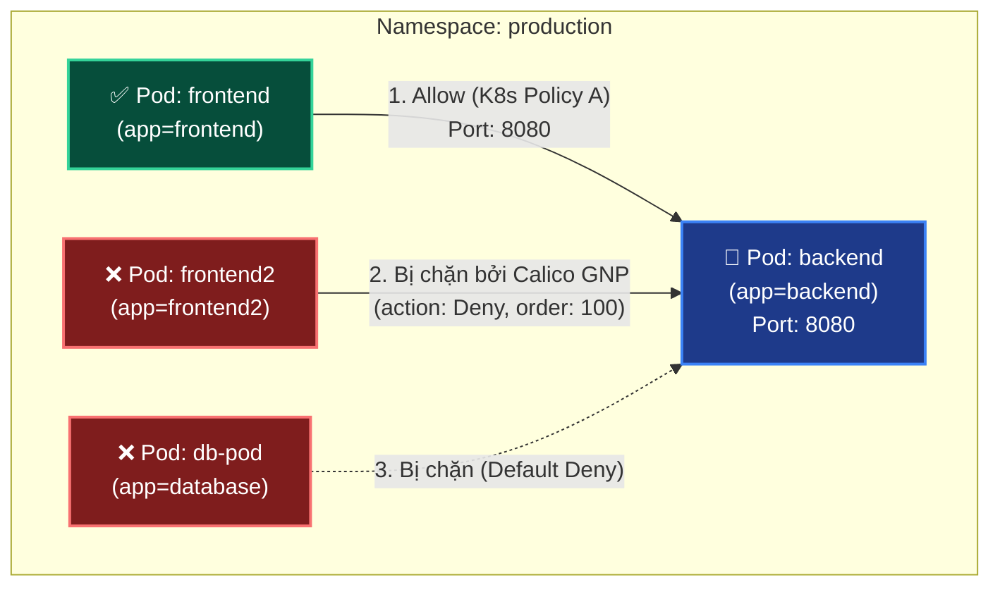
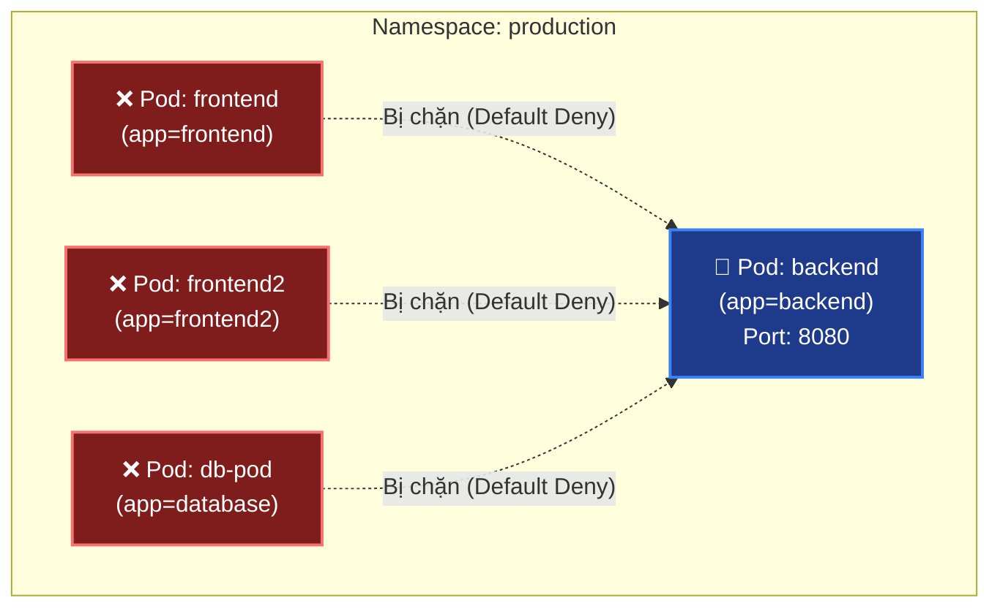
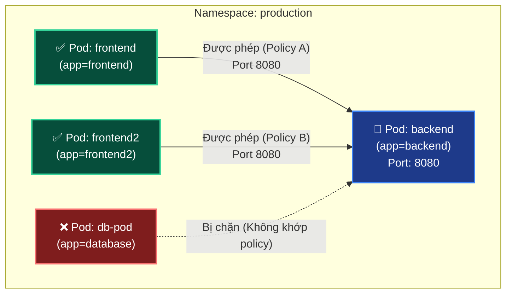
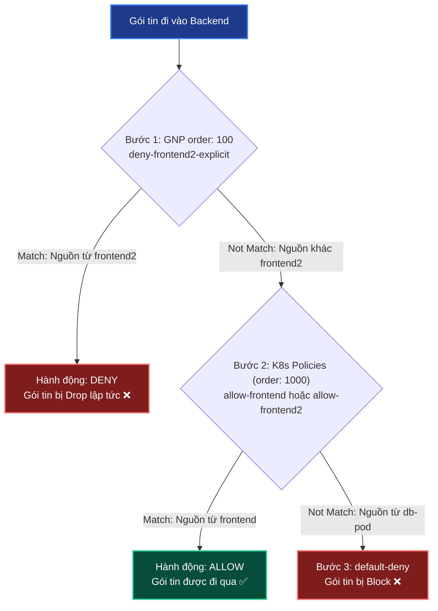

# Lab Tập 15: Union Logic — NetworkPolicy như Security Group

Tập này chứng minh NetworkPolicy là allowlist thuần túy: nhiều policies cộng hưởng, không có cancel, không có priority.

## 📖 Đề bài & Kịch bản thực tế
Hệ thống ứng dụng `backend` của bạn đang chạy trong namespace `production` và được cấu hình chính sách mặc định chặn toàn bộ Ingress (`default-deny`).

Hôm nay, bạn đối mặt với 2 bài toán thực tế để kiểm chứng cơ chế vận hành mạng của Kubernetes và Calico:

1. **Bài toán 1 (Chứng minh Union Logic):**
   - Đội vận hành muốn cho phép `frontend` truy cập vào `backend` cổng `8080`. Bạn apply `Policy A` (`allow-frontend`).
   - Ngay sau đó, một dự án phụ yêu cầu mở thêm cho `frontend2` truy cập vào `backend` cổng `8080`. Bạn apply tiếp `Policy B` (`allow-frontend2`).
   - Chúng ta cần chứng minh rằng hai policy này hoạt động theo cơ chế **Union (cộng dồn)** — tức là cả hai client đều truy cập thành công đồng thời, không có chính sách nào ghi đè hay phủ quyết chính sách nào.

2. **Bài toán 2 (Thử thách chặn tường minh - Explicit Deny):**
   - Giám đốc bảo mật (CISO) bất ngờ đưa ra yêu cầu khẩn cấp: **Tuyệt đối cấm** riêng biệt Pod `frontend2` truy cập vào `backend`, trong khi `frontend` vẫn phải được phép hoạt động bình thường.
   - Sử dụng K8s NetworkPolicy chuẩn, bạn nhận ra không cách nào làm được vì spec chỉ hỗ trợ Allowlist (chỉ cho phép).
   - Giải pháp là bạn phải sử dụng **Calico GlobalNetworkPolicy** với thuộc tính `action: Deny` và cơ chế ưu tiên `order: 100` để chặn đứng `frontend2` một cách chủ động trước khi các luật Allow chuẩn (`order: 1000`) được khớp.

**Mô hình mục tiêu:**


## 🛠 Yêu cầu chuẩn bị
- Cụm K8s với Calico từ Tập 9.
- Namespace `production` với `backend` pod từ Tập 14 (hoặc tạo lại bên dưới).

---

## 🔬 Thực nghiệm 1: Khởi tạo môi trường mạng và Thiết lập Default Deny

### 🎯 Mục đích:
- Chuẩn bị một hệ thống hoàn toàn cô lập để làm nền móng cho các thực nghiệm kiểm chứng.
- Tạo ra 4 Pod khác nhau (`backend`, `frontend`, `frontend2`, `db-pod`) đại diện cho các vai trò khác nhau trong cùng một namespace `production`.
- Thiết lập cơ chế **Default Deny** để khóa chặt tất cả Ingress traffic đi vào namespace, nhằm đảm bảo từ thời điểm này, mọi traffic muốn đi vào các Pod phải được cấp quyền chủ động (Allowlist) bởi một NetworkPolicy cụ thể.

**Mô hình trạng thái Thực nghiệm 1 (Default Deny):**


### 📝 Chi tiết các bước thực hiện:

**SSH vào `controlplane`:**

```bash
multipass shell controlplane
```

1. Đảm bảo namespace và backend pod tồn tại:
   ```bash
   kubectl create namespace production 2>/dev/null || true
   kubectl apply -n production -f - <<'EOF'
   apiVersion: v1
   kind: Pod
   metadata:
     name: backend
     labels:
       app: backend
   spec:
     containers:
     - name: api
       image: nicolaka/netshoot
       command: ["nc", "-lk", "-p", "8080"]
   ---
   apiVersion: v1
   kind: Pod
   metadata:
     name: frontend
     labels:
       app: frontend
   spec:
     containers:
     - name: web
       image: nicolaka/netshoot
       command: ["sleep", "infinity"]
   EOF
   kubectl -n production wait --for=condition=Ready pod/frontend pod/backend --timeout=90s
   ```

2. Tạo thêm frontend2 và db-pod:
   ```bash
   kubectl run frontend2 -n production --image=nicolaka/netshoot \
     --labels="app=frontend2" -- sleep infinity
   kubectl run db-pod -n production --image=nicolaka/netshoot \
     --labels="app=database" -- sleep infinity
   kubectl -n production wait --for=condition=Ready pod/frontend2 pod/db-pod --timeout=60s
   ```

3. Apply default deny ingress:
   ```bash
   kubectl apply -n production -f - <<'EOF'
   apiVersion: networking.k8s.io/v1
   kind: NetworkPolicy
   metadata:
     name: default-deny
   spec:
     podSelector: {}
     policyTypes:
     - Ingress
   EOF
   ```

4. Ghi lại backend IP:
   ```bash
   BACKEND_IP=$(kubectl -n production get pod backend -o jsonpath='{.status.podIP}')
   echo "Backend IP: $BACKEND_IP"
   ```

---

## 🔬 Thực nghiệm 2: Áp dụng các Policy độc lập và Chứng minh tính cộng hưởng (Union Logic)

### 🎯 Mục đích:
- Chứng minh rằng các Kubernetes NetworkPolicy chuẩn hoạt động theo cơ chế **Union (phép hợp)**. Mỗi policy mới được thêm vào chỉ có tác dụng mở rộng thêm cổng (allowlist), hoàn toàn không thể triệt tiêu hay ghi đè lên quyền của các policy đã có trước đó.
- Giúp người học thấy trực quan hành vi: Cả `frontend` và `frontend2` đều có thể đồng thời truy cập thành công vào `backend` khi cả hai policy tương ứng được áp dụng song song.
- Đối chiếu thực tế: Cơ chế này giống hệt như các **Security Group** trên AWS.

**Mô hình trạng thái Thực nghiệm 2 (Union Logic):**


### 📝 Chi tiết các bước thực hiện:

**Trên `controlplane`:**

1. Không có policy allow → tất cả bị deny:
   ```bash
   kubectl -n production exec frontend -- nc -zv -w 2 $BACKEND_IP 8080   # ❌
   kubectl -n production exec frontend2 -- nc -zv -w 2 $BACKEND_IP 8080  # ❌
   kubectl -n production exec db-pod -- nc -zv -w 2 $BACKEND_IP 8080     # ❌ db-pod cũng bị deny
   ```

2. Apply Policy A — Allow frontend → backend:
   ```bash
   kubectl apply -n production -f - <<'EOF'
   apiVersion: networking.k8s.io/v1
   kind: NetworkPolicy
   metadata:
     name: allow-frontend
   spec:
     podSelector:
       matchLabels:
         app: backend
     policyTypes:
     - Ingress
     ingress:
     - from:
       - podSelector:
           matchLabels:
             app: frontend
       ports:
       - protocol: TCP
         port: 8080
   EOF
   ```

   ```bash
   kubectl -n production exec frontend -- nc -zv -w 5 $BACKEND_IP 8080    # ✅ Policy A
   kubectl -n production exec frontend2 -- nc -zv -w 2 $BACKEND_IP 8080   # ❌ Không có rule
   kubectl -n production exec db-pod -- nc -zv -w 2 $BACKEND_IP 8080      # ❌ Không có rule
   ```

3. Apply Policy B — Allow frontend2 → backend:
   ```bash
   kubectl apply -n production -f - <<'EOF'
   apiVersion: networking.k8s.io/v1
   kind: NetworkPolicy
   metadata:
     name: allow-frontend2
   spec:
     podSelector:
       matchLabels:
         app: backend
     policyTypes:
     - Ingress
     ingress:
     - from:
       - podSelector:
           matchLabels:
             app: frontend2
       ports:
       - protocol: TCP
         port: 8080
   EOF
   ```

4. Cả hai policies active đồng thời:
   ```bash
   kubectl -n production exec frontend -- nc -zv -w 5 $BACKEND_IP 8080    # ✅ Policy A vẫn đúng
   kubectl -n production exec frontend2 -- nc -zv -w 5 $BACKEND_IP 8080   # ✅ Policy B thêm vào
   kubectl -n production exec db-pod -- nc -zv -w 2 $BACKEND_IP 8080      # ❌ Không có rule nào allow db-pod
   # Policy A KHÔNG bị Policy B ghi đè!
   ```

5. Xem tất cả policies đang active:
   ```bash
   kubectl -n production get networkpolicy
   # NAME            POD-SELECTOR   AGE
   # allow-frontend  app=backend    30s
   # allow-frontend2 app=backend    10s
   # default-deny    <none>         2m
   ```

---

## 🔬 Thực nghiệm 3: Thử thách chặn tường minh (Explicit Deny) bằng Calico GlobalNetworkPolicy

### 🎯 Mục đích:
- Chứng minh giới hạn của K8s NetworkPolicy chuẩn: Hoàn toàn không thể viết một rule mang tính chất loại trừ (ví dụ: mở hết nhưng cấm riêng một Pod cụ thể) vì spec của K8s chỉ hỗ trợ `Allow` (implicit deny).
- Thực hành giải pháp nâng cao: Tận dụng cơ chế mở rộng của Calico (**GlobalNetworkPolicy**) với thuộc tính `action: Deny` kết hợp với chỉ số ưu tiên (`order: 100`) để viết luật chặn tường minh có hiệu lực trước các luật Allow mặc định của K8s (`order: 1000`).

**Mô hình trạng thái Thực nghiệm 3 (Explicit Deny):**


### 📝 Chi tiết các bước thực hiện:

**Trên `controlplane`:**

1. Cố "deny" frontend2 bằng cách xóa policy B:
   ```bash
   kubectl delete -n production networkpolicy allow-frontend2
   kubectl -n production exec frontend2 -- nc -zv -w 2 $BACKEND_IP 8080
   # (timeout) ← frontend2 bị deny vì không còn rule allow
   ```

2. Thử viết policy "deny" tường minh — **K8s NetworkPolicy không hỗ trợ:**
   ```bash
   # Không có action: Deny trong K8s NetworkPolicy chuẩn!
   # Chỉ có: from/to selectors + ports → implicit allow
   ```

3. Demo Calico GlobalNetworkPolicy với DENY tường minh:
   ```bash
   # Re-apply allow-frontend2 trước
   kubectl apply -n production -f - <<'EOF'
   apiVersion: networking.k8s.io/v1
   kind: NetworkPolicy
   metadata:
     name: allow-frontend2
   spec:
     podSelector:
       matchLabels:
         app: backend
     policyTypes:
     - Ingress
     ingress:
     - from:
       - podSelector:
           matchLabels:
             app: frontend2
       ports:
       - protocol: TCP
         port: 8080
   EOF

   # Verify frontend2 vào được
   kubectl -n production exec frontend2 -- nc -zv -w 5 $BACKEND_IP 8080   # ✅

   # Apply Calico GlobalNetworkPolicy để DENY frontend2 explicitly
   cat <<'EOF' | kubectl apply -f -
   apiVersion: crd.projectcalico.org/v1
   kind: GlobalNetworkPolicy
   metadata:
     name: deny-frontend2-explicit
   spec:
     selector: app == 'backend' && projectcalico.org/namespace == 'production'
     order: 100
     ingress:
     - action: Deny
       source:
         selector: app == 'frontend2'
   EOF

   # frontend2 bị chặn bởi Calico GlobalNetworkPolicy
   kubectl -n production exec frontend2 -- nc -zv -w 2 $BACKEND_IP 8080   # ❌ Deny!
   # frontend vẫn OK (không bị ảnh hưởng bởi deny policy)
   kubectl -n production exec frontend -- nc -zv -w 5 $BACKEND_IP 8080    # ✅
   ```

---

## ⚙️ Cơ chế & Thứ tự thực thi Rule ở Thực nghiệm 3

Để hiểu tại sao quy tắc **Deny** của Calico GlobalNetworkPolicy lại có thể ghi đè (override) các quy tắc **Allow** của Kubernetes NetworkPolicy chuẩn, chúng ta cần phân tích sâu vào **Cơ chế đánh giá gói tin của Calico Engine**:

### 1. Phân loại chỉ số thứ tự (`order`) trong Calico:
*   Mọi chính sách mạng (Policy) trong cụm Calico đều được sắp xếp và đánh giá theo mức độ ưu tiên từ **nhỏ đến lớn** (chỉ số `order` càng thấp càng được ưu tiên cao).
*   **Kubernetes NetworkPolicy chuẩn:** Không có trường `order` trong spec. Do đó, khi Calico import và dịch các policy chuẩn này sang kiến trúc nội bộ của nó, Calico sẽ tự động gán cho chúng một giá trị `order` mặc định là **`1000`**.
*   **Calico GlobalNetworkPolicy:** Cho phép khai báo trường `order` tùy ý. Trong bài Lab này, chúng ta định nghĩa `order: 100` cho chính sách `deny-frontend2-explicit`.

### 2. Thứ tự thực thi từng bước (Packet Processing Pipeline):

Khi một gói tin cố gắng đi vào Pod `backend`, Calico Engine sẽ duyệt qua danh sách các policy đang hoạt động theo đúng thứ tự ưu tiên của chỉ số `order`:



*   **Bước 1: Khớp Calico GlobalNetworkPolicy (`order: 100`)**
    *   *Vì sao chạy trước?* Do `100 < 1000`, rule này có độ ưu tiên cao vượt trội.
    *   *Đánh giá luồng:*
        *   **Nếu gói tin từ `frontend2`:** Khớp điều kiện (`source: app == 'frontend2'`). Hành động cấu hình là `Deny`. Gói tin bị **vứt bỏ lập tức (Dropped)**, quá trình kiểm tra dừng lại. `frontend2` bị chặn hoàn toàn!
        *   **Nếu gói tin từ `frontend` hoặc `db-pod`:** Không khớp điều kiện của policy này. Calico bỏ qua và chuyển tiếp gói tin xuống tầng tiếp theo.
*   **Bước 2: Khớp nhóm K8s NetworkPolicies (`order: 1000`)**
    *   Do các policy `allow-frontend`, `allow-frontend2` và `default-deny` đều có `order: 1000` (mặc định), Calico sẽ gộp các rule Ingress của chúng lại thông qua **Union Logic (logic OR)**.
    *   *Đánh giá luồng:*
        *   **Nếu gói tin từ `frontend`:** Khớp với luật cho phép của `allow-frontend`. Hành động là `Allow` -> Gói tin được truyền qua thành công.
        *   **Nếu gói tin từ `db-pod`:** Không khớp với bất kỳ rule Allow nào ở mức `order: 1000`.
*   **Bước 3: Khớp Default Deny (`order: 1000`)**
    *   Gói tin từ `db-pod` do không được khớp ở bước 2 sẽ đụng phải rule `default-deny` và bị chặn lại.

---

## 🏆 Thực chiến: Best Practices khi kết hợp Calico GNP & K8s NetworkPolicy

Để vận hành hệ thống tường lửa mạng an toàn, hiệu quả và tránh các lỗ hổng bảo mật logic trên Kubernetes, hãy tuân thủ 3 nguyên tắc thực chiến vàng sau đây:

### 1. Phân tầng bảo mật rõ ràng (Security Tiering)
*   **Tầng SecOps / Platform (Calico GlobalNetworkPolicy):** 
    *   Dành cho đội quản trị bảo mật hệ thống để cấu hình các luật chặn cứng (Explicit Deny), chặn IP độc hại, hoặc thiết lập baseline an toàn cho toàn bộ Cluster.
    *   **Quy tắc:** Luôn đặt chỉ số `order` nhỏ hơn `1000` (Ví dụ: `order: 100` - `500`).
*   **Tầng App Dev / DevOps (Kubernetes NetworkPolicy):** 
    *   Dành cho các đội phát triển ứng dụng tự chủ động khai báo mở cổng kết nối (Allowlist) cho các microservices của mình.
    *   **Quy tắc:** Để chỉ số `order` mặc định (`1000`) bằng cách không khai báo trường `order` trong YAML tiêu chuẩn.

### 2. Tuyệt đối tránh xung đột trùng chỉ số `order` (Tie-Breaker Danger)
*   **Hiểm họa:** Nếu bạn đặt `order: 1000` cho cả Calico GNP và K8s NetworkPolicy, Calico sẽ phân xử thứ tự ưu tiên bằng cách **sắp xếp tên policy theo bảng chữ cái (A-Z)**.
*   Điều này khiến hệ thống mạng bị **nhạy cảm với cách đặt tên (Name-sensitive)** — cực kỳ nguy hiểm và dễ tạo ra hành vi mạng không xác định (race condition) trên môi trường Production chỉ vì đổi tên file YAML.
*   **Quy tắc vàng:** Luôn dùng `order < 1000` cho các GNP mang tính chất chặn (Deny) hoặc ghi đè (Override).

### 3. Luôn giới hạn Namespace Scope cho GlobalNetworkPolicy
*   Do `GlobalNetworkPolicy` có phạm vi tác động trên toàn Cluster (Cluster-scoped), nếu bạn viết `selector: app == 'backend'`, nó sẽ select **TẤT CẢ** các pod có nhãn `app=backend` ở mọi namespace (bao gồm `production`, `staging`, `dev`).
*   **Quy tắc vàng:** Luôn giới hạn phạm vi tác động của GNP bằng cách kết hợp nhãn namespace của Calico:
    ```yaml
    spec:
      # Chỉ tác động lên pod app=backend chạy trong namespace production
      selector: app == 'backend' && projectcalico.org/namespace == 'production'
    ```

---

## 🧹 Dọn dẹp

```bash
kubectl -n production delete networkpolicy --all
kubectl delete globalnetworkpolicy deny-frontend2-explicit 2>/dev/null || true
kubectl -n production delete pod frontend2 db-pod 2>/dev/null || true
```

---

## ✅ Tổng kết

1. **Union logic = cộng hưởng, không có ghi đè:** Policy A + Policy B = allow cả A và B. Không có priority, không có cancel.
2. **Không có DENY tường minh trong K8s NetworkPolicy:** Chỉ có "không có allow" = implicit deny. Muốn explicit DENY phải dùng Calico GlobalNetworkPolicy hoặc AdminNetworkPolicy (K8s 1.29+).
3. **Giống Security Group:** Mỗi policy mở thêm một cổng — tổng hợp tất cả. Không như firewall ACL có thứ tự và DENY tường minh.
4. **Calico mở rộng:** `action: Deny` trong GlobalNetworkPolicy cho phép deny tường minh với `order` để kiểm soát ưu tiên.
