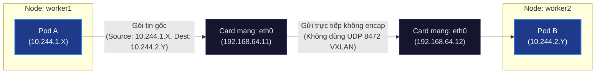

# Lab Tập 16: BGP trong Calico — Chuyển từ VXLAN sang BGP mode

Tập này chuyển Calico sang BGP mode (không encapsulation) và verify routing table thay đổi.

## 📖 Đề bài & Kịch bản thực tế

Hệ thống microservices của doanh nghiệp bạn được triển khai trên cụm Kubernetes Bare-metal (tự quản lý). Để chuẩn bị cho việc triển khai ứng dụng cơ sở dữ liệu phân tán có tần suất giao dịch cao (High TPS), đội ngũ kỹ sư cần tối ưu hóa tối đa hiệu năng mạng trong cụm.

Hiện tại, cụm đang sử dụng mạng Overlay mặc định bằng **VXLAN**. Qua giám sát, bạn nhận thấy:
- Mỗi gói tin đi ra/vào Pod đều mất thêm tài nguyên CPU để đóng gói/giải đóng gói (encap/decap).
- MTU của mạng bị giảm từ 1500 xuống 1450 do gánh nặng (overhead) 50-byte của tiêu đề VXLAN.

**Yêu cầu bài toán:**
1. Hãy cấu hình chuyển đổi toàn bộ cụm Calico sang **BGP mode (No Encapsulation)** nhằm loại bỏ hoàn toàn Overhead của overlay network.
2. Kiểm tra bảng định tuyến trên máy Host Linux (Worker Nodes), chứng minh các route dẫn tới các Pod ở node khác đã được chuyển hướng trực tiếp qua card mạng vật lý `eth0` thay vì đi qua interface ảo `vxlan.calico`.
3. Sử dụng công cụ giám sát mạng (`tcpdump`), bắt trực tiếp lưu lượng ICMP (ping) giữa hai Pod nằm trên hai node khác nhau, chứng minh các gói tin được định tuyến phẳng dạng IP-in-IP-less (không có UDP port 8472 VXLAN encapsulation).

**Mô hình định tuyến mục tiêu (BGP Flat Network):**


## 🛠 Yêu cầu chuẩn bị
- Cụm K8s với Calico từ Tập 9-12.
- `calicoctl` đã cài (từ Tập 10).
- `pod-a` trên `worker1` và `pod-b` trên `worker2` (tạo lại nếu cần).

> **Điều kiện tiên quyết:** BGP mode không encapsulation (`encapsulation: None`) chỉ hoạt động khi tất cả nodes cùng L2 subnet (flat network). Nếu nodes ở khác subnet, packet sẽ bị router trung gian drop vì không biết route đến Pod CIDR. Trường hợp cross-subnet cần dùng `VXLANCrossSubnet` hoặc `IPIPCrossSubnet` thay thế.

---

## 🔬 Thực nghiệm 1: Kiểm tra hệ thống hiện tại và chuyển sang BGP mode

**SSH vào `controlplane`:**

```bash
multipass shell controlplane
```

1. Kiểm tra trạng thái hệ thống Kubernetes hiện tại để đảm bảo các node và component hoạt động bình thường:
   - Kiểm tra trạng thái của các Nodes (phải ở trạng thái `Ready`):
     ```bash
     kubectl get nodes -o wide
     ```
   - Kiểm tra trạng thái của các Pod hệ thống, đặc biệt là các container `calico-node`:
     ```bash
     kubectl get pods -n kube-system -o wide
     ```
   - Kiểm tra danh sách nodes được nhận diện bởi `calicoctl`:
     ```bash
     calicoctl get nodes
     ```

2. Xem IP Pool hiện tại (VXLAN mode):
   ```bash
   calicoctl get ippool -o yaml | grep -E "encapsulation|cidr|name"
   # encapsulation: VXLANCrossSubnet
   ```

3. Chuyển sang BGP mode (không encapsulation):
   ```bash
   calicoctl patch ippool default-ipv4-ippool \
     --patch '{"spec": {"encapsulation": "None", "natOutgoing": true}}'
   ```
   *Lưu ý:* `natOutgoing: true` giữ nguyên — Pod IP (`10.244.x.x`) không được advertise ra ngoài cluster, nên khi Pod gửi traffic ra internet, node sẽ NAT (masquerade) sang Node IP. Nếu tắt, packet từ Pod ra internet sẽ bị router drop.

4. Verify:
   ```bash
   calicoctl get ippool default-ipv4-ippool -o yaml | grep encapsulation
   # encapsulation: None
   ```

5. Đợi khoảng 5-10 giây để Calico Felix cập nhật lại bảng định tuyến (cơ chế watch cập nhật dynamic, không cần restart pod):
   ```bash
   sleep 10
   ```

---

## 🔬 Thực nghiệm 2: Quan sát thay đổi routing table

**SSH vào `worker1`:**

```bash
multipass shell worker1
```

1. Xem routing table mới — không còn tunnel:
   ```bash
   ip route show | grep 10.244
   # 10.244.0.0/26 via 192.168.64.10 dev eth0        ← Direct route tới controlplane
   # 10.244.1.2 dev calic34a6efc193 scope link       ← Route tới Pod A chạy cục bộ (Calico không dùng cni0)
   # 10.244.2.0/26 via 192.168.64.12 dev eth0        ← Direct route tới worker2
   ```
   *Nhận xét:* Routes dùng `eth0` trực tiếp, không phải `vxlan.calico` hay bất kỳ tunnel interface nào.

2. Verify không còn VXLAN interface (hoặc đã down):
   ```bash
   ip link show | grep -i vxlan
   # (không có hoặc không active)
   ```

3. Xem routes do BIRD inject:
   ```bash
   ip route show proto bird
   # 10.244.0.0/26 via 192.168.64.10 dev eth0
   # 10.244.2.0/26 via 192.168.64.12 dev eth0
   ```
   *Lưu ý:* `proto bird` — BIRD là BGP daemon chạy bên trong container `calico-node`. BIRD học Pod subnet routes qua BGP sessions giữa các nodes và inject vào kernel routing table với protocol label `bird`.

---

## 🔬 Thực nghiệm 3: Xem BGP sessions và verify không còn VXLAN

**Mở 2 terminal:**

**Terminal 1 — `worker1`, bắt traffic:**
```bash
multipass shell worker1

# Nghe VXLAN (8472) và ICMP
sudo tcpdump -i eth0 -n '(udp port 8472) or icmp' &
TCPDUMP_PID=$!
```

**Terminal 2 — `controlplane`, tạo traffic:**
```bash
multipass shell controlplane

# Tạo pods nếu chưa có
kubectl get pod pod-a pod-b 2>/dev/null || kubectl apply -f - <<'EOF'
apiVersion: v1
kind: Pod
metadata:
  name: pod-a
spec:
  nodeName: worker1
  containers:
  - name: net
    image: nicolaka/netshoot
    command: ["sleep", "infinity"]
---
apiVersion: v1
kind: Pod
metadata:
  name: pod-b
spec:
  nodeName: worker2
  containers:
  - name: net
    image: nicolaka/netshoot
    command: ["sleep", "infinity"]
EOF
kubectl wait --for=condition=Ready pod/pod-a pod/pod-b --timeout=90s

POD_B_IP=$(kubectl get pod pod-b -o jsonpath='{.status.podIP}')
kubectl exec pod-a -- ping -c 5 $POD_B_IP
```

**Quay lại Terminal 1:**
- **Không thấy** dòng `> 8472` (không có VXLAN)
- Thấy ICMP trực tiếp: `10.244.1.X > 10.244.2.Y: ICMP echo request`

```bash
kill $TCPDUMP_PID
```

---

## 🔬 Thực nghiệm 4: Xem BGPConfiguration và node status

**Trên `controlplane`:**

1. Xem BGP configuration (Lưu ý: Nếu chưa cấu hình, lệnh `get ... default` có thể báo lỗi không tìm thấy, đó là bình thường vì Calico ngầm định cấu hình này):
   ```bash
   calicoctl get bgpconfiguration default -o yaml || calicoctl get bgpconfigurations
   # (Nếu có) spec:
   #   asNumber: 64512           ← AS number của cluster (Autonomous System)
   #   nodeToNodeMeshEnabled: true  ← Full mesh enabled
   ```
   *Lưu ý:* AS number `64512` thuộc dải private ASN (64512–65534, RFC 6996). Calico dùng AS number để thiết lập BGP sessions giữa các nodes — tất cả nodes cùng một AS là iBGP (internal BGP).

2. Xem BGP session status từ controlplane:
   ```bash
   calicoctl node status
   # Calico process is running.
   # IPv4 BGP status
   # PEER ADDRESS  | PEER TYPE      | STATE | SINCE | INFO
   # 192.168.64.11 | node specific  | up    | ...   | Established
   # 192.168.64.12 | node specific  | up    | ...   | Established
   ```

3. Xem BGP peer từ worker1:
   ```bash
   # calicoctl node status bắt buộc chạy local trên node để đọc Unix Socket BIRD
   multipass exec worker1 -- sudo calicoctl node status
   ```

---

## 🔧 Troubleshooting BGP

Mỗi kịch bản dưới đây: **tạo lỗi có chủ đích → quan sát triệu chứng → điều tra → fix → verify**.

---

### Kịch bản 1: BGP session không lên `Established` (block port 179)

**Nguyên nhân mô phỏng:** iptables trên worker2 block TCP 179 → BIRD trên worker1 không thể kết nối peer.

**Bước 1 — Tạo lỗi trên `worker2`:**

```bash
multipass shell worker2

# Block BGP port incoming
sudo iptables -I INPUT -p tcp --dport 179 -j DROP

# Verify rule đã có
sudo iptables -L INPUT -n --line-numbers | grep 179
# 1   DROP  tcp  --  0.0.0.0/0  0.0.0.0/0  tcp dpt:179
```

**Bước 2 — Quan sát triệu chứng từ `worker1`:**

```bash
multipass shell worker1

sudo calicoctl node status
```

Kết quả mong đợi:
```
IPv4 BGP status
PEER ADDRESS  | PEER TYPE     | STATE  | SINCE | INFO
192.168.64.10 | node specific | up     | ...   | Established
192.168.64.12 | node specific | Active | ...   | BGP state is Active
```

`Active` = BIRD đang gửi SYN đến TCP 179 nhưng không nhận SYN-ACK. Khác với `Established` (kết nối thành công) và `Idle` (chưa bắt đầu kết nối).

**Bước 3 — Điều tra:**

```bash
# Test TCP 179 từ worker1 → worker2 (phải thất bại)
nc -zv 192.168.64.12 179 -w 3
# nc: connect to 192.168.64.12 port 179 (tcp) timed out: Operation now in progress

# Xem BIRD log trong calico-node container trên worker1
kubectl logs -n kube-system \
  $(kubectl get pod -n kube-system -l k8s-app=calico-node \
    --field-selector spec.nodeName=worker1 -o name) \
  -c calico-node --tail=50 | grep -iE "connect|active|192.168.64.12"
# Thấy: BGP session to 192.168.64.12 state Active

# Xem BIRD protocol table trực tiếp từ bên trong container
kubectl exec -n kube-system \
  $(kubectl get pod -n kube-system -l k8s-app=calico-node \
    --field-selector spec.nodeName=worker1 -o name) \
  -c calico-node -- birdcl show protocols all | grep -A5 "192.168.64.12"
# State: Active, Last error: Connection timed out
# (DROP rule không gửi TCP RST → BIRD chờ timeout, không phải "Connection refused"
#  "Connection refused" chỉ xảy ra khi dùng -j REJECT)

# Kiểm tra iptables trên worker2 có block không
multipass exec worker2 -- sudo iptables -L INPUT -n | grep 179
# DROP  tcp  ... dpt:179  ← đây là vấn đề
```

**Bước 4 — Fix trên `worker2`:**

```bash
multipass shell worker2

sudo iptables -D INPUT -p tcp --dport 179 -j DROP

# Verify đã xóa rule
sudo iptables -L INPUT -n | grep 179
# (không có output)
```

**Bước 5 — Verify từ `worker1`:**

```bash
# Đợi BIRD reconnect — ConnectRetryTime mặc định 5s nhưng cần thêm
# thời gian cho BGP OPEN + KEEPALIVE exchange trên Multipass
sleep 30
sudo calicoctl node status
```

Kết quả mong đợi:
```
PEER ADDRESS  | PEER TYPE     | STATE | SINCE | INFO
192.168.64.10 | node specific | up    | ...   | Established
192.168.64.12 | node specific | up    | ...   | Established
```

---

### Kịch bản 2: Routes không xuất hiện sau khi patch IP Pool

**Nguyên nhân mô phỏng:** Patch IP Pool về VXLAN (xóa bird routes), sau đó patch lại về None — quan sát cửa sổ thời gian Felix chưa kịp apply và cách xử lý khi chờ quá lâu.

**Bước 1 — Tạo lỗi trên `controlplane`:**

```bash
multipass shell controlplane

# Patch về VXLAN để xóa sạch bird routes
calicoctl patch ippool default-ipv4-ippool \
  --patch '{"spec": {"encapsulation": "VXLANCrossSubnet"}}'

# Đợi Felix apply (routes sẽ biến mất)
sleep 20

# Verify routes đã xóa (chạy trên worker1 từ terminal khác)
# → ip route show proto bird   # Phải trống
```

Trên `worker1` (terminal riêng):
```bash
multipass shell worker1
ip route show proto bird
# (trống — Felix đã xóa bird routes vì đang dùng VXLAN tunnel)
```

**Bước 2 — Patch lại về None, quan sát cửa sổ thiếu routes:**

Trên `controlplane`:
```bash
# Patch về BGP mode
calicoctl patch ippool default-ipv4-ippool \
  --patch '{"spec": {"encapsulation": "None"}}'

# Kiểm tra ngay lập tức — routes chưa có
echo "=== Kiểm tra ngay sau patch ==="
# (chạy lệnh sau trên worker1)
```

Trên `worker1`:
```bash
ip route show proto bird
# (vẫn trống — Felix chưa kịp propagate)
```

**Triệu chứng:** IP Pool đã thay đổi nhưng routing table chưa phản ánh.

**Bước 3 — Điều tra:**

```bash
# Verify IP Pool đã thực sự thay đổi hay chưa
calicoctl get ippool default-ipv4-ippool -o yaml | grep encapsulation
# encapsulation: None  ← đã đúng, vấn đề là Felix chưa apply

# Theo dõi Felix đang làm gì — chỉ định pod cụ thể trên worker1
# (kubectl logs -f với -l label selector và nhiều pod sẽ fail hoặc chọn ngẫu nhiên)
kubectl logs -n kube-system \
  $(kubectl get pod -n kube-system -l k8s-app=calico-node \
    --field-selector spec.nodeName=worker1 -o name) \
  -c calico-node --tail=30 | grep -iE "encap|ippool|route|vxlan"
# Sẽ thấy Felix đang recalculate routes

# Watch routing table trên worker1 đến khi routes xuất hiện
watch -n2 'ip route show proto bird'
# Ctrl+C khi thấy:
# 10.244.0.0/26 via 192.168.64.10 dev eth0
# 10.244.2.0/26 via 192.168.64.12 dev eth0
```

*Thông thường routes xuất hiện sau 15–30s. Trên Multipass với tải cao có thể lên đến 60s.*

**Bước 4 — Nếu sau 90s vẫn trống (fix):**

```bash
# Kiểm tra calico-node pod có healthy không
kubectl get pods -n kube-system -l k8s-app=calico-node -o wide

# Force Felix reload bằng restart DaemonSet
kubectl rollout restart daemonset/calico-node -n kube-system
kubectl rollout status daemonset/calico-node -n kube-system
```

**Bước 5 — Verify:**

```bash
# Trên worker1:
ip route show proto bird
# 10.244.0.0/26 via 192.168.64.10 dev eth0
# 10.244.2.0/26 via 192.168.64.12 dev eth0

# Verify pod connectivity
POD_B_IP=$(kubectl get pod pod-b -o jsonpath='{.status.podIP}')
kubectl exec pod-a -- ping -c3 $POD_B_IP
```

---

### Kịch bản 3: Pod-to-pod ping fail dù routes và BGP session bình thường

**Nguyên nhân mô phỏng:** Chèn DROP rule vào FORWARD chain trên worker1 → packet từ pod-a không được forward ra eth0.

**Bước 1 — Tạo lỗi trên `worker1`:**

```bash
multipass shell worker1

# Xác nhận pod-a CIDR trên worker1
POD_A_CIDR=$(ip route show | grep "dev cali" | awk '{print $1}' | head -1 | sed 's/\.[0-9]*$/\.0\/26/')
echo "Pod CIDR worker1: $POD_A_CIDR"
# 10.244.1.0/26

POD_B_CIDR="10.244.2.0/26"

# Chèn DROP rule: block forward traffic từ pod-a → pod-b subnet
sudo iptables -I FORWARD -s $POD_A_CIDR -d $POD_B_CIDR -j DROP

# Verify rule đã có
sudo iptables -L FORWARD -n --line-numbers | head -5
# 1  DROP  all  -- 10.244.1.0/26  10.244.2.0/26
```

**Bước 2 — Quan sát triệu chứng từ `controlplane`:**

```bash
multipass shell controlplane

POD_B_IP=$(kubectl get pod pod-b -o jsonpath='{.status.podIP}')
kubectl exec pod-a -- ping -c5 $POD_B_IP
```

Kết quả mong đợi:
```
PING 10.244.2.X (10.244.2.X): 56 data bytes
--- 10.244.2.X ping statistics ---
5 packets transmitted, 0 received, 100% packet loss
```

**Bước 3 — Điều tra:**

```bash
# Trên worker1:

# Kiểm tra: Routes có không? BGP có up không?
ip route show | grep 10.244
# 10.244.2.0/26 via 192.168.64.12 dev eth0  ← Routes OK

sudo calicoctl node status | grep -E "STATE|Established|Active"
# Established ← BGP OK

# Vậy vấn đề nằm ở dataplane, không phải control plane
# → Kiểm tra iptables FORWARD chain
sudo iptables -L FORWARD -n -v | head -10
# pkts bytes target  prot  ... source          destination
#    5   500 DROP    all   ... 10.244.1.0/26   10.244.2.0/26  ← đây rồi!
```

```bash
# Xác nhận bằng tcpdump: packet có rời khỏi worker1 không?
# Terminal 1 - worker2:
sudo tcpdump -i eth0 -n 'icmp and src 10.244.1.0/24' &
TCPDUMP_PID=$!

# Terminal 2 - controlplane: tạo traffic
kubectl exec pod-a -- ping -c3 $POD_B_IP

# Quay lại worker2:
kill $TCPDUMP_PID
# Không thấy packet ICMP → packet bị DROP tại worker1 trước khi ra eth0
```

**Bước 4 — Fix trên `worker1`:**

```bash
POD_A_CIDR="10.244.1.0/26"
POD_B_CIDR="10.244.2.0/26"

sudo iptables -D FORWARD -s $POD_A_CIDR -d $POD_B_CIDR -j DROP

# Verify đã xóa
sudo iptables -L FORWARD -n | grep "10.244.1"
# (không có DROP rule)
```

**Bước 5 — Verify:**

```bash
# Trên controlplane:
POD_B_IP=$(kubectl get pod pod-b -o jsonpath='{.status.podIP}')
kubectl exec pod-a -- ping -c5 $POD_B_IP
# 5 packets transmitted, 5 received, 0% packet loss

# Tcpdump confirm plain ICMP (không VXLAN) — chạy trên worker2:
sudo tcpdump -i eth0 -n 'icmp' -c10
# 10.244.1.X > 10.244.2.Y: ICMP echo request
# 10.244.2.Y > 10.244.1.X: ICMP echo reply
```

---

### Kịch bản 4: `calicoctl node status` báo lỗi socket

**Nguyên nhân mô phỏng:** Xóa calico-node pod trên worker1 (DaemonSet tự restart), chạy `calicoctl node status` trong khoảng thời gian Felix chưa khởi động lại xong.

**Bước 1 — Tạo lỗi:**

> **Lưu ý timing:** Mở sẵn shell worker1 TRƯỚC khi chạy lệnh delete. DaemonSet tạo pod mới ngay lập tức — image đã pull sẵn nên container start trong 3–8s. Phải chạy `calicoctl node status` ngay trong cửa sổ đó.

**Terminal 1 — Mở sẵn shell worker1:**
```bash
multipass shell worker1
# Giữ sẵn terminal này, chưa chạy gì
```

**Terminal 2 — Controlplane, xóa pod:**
```bash
multipass shell controlplane

# Tìm tên pod calico-node trên worker1
CALICO_POD_W1=$(kubectl get pod -n kube-system -l k8s-app=calico-node \
  --field-selector spec.nodeName=worker1 -o name)
echo $CALICO_POD_W1

# Xóa pod — chuyển ngay sang Terminal 1 sau lệnh này
kubectl delete $CALICO_POD_W1 -n kube-system --wait=false
```

**Bước 2 — Quan sát triệu chứng (Terminal 1 — `worker1`, ngay sau bước trên):**

```bash
# Chạy ngay, trong khoảng 3-15s sau khi pod bị xóa
sudo calicoctl node status
```

Kết quả mong đợi:
```
Error: No process is using this socket (is Felix running?)
```

Hoặc nếu pod đã restart nhưng Felix chưa khởi tạo xong:
```
Calico process is not running.
```

**Bước 3 — Điều tra:**

```bash
# Từ controlplane: kiểm tra trạng thái pod
kubectl get pod -n kube-system -l k8s-app=calico-node -o wide
# worker1 pod đang: ContainerCreating / Init:x/y / Running (vừa restart)

# Xem log pod mới trên worker1
kubectl logs -n kube-system \
  $(kubectl get pod -n kube-system -l k8s-app=calico-node \
    --field-selector spec.nodeName=worker1 -o name) \
  -c calico-node --tail=30
# Thấy Felix đang khởi động: "Starting Felix" / "Waiting for datastore"

# Kiểm tra Unix socket có chưa (trên worker1)
ls -la /var/run/calico/
# Nếu không có bird.ctl → BIRD chưa start → đây là nguyên nhân lỗi socket
```

**Bước 4 — Fix: đợi pod healthy:**

```bash
# Trên controlplane:
kubectl rollout status daemonset/calico-node -n kube-system --timeout=120s
# Waiting for daemon set "calico-node" rollout to finish...
# daemon set "calico-node" successfully rolled out
```

**Bước 5 — Verify:**

```bash
# Trên worker1 (sau khi pod Running):
sudo calicoctl node status
# Calico process is running.
# PEER ADDRESS  | STATE | INFO
# 192.168.64.10 | up    | Established
# 192.168.64.12 | up    | Established

# Routing table đã phục hồi
ip route show proto bird
# 10.244.0.0/26 via 192.168.64.10 dev eth0
# 10.244.2.0/26 via 192.168.64.12 dev eth0
```

---

### Kịch bản 5: VXLAN interface vẫn `UP` sau khi chuyển sang BGP mode

**Nguyên nhân mô phỏng:** Patch IP Pool về VXLAN (tạo lại vxlan.calico interface), sau đó patch về None — trong khoảng thời gian Felix chưa cleanup, interface vẫn còn `UP`.

**Bước 1 — Tạo lỗi trên `controlplane`:**

```bash
multipass shell controlplane

# Bật lại VXLAN để interface vxlan.calico xuất hiện
calicoctl patch ippool default-ipv4-ippool \
  --patch '{"spec": {"encapsulation": "VXLANCrossSubnet"}}'

# Đợi Felix tạo interface
sleep 20

# Xác nhận vxlan.calico đã xuất hiện trên worker1
multipass exec worker1 -- ip link show vxlan.calico
# vxlan.calico: <BROADCAST,MULTICAST,UP,LOWER_UP> mtu 1450 ...

# Giờ patch về None ngay lập tức
calicoctl patch ippool default-ipv4-ippool \
  --patch '{"spec": {"encapsulation": "None"}}'
```

**Bước 2 — Quan sát triệu chứng trên `worker1`:**

> **Lưu ý timing:** Felix cleanup interface nhanh (5–15s). Dùng `watch` để capture trạng thái transient thay vì chạy lệnh đơn lẻ.

```bash
multipass shell worker1

# Chạy watch NGAY SAU khi patch về None ở bước trên
# Ctrl+C ngay khi thấy vxlan.calico xuất hiện rồi biến mất
watch -n1 'ip link show | grep -i vxlan; echo "---"; ip route show | grep vxlan'
```

Quan sát thấy 2 giai đoạn:
```
# Giai đoạn 1 (ngay sau patch về None): interface vẫn còn
vxlan.calico: <BROADCAST,MULTICAST,UP,LOWER_UP> mtu 1450 ...
---
(routes trống — không còn dùng vxlan)

# Giai đoạn 2 (sau 5-15s): Felix cleanup xong
(không có output — interface đã xóa)
---
```

**Bước 3 — Điều tra: interface còn nhưng có ảnh hưởng routing không?**

```bash
# Kiểm tra routes có đi qua vxlan không
ip route show | grep vxlan
# (trống → routes không dùng vxlan nữa)

# Kiểm tra routes đang dùng gì
ip route show | grep 10.244
# 10.244.0.0/26 via 192.168.64.10 dev eth0  ← eth0 ✓
# 10.244.2.0/26 via 192.168.64.12 dev eth0  ← eth0 ✓
# (hoặc có thể vẫn trống nếu Felix chưa add bird routes lại — xem Kịch bản 2)

# Kiểm tra IP Pool đã apply đúng chưa
calicoctl get ippool default-ipv4-ippool -o yaml | grep encapsulation
# encapsulation: None  ← config đúng, Felix đang xử lý

# Xem Felix log
kubectl logs -n kube-system -l k8s-app=calico-node \
  -c calico-node --tail=30 | grep -iE "vxlan|cleanup|remove|interface"
```

*Interface `vxlan.calico` tồn tại mà không có routes đi qua nó = **bình thường**, Felix sẽ xóa khi có cơ hội. Trường hợp nguy hiểm: routes vẫn đi qua `vxlan.calico` trong khi config đã là `None`.*

**Bước 4 — Fix: force Felix cleanup interface:**

```bash
# Trên controlplane:
kubectl rollout restart daemonset/calico-node -n kube-system
kubectl rollout status daemonset/calico-node -n kube-system
```

**Bước 5 — Verify:**

```bash
# Trên worker1 (sau khi calico-node restart xong):
ip link show | grep -i vxlan
# (không có output — interface đã xóa)

ip route show proto bird
# 10.244.0.0/26 via 192.168.64.10 dev eth0
# 10.244.2.0/26 via 192.168.64.12 dev eth0

# Confirm pod connectivity vẫn bình thường
POD_B_IP=$(kubectl get pod pod-b -o jsonpath='{.status.podIP}')
kubectl exec pod-a -- ping -c3 $POD_B_IP
# 0% packet loss
```

---

### Bảng tóm tắt: Triệu chứng → Nguyên nhân → Fix

| Triệu chứng | Nguyên nhân | Fix |
| :--- | :--- | :--- |
| BGP state `Active` | TCP 179 bị block (iptables/firewall) | Xóa DROP rule, verify `nc -zv <peer> 179` |
| BGP state `Idle` | Felix chưa start hoặc sai BGPConfiguration | Đợi pod ready, kiểm tra `calicoctl get bgpconfig` |
| `proto bird` routes trống | Felix chưa kịp apply sau patch | `watch ip route show proto bird`, sau 90s → restart DaemonSet |
| Pod ping 100% loss, routes có | iptables FORWARD chain DROP | `iptables -L FORWARD -n -v`, xóa rule lạ |
| `No process is using this socket` | BIRD/Felix chưa start (pod restarting) | `kubectl rollout status daemonset/calico-node` |
| `vxlan.calico` vẫn UP | Felix chưa cleanup (timing) | Bình thường nếu routes không dùng nó; restart DaemonSet để dọn |

---

## 🧹 Dọn dẹp / Chuẩn bị cho tập tiếp theo

```bash
# Giữ nguyên BGP mode cho Tập 17 (WireGuard)
# Không cần xóa gì
```

> **Lý thuyết Route Reflector** đã được trình bày trong slide tập này.
> Cấu hình hands-on Route Reflector có trong `tap-17-route-reflector/lab-guide.md` (tài liệu tham khảo tùy chọn).

---

## ✅ Tổng kết

1. **BGP mode = không encapsulation:** IP Pool `encapsulation: None` → routes trực tiếp qua `eth0`, không qua tunnel. Yêu cầu L2 flat network giữa các nodes.
2. **Routing table thay đổi:** Thay vì route qua VXLAN interface, giờ route thẳng qua `eth0` via Node IP, inject bởi BIRD BGP daemon.
3. **tcpdump confirm:** Không có UDP 8472, packet ICMP có source/dest là Pod IP thật (không wrapped).
4. **BIRD quản lý routes:** BGP sessions giữa các Nodes trao đổi Pod subnet routes — giống như datacenter routing.
