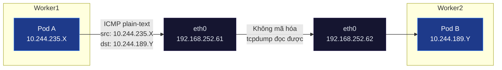
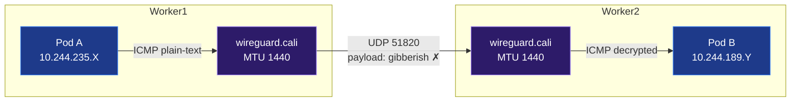

# Lab Tập 17: WireGuard trong Calico — Mã hóa Traffic và Fix MTU

Tập này bật WireGuard encryption, verify traffic được mã hóa, và reproduce + fix PMTUD Black Hole.

## 📖 Đề bài & Kịch bản thực tế

Cụm Kubernetes của công ty đang chạy chế độ BGP (No Encapsulation) từ Tập 16. Đội bảo mật vừa hoàn thành kiểm tra tuân thủ (compliance audit) và yêu cầu: **toàn bộ traffic giữa các Pod phải được mã hóa end-to-end**, kể cả khi truyền qua mạng nội bộ datacenter, nhằm đáp ứng tiêu chuẩn Zero Trust Network.

Đội platform chọn **WireGuard** — giải pháp mã hóa kernel-native, không cần sidecar proxy hay service mesh — vì overhead thấp và tích hợp sẵn trong Calico.

Sau khi bật WireGuard, team nhận báo cáo: *"Request nhỏ vẫn OK, nhưng upload file lớn bị treo (hang) không hoàn thành."* Đây là dấu hiệu điển hình của **PMTUD Black Hole** — lỗ hổng MTU phổ biến nhất khi thêm tầng encapsulation/encryption vào network stack.

**Yêu cầu bài toán:**
1. Bật WireGuard encryption cho toàn bộ Pod traffic trong cụm thông qua `FelixConfiguration`, xác nhận interface `wireguard.cali` xuất hiện trên các node.
2. Dùng `tcpdump` để chứng minh traffic đã được mã hóa: chỉ thấy UDP port 51820 với payload không đọc được, không còn ICMP plain-text.
3. Tái hiện lỗi **PMTUD Black Hole** bằng cách cấu hình `wireguardMTU` sai (quá cao), quan sát hiện tượng file nhỏ OK nhưng file lớn hang.
4. Chẩn đoán nguyên nhân bằng `ping -M do -s <size>`, sau đó fix bằng cách set MTU đúng (`1440`) và xác nhận cơ chế điều chỉnh MSS (MSS Clamping) tự động thông qua việc cấu hình MTU của Pod.

### Sơ đồ so sánh: Trước và sau khi bật WireGuard

#### 1. Trước WireGuard — BGP Flat Network (plain-text)


#### 2. Sau WireGuard — Encrypted (UDP 51820)


## 🛠 Yêu cầu chuẩn bị
- Cụm K8s chạy Calico (đã cấu hình BGP ở Tập 16).
- Thông tin các node trong lab:
  - `controlplane`: IP `192.168.252.60` (Pod CIDR: `10.244.49.64/26`)
  - `worker1`: IP `192.168.252.61` (Pod CIDR: `10.244.235.128/26`)
  - `worker2`: IP `192.168.252.62` (Pod CIDR: `10.244.189.64/26`)
- OS: Ubuntu 26.04 (Kernel 7.0.0-22-generic arm64) đã tích hợp sẵn WireGuard trong kernel.
- Cài đặt `wireguard-tools` trên các node để có công cụ CLI `wg` (chạy `sudo apt-get update && sudo apt-get install -y wireguard-tools`).
- `pod-a` chạy trên `worker1` (IP thuộc dải `10.244.235.128/26`), `pod-b` chạy trên `worker2` (IP thuộc dải `10.244.189.64/26`).

---

## 🔬 Thực nghiệm 1: Kiểm tra WireGuard module

**SSH vào `worker1`:**

```bash
multipass shell worker1
```

1. Load WireGuard module:
   ```bash
   sudo modprobe wireguard && echo "WireGuard OK"
   # WireGuard OK
   ```

2. Verify module loaded:
   ```bash
   lsmod | grep wireguard
   # wireguard   xxxxx  0
   ```

3. Kiểm tra kernel version đủ điều kiện:
   ```bash
   uname -r
   # 7.0.0-22-generic-arm64   ← Đủ điều kiện (cần 5.6+)
   ```

4. Cài đặt `wireguard-tools` (công cụ CLI `wg` để debug):
   ```bash
   sudo apt-get update && sudo apt-get install -y wireguard-tools
   ```

> 💡 **Giải thích cho học viên:**
> - **Tại sao kiểm tra module WireGuard?** WireGuard trong Linux chạy trực tiếp ở cấp độ nhân (Kernel space) cho tốc độ tối đa và độ trễ tối thiểu. Thay vì chạy ở Userspace (như IPSec trong một số CNI cũ hoặc OpenVPN), WireGuard đóng gói gói tin ngay trong Kernel.
> - `sudo modprobe wireguard`: Câu lệnh yêu cầu Linux Kernel nạp module WireGuard vào bộ nhớ.
> - `lsmod`: Liệt kê các kernel module hiện đang hoạt động để xác nhận WireGuard đã sẵn sàng.
> - `uname -r`: WireGuard được tích hợp chính thức vào Linux Kernel từ bản 5.6. Do hệ thống của chúng ta dùng Ubuntu 26.04 với Kernel 7.0+, module này đã có sẵn và không cần cài đặt thêm gói ngoài.

---

## 🔬 Thực nghiệm 2: Bật WireGuard trong Calico

**SSH vào `controlplane`:**

```bash
multipass shell controlplane
```

1. Bật WireGuard encryption:
   ```bash
   kubectl patch felixconfiguration default \
     --type merge \
     --patch '{"spec": {"wireguardEnabled": true}}'
   ```

2. Chờ Calico áp dụng (~30 giây):
   ```bash
   kubectl -n calico-system rollout status daemonset/calico-node
   ```

3. Verify interface `wireguard.cali` xuất hiện trên `worker1`:
   **SSH vào `worker1`:**
   ```bash
   multipass shell worker1
   ```
   **Kiểm tra interface:**
   ```bash
   ip link show wireguard.cali
   # wireguard.cali: <POINTOPOINT,NOARP,UP,LOWER_UP> mtu 1440 qdisc ...
   # MTU = 1440 ← WireGuard overhead accounting
   ```

4. Xem WireGuard public key và peers trên `worker1`:
   ```bash
   sudo wg show wireguard.cali
   # interface: wireguard.cali
   #   public key: xxxxx=
   #   listening port: 51820
   #   peers: 2    ← Peer với 2 nodes khác (controlplane và worker2)
   ```

> 💡 **Giải thích cho học viên:**
> - **Cấu hình Felix (Calico Agent):** Khi set `wireguardEnabled: true`, Calico DaemonSet (chạy felix) nhận diện cấu hình từ data store của K8s. Felix tự động tạo interface ảo `wireguard.cali` trên từng node, tự sinh cặp khóa public/private key cho WireGuard và chia sẻ public key này với các node khác trong cụm thông qua BGP/Calico IPAM.
> - **Interface `wireguard.cali`:** Là một Point-to-Point tunnel. Toàn bộ traffic giữa Pod ở các node khác nhau đi qua routing table sẽ được đẩy vào interface ảo này thay vì đẩy trực tiếp ra `eth0`.
> - **Tại sao MTU mặc định là 1440?** Vì WireGuard đóng gói gói tin gốc bằng header mới (gồm IP, UDP, và mã hóa) tốn 60 bytes overhead. Nếu MTU vật lý là 1500, MTU hiệu dụng tối đa sẽ là 1440. Calico tự động tính toán và đặt mặc định là 1440.
> - **`sudo wg show`:** Công cụ quản trị WireGuard cho biết cổng lắng nghe mặc định (UDP 51820) và thông tin các Peer (các node khác trong cluster).

---

## 🔬 Thực nghiệm 3: Verify encryption đang hoạt động

**Mở 2 terminal:**

**Terminal 1 — `worker1`, bắt WireGuard traffic:**
```bash
multipass shell worker1

sudo tcpdump -i eth0 -n udp port 51820 -X -c 10 &
TCPDUMP_PID=$!
```

**Terminal 2 — `controlplane`, tạo traffic:**
```bash
multipass shell controlplane
POD_B_IP=$(kubectl get pod pod-b -o jsonpath='{.status.podIP}')
kubectl exec pod-a -- ping -c 5 $POD_B_IP
```

**Quay lại Terminal 1:**
```bash
# Thấy UDP packets trên port 51820 với payload gibberish (encrypted):
# 0x0000: xxxx xxxx xxxx xxxx xxxx xxxx xxxx xxxx
# ← Không đọc được nội dung! Đang mã hóa.

kill $TCPDUMP_PID
```

**So sánh:** Nếu tắt WireGuard, tcpdump thấy ICMP rõ nội dung. Với WireGuard bật, chỉ thấy UDP noise.

Xem transfer stats (chạy trên `worker1`):
```bash
sudo wg show wireguard.cali transfer
# peer: xxx=
#   transfer: X KiB received, Y KiB sent  ← Traffic đã qua WireGuard
```

> 💡 **Giải thích cho học viên:**
> - **Nguyên lý đóng gói (Encapsulation):** Trước khi bật WireGuard, gói tin đi từ Pod A sang Pod B là một gói tin ICMP plain-text thuần túy. Khi ta sniff trên card vật lý `eth0` bằng tcpdump, ta có thể dễ dàng đọc được nội dung của gói tin.
> - **Khi bật WireGuard:**
>   1. Gói tin ICMP từ `pod-a` đi tới kernel routing table.
>   2. Kernel điều hướng nó đi vào interface ảo `wireguard.cali`.
>   3. Tại đây, WireGuard lấy gói tin gốc làm payload, mã hóa nó bằng thuật toán ChaCha20-Poly1305, thêm WireGuard Header, rồi đóng vào một gói tin UDP với Source/Destination IP là IP vật lý của các node và Destination Port là 51820.
>   4. Vì thế, sniff trên `eth0` ta chỉ nhìn thấy các gói tin UDP 51820 và dữ liệu hoàn toàn là "gibberish" (nhiễu vô nghĩa), bảo vệ an toàn cho dữ liệu truyền tải giữa các Pod.
>   5. `sudo wg show wireguard.cali transfer` xác nhận dữ liệu đã được truyền/nhận thực tế qua interface mã hóa này.

---

## 💥 Thực nghiệm 4: Reproduce PMTUD Black Hole và Fix

### 📋 Bước 0: Kiểm tra baseline (trước khi thay đổi MTU)

Verify trạng thái đúng làm reference. Tạo file test ở đây để tái sử dụng xuyên suốt thực nghiệm.

**Trên `controlplane` — kiểm tra nguồn cấu hình:**

**0a. Xem wireguardMTU trong FelixConfiguration (source of truth):**
```bash
kubectl get felixconfiguration default -o yaml | grep -E 'wireguard'
# wireguardEnabled: true
# wireguardMTU: 1440   ← Nếu không có dòng wireguardMTU → Calico đang auto-detect = 1440
```

> 💡 Calico Felix đọc `wireguardMTU` từ FelixConfig rồi áp dụng lên interface `wireguard.cali` và tính MSS = wireguardMTU - 40. Nếu field không tồn tại, Felix tự tính từ physical MTU của `eth0`: `1500 - 60 (WireGuard overhead) = 1440`.

**SSH vào `worker1` — kiểm tra kết quả áp dụng:**
```bash
multipass shell worker1
```

**0b. Confirm MTU interface = 1440 (Felix đã áp xuống):**
```bash
ip link show wireguard.cali | grep -o 'mtu [0-9]*'
# mtu 1440  ← Đúng
```

**0c. Kiểm tra MTU và MSS của Pod:**
Do Calico cấu hình MTU của Pod trực tiếp, Linux TCP stack bên trong Pod sẽ tự giới hạn MSS mà không cần luật iptables `TCPMSS` trên host. Ta confirm bằng cách kiểm tra MTU của Pod `pod-a`:
```bash
kubectl exec pod-a -- ip link show eth0
# eth0@ifX: <BROADCAST,MULTICAST,UP,LOWER_UP> mtu 1440 ...
```
> 💡 Điều này có nghĩa là mọi kết nối TCP đi ra từ Pod sẽ tự động thương lượng MSS tối đa là `1440 - 40 = 1400` bytes.

**Trên `controlplane`:**

**0d. Tạo file test 5MB và verify transfer lớn hoạt động bình thường:**
```bash
kubectl exec pod-a -- dd if=/dev/zero of=/tmp/largefile bs=1M count=5 2>&1
# 5+0 records in, 5+0 records out  ← File tạo thành công

kubectl exec pod-b -- nc -l -p 9999 > /dev/null &
POD_B_IP=$(kubectl get pod pod-b -o jsonpath='{.status.podIP}')
kubectl exec pod-a -- sh -c "nc -w 10 $POD_B_IP 9999 < /tmp/largefile"
# (Hoàn thành ngay) ✅  ← MTU đúng: file lớn qua được hoàn toàn
```

> 💡 **Tại sao cần baseline?** Tạo reference point rõ ràng: cùng test, cùng điều kiện, chỉ thay đổi một biến là MTU. Khi bước tiếp gây hang, học viên biết chắc MTU là nguyên nhân, không phải config khác. "Trước/Sau" contrast là cách chứng minh tốt nhất trong lab.

---

### 💣 Bước 1: Gây lỗi PMTUD Black Hole

**Trên `controlplane`:**

1. Đặt MTU sai (quá cao) để trigger PMTUD Black Hole:
   ```bash
   kubectl patch felixconfiguration default \
     --type merge \
     --patch '{"spec": {"wireguardMTU": 1500}}'
   # Sai! Physical MTU là 1500, WireGuard overhead 60 bytes → thực tế chỉ còn 1440
   ```

2. Chờ config áp dụng:
   ```bash
   kubectl -n calico-system rollout restart daemonset/calico-node
   kubectl -n calico-system rollout status daemonset/calico-node
   ```

   **Verify MTU của Pod đã thay đổi**:
   ```bash
   kubectl exec pod-a -- ip link show eth0 | grep -o 'mtu [0-9]*'
   # mtu 1500  ← MTU của Pod tăng lên 1500 (theo FelixConfig mới)
   ```

   > ⚠️ **Tại sao MTU 1500 gây Black Hole?** Khi MTU của Pod là 1500, Linux TCP stack trong Pod sẽ thương lượng MSS tối đa là `1500 - 40 = 1460` bytes. Khi gửi file lớn, Pod gửi các gói tin IP kích thước 1500 bytes. Khi đi qua host, WireGuard đóng gói thêm 60 bytes overhead làm gói tin phình to thành **1560 bytes > 1500 bytes (MTU vật lý) → Bị drop**. Do iptables rule phía dưới giả lập drop âm thầm (không phản hồi ICMP), bên gửi không biết để hạ MSS xuống → kết nối treo vô hạn.

3. **Giả lập drop gói tin quá khổ ở card vật lý (do môi trường ảo hóa Multipass/Bridges nội bộ thường tự bypass và cho qua gói tin > 1500 bytes):**
   **SSH vào `worker1`:**
   ```bash
   multipass shell worker1
   ```
   **Chạy lệnh sau để drop các gói tin UDP Wireguard có kích thước IP packet > 1500 bytes:**
   ```bash
   sudo iptables -I OUTPUT -p udp --dport 51820 -m length --length 1501:65535 -j DROP
   ```

4. Thử transfer file lớn — **sẽ HANG (treo):**
   > File `/tmp/largefile` đã tạo sẵn từ Bước 0. Nếu pod-a restart, chạy lại: `kubectl exec pod-a -- dd if=/dev/zero of=/tmp/largefile bs=1M count=5`

   ```bash
   # Terminal 1: pod-b lắng nghe
   kubectl exec pod-b -- nc -l -p 9999 > /dev/null &

   # Terminal 2: pod-a gửi file lớn
   POD_B_IP=$(kubectl get pod pod-b -o jsonpath='{.status.podIP}')
   kubectl exec pod-a -- sh -c "nc -w 30 $POD_B_IP 9999 < /tmp/largefile"
   # (Hang 30 giây rồi timeout) ← PMTUD Black Hole! TCP MSS=1460 → inner 1500B → WireGuard wrap 1560B > 1500B → DROP!
   ```

6. Diagnose with ping DF bit — **sẽ HANG (không có phản hồi):**
   ```bash
   kubectl exec pod-a -- ping -s 1440 -M do $(kubectl get pod pod-b -o jsonpath='{.status.podIP}')
   # (Đứng treo hoặc báo timeout) ← PMTUD Black Hole thực tế!
   # Vì gói tin ICMP kích thước 1468 bytes + 60 bytes WireGuard = 1528 bytes, lớn hơn 1500 bytes vật lý và bị drop.
   ```

7. **Fix:** Set MTU đúng:
   **Trên terminal `controlplane`:**
   ```bash
   kubectl patch felixconfiguration default \
     --type merge \
     --patch '{"spec": {"wireguardMTU": 1440}}'

   kubectl -n calico-system rollout restart daemonset/calico-node
   kubectl -n calico-system rollout status daemonset/calico-node
   ```

8. Test lại sau fix — **sẽ thành công ngay lập tức:**
   ```bash
   # Restart listener (nc cũ trên pod-b đã exit sau khi sender timeout ở step 5)
   kubectl exec pod-b -- pkill nc 2>/dev/null; true
   kubectl exec pod-b -- nc -l -p 9999 > /dev/null &

   POD_B_IP=$(kubectl get pod pod-b -o jsonpath='{.status.podIP}')
   kubectl exec pod-a -- sh -c "nc -w 10 $POD_B_IP 9999 < /tmp/largefile"
   # (Hoàn thành trong vài giây) ✅
   # Vì lúc này TCP MSS=1400 → inner IP 1440B → WireGuard wrap 1500B = physical MTU, đi qua được!
   ```

9. **Kiểm tra MTU của Pod sau khi fix:**
   ```bash
   kubectl exec pod-a -- ip link show eth0 | grep -o 'mtu [0-9]*'
   # mtu 1440  ← MTU đã quay lại 1440
   ```
   > 💡 Lúc này, Linux TCP stack trong Pod sẽ tự động thương lượng MSS tối đa là `1440 - 40 = 1400` bytes. Gói tin IP tối đa gửi ra từ Pod là 1440 bytes, cộng thêm 60 bytes WireGuard overhead = đúng 1500 bytes, đi qua card mạng vật lý hoàn hảo!

> 💡 **Giải thích cho học viên:**
> - **PMTUD Black Hole là gì?** Khi một gói tin TCP được gửi với cờ DF=1 (Don't Fragment) và có kích thước lớn hơn MTU của đường truyền (1440 bytes của WireGuard), thiết bị mạng (hoặc kernel) buộc phải hủy gói tin và gửi lại bản tin ICMP "Fragmentation Needed" (Type 3, Code 4) cho bên gửi để giảm kích thước đóng gói (MSS). Tuy nhiên, nếu bản tin ICMP này bị chặn bởi tường lửa hoặc router dọc đường (chính là lỗ đen - Black Hole), bên gửi sẽ không bao giờ biết lý do tại sao gói tin bị drop và tiếp tục truyền lại với kích thước cũ dẫn đến kết nối bị treo (hang).
> - **MSS Clamping hoạt động thế nào?** Thay vì viết các luật iptables `TCPMSS` trên host (dễ gây overhead và phức tạp), Calico giải quyết bài toán MSS bằng cách cấu hình trực tiếp MTU của Pod thông qua CNI. Khi MTU của card mạng ảo trong Pod được hạ xuống đúng bằng `wireguardMTU`, Linux TCP stack bên trong container sẽ tự động điều chỉnh trường MSS (Maximum Segment Size) trong quá trình bắt tay 3 bước (TCP 3-way handshake) về mức an toàn.
> - **Công thức tính MSS:** `MSS = wireguardMTU - 20 (IP header) - 20 (TCP header) = 1440 - 40 = 1400 bytes`. Nhờ đó, gói tin IP từ Pod gửi đi không bao giờ vượt quá 1440 bytes. Khi host đóng gói thêm 60 bytes WireGuard, gói tin UDP ngoài cùng đạt tối đa 1500 bytes (vừa khít MTU vật lý), truyền đi trơn tru không bị drop.

---

## 🧹 Dọn dẹp

1. Xóa rule giả lập drop gói tin quá khổ trên `worker1`:
   **SSH vào `worker1` và chạy:**
   ```bash
   sudo iptables -D OUTPUT -p udp --dport 51820 -m length --length 1501:65535 -j DROP
   ```

2. Tắt WireGuard trên `controlplane`:
   ```bash
   kubectl patch felixconfiguration default \
     --type merge \
     --patch '{"spec": {"wireguardEnabled": false}}'
   ```

---

## ✅ Tổng kết

1. **WireGuard kernel-native:** Ubuntu 26.04 kernel 6.x/7.x+ có sẵn — không cần cài thêm gì.
2. **Interface `wireguard.cali`:** Xuất hiện trên mỗi Node sau khi bật, MTU 1440, UDP port 51820.
3. **Traffic encrypted:** tcpdump thấy UDP 51820 với payload gibberish — không đọc được nội dung.
4. **PMTUD Black Hole:** MTU sai → file nhỏ OK, file lớn hang — diagnose bằng `ping -M do -s 1440`.
5. **Fix:** Set `wireguardMTU: 1440` → Calico tự động đồng bộ MTU xuống interface của Pod, giúp Linux TCP stack tự giới hạn MSS về 1400 (`MTU - 40 bytes`) mà không cần luật iptables TCPMSS trên host.
