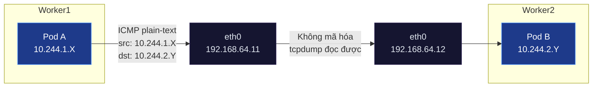
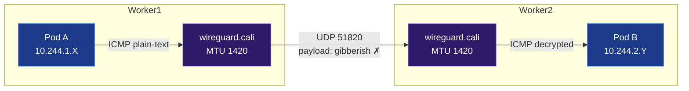

# Lab Tập 17: WireGuard trong Calico — Mã hóa Traffic và Fix MTU

Tập này bật WireGuard encryption, verify traffic được mã hóa, và reproduce + fix PMTUD Black Hole.

## 📖 Đề bài & Kịch bản thực tế

Cụm Kubernetes của công ty đang chạy chế độ BGP (No Encapsulation) từ Tập 16. Đội bảo mật vừa hoàn thành kiểm tra tuân thủ (compliance audit) và yêu cầu: **toàn bộ traffic giữa các Pod phải được mã hóa end-to-end**, kể cả khi truyền qua mạng nội bộ datacenter, nhằm đáp ứng tiêu chuẩn Zero Trust Network.

Đội platform chọn **WireGuard** — giải pháp mã hóa kernel-native, không cần sidecar proxy hay service mesh — vì overhead thấp và tích hợp sẵn trong Calico.

Sau khi bật WireGuard, team nhận báo cáo: *"Request nhỏ vẫn OK, nhưng upload file lớn bị treo (hang) không hoàn thành."* Đây là dấu hiệu điển hình của **PMTUD Black Hole** — lỗ hổng MTU phổ biến nhất khi thêm tầng encapsulation/encryption vào network stack.

**Yêu cầu bài toán:**
1. Bật WireGuard encryption cho toàn bộ Pod traffic trong cụm thông qua `FelixConfiguration`, xác nhận interface `wireguard.cali` xuất hiện trên các node.
2. Dùng `tcpdump` để chứng minh traffic đã được mã hóa: chỉ thấy UDP port 51820 với payload không đọc được, không còn ICMP plain-text.
3. Tái hiện lỗi **PMTUD Black Hole** bằng cách cấu hình `wireguardMTU` sai (quá cao), quan sát hiện tượng file nhỏ OK nhưng file lớn hang.
4. Chẩn đoán nguyên nhân bằng `ping -M do -s <size>`, sau đó fix bằng cách set MTU đúng (`1420`) và xác nhận MSS Clamping được Calico tự động cài vào `iptables mangle`.

### Sơ đồ so sánh: Trước và sau khi bật WireGuard

#### 1. Trước WireGuard — BGP Flat Network (plain-text)


#### 2. Sau WireGuard — Encrypted (UDP 51820)


## 🛠 Yêu cầu chuẩn bị
- Cụm K8s với Calico từ Tập 9.
- Ubuntu 26.04 — WireGuard được build sẵn trong kernel 6.x/7.x+.
- `pod-a` trên `worker1`, `pod-b` trên `worker2`.

---

## 🔬 Thực nghiệm 1: Kiểm tra WireGuard module

**SSH vào `worker1`:**

```bash
multipass shell worker1
```

1. Load WireGuard module:
   ```bash
   sudo modprobe wireguard && echo "WireGuard OK"
   # WireGuard OK
   ```

2. Verify module loaded:
   ```bash
   lsmod | grep wireguard
   # wireguard   xxxxx  0
   ```

3. Kiểm tra kernel version đủ điều kiện:
   ```bash
   uname -r
   # 6.x.x/7.x.x-generic   ← Đủ điều kiện (cần 5.6+)
   ```

---

## 🔬 Thực nghiệm 2: Bật WireGuard trong Calico

**SSH vào `controlplane`:**

```bash
multipass shell controlplane
```

1. Bật WireGuard encryption:
   ```bash
   kubectl patch felixconfiguration default \
     --type merge \
     --patch '{"spec": {"wireguardEnabled": true}}'
   ```

2. Chờ Calico áp dụng (~30 giây):
   ```bash
   kubectl -n calico-system rollout status daemonset/calico-node
   ```

3. Verify interface `wireguard.cali` xuất hiện trên worker1:
   ```bash
   multipass exec worker1 -- ip link show wireguard.cali
   # wireguard.cali: <POINTOPOINT,NOARP,UP,LOWER_UP> mtu 1420 qdisc ...
   # MTU = 1420 ← WireGuard overhead accounting
   ```

4. Xem WireGuard public key và peers:
   ```bash
   multipass exec worker1 -- sudo wg show wireguard.cali
   # interface: wireguard.cali
   #   public key: xxxxx=
   #   listening port: 51820
   #   peers: 2    ← Peer với 2 nodes khác
   ```

---

## 🔬 Thực nghiệm 3: Verify encryption đang hoạt động

**Mở 2 terminal:**

**Terminal 1 — `worker1`, bắt WireGuard traffic:**
```bash
multipass shell worker1

sudo tcpdump -i eth0 -n udp port 51820 -X -c 10 &
TCPDUMP_PID=$!
```

**Terminal 2 — `controlplane`, tạo traffic:**
```bash
multipass shell controlplane
POD_B_IP=$(kubectl get pod pod-b -o jsonpath='{.status.podIP}')
kubectl exec pod-a -- ping -c 5 $POD_B_IP
```

**Quay lại Terminal 1:**
```bash
# Thấy UDP packets trên port 51820 với payload gibberish (encrypted):
# 0x0000: xxxx xxxx xxxx xxxx xxxx xxxx xxxx xxxx
# ← Không đọc được nội dung! Đang mã hóa.

kill $TCPDUMP_PID
```

**So sánh:** Nếu tắt WireGuard, tcpdump thấy ICMP rõ nội dung. Với WireGuard bật, chỉ thấy UDP noise.

Xem transfer stats:
```bash
multipass exec worker1 -- sudo wg show wireguard.cali transfer
# peer: xxx=
#   transfer: X KiB received, Y KiB sent  ← Traffic đã qua WireGuard
```

---

## 💥 Thực nghiệm 4: Reproduce PMTUD Black Hole và Fix

**Trên `controlplane`:**

1. Đặt MTU sai (quá cao) để trigger PMTUD Black Hole:
   ```bash
   kubectl patch felixconfiguration default \
     --type merge \
     --patch '{"spec": {"wireguardMTU": 1500}}'
   # Sai! Physical MTU là 1500, WireGuard overhead 80 bytes → thực tế chỉ còn 1420
   ```

2. Chờ config áp dụng:
   ```bash
   kubectl -n calico-system rollout restart daemonset/calico-node
   kubectl -n calico-system rollout status daemonset/calico-node
   ```

3. Tạo file lớn trong pod-a để test:
   ```bash
   kubectl exec pod-a -- dd if=/dev/zero of=/tmp/largefile bs=1M count=5 2>&1
   ```

4. Thử transfer file lớn — **sẽ hang:**
   ```bash
   # Terminal 1: pod-b lắng nghe
   kubectl exec pod-b -- nc -l -p 9999 > /dev/null &

   # Terminal 2: pod-a gửi file lớn
   POD_B_IP=$(kubectl get pod pod-b -o jsonpath='{.status.podIP}')
   kubectl exec pod-a -- nc -w 5 $POD_B_IP 9999 < /tmp/largefile
   # (Hang! không hoàn thành) ← PMTUD Black Hole!
   ```

5. Diagnose với ping DF bit:
   ```bash
   kubectl exec pod-a -- ping -s 1440 -M do $POD_B_IP
   # ping: local error: message too long, mtu=1420
   # ← Kernel báo MTU mismatch
   ```

6. **Fix:** Set MTU đúng:
   ```bash
   kubectl patch felixconfiguration default \
     --type merge \
     --patch '{"spec": {"wireguardMTU": 1420}}'

   kubectl -n calico-system rollout restart daemonset/calico-node
   kubectl -n calico-system rollout status daemonset/calico-node
   ```

7. Test lại sau fix:
   ```bash
   kubectl exec pod-a -- nc -w 10 $POD_B_IP 9999 < /tmp/largefile
   # (Hoàn thành trong vài giây) ✅
   ```

8. Xem MSS Clamping được tự động cài:
   ```bash
   multipass exec worker1 -- sudo iptables -t mangle -L | grep TCPMSS
   # TCPMSS  tcp  --  anywhere  anywhere  ... TCPMSS clamp to 1380
   # ← Calico tự set MSS Clamping cho WireGuard!
   # 1380 = 1420 (WireGuard MTU) - 40 bytes (IP header 20 + TCP header 20)
   ```

---

## 🧹 Dọn dẹp

```bash
# Tắt WireGuard nếu không cần cho tập tiếp
kubectl patch felixconfiguration default \
  --type merge \
  --patch '{"spec": {"wireguardEnabled": false}}'
```

---

## ✅ Tổng kết

1. **WireGuard kernel-native:** Ubuntu 26.04 kernel 6.x/7.x+ có sẵn — không cần cài thêm gì.
2. **Interface `wireguard.cali`:** Xuất hiện trên mỗi Node sau khi bật, MTU 1420, UDP port 51820.
3. **Traffic encrypted:** tcpdump thấy UDP 51820 với payload gibberish — không đọc được nội dung.
4. **PMTUD Black Hole:** MTU sai → file nhỏ OK, file lớn hang — diagnose bằng `ping -M do -s 1440`.
5. **Fix = 2 bước:** Set `wireguardMTU: 1420` + MSS Clamping tự động được Calico cài vào iptables mangle table (clamp = MTU - 40 bytes).
