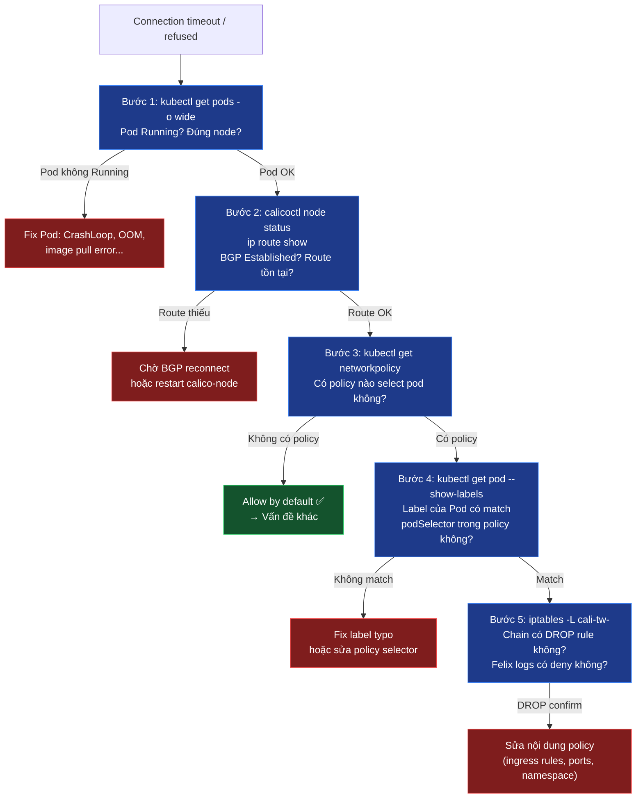

# Lab Tập 18: Troubleshooting Calico — 3 Scenarios

Tập này thực hành workflow debug có hệ thống với 3 scenarios khác nhau.

## 📖 Đề bài & Kịch bản thực tế

Bạn là kỹ sư SRE trực on-call. Lúc 2 giờ sáng, hệ thống monitoring báo alert: microservice `client` không kết nối được tới `server` trong cụm Kubernetes production.

Đội platform cho biết trong 2 giờ qua họ đã thực hiện đồng thời 3 thay đổi:
- **(A)** Deploy `NetworkPolicy` mới cho service `server`
- **(B)** Restart `calico-node` DaemonSet để apply cấu hình BGP
- **(C)** Rerun Helm chart update làm đổi một số Pod labels

Không rõ thay đổi nào gây ra sự cố — hoặc cả ba.

**Yêu cầu bài toán:**
1. Reproduce và chẩn đoán **Scenario A**: `NetworkPolicy` có `ingress: []` (deny all) — không có error message, chỉ timeout. Xác nhận deny qua iptables chain của Calico.
2. Reproduce **Scenario B**: `calico-node` restart làm route biến mất tạm thời. Quan sát BGP state machine (`OpenSent` → `Established`). Confirm self-healing không cần can thiệp.
3. Reproduce **Scenario C**: label typo khiến `NetworkPolicy` allow-rule không match Pod. Debug bằng `--show-labels` và so sánh với policy selector.
4. Với mỗi scenario, xác định **bước nào** trong workflow 5 bước phát hiện ra root cause — đây là nền tảng để xây dựng runbook troubleshooting cá nhân.

### Workflow debug 5 bước



## 🛠 Yêu cầu chuẩn bị
- Cụm K8s với Calico đang chạy (từ Tập 9+).
- `calicoctl` đã cài.

---

## 🔬 Thực nghiệm 1: Setup môi trường test

**SSH vào `controlplane`:**

```bash
multipass shell controlplane
```

1. Deploy client, server và Service:
   ```bash
   kubectl apply -f - <<'EOF'
   apiVersion: v1
   kind: Pod
   metadata:
     name: client
     labels:
       app: client
   spec:
     nodeName: worker1
     containers:
     - name: c
       image: nicolaka/netshoot
       command: ["sleep", "infinity"]
   ---
   apiVersion: v1
   kind: Pod
   metadata:
     name: server
     labels:
       app: server
   spec:
     nodeName: worker2
     containers:
     - name: s
       image: nicolaka/netshoot
       command: ["nc", "-lk", "8080"]
   ---
   apiVersion: v1
   kind: Service
   metadata:
     name: server-svc
   spec:
     selector:
       app: server
     ports:
     - port: 8080
       targetPort: 8080
   EOF
   kubectl wait --for=condition=Ready pod/client pod/server --timeout=90s
   SERVER_IP=$(kubectl get pod server -o jsonpath='{.status.podIP}')
   echo "Server IP: $SERVER_IP"
   ```

2. Verify baseline connectivity (không có policy = allow all):
   ```bash
   kubectl exec client -- nc -zv -w 3 $SERVER_IP 8080
   # Connection to 10.244.x.x 8080 port [tcp] succeeded! ✅
   ```

---

## 💥 Scenario A: Policy deny không rõ lý do

**Trên `controlplane`:**

1. **Setup broken** — apply deny policy với ingress rỗng:
   ```bash
   kubectl apply -f - <<'EOF'
   apiVersion: networking.k8s.io/v1
   kind: NetworkPolicy
   metadata:
     name: debug-deny
   spec:
     podSelector:
       matchLabels:
         app: server
     policyTypes:
     - Ingress
     ingress: []
   EOF
   ```

2. **Reproduce symptom:**
   ```bash
   kubectl exec client -- nc -zv -w 3 $SERVER_IP 8080
   # (timeout — không có error message, không có logs)
   ```

3. **Debug — Bước 1: Check Pod status:**
   ```bash
   kubectl get pods -o wide
   # client: Running, worker1 ✅
   # server: Running, worker2 ✅
   # → Pod OK, không phải vấn đề Pod
   ```

4. **Debug — Bước 3: Check NetworkPolicy:**
   ```bash
   kubectl get networkpolicy
   # NAME         POD-SELECTOR   AGE
   # debug-deny   app=server     30s  ← Có policy!

   kubectl get networkpolicy debug-deny -o yaml | grep -A5 "ingress:"
   # ingress: []  ← Mảng rỗng = không có rule nào = deny ALL ingress!
   ```
   *Lưu ý:* `ingress: []` khác với không có key `ingress` (không có `policyTypes: Ingress`). Mảng rỗng nghĩa là: policy đang active nhưng không cho phép bất kỳ traffic nào vào.

5. **Debug — Bước 5: Xác nhận DROP qua iptables chain Calico:**
   ```bash
   # Lấy tên interface của server pod từ calicoctl
   SERVER_IF=$(calicoctl get workloadendpoint | grep server | awk '{print $NF}')
   echo "Server interface: $SERVER_IF"

   # Xem chain "to workload" (cali-tw = calico to workload = ingress vào Pod)
   multipass exec worker2 -- sudo iptables -L cali-tw-$SERVER_IF -n --line-numbers
   # Chain cali-tw-<iface> (1 references)
   # num  target     prot opt source       destination
   # 1    DROP       all  --  0.0.0.0/0    0.0.0.0/0    ← DROP all incoming!
   ```

6. **Fix:**
   ```bash
   kubectl delete networkpolicy debug-deny
   kubectl exec client -- nc -zv -w 3 $SERVER_IP 8080
   # Connection succeeded! ✅
   ```

**Root cause phát hiện tại:** Bước 3 (NetworkPolicy inspect) — `ingress: []`.

---

## 💥 Scenario B: Route bị thiếu tạm thời (BGP mode)

**Trên `controlplane`:**

1. **Setup** — restart calico-node để simulate route loss, đồng thời test ngay:
   ```bash
   # Chạy restart ở background để có thể test ngay lập tức
   kubectl -n calico-system rollout restart daemonset/calico-node &
   sleep 5

   # Test trong window khi routes đang bị xóa
   kubectl exec client -- ping -c 3 -W 2 $SERVER_IP
   # Request timeout  ← Route đến worker2 subnet bị xóa tạm thời
   ```

2. **Debug — Bước 2: Check BGP state:**
   ```bash
   # Check BGP sessions trên worker1 (phải chạy local trên node)
   multipass exec worker1 -- sudo calicoctl node status
   # PEER ADDRESS  | STATE
   # 192.168.64.10 | OpenSent  ← Đang reconnect, chưa Established
   ```

3. **Debug — Bước 2: Check routing table:**
   ```bash
   multipass exec worker1 -- ip route show proto bird
   # (Trống hoặc thiếu route đến 10.244.2.0/26)
   # ← Route đến worker2 subnet chưa được inject lại
   ```

4. **Watch recovery — không can thiệp:**
   ```bash
   watch -n2 'multipass exec worker1 -- sudo calicoctl node status'
   # Sau 10-30 giây: STATE → Established
   # Ctrl+C khi thấy Established
   ```

5. **Verify self-healing:**
   ```bash
   multipass exec worker1 -- ip route show proto bird
   # 10.244.0.0/26 via 192.168.64.10 dev eth0  ← Route về
   # 10.244.2.0/26 via 192.168.64.12 dev eth0  ← Route về

   kubectl exec client -- ping -c 3 $SERVER_IP
   # 3 packets transmitted, 3 received ✅
   ```

**Root cause phát hiện tại:** Bước 2 (BGP status + routing table) — BGP state không phải Established trong thời gian restart. Không cần fix — self-healing.

---

## 💥 Scenario C: Label typo

**Trên `controlplane`:**

1. **Setup** — apply allow policy (chỉ cho phép `app: client`):
   ```bash
   kubectl apply -f - <<'EOF'
   apiVersion: networking.k8s.io/v1
   kind: NetworkPolicy
   metadata:
     name: allow-client
   spec:
     podSelector:
       matchLabels:
         app: server
     policyTypes:
     - Ingress
     ingress:
     - from:
       - podSelector:
           matchLabels:
             app: client
       ports:
       - protocol: TCP
         port: 8080
   EOF
   ```

2. **Verify baseline** (label đúng → phải hoạt động):
   ```bash
   kubectl exec client -- nc -zv -w 3 $SERVER_IP 8080
   # Connection succeeded! ✅
   ```

3. **Introduce typo** — đổi label thành sai:
   ```bash
   kubectl label pod client app=cliennt --overwrite
   # "cliennt" — 2 chữ n
   ```

4. **Reproduce:**
   ```bash
   kubectl exec client -- nc -zv -w 3 $SERVER_IP 8080
   # (timeout) ← Không có error, không có logs
   ```

5. **Debug — Bước 1: Check Pod:**
   ```bash
   kubectl get pods -o wide
   # Running ✅ → Pod OK
   ```

6. **Debug — Bước 3: Check NetworkPolicy tồn tại:**
   ```bash
   kubectl get networkpolicy
   # allow-client   app=server  ← Có policy
   ```

7. **Debug — Bước 4: So sánh label Pod vs policy selector:**
   ```bash
   kubectl get pod client --show-labels
   # LABELS: app=cliennt  ← "cliennt" (2 chữ n) ← TYPO!

   kubectl get networkpolicy allow-client -o yaml | grep -A2 "from:" -A5 "podSelector:"
   # matchLabels:
   #   app: client  ← Policy expect "client" (1 chữ n)

   # → Không match → traffic bị deny
   ```

8. **Fix:**
   ```bash
   kubectl label pod client app=client --overwrite
   kubectl exec client -- nc -zv -w 3 $SERVER_IP 8080
   # Connection succeeded! ✅ — Ngay lập tức, không cần restart gì
   ```

**Root cause phát hiện tại:** Bước 4 (`--show-labels` vs policy selector) — label mismatch.

---

## 🧹 Dọn dẹp

```bash
kubectl delete pod client server
kubectl delete svc server-svc
kubectl delete networkpolicy allow-client 2>/dev/null || true
```

---

## ✅ Tổng kết

| Scenario | Root cause | Phát hiện tại bước |
|----------|-----------|-------------------|
| A — Policy deny | `ingress: []` = deny all | Bước 3: inspect policy content |
| B — Route loss | BGP reconnecting sau restart | Bước 2: BGP state + routing table |
| C — Label typo | Label Pod `cliennt` ≠ selector `client` | Bước 4: `--show-labels` vs policy |

**3 nguyên tắc:**
1. **Timeout không có error = NetworkPolicy** — lỗi application có error message, policy drop thì im lặng.
2. **BGP self-healing** — route loss sau calico-node restart là tạm thời, không cần can thiệp nếu BGP về Established.
3. **`--show-labels` là lệnh đầu tiên** khi policy có vẻ đúng mà traffic vẫn bị block — label mismatch là nguyên nhân phổ biến nhất.
