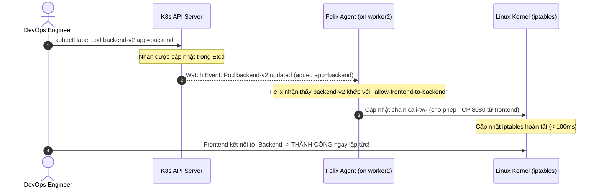

# Lab Tập 18: Lab 1 — Sự cố kết nối (Connection Timeout) không rõ nguyên nhân

**Hiện tượng hiện tại:**
Sau khi lập trình viên triển khai phiên bản Backend mới (`backend-v2`), hệ thống Frontend liên tục báo lỗi **Connection Timeout** khi kết nối tới Backend này. Logs của ứng dụng không hiển thị lỗi cụ thể và cả hai Pod đều đang ở trạng thái `Running` bình thường. Nhiệm vụ của bạn là chẩn đoán và khắc phục sự cố này.

## 🛠 Yêu cầu chuẩn bị
- Cụm K8s với Calico từ Tập 9.
- Namespace `production` với default-deny policy đang active.

---

## 🔬 Phần 1: Cấu hình môi trường và Kích hoạt Sự cố (Mô phỏng Production Incident)

**SSH vào `controlplane`:**

```bash
multipass shell controlplane
```

1. Tạo namespace và apply các NetworkPolicy mặc định của dự án (giống môi trường production):
   ```bash
   kubectl create namespace production 2>/dev/null || true

   kubectl apply -n production -f - <<'EOF'
   apiVersion: networking.k8s.io/v1
   kind: NetworkPolicy
   metadata:
     name: default-deny
   spec:
     podSelector: {}
     policyTypes:
     - Ingress
   ---
   apiVersion: networking.k8s.io/v1
   kind: NetworkPolicy
   metadata:
     name: allow-frontend-to-backend
   spec:
     podSelector:
       matchLabels:
         app: backend
     policyTypes:
     - Ingress
     ingress:
     - from:
       - podSelector:
           matchLabels:
             app: frontend
       ports:
       - protocol: TCP
         port: 8080
   EOF
   ```

2. Triển khai **backend-v2** (cấu hình deploy thực tế của developer):
   ```bash
   kubectl run backend-v2 -n production \
     --image=nicolaka/netshoot \
     -- nc -lk -p 8080
   ```

3. Triển khai **frontend** với nhãn đúng chuẩn:
   ```bash
   kubectl run frontend -n production \
     --image=nicolaka/netshoot \
     --labels="app=frontend" \
     -- sleep infinity
   ```

4. Chờ cho các Pod ở trạng thái Ready:
   ```bash
   kubectl -n production wait --for=condition=Ready pod/backend-v2 pod/frontend --timeout=60s
   BACKEND_IP=$(kubectl -n production get pod backend-v2 -o jsonpath='{.status.podIP}')
   echo "Backend IP: $BACKEND_IP"
   ```

5. Xác nhận lỗi (Connection Timeout):
   ```bash
   kubectl -n production exec frontend -- nc -zv -w 5 $BACKEND_IP 8080
   # (Kết quả bị treo và báo timeout)
   ```

---

## 🎯 Phần 2: Thử thách 30 Phút Tự Giải & Tự Tìm Lỗi (Troubleshoot Challenge)

> [!IMPORTANT]
> **Nhiệm vụ của học viên:**
> Hãy đóng vai là một DevOps/SRE Engineer đang xử lý sự cố nóng trên Production. Bạn không có sẵn đáp án. 
> 
> Hãy tự mình thực hiện các bước điều tra (troubleshooting) theo tư duy và phản xạ tự nhiên của bản thân:
> 1. Kiểm tra trạng thái hệ thống, logs, routes của Pod.
> 2. Kiểm tra xem luồng đi của gói tin đang bị chặn ở đâu.
> 3. Tìm ra nguyên nhân gốc rễ (Root Cause) và thực hiện sửa lỗi (Fix).
> 4. Xác nhận kết nối từ `frontend` sang `backend-v2` thành công, đồng thời đảm bảo an toàn hệ thống (các Pod lạ/attacker không thể kết nối tới backend-v2).
> 
> *Bạn có đúng **30 phút** để tự mình giải quyết sự cố này trước khi chuyển sang Phần 3.*

---

## 📖 Phần 3: Hướng dẫn Troubleshooting từng bước chuẩn (Chỉ xem sau khi tự làm)

Nếu đã qua 30 phút hoặc bạn đã tự giải xong, hãy đối chiếu các bước xử lý của bạn với quy trình điều tra chuẩn dưới đây:

### Bước 1: Kiểm tra cơ bản trạng thái Pod và Kết nối L3
1. Kiểm tra xem các Pod có đang thực sự chạy (`Running`) và nằm ở node nào không:
   ```bash
   kubectl -n production get pods -o wide
   # Cả hai Pod backend-v2 và frontend phải đang Running
   ```
2. Kiểm tra kết nối cơ bản ở tầng mạng (L3 IP Routing) bằng lệnh Ping:
   ```bash
   kubectl -n production exec frontend -- ping -c 2 $BACKEND_IP
   # Ping thành công! Kết luận: Tầng IP Routing hoạt động bình thường, gói tin IP đi được tới node đích.
   ```
   *Nhận định:* Do ping được nhưng không telnet/nc được port 8080 (TCP), sự cố rất có thể nằm ở các rule bảo mật / Network Policy chặn cổng TCP 8080.

### Bước 2: Kiểm tra NetworkPolicy và Nhãn (Labels)
1. Liệt kê các NetworkPolicy đang được áp dụng trong namespace `production`:
   ```bash
   kubectl -n production get networkpolicy
   # Có 2 policy: default-deny và allow-frontend-to-backend
   ```
2. Kiểm tra nội dung của `allow-frontend-to-backend` để xem nó yêu cầu nhãn gì:
   ```bash
   kubectl -n production get networkpolicy allow-frontend-to-backend -o yaml | grep -A5 "podSelector:"
   # podSelector:
   #   matchLabels:
   #     app: backend   <-- Policy yêu cầu Pod đích phải có nhãn app=backend
   ```
3. Kiểm tra nhãn thực tế của Pod `backend-v2`:
   ```bash
   kubectl -n production get pod backend-v2 --show-labels
   # LABELS: run=backend-v2  <-- Lỗi rồi! Hoàn toàn không có nhãn app=backend
   ```

### Bước 3: Kiểm tra góc nhìn của Calico (workloadendpoint)
Để xem Calico đã áp dụng Policy cho Endpoint chưa, ta kiểm tra thông tin Endpoint:
```bash
calicoctl get workloadendpoint -n production
# Sẽ thấy backend-v2 tồn tại nhưng vì không khớp nhãn, rule của allow-frontend-to-backend không được Felix nạp vào iptables cho card cali tương ứng.
# Kết quả là policy default-deny được áp dụng lên backend-v2 và drop tất cả traffic đi vào.
```

### Bước 4: Khắc phục sự cố và Xác minh

1. Thêm nhãn chính xác cho Pod `backend-v2`:
   ```bash
   kubectl -n production label pod backend-v2 app=backend
   ```
2. Xác minh lại nhãn của Pod:
   ```bash
   kubectl -n production get pod backend-v2 --show-labels
   # Đã xuất hiện nhãn: app=backend,run=backend-v2
   ```
3. Test kết nối từ `frontend` sang `backend-v2` (Calico Felix cập nhật cực nhanh dưới 100ms thông qua cơ chế Event-Driven):
   ```bash
   kubectl -n production exec frontend -- nc -zv $BACKEND_IP 8080
   # Connection to 10.244.2.X 8080 port succeeded! ✅
   ```
4. Đảm bảo an toàn mạng (các Pod khác vẫn bị chặn bởi default-deny):
   ```bash
   kubectl run attacker -n production --image=nicolaka/netshoot -- sleep infinity
   kubectl -n production wait --for=condition=Ready pod/attacker --timeout=30s
   kubectl -n production exec attacker -- nc -zv -w 3 $BACKEND_IP 8080
   # (Kết quả timeout) ✅ An toàn mạng vẫn được đảm bảo!
   ```

---

### Quy trình đồng bộ nhãn cực nhanh của Calico Felix (Event-Driven)


---

## 🧹 Dọn dẹp

```bash
kubectl -n production delete pod backend-v2 frontend attacker
kubectl -n production delete networkpolicy default-deny allow-frontend-to-backend
```

---

## ✅ Tổng kết

1. **Root cause:** Thiếu nhãn `app=backend` trên backend Pod làm cho NetworkPolicy selector không tìm thấy đối tượng để mở khóa cổng.
2. **Triệu chứng đặc trưng:** Lỗi im lặng (Connection Timeout) chứ không phải Connection Refused, do gói tin bị chặn và DROP âm thầm bởi iptables thay vì bị từ chối trả về RST.
3. **Cơ chế Event-Driven:** Calico Felix giám sát các thay đổi nhãn thông qua Watch API của Kubernetes và cập nhật cấu hình iptables cục bộ chỉ trong mili-giây mà không cần reload/restart dịch vụ.
4. **Quy trình gỡ lỗi chuẩn:** Kiểm tra trạng thái Pod -> Kiểm tra thông kết nối L3 (Ping) -> Xem nhãn Pod (`--show-labels`) -> Đối chiếu với selector của NetworkPolicy -> Kiểm tra Endpoint trên Calico.
