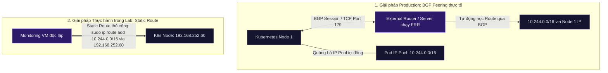

# Lab Tập 19: Lab Thực chiến 2 — Sự cố kết nối từ Máy chủ ngoài vào cụm Kubernetes BGP

**Hiện tượng hiện tại:**
Cụm Kubernetes đã được cấu hình hoạt động ở chế độ BGP (No Encapsulation), trạng thái các BGP session giữa các Node K8s đều báo `Established` thành công. Tuy nhiên, một máy chủ giám sát độc lập nằm ngoài cụm (`monitoring`) không thể kết nối hoặc ping tới IP của Pod chạy trong cụm. Bạn được yêu cầu điều tra và khắc phục sự cố này để đảm bảo máy chủ ngoài có thể kết nối trực tiếp tới Pod IP.

### Sơ đồ kiến trúc định tuyến: BGP Peering (Production) vs Static Route (Lab Shortcut)



---

## 🛠 Yêu cầu chuẩn bị
- Cụm K8s với Calico đang chạy BGP mode (từ Tập 16).
- `calicoctl` đã cài.
- Có thể tạo thêm 1 Multipass VM chạy Ubuntu 26.04 để làm external server.

---

## 🔬 Phần 1: Cấu hình môi trường và Kích hoạt Sự cố (Mô phỏng Production Incident)

**SSH vào `controlplane`:**

```bash
multipass shell controlplane
```

1. Kiểm tra cluster đang chạy BGP mode:
   ```bash
   calicoctl get ippool default-ipv4-ippool -o yaml | grep -E "ipipMode|vxlanMode"
   # Kết quả mong đợi: 
   # ipipMode: Never
   # vxlanMode: Never
   ```
   > 💡 **Giải thích cho học viên:** 
   > - Chúng ta cần đảm bảo cụm đã tắt hoàn toàn đóng gói overlay (cả `ipipMode` và `vxlanMode` đều là `Never`) trước khi bắt đầu bài lab kiểm tra định tuyến tĩnh từ máy chủ ngoài.
   
   *Nếu vẫn là VXLAN, chuyển sang BGP trước:*
   ```bash
   calicoctl patch ippool default-ipv4-ippool \
     --patch '{"spec": {"ipipMode": "Never", "vxlanMode": "Never", "natOutgoing": true}}'
   ```
   > 💡 **Giải thích cho học viên:** 
   > - Lệnh này cấu hình lại IPPool mặc định để tắt tất cả các cơ chế đóng gói (overlay network). BIRD daemon sẽ chịu trách nhiệm định tuyến gói tin phẳng trực tiếp qua card mạng vật lý.

2. Xác nhận trạng thái BGP sessions giữa các node đang ở trạng thái `Established`:
   ```bash
   calicoctl node status
   ```

3. Xem cấu hình BGPConfiguration hiện tại của cụm:
   ```bash
   calicoctl get bgpconfiguration default -o yaml
   ```

4. Triển khai một Pod thử nghiệm trong cụm:
   ```bash
   kubectl run test-pod --image=nicolaka/netshoot -- sleep infinity
   kubectl wait --for=condition=Ready pod/test-pod --timeout=60s
   POD_IP=$(kubectl get pod test-pod -o jsonpath='{.status.podIP}')
   echo "Pod IP: $POD_IP"
   ```

**Từ một terminal mới trên máy Host (macOS):**

5. Triển khai một máy ảo (VM) độc lập đại diện cho máy chủ ngoài (External Monitoring Server):
   ```bash
   multipass launch 26.04 --name monitoring \
     --cpus 1 --memory 1G --disk 10G
   ```
   *Lấy IP của máy ảo vừa tạo:*
   ```bash
   MONITOR_IP=$(multipass info monitoring | grep IPv4 | awk '{print $2}')
   echo "Monitoring server IP: $MONITOR_IP"
   ```

6. Kiểm tra kết nối từ máy chủ ngoài tới Pod IP trong cụm:
   ```bash
   multipass exec monitoring -- ping -c 3 -W 2 $POD_IP
   # (Kết quả ping thất bại: 100% packet loss)
   ```

7. Kiểm tra bảng định tuyến hiện tại của máy chủ ngoài:
   ```bash
   multipass exec monitoring -- ip route show
   ```

---

## 🎯 Phần 2: Thử thách 30 Phút Tự Giải & Tự Tìm Lỗi (Troubleshoot Challenge)

> [!IMPORTANT]
> **Nhiệm vụ của học viên:**
> Mặc dù BGP session giữa các node K8s đã Established và Pod IP hoạt động tốt, máy chủ giám sát độc lập (`monitoring`) vẫn không thể ping được Pod. 
> 
> Hãy tự mình thực hiện các bước điều tra (troubleshooting) theo tư duy và phản xạ tự nhiên của bạn:
> 1. Tại sao máy chủ ngoài không gửi được gói tin tới Pod IP?
> 2. Bảng định tuyến (routing table) của máy chủ ngoài thiếu thông tin gì?
> 3. Làm cách nào để máy chủ ngoài biết cách định tuyến gói tin đi tới mạng của Pod (Pod CIDR)?
> 4. Hãy tìm ra ít nhất 2 giải pháp (1 giải pháp bằng định tuyến động BGP, 1 giải pháp bằng định tuyến tĩnh) và thực hiện sửa lỗi.
> 
> *Bạn có đúng **30 phút** để tự giải quyết thử thách này trước khi tham khảo hướng dẫn chi tiết ở Phần 3.*

---

## 📖 Phần 3: Hướng dẫn Troubleshooting từng bước chuẩn (Chỉ xem sau khi tự làm)

Nếu đã qua 30 phút hoặc bạn đã tự giải xong, hãy đối chiếu các bước xử lý của bạn với quy trình điều tra chuẩn dưới đây:

### Bước 1: Phân tích nguyên nhân gốc rễ (Root Cause Analysis)
1. **Kiểm tra bảng định tuyến trên `monitoring`:**
   ```bash
   multipass exec monitoring -- ip route show
   ```
   *Nhận định:* Ta thấy máy chủ ngoài chỉ có route mặc định và route cho dải mạng vật lý `192.168.252.0/24`. Nó hoàn toàn không có thông tin về dải IP của Pod (`10.244.0.0/16`). Khi ping đến `10.244.x.x`, gói tin sẽ bị đẩy ra default gateway (Internet/Router ngoài) và bị drop.
2. **Tại sao BGP của cụm K8s đang chạy mà máy chủ ngoài không tự học được route?**
   - BGP là giao thức chạy trên cổng TCP 179. BIRD daemon chạy trên các K8s nodes chỉ trao đổi route với các thiết bị đã được thiết lập kết nối BGP Peer (BGP Peering).
   - Máy ảo `monitoring` là một VM độc lập, không chạy BGP daemon và không peer với bất kỳ node K8s nào, nên nó không nhận được thông tin định tuyến.

---

### Bước 2: Hướng giải quyết khắc phục sự cố

Ta có 2 giải pháp chính để khắc phục vấn đề này:

#### Giải pháp A: Sử dụng Định tuyến động (Production Design)
Trong môi trường thực tế doanh nghiệp, ta sẽ thiết lập để máy chủ ngoài chạy BGP Peer trực tiếp với cụm Calico:

1. **Cấu hình trên Kubernetes (BGPPeer resource):**

   * **Bước A: Lưu và áp dụng (apply) cấu hình BGPPeer:**
     SSH vào node `controlplane` và chạy lệnh sau để khai báo BGP Peer mới (máy chủ `monitoring`):
     ```bash
     calicoctl apply -f - <<EOF
     apiVersion: projectcalico.org/v3
     kind: BGPPeer
     metadata:
       name: peer-monitoring
     spec:
       peerIP: 192.168.252.66         # IP của Monitoring Server
       asNumber: 64512              # AS Number của cụm
     EOF
     ```

   * **Bước B: Kiểm tra và xem cấu hình BGPPeer đã nạp:**
     Xem danh sách BGPPeer đã cấu hình:
     ```bash
     calicoctl get bgppeer
     ```
     Xem chi tiết cấu hình của BGPPeer vừa tạo dưới dạng YAML:
     ```bash
     calicoctl get bgppeer peer-monitoring -o yaml
     ```
     *Kết quả mong đợi:* Hiển thị thông tin BGPPeer `peer-monitoring` trỏ tới IP `192.168.252.66` với AS `64512`.

2. **Cấu hình chi tiết trên Monitoring Server (Sử dụng BIRD 2 làm BGP Daemon):**
   
   * **Bước A: Cài đặt BIRD 2**
     SSH vào máy ảo `monitoring` (hoặc chạy lệnh từ host):
     ```bash
     multipass shell monitoring
     # Cài đặt BIRD 2
     sudo apt update && sudo apt install -y bird2
     ```

   * **Bước B: Cấu hình BGP Peering**
     Mở và cập nhật file `/etc/bird/bird.conf` trên `monitoring`:
     ```nginx
     # Router ID của Monitoring Server (thay bằng IP thực tế của máy ảo này, ví dụ: 192.168.252.66)
     router id 192.168.252.66;

     protocol device {
     }

     # Đẩy các tuyến định tuyến (routes) học từ BGP vào bảng định tuyến của OS Kernel
     protocol kernel {
         ipv4 {
             export all; # Đồng bộ các routes nhận được vào Linux Kernel
             import none;
         };
     }

     # Định nghĩa template BGP peer với cụm Calico (iBGP - AS 64512)
     template bgp k8s_nodes {
         local as 64512;
         neighbor as 64512;
         ipv4 {
             import all;   # Nhận toàn bộ dải IP Pod được quảng bá từ K8s nodes
             export none;  # Không quảng bá ngược lại
         };
     }

     # Thiết lập session BGP với Control Plane Node
     protocol bgp k8s_controlplane from k8s_nodes {
         neighbor 192.168.252.60; # IP thực tế của controlplane node
     }

     # Thiết lập session BGP với Worker 1 Node
     protocol bgp k8s_worker1 from k8s_nodes {
         neighbor 192.168.252.61; # IP thực tế của worker1 node
     }

     # Thiết lập session BGP với Worker 2 Node
     protocol bgp k8s_worker2 from k8s_nodes {
         neighbor 192.168.252.62; # IP thực tế của worker2 node
     }
     ```

   * **Bước C: Khởi chạy dịch vụ và kiểm tra trạng thái trên Monitoring Server**
     Khởi động lại BIRD và kiểm tra session BGP:
     ```bash
     sudo systemctl restart bird
     sudo birdc show protocols
     ```
     *Kết quả mong đợi:* Trạng thái các session `k8s_controlplane`, `k8s_worker1` và `k8s_worker2` phải hiển thị là `Established` (hoặc `up`).

   * **Bước D: Kiểm tra trạng thái kết nối BGP từ phía Kubernetes Nodes**
     Quay trở lại terminal trên node `controlplane`, chạy lệnh sau để kiểm tra trạng thái BGP peer từ phía K8s:
     ```bash
     calicoctl node status
     ```
     *Kết quả mong đợi:* Trong phần BGP Peers sẽ xuất hiện neighbor `192.168.252.66` với trạng thái `Established`.

     Lúc này, nếu kiểm tra bảng định tuyến trên `monitoring`:
     ```bash
     ip route show
     ```
     Bạn sẽ thấy các tuyến đường tới dải Pod IP (`10.244.x.x/26`) được tự động thêm vào thông qua các Node K8s mà không cần cấu hình thủ công.


#### Giải pháp B: Sử dụng Định tuyến tĩnh (Lab Shortcut - Cực kỳ phổ biến với Legacy VM)
Vì máy ảo `monitoring` của chúng ta trong môi trường lab là VM đơn giản, ta sẽ cấu hình **Static Route** trỏ dải Pod CIDR thông qua node `controlplane` làm gateway trung chuyển.

1. Lấy IP của node `controlplane`:
   ```bash
   MASTER_IP=$(multipass info controlplane | grep IPv4 | awk '{print $2}')
   echo "Controlplane IP: $MASTER_IP"
   ```
2. Thêm static route trỏ dải Pod CIDR qua `controlplane` trên máy chủ `monitoring`:
   ```bash
   multipass exec monitoring -- sudo ip route add 10.244.0.0/16 via $MASTER_IP
   ```
3. Xác minh bảng định tuyến trên `monitoring` đã nhận route mới:
   ```bash
   multipass exec monitoring -- ip route show | grep 10.244
   # Kết quả mong đợi:
   # 10.244.0.0/16 via 192.168.252.60 dev eth0
   ```

---

### Bước 3: Xác minh kết nối thành công

Từ máy ảo `monitoring`, ping trực tiếp tới Pod IP trong cụm K8s:
```bash
multipass exec monitoring -- ping -c 5 $POD_IP
```

Kết quả mong đợi:
```
5 packets transmitted, 5 received, 0% packet loss ✅ THÀNH CÔNG!
```
*Giải thích đường đi của gói tin:* 
Packet từ `monitoring` đi tới IP `10.244.x.x` -> Khớp với static route -> Gửi sang IP của `controlplane` -> Kernel của `controlplane` nhận được gói tin -> Khớp routing table nội bộ cụm (do BIRD tạo) -> Forward trực tiếp sang Node đích chạy Pod thông qua card vật lý `eth0` (không đóng gói VXLAN).

---

## 🧹 Dọn dẹp

```bash
# Trên controlplane
kubectl delete pod test-pod

# Trên macOS host
multipass delete monitoring && multipass purge
```

---

## ✅ Tổng kết

1. **BGP Control Plane ≠ BGP Data Plane:** Thiết lập session BGP thành công (`Established`) giữa các K8s nodes chỉ giúp các Pod trong cụm kết nối được với nhau. Các thiết bị bên ngoài muốn kết nối trực tiếp đến Pod IP bắt buộc phải tham gia vào mạng định tuyến (qua BGP Peer động hoặc qua Route tĩnh).
2. **Hiểu đúng spec.serviceClusterIPs:** Tham số này chỉ dùng để quảng bá dải Service Cluster IP ra ngoài. Mặc định dải Pod IP Pool luôn được Calico quảng bá tự động thông qua BGP Peer.
3. **Mô hình Định tuyến tĩnh (Static Route):** Là phương án gỡ lỗi nhanh, hữu dụng trong thực tế cho các máy chủ legacy hoặc các VM giám sát nằm ngoài cluster mà không hỗ trợ giao thức BGP.
