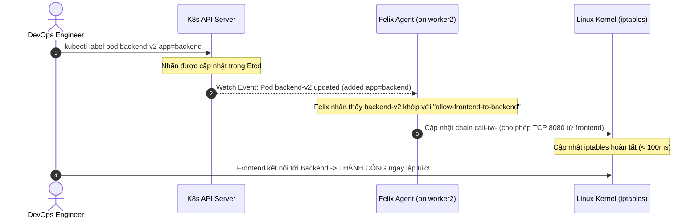

# Lab Tập 19: Lab 1 — Pod thiếu label, Connection Timeout

Tập này simulate production incident: developer deploy backend mới không có label, frontend timeout không rõ lý do.

## 🛠 Yêu cầu chuẩn bị
- Cụm K8s với Calico từ Tập 9.
- Namespace `production` với default-deny policy đang active.

---

## 🔬 Thí nghiệm 1: Setup môi trường production giống thật

**SSH vào `controlplane`:**

```bash
multipass shell controlplane
```

1. Tạo namespace và apply policies (giống production):
   ```bash
   kubectl create namespace production 2>/dev/null || true

   kubectl apply -n production -f - <<'EOF'
   apiVersion: networking.k8s.io/v1
   kind: NetworkPolicy
   metadata:
     name: default-deny
   spec:
     podSelector: {}
     policyTypes:
     - Ingress
   ---
   apiVersion: networking.k8s.io/v1
   kind: NetworkPolicy
   metadata:
     name: allow-frontend-to-backend
   spec:
     podSelector:
       matchLabels:
         app: backend
     policyTypes:
     - Ingress
     ingress:
     - from:
       - podSelector:
           matchLabels:
             app: frontend
       ports:
       - protocol: TCP
         port: 8080
   EOF
   ```

2. Deploy **backend-v2 không có label** (lỗi của developer):
   ```bash
   kubectl run backend-v2 -n production \
     --image=nicolaka/netshoot \
     -- nc -lk -p 8080
   # Không có --labels="app=backend" !
   ```

3. Deploy frontend với label đúng:
   ```bash
   kubectl run frontend -n production \
     --image=nicolaka/netshoot \
     --labels="app=frontend" \
     -- sleep infinity
   ```

4. Chờ ready:
   ```bash
   kubectl -n production wait --for=condition=Ready pod/backend-v2 pod/frontend --timeout=60s
   BACKEND_IP=$(kubectl -n production get pod backend-v2 -o jsonpath='{.status.podIP}')
   echo "Backend IP: $BACKEND_IP"
   ```

---

## 💥 Thí nghiệm 2: Reproduce symptom và bắt đầu debug

**Trên `controlplane`:**

1. Confirm symptom (timeout):
   ```bash
   kubectl -n production exec frontend -- nc -zv -w 5 $BACKEND_IP 8080
   # (timeout) ← Confirmed symptom
   ```

2. **Debug Bước 1 — Check basics:** Pod có running không?
   ```bash
   kubectl -n production get pods -o wide
   # NAME         READY   STATUS    IP            NODE
   # backend-v2   1/1     Running   10.244.2.X    worker2  ← Running, đúng node
   # frontend     1/1     Running   10.244.1.Y    worker1
   ```
   *Kết luận: Pod OK, không phải Pod crash.*

3. **Check connectivity tầng L3:** Ping có qua không?
   ```bash
   kubectl -n production exec frontend -- ping -c 2 $BACKEND_IP
   # 2 packets transmitted, 2 received ← Ping OK!
   ```
   *Kết luận: Routing OK, vấn đề ở tầng policy (L4).*

---

## 🔬 Thí nghiệm 3: Tìm root cause — Labels

**Trên `controlplane`:**

1. **Debug Bước 3 — Check labels của backend-v2:**
   ```bash
   kubectl -n production get pod backend-v2 --show-labels
   # NAME         LABELS
   # backend-v2   run=backend-v2   ← Không có app=backend!
   ```

2. **So sánh với policy selector:**
   ```bash
   kubectl -n production get networkpolicy allow-frontend-to-backend -o yaml | grep -A5 "podSelector:"
   # podSelector:
   #   matchLabels:
   #     app: backend   ← Policy chờ label này
   ```

3. **Kiểm tra calicoctl — Felix có biết về backend-v2 không:**
   ```bash
   calicoctl get workloadendpoint -n production
   # WORKLOAD     NODE      NETWORKS         INTERFACE
   # backend-v2   worker2   10.244.2.X/32    cali<hash>
   # ← Felix biết Pod (endpoint tồn tại) nhưng không match policy!
   ```

4. **Kết luận root cause:**
   ```
   backend-v2 không có label app=backend
   → allow-frontend-to-backend podSelector không match
   → Felix không tạo allow rule cho endpoint này
   → default-deny áp dụng (podSelector: {} match tất cả)
   → Timeout
   ```

## 🔬 Thí nghiệm 4: Fix và verify

### Quy trình đồng bộ nhãn cực nhanh của Calico Felix (Event-Driven):


**Trên `controlplane`:**

1. Fix — Thêm label cho backend-v2:
   ```bash
   kubectl -n production label pod backend-v2 app=backend
   ```

2. Verify label đã được thêm:
   ```bash
   kubectl -n production get pod backend-v2 --show-labels
   # LABELS: app=backend,run=backend-v2  ✅
   ```

3. Test ngay lập tức (Felix cập nhật < 100ms):
   ```bash
   kubectl -n production exec frontend -- nc -zv $BACKEND_IP 8080
   # Connection to 10.244.2.X 8080 port succeeded! ✅
   ```

4. Verify attacker vẫn bị chặn:
   ```bash
   kubectl run attacker -n production --image=nicolaka/netshoot -- sleep infinity
   kubectl -n production wait --for=condition=Ready pod/attacker --timeout=30s
   kubectl -n production exec attacker -- nc -zv -w 3 $BACKEND_IP 8080
   # (timeout) ✅ Policy vẫn bảo vệ đúng
   ```

5. Xem Felix event trong log (optional):
   ```bash
   POD_NAME=$(kubectl -n calico-system get pods -l k8s-app=calico-node --field-selector spec.nodeName=worker2 -o jsonpath='{.items[0].metadata.name}')
   kubectl -n calico-system logs $POD_NAME -c calico-node 2>/dev/null | grep "backend-v2" | tail -5
   # "Endpoint updated: backend-v2 now matches policy..."
   ```

---

## 🧹 Dọn dẹp

```bash
kubectl -n production delete pod backend-v2 frontend attacker
kubectl -n production delete networkpolicy default-deny allow-frontend-to-backend
```

---

## ✅ Tổng kết

1. **Root cause:** Thiếu label `app=backend` → policy selector không match → Felix không tạo allow rule.
2. **Triệu chứng đặc trưng:** Timeout không có error trong `kubectl logs` — network layer drop, app không biết.
3. **Felix event-driven:** Thêm label → K8s API notify Felix → iptables rule update < 100ms — không restart gì.
4. **Debug checklist:** `--show-labels` → so sánh với policy `podSelector.matchLabels` → kiểm tra `calicoctl get workloadendpoint`.
