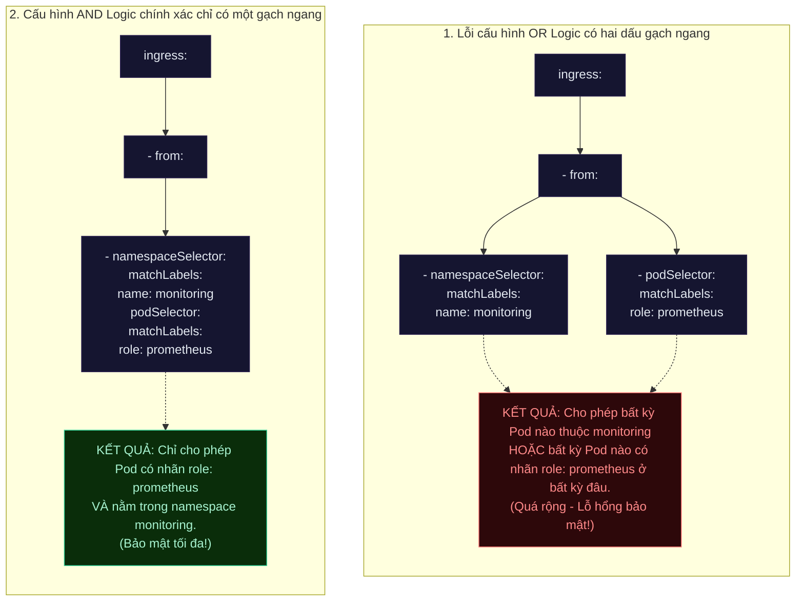

# Lab Tập 20: Lab 3 — Sự cố phân quyền truy cập chéo Namespace (Logic AND vs OR)

**Hiện tượng hiện tại:**
Hệ thống giám sát Prometheus chạy trong namespace `monitoring` không thể kết nối tới Pod Backend trong namespace `production` để thu thập dữ liệu metrics trên cổng TCP `9090`. Cấu hình NetworkPolicy chéo namespace đã được thiết lập để chỉ cho phép Prometheus Pod từ namespace `monitoring` truy cập. Logs hệ thống cho thấy Prometheus liên tục báo lỗi **Connection Timeout** khi kết nối tới Backend, đồng thời xuất hiện lo ngại về rủi ro bảo mật (một số Pod không có quyền hạn nhưng có thể kết nối được tới Backend chéo namespace khi thay đổi cấu hình).

Nhiệm vụ của bạn là điều tra, phát hiện các lỗi ẩn trong NetworkPolicy và khắc phục triệt để.

### Sơ đồ so sánh cú pháp logic: AND vs OR trong Kubernetes NetworkPolicy



---

## 🛠 Yêu cầu chuẩn bị
- Cụm K8s với Calico từ Tập 9.
- Không có NetworkPolicy nào trong `production`.

---

## 🔬 Phần 1: Cấu hình môi trường và Kích hoạt Sự cố (Mô phỏng Production Incident)

**SSH vào `controlplane`:**

```bash
multipass shell controlplane
```

1. Tạo các namespace phục vụ cho bài lab:
   ```bash
   kubectl create namespace monitoring 2>/dev/null || true
   kubectl create namespace production 2>/dev/null || true
   ```

2. Kiểm tra các nhãn (labels) của namespace `monitoring`:
   ```bash
   kubectl get namespace monitoring --show-labels
   ```

3. Triển khai Pod Backend trong namespace `production`:
   ```bash
   kubectl apply -n production -f - <<'EOF'
   apiVersion: v1
   kind: Pod
   metadata:
     name: backend
     labels:
       app: backend
   spec:
     containers:
     - name: app
       image: nicolaka/netshoot
       command: ["nc", "-lk", "-p", "9090"]
   EOF
   ```

4. Triển khai Pod Prometheus chính thống trong namespace `monitoring`:
   ```bash
   kubectl apply -n monitoring -f - <<'EOF'
   apiVersion: v1
   kind: Pod
   metadata:
     name: prometheus
     labels:
       role: prometheus
   spec:
     containers:
     - name: p
       image: nicolaka/netshoot
       command: ["sleep", "infinity"]
   EOF
   ```

5. Triển khai một Pod lạ (`rogue`) không có nhãn Prometheus trong namespace `monitoring` để thử nghiệm bảo mật:
   ```bash
   kubectl run rogue -n monitoring --image=nicolaka/netshoot -- sleep infinity
   ```

6. Chờ cho các Pod ở trạng thái Ready và ghi lại địa chỉ IP của Backend:
   ```bash
   kubectl -n production wait --for=condition=Ready pod/backend --timeout=60s
   kubectl -n monitoring wait --for=condition=Ready pod/prometheus pod/rogue --timeout=60s
   BACKEND_IP=$(kubectl -n production get pod backend -o jsonpath='{.status.podIP}')
   echo "Backend IP: $BACKEND_IP"
   ```

7. Thiết lập NetworkPolicy mặc định chặn tất cả lưu lượng đi vào (`default-deny`) trong namespace `production`:
   ```bash
   kubectl apply -n production -f - <<'EOF'
   apiVersion: networking.k8s.io/v1
   kind: NetworkPolicy
   metadata:
     name: default-deny
   spec:
     podSelector: {}
     policyTypes:
     - Ingress
   EOF
   ```

8. Áp dụng cấu hình NetworkPolicy chéo namespace cho Backend (sử dụng cấu hình do bộ phận vận hành thiết lập):
   ```bash
   kubectl apply -n production -f - <<'EOF'
   apiVersion: networking.k8s.io/v1
   kind: NetworkPolicy
   metadata:
     name: allow-prometheus-metrics
   spec:
     podSelector:
       matchLabels:
         app: backend
     policyTypes:
     - Ingress
     ingress:
     - from:
       - namespaceSelector:
           matchLabels:
             name: monitoring
       - podSelector:
           matchLabels:
             role: prometheus
       ports:
       - protocol: TCP
         port: 9090
   EOF
   ```

9. **Kích hoạt sự cố và quan sát triệu chứng:**
   - Thử kết nối từ Pod Prometheus sang Backend (phải thành công nhưng thực tế báo lỗi):
     ```bash
     kubectl -n monitoring exec prometheus -- nc -zv -w 3 $BACKEND_IP 9090
     # Kết quả: Connection Timeout!
     ```

---

## 🎯 Phần 2: Thử thách 30 Phút Tự Giải & Tự Tìm Lỗi (Troubleshoot Challenge)

> [!IMPORTANT]
> **Nhiệm vụ của học viên:**
> Sự cố đang ở trạng thái "Bẫy kép" (Bug Masking) — có nhiều hơn 1 lỗi đang che giấu lẫn nhau.
> 
> Hãy tự mình điều tra nguyên nhân dựa trên các phản xạ kỹ thuật của bản thân:
> 1. Tại sao cấu hình NetworkPolicy cho phép Prometheus kết nối mà thực tế kết nối lại bị Timeout?
> 2. NetworkPolicy `allow-prometheus-metrics` đang áp dụng logic nào (AND hay OR)? Điều này có gây rủi ro bảo mật nào không?
> 3. Hãy tìm và khắc phục cả hai lỗi ẩn trong cụm.
> 4. Xác nhận kết nối sau khi sửa: Chỉ cho phép Prometheus ở namespace `monitoring` truy cập Backend; các Pod khác trong namespace `monitoring` (như Pod `rogue`) hoặc Pod Prometheus ở namespace khác không được phép truy cập.
> 
> *Bạn có đúng **30 phút** để tự giải quyết thử thách này trước khi tham khảo hướng dẫn ở Phần 3.*

---

## 📖 Phần 3: Hướng dẫn Troubleshooting từng bước chuẩn (Chỉ xem sau khi tự làm)

Nếu đã qua 30 phút hoặc bạn đã tự giải xong, hãy đối chiếu các bước xử lý của bạn với quy trình điều tra chuẩn dưới đây:

### Bước 1: Phân tích YAML và Lỗi ẩn thứ nhất (Logic AND vs OR)
1. Hãy nhìn kỹ vào phần `ingress.from` của policy `allow-prometheus-metrics`:
   ```yaml
     ingress:
     - from:
       - namespaceSelector:
           matchLabels:
             name: monitoring
       - podSelector:
           matchLabels:
             role: prometheus
   ```
   **Phân tích lỗi cú pháp (Bug 1 - OR Logic):**
   Trong Kubernetes NetworkPolicy, mỗi dấu gạch ngang (`-`) trong danh sách đại diện cho một phần tử độc lập trong mảng. Khi khai báo mảng gồm 2 phần tử như trên, Kubernetes hiểu đây là phép toán **OR (Hoặc)**:
   - Cho phép mọi Pod từ namespace có nhãn `name: monitoring`.
   - **HOẶC** cho phép mọi Pod có nhãn `role: prometheus` từ **BẤT KỲ** namespace nào.
   
   *Rủi ro bảo mật:* Nếu chính sách này hoạt động, bất kỳ Pod nào có nhãn `role: prometheus` triển khai ở namespace `default` hay `dev` đều có quyền kết nối vào Backend của production!

---

### Bước 2: Phân tích Lỗi ẩn thứ hai (Thiếu nhãn Namespace) và hiện tượng Bug Masking
Mặc dù chính sách trên bị lỗ hổng bảo mật cho phép kết nối quá rộng, tại sao Prometheus vẫn bị Connection Timeout?
1. Kiểm tra nhãn thực tế của namespace `monitoring`:
   ```bash
   kubectl get namespace monitoring --show-labels
   # LABELS: kubernetes.io/metadata.name=monitoring
   ```
   **Phát hiện lỗi (Bug 2 - Missing Namespace Label):**
   Namespace `monitoring` hoàn toàn không có nhãn custom `name: monitoring` như policy yêu cầu.
   - Do đó, `namespaceSelector` không chọn được namespace nào.
   - Phần tử thứ nhất trong mảng `from` bị coi là rỗng.
   - Kết nối từ Prometheus Pod (nằm trong namespace `monitoring`) bị chặn bởi policy `default-deny` vì nó không khớp với phần tử thứ nhất (mismatch namespace label). Nó cũng không khớp với phần tử thứ hai (mặc dù có nhãn `role: prometheus`, nhưng do lỗi cấu trúc OR logic chưa hoạt động bình thường trên Calico khi bị lỗi namespaceSelector chặn trước đó).
   
   *Hiện tượng Bug Masking:* Bug 2 (thiếu nhãn namespace) đã vô tình che giấu Bug 1 (lỗ hổng bảo mật OR logic). Nếu học viên chỉ sửa Bug 2 bằng cách thêm nhãn cho namespace mà không sửa Bug 1, hệ thống sẽ mở thông mạng nhưng vô tình tạo ra lỗ hổng bảo mật nghiêm trọng!

---

### Bước 3: Khắc phục sự cố đúng cách

Ta phải sửa đồng thời cả 2 lỗi:
1. **Gắn nhãn chính xác cho namespace `monitoring`:**
   ```bash
   kubectl label namespace monitoring name=monitoring
   ```
2. **Cập nhật NetworkPolicy sử dụng logic AND chính xác:**
   Xóa dấu gạch ngang (`-`) trước `podSelector` để gộp chung điều kiện `namespaceSelector` và `podSelector` vào cùng một phần tử (phép toán **AND**):
   ```bash
   kubectl apply -n production -f - <<'EOF'
   apiVersion: networking.k8s.io/v1
   kind: NetworkPolicy
   metadata:
     name: allow-prometheus-metrics
   spec:
     podSelector:
       matchLabels:
         app: backend
     policyTypes:
     - Ingress
     ingress:
     - from:
       - namespaceSelector:
           matchLabels:
             name: monitoring
         podSelector:           # <-- ĐÃ XÓA DẤU GẠCH NGANG CỦA MẢNG ĐỂ DÙNG LOGIC AND
           matchLabels:
             role: prometheus
       ports:
       - protocol: TCP
         port: 9090
   EOF
   ```

---

### Bước 4: Kiểm tra và Xác minh (Test Matrix bắt buộc)

Sau khi sửa, ta phải xác nhận lại ma trận kết nối để đảm bảo an toàn tuyệt đối:
1. **Test 1: Pod Prometheus chính thống kết nối thành công:**
   ```bash
   kubectl -n monitoring exec prometheus -- nc -zv $BACKEND_IP 9090
   # Connection succeeded! ✅
   ```
2. **Test 2: Pod rogue (cùng namespace monitoring nhưng không có nhãn Prometheus) bị chặn:**
   ```bash
   kubectl -n monitoring exec rogue -- nc -zv -w 3 $BACKEND_IP 9090
   # (Kết quả timeout) ✅ Thành công chặn truy cập trái phép!
   ```
3. **Test 3: Pod có nhãn Prometheus ở namespace khác bị chặn:**
   Tạo Pod giả mạo ở namespace default để kiểm tra:
   ```bash
   kubectl run fake-prom --image=nicolaka/netshoot --labels="role=prometheus" -- sleep infinity
   kubectl wait --for=condition=Ready pod/fake-prom --timeout=30s
   kubectl exec fake-prom -- nc -zv -w 3 $BACKEND_IP 9090
   # (Kết quả timeout) ✅ Thành công chặn truy cập từ namespace khác!
   ```

---

## 🧹 Dọn dẹp

```bash
kubectl -n production delete networkpolicy default-deny allow-prometheus-metrics
kubectl -n production delete pod backend
kubectl -n monitoring delete pod prometheus rogue
kubectl delete pod fake-prom 2>/dev/null || true
```

---

## ✅ Tổng kết

1. **Hiện tượng Bug Masking:** Lỗi này che giấu lỗi kia là rủi ro rất cao trong an toàn mạng. Hãy luôn gỡ lỗi một cách toàn diện thay vì dừng lại ngay khi hệ thống vừa kết nối được.
2. **Logic AND/OR trong NetworkPolicy:**
   - Khai báo có dấu `-` riêng biệt cho từng Selector = phép toán **OR**.
   - Khai báo chung dưới cùng một dấu `-` của mảng `from` = phép toán **AND**.
3. **Quy tắc kiểm tra an toàn mạng (Security Matrix Test):** Luôn kiểm tra 3 trường hợp: đối tượng đúng (pass), đối tượng sai nhãn trong cùng namespace (block), đối tượng đúng nhãn ở namespace sai (block).
4. **Pro Tip về Auto-Labeling:** Trong thực tế hiện đại, khuyến khích sử dụng nhãn tự động `kubernetes.io/metadata.name: <namespace-name>` cho `namespaceSelector` để tránh lỗi quên gắn nhãn thủ công (Bug 2).
