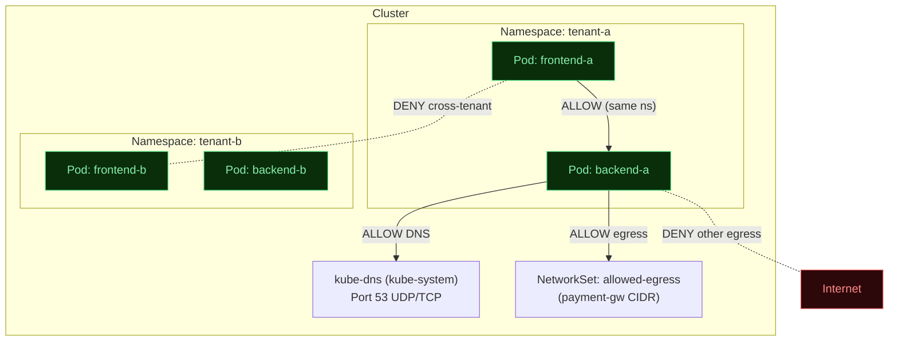

# Lab Tập 21: Lab Thực Chiến 4 — Network Policy Nâng Cao với Calico
**Bối cảnh:**
Công ty triển khai nền tảng SaaS multi-tenant trên cùng một hạ tầng On-Premise dùng chung một cluster Kubernetes. Mỗi tenant chạy trong namespace riêng và phải được cô lập hoàn toàn với nhau. Đồng thời, cluster cần kiểm soát chặt chẽ lưu lượng egress ra ngoài Internet để ngăn data exfiltration và giới hạn chỉ các dịch vụ bên ngoài được phép.

Đây là ba thách thức thực tế bạn sẽ giải quyết trong lab này:
1. **Multi-tenant isolation**: Các Pod giữa hai tenant phải không thể giao tiếp với nhau, nhưng vẫn cho phép DNS.
2. **Egress control**: Chỉ cho phép Pod của backend gọi ra một số domain/IP ngoài cụ thể (ví dụ: payment gateway, database hosted ngoài).
3. **GlobalNetworkPolicy**: Áp rule chi phối toàn cluster (chặn truy cập vào dải IP quản trị thiết bị / Link-Local Metadata 169.254.169.254 của hạ tầng On-Premise) mà không cần cấu hình từng namespace.

### Sơ đồ kiến trúc mạng mục tiêu:



---

## 🛠 Yêu cầu chuẩn bị
- Cụm K8s với Calico từ Tập 9 (đang chạy).
- `calicoctl` đã cài sẵn (hoặc dùng `kubectl exec` vào calico-node pod).
- Ubuntu 26.04.

---

## 🔬 Phần 1: Cấu hình môi trường

**SSH vào `controlplane`:**

```bash
multipass shell controlplane
```

### 1.1 Tạo namespace và workload cho hai tenant

```bash
kubectl apply -f - <<'EOF'
apiVersion: v1
kind: Namespace
metadata:
  name: tenant-a
  labels:
    tenant: a
---
apiVersion: v1
kind: Namespace
metadata:
  name: tenant-b
  labels:
    tenant: b
---
apiVersion: v1
kind: Pod
metadata:
  name: frontend-a
  namespace: tenant-a
  labels:
    app: frontend
    tenant: a
spec:
  containers:
  - name: c
    image: nicolaka/netshoot
    command: ["sleep", "infinity"]
---
apiVersion: v1
kind: Pod
metadata:
  name: backend-a
  namespace: tenant-a
  labels:
    app: backend
    tenant: a
spec:
  containers:
  - name: c
    image: nicolaka/netshoot
    command: ["sleep", "infinity"]
---
apiVersion: v1
kind: Pod
metadata:
  name: frontend-b
  namespace: tenant-b
  labels:
    app: frontend
    tenant: b
spec:
  containers:
  - name: c
    image: nicolaka/netshoot
    command: ["sleep", "infinity"]
---
apiVersion: v1
kind: Pod
metadata:
  name: backend-b
  namespace: tenant-b
  labels:
    app: backend
    tenant: b
spec:
  containers:
  - name: c
    image: nicolaka/netshoot
    command: ["sleep", "infinity"]
EOF
kubectl wait --for=condition=Ready pod -l tenant=a -n tenant-a --timeout=90s
kubectl wait --for=condition=Ready pod -l tenant=b -n tenant-b --timeout=90s
```

### 1.2 Ghi lại IP của các Pod

```bash
FA_IP=$(kubectl get pod frontend-a -n tenant-a -o jsonpath='{.status.podIP}')
BA_IP=$(kubectl get pod backend-a   -n tenant-a -o jsonpath='{.status.podIP}')
FB_IP=$(kubectl get pod frontend-b -n tenant-b -o jsonpath='{.status.podIP}')
BB_IP=$(kubectl get pod backend-b   -n tenant-b -o jsonpath='{.status.podIP}')
echo "frontend-a: $FA_IP | backend-a: $BA_IP"
echo "frontend-b: $FB_IP | backend-b: $BB_IP"
```

### 1.3 Xác nhận trạng thái ban đầu — tất cả đang thông nhau (chưa có policy)

```bash
# frontend-a gọi được frontend-b (cross-tenant) — phải thấy open
kubectl exec frontend-a -n tenant-a -- nc -zv $FB_IP 80 2>&1 || true

# backend-a gọi ra ngoài Internet — phải thấy connected
kubectl exec backend-a -n tenant-a -- curl -s --max-time 5 https://ifconfig.me 2>&1 || true
```

---

## 🎯 Phần 2: Thử thách 30 Phút Tự Giải (Troubleshoot Challenge)

> [!IMPORTANT]
> **Nhiệm vụ của học viên:**
>
> Hãy đóng vai SRE đang triển khai security policy cho production cluster.
>
> Mục tiêu cần đạt được SAU KHI áp policy:
> 1. **[Tenant Isolation]** `frontend-a` KHÔNG thể kết nối tới bất kỳ Pod nào trong `tenant-b` và ngược lại.
> 2. **[Intra-tenant]** `frontend-a` VẪN có thể kết nối tới `backend-a` (cùng namespace).
> 3. **[DNS]** Mọi Pod trong cả hai tenant vẫn resolve được DNS (`nslookup kubernetes.default`).
> 4. **[Egress Control]** `backend-a` CHỈ được phép kọi ra IP `1.1.1.1` (Cloudflare DNS — giả lập payment gateway). Mọi egress khác bị chặn.
> 5. **[GlobalNetworkPolicy]** Block toàn bộ cluster truy cập `169.254.169.254` (IP quản trị hạ tầng / Metadata endpoint) — không cần sửa từng namespace.
>
> **Tài liệu tham khảo:**
> - K8s NetworkPolicy: https://kubernetes.io/docs/concepts/services-networking/network-policies/
> - Calico NetworkPolicy: https://docs.tigera.io/calico/latest/reference/resources/networkpolicy
> - Calico GlobalNetworkPolicy: https://docs.tigera.io/calico/latest/reference/resources/globalnetworkpolicy
> - Calico NetworkSet: https://docs.tigera.io/calico/latest/reference/resources/networkset
>
> *Bạn có **30 phút** trước khi xem hướng dẫn ở Phần 3.*

---

## 📖 Phần 3: Hướng dẫn từng bước (Chỉ xem sau khi tự làm)

### Bước 1: Default-Deny Ingress + cho phép intra-namespace

Áp `NetworkPolicy` default-deny cho từng tenant, sau đó mở intra-namespace:

```bash
kubectl apply -f - <<'EOF'
# Default deny ALL ingress trong tenant-a
apiVersion: networking.k8s.io/v1
kind: NetworkPolicy
metadata:
  name: default-deny-ingress
  namespace: tenant-a
spec:
  podSelector: {}
  policyTypes:
  - Ingress
---
# Cho phép ingress từ trong chính namespace tenant-a
apiVersion: networking.k8s.io/v1
kind: NetworkPolicy
metadata:
  name: allow-intra-tenant
  namespace: tenant-a
spec:
  podSelector: {}
  policyTypes:
  - Ingress
  ingress:
  - from:
    - podSelector: {}
---
# Tương tự cho tenant-b
apiVersion: networking.k8s.io/v1
kind: NetworkPolicy
metadata:
  name: default-deny-ingress
  namespace: tenant-b
spec:
  podSelector: {}
  policyTypes:
  - Ingress
---
apiVersion: networking.k8s.io/v1
kind: NetworkPolicy
metadata:
  name: allow-intra-tenant
  namespace: tenant-b
spec:
  podSelector: {}
  policyTypes:
  - Ingress
  ingress:
  - from:
    - podSelector: {}
EOF
```

**Kiểm tra:**
```bash
# Cross-tenant PHẢI bị block (timeout/refused)
kubectl exec frontend-a -n tenant-a -- nc -zv -w 3 $FB_IP 80 2>&1 || echo "BLOCKED ✅"

# Intra-tenant PHẢI thông (backend-a chạy netcat listener tạm)
kubectl exec backend-a -n tenant-a -- nc -lk -p 8080 &
kubectl exec frontend-a -n tenant-a -- nc -zv -w 3 $BA_IP 8080 && echo "INTRA OK ✅" || echo "FAILED ❌"
kubectl exec backend-a -n tenant-a -- kill %1 2>/dev/null || true
```

---

### Bước 2: Cho phép DNS egress (port 53)

Không có rule egress → Pod vẫn ra được (K8s NetworkPolicy mặc định không chặn egress trừ khi explicit). Tuy nhiên, khi thêm Egress deny ở bước sau, phải mở sẵn DNS:

```bash
kubectl apply -f - <<'EOF'
apiVersion: networking.k8s.io/v1
kind: NetworkPolicy
metadata:
  name: allow-dns-egress
  namespace: tenant-a
spec:
  podSelector: {}
  policyTypes:
  - Egress
  egress:
  - ports:
    - port: 53
      protocol: UDP
    - port: 53
      protocol: TCP
EOF
```

**Kiểm tra DNS vẫn hoạt động:**
```bash
kubectl exec frontend-a -n tenant-a -- nslookup kubernetes.default && echo "DNS OK ✅"
```

---

### Bước 3: Egress control cho backend-a — dùng Calico NetworkSet

Calico mở rộng K8s NetworkPolicy bằng `NetworkSet` — cho phép define tập hợp CIDR/IP có thể tái sử dụng trong nhiều policy.

> [!IMPORTANT]
> **Lưu ý lỗi `no matches for kind "NetworkSet" in version "projectcalico.org/v3"`:**
> Nếu cụm Lab của bạn cài đặt Calico bằng file Manifest (mặc định không chạy Calico API Server), `kubectl` sẽ báo lỗi không tìm thấy tài nguyên thuộc `projectcalico.org/v3`.
> 
> **Cách xử lý (chọn 1 trong 2 cách):**
> - **Cách 1:** Sử dụng `calicoctl apply` thay vì `kubectl apply` (ví dụ: `calicoctl apply -f - <<'EOF'`).
> - **Cách 2:** Tiếp tục sử dụng `kubectl apply` nhưng đổi toàn bộ `apiVersion: projectcalico.org/v3` thành `apiVersion: crd.projectcalico.org/v1` cho tất cả cấu hình Calico trong bài lab này (bao gồm cả `NetworkSet`, `NetworkPolicy` của projectcalico và `GlobalNetworkPolicy`).
> 
> *Ví dụ ở bước 3.1 dưới đây trình bày theo định dạng chuẩn `projectcalico.org/v3`, bạn hãy tự điều chỉnh `apiVersion` theo cách bạn chọn.*

**3.1 Tạo NetworkSet chứa các IP được phép:**
```bash
kubectl apply -f - <<'EOF'
apiVersion: projectcalico.org/v3
kind: NetworkSet
metadata:
  name: allowed-egress-ips
  namespace: tenant-a
  labels:
    role: allowed-external
spec:
  nets:
  - 1.1.1.1/32
EOF
```

**3.2 Tạo Calico NetworkPolicy cho phép backend-a egress đến NetworkSet:**

> **Lưu ý:** Dùng `projectcalico.org/v3` NetworkPolicy (không phải `networking.k8s.io/v1`) để dùng được selector `nets` từ NetworkSet.

```bash
kubectl apply -f - <<'EOF'
apiVersion: projectcalico.org/v3
kind: NetworkPolicy
metadata:
  name: backend-a-egress
  namespace: tenant-a
spec:
  selector: app == 'backend'
  types:
  - Egress
  egress:
  # Cho phép DNS
  - action: Allow
    protocol: UDP
    destination:
      ports: [53]
  - action: Allow
    protocol: TCP
    destination:
      ports: [53]
  # Cho phép ra các IP trong NetworkSet
  - action: Allow
    destination:
      selector: role == 'allowed-external'
  # Block tất cả egress còn lại
  - action: Deny
EOF
```

**Kiểm tra:**
```bash
# Phải thành công (1.1.1.1 — nằm trong allowed NetworkSet)
kubectl exec backend-a -n tenant-a -- ping -c 2 -W 3 1.1.1.1 && echo "ALLOWED ✅" || echo "BLOCKED ❌"

# Phải bị block (8.8.8.8 — không trong NetworkSet)
kubectl exec backend-a -n tenant-a -- ping -c 2 -W 3 8.8.8.8 && echo "LEAK ❌" || echo "BLOCKED ✅"
```

---

### Bước 4: GlobalNetworkPolicy — Block IP quản trị hạ tầng / Metadata endpoint toàn cluster

`GlobalNetworkPolicy` (chỉ có ở Calico) áp dụng cho toàn bộ cluster mà không bị giới hạn trong phạm vi namespace. Trong môi trường hạ tầng doanh nghiệp **On-Premise**, một yêu cầu bảo mật bắt buộc là chặn toàn bộ các Pod của ứng dụng truy cập vào dải IP quản trị của các máy chủ vật lý (như IPMI, iLO, vCenter) hoặc các dịch vụ Metadata nội bộ (như OpenStack Metadata IP: `169.254.169.254`) để tránh nguy cơ dò quét và tấn công ngược lại hạ tầng mạng vật lý.

```bash
kubectl apply -f - <<'EOF'
apiVersion: projectcalico.org/v3
kind: GlobalNetworkPolicy
metadata:
  name: block-metadata
spec:
  order: 1
  selector: all()
  types:
  - Egress
  egress:
  # Block tất cả traffic đến IP quản trị hạ tầng / metadata (169.254.169.254)
  - action: Deny
    destination:
      nets:
      - 169.254.169.254/32
  # Cho phép tất cả egress khác (rule này KHÔNG override policy namespace-level)
  - action: Allow
EOF
```

> **Giải thích ordering:** Calico evaluate policy theo thứ tự `order` (số nhỏ = ưu tiên cao hơn). `GlobalNetworkPolicy` với `order: 1` được evaluate TRƯỚC các `NetworkPolicy` namespace-level. Vì block metadata/IP quản trị là security requirement toàn cluster, đặt order thấp đảm bảo không bị override.

**Kiểm tra block metadata hoạt động:**
```bash
# Từ frontend-a (tenant-a) — PHẢI bị block
kubectl exec frontend-a -n tenant-a -- curl -s --max-time 3 http://169.254.169.254/ 2>&1 || echo "BLOCKED ✅"

# Từ frontend-b (tenant-b) — cũng PHẢI bị block (global policy)
kubectl exec frontend-b -n tenant-b -- curl -s --max-time 3 http://169.254.169.254/ 2>&1 || echo "BLOCKED ✅"
```

---

### Bước 5: Xác minh toàn bộ security matrix

Chạy kiểm tra tổng thể:

```bash
echo "=== Tenant Isolation ==="
kubectl exec frontend-a -n tenant-a -- nc -zv -w 3 $FB_IP 80 2>&1 | grep -E "open|refused|timeout" \
  && echo "LEAK ❌" || echo "Cross-tenant BLOCKED ✅"

echo ""
echo "=== DNS Resolution ==="
kubectl exec frontend-a -n tenant-a -- nslookup kubernetes.default 2>&1 | grep -q "Address" \
  && echo "DNS OK ✅" || echo "DNS BROKEN ❌"

echo ""
echo "=== Egress Control: backend-a → 1.1.1.1 (allowed) ==="
kubectl exec backend-a -n tenant-a -- ping -c 2 -W 3 1.1.1.1 2>&1 | grep -q "2 received" \
  && echo "ALLOWED ✅" || echo "BLOCKED ❌"

echo ""
echo "=== Egress Control: backend-a → 8.8.8.8 (denied) ==="
kubectl exec backend-a -n tenant-a -- ping -c 2 -W 3 8.8.8.8 2>&1 | grep -q "2 received" \
  && echo "LEAK ❌" || echo "BLOCKED ✅"

echo ""
echo "=== GlobalNetworkPolicy: Metadata block ==="
kubectl exec frontend-a -n tenant-a -- curl -s --max-time 3 http://169.254.169.254/ \
  && echo "LEAK ❌" || echo "METADATA BLOCKED ✅"
```

Kết quả mong đợi: tất cả 5 kiểm tra đều báo `✅`.

---

### Bước 6: Debug Network Policy bằng Calico policy hit counters

Calico cung cấp công cụ xem policy nào đang drop traffic — rất hữu ích khi debug production:

```bash
# Xem policy statistics từ calico-node trên worker1
CALICO_POD=$(kubectl get pod -n calico-system -l k8s-app=calico-node -o name | head -1)
kubectl exec -n calico-system $CALICO_POD -- calico-node -felix-live 2>/dev/null || true

# Hoặc xem iptables rules do Calico sinh ra:
# SSH vào worker1
multipass shell worker1

# Xem chain Calico-specific drop rules
sudo iptables -L cali-pi-_default-deny-ingres -n -v 2>/dev/null | head -20
sudo iptables -nL | grep -E "cali|DROP" | head -30
```

---

## 🧹 Dọn dẹp

```bash
# Trên controlplane:
kubectl delete namespace tenant-a tenant-b

# Xóa GlobalNetworkPolicy
kubectl delete globalnetworkpolicy block-metadata
```

---

## ✅ Tổng kết

| Kỹ thuật | Công cụ | Khi nào dùng |
|---|---|---|
| **Tenant isolation** | K8s `NetworkPolicy` default-deny | Multi-tenant cluster, PCI/SOC2 compliance |
| **Intra-namespace allow** | `podSelector: {}` + `namespaceSelector` | Microservices cùng team giao tiếp nhau |
| **DNS whitelist** | Mở port 53 trong egress policy | Luôn cần khi áp egress deny |
| **NetworkSet** | Calico `NetworkSet` CRD | Reuse tập IP/CIDR trong nhiều policy |
| **Egress IP whitelist** | Calico `NetworkPolicy` + `NetworkSet` | Control outbound đến payment gateway, DB ngoài |
| **Cluster-wide rule** | Calico `GlobalNetworkPolicy` | Chặn IP quản trị hạ tầng, chặn C2 infrastructure |

**Bài học core:**
- K8s `NetworkPolicy` mặc định **không chặn egress** trừ khi có ít nhất 1 egress policy.
- Calico `GlobalNetworkPolicy` vượt qua giới hạn namespace — dùng để áp security baseline toàn cluster.
- `NetworkSet` giải quyết vấn đề quản lý IP tập trung — thay vì hardcode CIDR trong từng policy.
- Luôn mở port 53 TRƯỚC khi áp egress deny, không thì DNS chết trước khi policy được kiểm tra.
