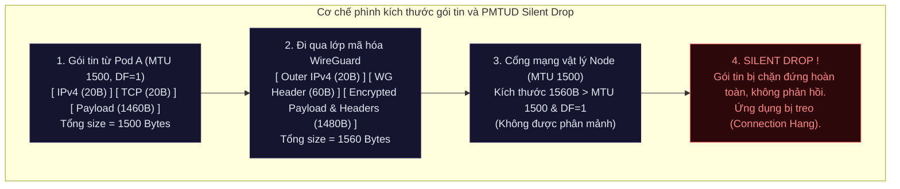

# Lab Tập 21: Lab 3 — Sự cố truyền nhận file dung lượng lớn qua WireGuard (MTU Black Hole)

**Hiện tượng hiện tại:**
Sau khi bật WireGuard để mã hóa lưu lượng giữa các Node trong cụm Kubernetes, đội ngũ vận hành nhận được phản hồi về lỗi truyền nhận file lớn:
- Các thao tác truyền file dung lượng nhỏ (như upload ảnh < 512KB) qua lại giữa các Pod chéo Node diễn ra bình thường.
- Tuy nhiên, khi upload file dung lượng lớn (như video > 5MB) qua kết nối chéo Node thì kết nối bị treo (hang) hoàn toàn và báo lỗi timeout.
- Rất kỳ lạ là việc truyền file dung lượng lớn giữa các Pod chạy trên cùng một Node (same-node) vẫn hoạt động mượt mà không gặp bất cứ lỗi gì.

Nhiệm vụ của bạn là điều tra, tìm nguyên nhân gốc rễ và khắc phục sự cố này để khôi phục tốc độ truyền file lớn chéo Node bình thường.

### Sơ đồ cơ chế phình kích thước gói tin qua lớp mã hóa WireGuard:



---

## 🛠 Yêu cầu chuẩn bị
- Cụm K8s với Calico từ Tập 9.
- Ubuntu 26.04 — WireGuard kernel built-in.
- `pod-a` trên `worker1`, hoặc sẽ tạo trong lab này.

---

## 🔬 Phần 1: Cấu hình môi trường và Kích hoạt Sự cố (Mô phỏng Production Incident)

**SSH vào `controlplane`:**

```bash
multipass shell controlplane
```

1. Bật tính năng mã hóa WireGuard trên cluster:
   ```bash
   kubectl patch felixconfiguration default \
     --type merge \
     --patch '{"spec": {"wireguardEnabled": true}}'
   ```

2. Thiết lập MTU cho Felix Configuration:
   ```bash
   kubectl patch felixconfiguration default \
     --type merge \
     --patch '{"spec": {"wireguardMTU": 1500}}'
   ```

3. Chờ cho Calico Nodes cập nhật lại cấu hình:
   ```bash
   kubectl -n calico-system rollout status daemonset/calico-node
   ```

4. Xác nhận MTU của interface WireGuard đã được thiết lập:
   ```bash
   multipass exec worker1 -- ip link show wireguard.cali
   ```

5. Triển khai các Pod kiểm tra (Client trên worker1, Server chéo node trên worker2, Server cùng node trên worker1):
   ```bash
   kubectl apply -f - <<'EOF'
   apiVersion: v1
   kind: Pod
   metadata:
     name: upload-client
   spec:
     nodeName: worker1
     containers:
     - name: c
       image: nicolaka/netshoot
       command: ["sleep", "infinity"]
   ---
   apiVersion: v1
   kind: Pod
   metadata:
     name: upload-server
   spec:
     nodeName: worker2
     containers:
     - name: s
       image: nicolaka/netshoot
       command: ["nc", "-lk", "-p", "9999"]
   ---
   apiVersion: v1
   kind: Pod
   metadata:
     name: upload-server-local
   spec:
     nodeName: worker1
     containers:
     - name: s
       image: nicolaka/netshoot
       command: ["nc", "-lk", "-p", "9998"]
   EOF
   kubectl wait --for=condition=Ready pod/upload-client pod/upload-server pod/upload-server-local --timeout=90s
   ```

6. Ghi lại địa chỉ IP của các Pod:
   ```bash
   SERVER_IP=$(kubectl get pod upload-server -o jsonpath='{.status.podIP}')
   LOCAL_IP=$(kubectl get pod upload-server-local -o jsonpath='{.status.podIP}')
   echo "Cross-node server IP: $SERVER_IP"
   echo "Same-node server IP: $LOCAL_IP"
   ```

7. **Kích hoạt sự cố và quan sát triệu chứng:**
   - **Trường hợp A:** Truyền file dung lượng nhỏ (512KB) chéo node -> **OK**:
     ```bash
     kubectl exec upload-client -- bash -c "
       dd if=/dev/urandom bs=512K count=1 2>/dev/null | nc -w 5 $SERVER_IP 9999
       echo 'Small file connection exit: '$?
     "
     # Small file (cross-node): 0  (Thành công!)
     ```
   - **Trường hợp B:** Truyền file dung lượng lớn (5MB) chéo node -> **BỊ TREO (HANG)**:
     ```bash
     kubectl exec upload-client -- bash -c "
       timeout 10 bash -c 'dd if=/dev/urandom bs=1M count=5 2>/dev/null | nc $SERVER_IP 9999'
       echo 'Large file connection exit: '$?
     "
     # Connection exit: 124  (Bị timeout chéo node!)
     ```
   - **Trường hợp C:** Truyền file dung lượng lớn (5MB) trên cùng node -> **OK**:
     ```bash
     kubectl exec upload-client -- bash -c "
       dd if=/dev/urandom bs=1M count=5 2>/dev/null | nc -w 10 $LOCAL_IP 9998
       echo 'Large file (same-node) exit: '$?
     "
     # Connection exit: 0  (Thành công khi truyền cùng node!)
     ```

---

## 🎯 Phần 2: Thử thách 30 Phút Tự Giải & Tự Tìm Lỗi (Troubleshoot Challenge)

> [!IMPORTANT]
> **Nhiệm vụ của học viên:**
> Hãy đóng vai là một Chuyên gia mạng K8s đang đối mặt với sự cố kỳ quái này.
> 
> Hãy tự mình điều tra nguyên nhân dựa trên các phản xạ kỹ thuật của bản thân:
> 1. Tại sao file nhỏ đi chéo node được, file lớn lại bị drop/treo chéo node?
> 2. Tại sao việc truyền file lớn cùng node lại không gặp vấn đề gì? (Gợi ý: Cùng node traffic có đi qua WireGuard tunnel không?)
> 3. Hãy tìm cách xác định MTU thực tế của kết nối mạng vật lý và lớp đường hầm WireGuard.
> 4. Thực hiện sửa lỗi và đảm bảo việc truyền file 5MB chéo node đạt tốc độ tối đa không bị timeout.
> 
> *Bạn có đúng **30 phút** để tự mình giải bài toán này trước khi xem hướng dẫn chi tiết ở Phần 3.*

---

## 📖 Phần 3: Hướng dẫn Troubleshooting từng bước chuẩn (Chỉ xem sau khi tự làm)

Nếu đã qua 30 phút hoặc bạn đã tự giải xong, hãy đối chiếu các bước xử lý của bạn với quy trình điều tra chuẩn dưới đây:

### Bước 1: Kiểm tra MTU của các Interface
1. Kiểm tra MTU trên card mạng của Pod `upload-client`:
   ```bash
   kubectl exec upload-client -- ip link show eth0
   # Kết quả: eth0: mtu 1500
   ```
2. Kiểm tra MTU của interface WireGuard trên Node:
   ```bash
   multipass exec worker1 -- ip link show wireguard.cali
   # Kết quả: wireguard.cali: mtu 1500
   ```
   *Nhận định:* Cả Pod và WireGuard đều đang để MTU mặc định là 1500.

### Bước 2: Chẩn đoán bằng gói tin Ping kích hoạt DF (Don't Fragment)
Để kiểm tra xem MTU thực sự chịu tải được bao nhiêu bytes trước khi bị drop, ta gửi gói tin ICMP Ping với cờ `DF` hoạt động (ép không phân mảnh):
1. Ping thử với payload 1400 bytes (tổng gói tin khoảng 1428 bytes):
   ```bash
   kubectl exec upload-client -- ping -c 2 -s 1400 -M do $SERVER_IP
   # Thành công!
   ```
2. Ping thử với payload 1440 bytes (tổng gói tin khoảng 1468 bytes):
   ```bash
   kubectl exec upload-client -- ping -c 1 -s 1440 -M do $SERVER_IP
   # Lỗi: ping: local error: message too long, mtu=1420
   ```
   *Giải thích phát hiện:* Hệ điều hành trả về cảnh báo kích thước quá dài và báo hiệu MTU tối đa có thể chịu tải qua lớp mã hóa WireGuard chỉ là **1420 bytes**.
   
   **Nguyên nhân gốc rễ (PMTUD Black Hole):**
   - MTU mạng vật lý là 1500 bytes.
   - Lớp mã hóa WireGuard cộng thêm 80 bytes tiêu đề (overhead) vào mỗi gói tin.
   - Khi Pod gửi gói tin kích thước lớn 1500 bytes với cờ `DF=1` (Don't Fragment), Calico đưa gói tin này vào WireGuard làm phình gói tin lên 1580 bytes.
   - Khi đẩy ra card vật lý `eth0` của Node có MTU 1500, vì cờ `DF=1` cấm phân mảnh, router/card mạng âm thầm hủy bỏ gói tin (Silent Drop) mà không phản hồi lại gói tin ICMP báo lỗi cho bên gửi. Bên gửi (TCP sender) chờ ACK vô hạn dẫn đến treo kết nối (Black Hole).

---

### Bước 3: Khắc phục sự cố

#### 1. Cấu hình lại MTU chính xác cho WireGuard (MTU = 1420)
Ta phải cấu hình Calico tự động tính toán hoặc ép MTU của interface WireGuard xuống 1420 bytes (1500 - 80 bytes overhead):
```bash
kubectl patch felixconfiguration default \
  --type merge \
  --patch '{"spec": {"wireguardMTU": 1420}}'
```

*Đợi Calico reload lại cấu hình:*
```bash
kubectl -n calico-system rollout status daemonset/calico-node
```

#### 2. Xác minh cấu hình MTU mới đã được đồng bộ xuống Pod và Node
```bash
# Trên Node worker1:
multipass exec worker1 -- ip link show wireguard.cali
# wireguard.cali: mtu 1420 ✅

# Bên trong Pod upload-client:
kubectl exec upload-client -- ip link show eth0
# eth0: mtu 1420 ✅ (Calico tự động cập nhật MTU cho Pod!)
```

#### 3. Cấu hình MSS Clamping để bảo vệ bổ sung
Trong một số môi trường, để chắc chắn gói tin TCP luôn thỏa thuận kích thước MSS nhỏ hơn (tránh vượt ngưỡng MTU), ta kích hoạt MSS Clamping trên Calico:
```bash
kubectl patch felixconfiguration default \
  --type merge \
  --patch '{"spec": {"wireguardMssClamp": 1380}}'
```
*Xác nhận rule iptables đã tự động cài đặt trên Node:*
```bash
multipass exec worker1 -- sudo iptables -t mangle -L | grep TCPMSS
# TCPMSS  tcp  -- ... TCPMSS clamp to 1380 ✅
```

---

### Bước 4: Kiểm tra lại kết nối

Tiến hành kiểm tra lại việc truyền file dung lượng lớn 5MB chéo Node:
```bash
kubectl exec upload-client -- bash -c "
  dd if=/dev/urandom bs=1M count=5 2>/dev/null | nc -w 30 $SERVER_IP 9999
  echo 'Large file cross-node connection exit: '$?
"
```

Kết quả mong đợi:
```
Large file cross-node connection exit: 0 ✅ THÀNH CÔNG!
```

---

## 🧹 Dọn dẹp

```bash
kubectl delete pod upload-client upload-server upload-server-local

# Trả FelixConfiguration về mặc định để tránh ảnh hưởng các bài lab sau
kubectl patch felixconfiguration default \
  --type merge \
  --patch '{"spec": {"wireguardEnabled": false, "wireguardMTU": null, "wireguardMssClamp": null}}'
```

---

## ✅ Tổng kết

1. **Dấu hiệu nhận biết sự cố MTU:** Truyền file dung lượng nhỏ hoạt động bình thường, nhưng truyền file lớn bị treo chéo node (hoạt động bình thường cùng node).
2. **Cơ chế Black Hole:** Lớp mã hóa (WireGuard/IPsec) chèn thêm header làm phình gói tin vượt quá MTU vật lý của Node. Cờ `DF=1` cấm phân mảnh, kết hợp với các router trung gian drop âm thầm gói tin mà không gửi trả ICMP báo lỗi, tạo ra một "hố đen định tuyến".
3. **Cách tìm MTU thực tế:** Dùng công cụ Ping với cờ chặn phân mảnh (`ping -M do -s <size> <target_ip>`).
4. **Cách khắc phục:** Cấu hình MTU của tunnel phù hợp (MTU vật lý trừ đi overhead của công nghệ đóng gói, ví dụ WireGuard là 80 bytes, VXLAN là 50 bytes) kết hợp với **MSS Clamping** để ép gói tin TCP tự thương lượng kích thước an toàn.
