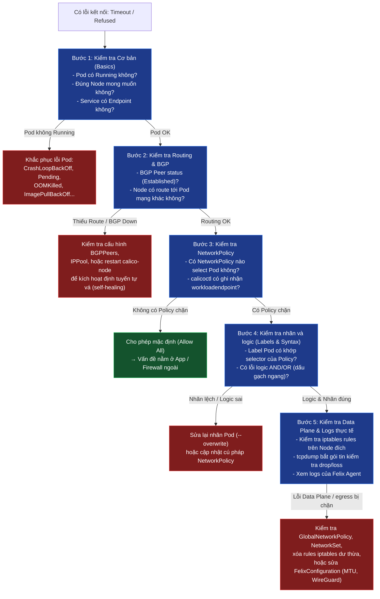

# Tài liệu Tập 22: Tổng kết & Hướng dẫn Troubleshooting Calico chuẩn

Tài liệu này tổng hợp lại toàn bộ kiến thức, quy trình xử lý sự cố (troubleshooting) hệ thống mạng Calico trong cụm Kubernetes sau khi bạn đã hoàn thành 4 bài lab thực tế (Tập 18 - 21). Đây sẽ là tài liệu tham chiếu (cheatsheet) giúp bạn nhanh chóng định vị lỗi trong môi trường Production.

---

## 🧭 Quy trình gỡ lỗi (Troubleshooting Workflow) 5 bước

Khi phát hiện sự cố kết nối giữa các Pod (ví dụ: `Connection Timeout` hoặc `Connection Refused`), hãy thực hiện kiểm tra theo trình tự 5 bước dưới đây để tránh đoán mò và tiết kiệm thời gian:



---

## 📊 Tổng hợp 4 Kịch bản Sự cố thực tế (Tập 18 – Tập 21)

| Bài Lab | Hiện tượng (Symptom) | Nguyên nhân gốc rễ (Root Cause) | Công cụ chẩn đoán chính | Giải pháp khắc phục |
| :--- | :--- | :--- | :--- | :--- |
| **Lab 1 (Tập 18): Label Typo** | Connection Timeout chéo/cùng node khi deploy Backend phiên bản mới. | Pod Backend thiếu nhãn `app=backend` khiến policy `allow-frontend-to-backend` không match, Pod bị chặn bởi `default-deny`. | `kubectl get pod --show-labels`<br>`calicoctl get workloadendpoint` | Thêm nhãn chính xác cho Pod (`kubectl label pod backend app=backend`). |
| **Lab 2 (Tập 19): BGP Route Loss** | BGP session báo UP giữa các node nhưng máy chủ giám sát ngoài cụm không ping được Pod. | Máy chủ ngoài chưa cấu hình BGP Peer với cụm K8s nên không tự động nhận dải Pod CIDR. | `ip route show`<br>`calicoctl node status` | Thêm Static Route trên máy chủ ngoài trỏ về Node trung chuyển hoặc thiết lập BGP Peer động qua BIRD/FRR. |
| **Lab 3 (Tập 20): Network Policy Nâng Cao** | Tenant A reach được Tenant B (cross-namespace). Backend gọi ra Internet thoải mái. Mọi Pod đều reach được AWS IMDS `169.254.169.254`. | Chưa có NetworkPolicy nào — cluster mặc định allow-all. Thiếu egress control, thiếu cluster-wide baseline security. | `kubectl get networkpolicy -A`<br>`calicoctl get globalnetworkpolicy`<br>`kubectl exec -- nc -zv <IP> <port>` | Default-deny ingress theo namespace + DNS whitelist (port 53) + `NetworkSet` CIDR egress + `GlobalNetworkPolicy order:1` block IMDS toàn cluster. |
| **Lab 4 (Tập 21): Cross-Namespace** | Prometheus ở namespace `monitoring` không scrape được Backend ở `production`. | Lỗi cú pháp dấu gạch ngang tạo logic OR thay vì AND, đồng thời bị che giấu bởi namespace thiếu nhãn (Bug Masking). | `kubectl get ns --show-labels`<br>Phân tích cú pháp YAML `- namespaceSelector` | Sử dụng cú pháp AND (gộp chung dưới 1 dấu gạch ngang), gắn nhãn namespace hoặc dùng K8s auto-labeling. |

---

## 🛠 Bộ công cụ gỡ lỗi Calico (Command Toolkit Cheatsheet)

### 1. Kiểm tra tầng Control Plane (Calico / K8s Metadata)
* **Xem trạng thái kết nối BGP với các Node lân cận:**
  ```bash
  sudo calicoctl node status
  # Cần hiển thị STATE: Established cho tất cả các Peer
  ```
* **Xem các Endpoint (Pod) mà Calico Felix đã nhận diện và quản lý:**
  ```bash
  calicoctl get workloadendpoint -o wide
  # Xác nhận Interface name tương ứng trên Node (ví dụ: calic316a70e704)
  ```
* **Liệt kê và kiểm tra nhanh các chính sách NetworkPolicy:**
  ```bash
  kubectl get networkpolicy -A
  calicoctl get networkpolicy -A -o yaml
  ```
* **Kiểm tra Calico-specific policies (GlobalNetworkPolicy, NetworkSet):**
  ```bash
  # Policy áp toàn cluster (không bị namespace giới hạn)
  calicoctl get globalnetworkpolicy -o yaml

  # Tập hợp CIDR/IP dùng trong egress policy
  calicoctl get networkset -A -o yaml

  # Xác nhận policy nào đang select Pod cụ thể
  calicoctl get workloadendpoint <pod-name> -n <namespace> -o yaml
  ```

### 2. Kiểm tra tầng Data Plane (Linux Kernel & Network Card)
* **Kiểm tra bảng định tuyến của Node (được cập nhật bởi BIRD):**
  ```bash
  ip route show proto bird
  # Phải xuất hiện route dẫn đến các dải Pod CIDR của các Node khác qua interface vật lý (ví dụ: eth0)
  ```
* **Kiểm tra card mạng của WireGuard (nếu bật mã hóa):**
  ```bash
  ip link show wireguard.cali
  # Kiểm tra giá trị MTU (Khuyên dùng: 1440)
  ```
* **Tra cứu các rule iptables do Calico tự động sinh ra:**
  ```bash
  # Xem tất cả các chain liên quan đến Calico
  sudo iptables-save | grep cali
  
  # Xem chi tiết rule đi vào (Ingress) của một Pod cụ thể:
  sudo iptables -L cali-tw-<interface-id> -n --line-numbers
  
  # Xem chi tiết rule đi ra (Egress) của một Pod cụ thể:
  sudo iptables -L cali-fw-<interface-id> -n --line-numbers
  ```
* **Bắt gói tin thực tế bằng `tcpdump`:**
  ```bash
  # Chạy trên Node đích để xem gói tin có đi qua card mạng veth của Pod hay không
  sudo tcpdump -i cali<iface-id> port 8080 -n
  ```

---

## 💡 Bài học cốt lõi (Key Takeaways)

1. **Bản chất của Lỗi im lặng (Silent Drop):**
   Khi bị chặn bởi `NetworkPolicy` hoặc do lỗi `MTU Black Hole`, gói tin sẽ bị hủy âm thầm (DROP) trong iptables/card vật lý mà không phản hồi. Điều này làm cho ứng dụng khách bị treo (`Connection Timeout` hoặc `Hang`) và không hiển thị lỗi rõ ràng. Ngược lại, nếu lỗi do ứng dụng không lắng nghe cổng, hệ thống sẽ trả về ngay lập tức mã lỗi `Connection Refused` (TCP RST).
2. **Nguyên tắc "Tự chữa lành" (Self-Healing) của Calico:**
   Hầu hết các thành phần của Calico (Felix, BIRD) đều chạy dưới dạng các agent độc lập trên từng Node. Khi gặp sự cố mất kết nối tạm thời hoặc restart daemonset `calico-node`, BGP sẽ tự động thiết lập lại session và khôi phục bảng định tuyến trong vòng 10-30 giây mà không cần can thiệp thủ công.
3. **Quy trình Xác minh An toàn (Security Test Matrix):**
   Sau khi chỉnh sửa bất kỳ chính sách NetworkPolicy nào, luôn luôn thực hiện kiểm thử chéo với ít nhất 3 trường hợp:
   - **Legit Client:** Kết nối thành công.
   - **Rogue Client (Cùng Namespace):** Kết nối bị chặn.
   - **Rogue Client (Khác Namespace nhưng cùng nhãn):** Kết nối bị chặn.
