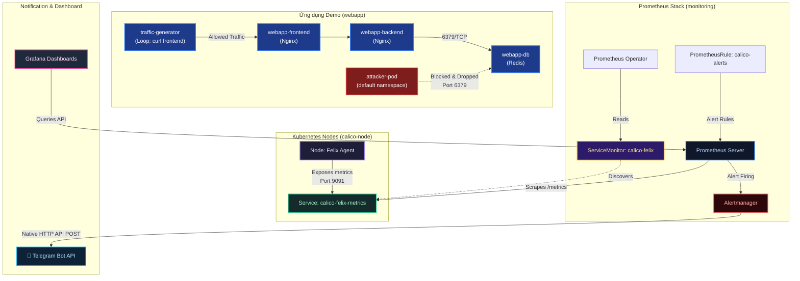
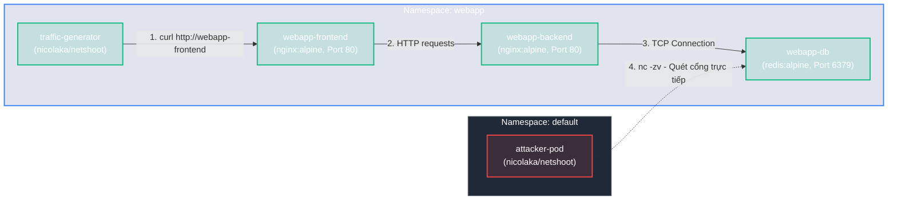

# Lab Tập 23: Calico Observability — Prometheus + Grafana + Alertmanager (Native Telegram Alerts)

Tập này dựng hệ thống giám sát và cảnh báo bảo mật cấp độ doanh nghiệp (Production-grade) cho cụm mạng Calico. Hệ thống sử dụng Prometheus Operator thu thập metrics, Alertmanager tích hợp trực tiếp để gửi cảnh báo Telegram, và Grafana trực quan hóa lưu lượng mạng hợp lệ (Allowed) đối chiếu với lưu lượng bị chặn (Denied).

### Sơ đồ kiến trúc giám sát & Kịch bản thực tế:



---

## Yêu cầu chuẩn bị

- Ít nhất 4GB RAM trống trên cụm lab (hoặc máy host).
- Kết nối Internet để pull Helm chart & docker images.
- **Tài khoản Telegram** và **Telegram Bot** để nhận tin nhắn alert.
- **Cụm Kubernetes 3 Node chạy Calico CNI (Tập 9+)**:
  
> [!TIP]
> **Nếu bạn chưa có cụm Lab hoặc muốn dựng mới từ đầu sạch hoàn toàn:**
>
> Chúng tôi đã chuẩn bị sẵn một script tự động hoá toàn bộ quá trình dựng VM, khởi tạo K8s cluster, cài Calico CNI, kích hoạt Felix Metrics và cài Helm chỉ trong **1 cú click**.
>
> Bạn chỉ cần mở Terminal trên máy host, di chuyển đến thư mục bài lab này (`tap-23-calico-observability`) và chạy:
> ```bash
> chmod +x setup-lab.sh
> ./setup-lab.sh
> ```
> *Script sẽ tự động nhận diện cấu trúc chip (ARM vs Intel/AMD) để cấp phát tài nguyên RAM/CPU tối ưu và hoàn thành toàn bộ công đoạn setup. Bạn có thể bỏ qua tất cả các bước thủ công dưới đây và tiến thẳng đến **Thực nghiệm 2**!*
>
> Nếu bạn muốn tự chạy thủ công từng bước để học bản chất, hãy tham khảo các bước bên dưới:
>
> **Bước 1: Khởi tạo 3 máy ảo VM (controlplane, worker1, worker2) trên máy host (Mac/Windows/Linux):**
> ```bash
> # Di chuyển tới thư mục cài đặt lab 00
> cd kubernetes-networking/k8s-lab/tap-00-setup-lab/
> chmod +x setup-lab.sh
> ./setup-lab.sh
> ```
>
> **Bước 2: Khởi tạo cụm Kubernetes trên Node `controlplane`:**
> ```bash
> # SSH vào controlplane
> multipass shell controlplane
> 
> # Khởi tạo Control Plane
> sudo kubeadm init --pod-network-cidr=10.244.0.0/16 --apiserver-advertise-address=$(ip route get 1.1.1.1 | awk '{print $7}')
> 
> # Cấu hình quyền truy cập kubectl
> mkdir -p $HOME/.kube
> sudo cp -i /etc/kubernetes/admin.conf $HOME/.kube/config
> sudo chown $(id -u):$(id -g) $HOME/.kube/config
> ```
> *Lưu ý: Copy câu lệnh `kubeadm join ...` xuất ra ở cuối quá trình khởi tạo.*
>
> **Bước 3: Tham gia các Node Worker vào cụm:**
> Mở terminal mới trên máy host và chạy:
> - SSH vào `worker1` và chạy lệnh join:
>   ```bash
>   multipass shell worker1
>   sudo kubeadm join <APISERVER_IP>:6443 --token <token> --discovery-token-ca-cert-hash sha256:<hash>
>   exit
>   ```
> - SSH vào `worker2` và chạy lệnh join:
>   ```bash
>   multipass shell worker2
>   sudo kubeadm join <APISERVER_IP>:6443 --token <token> --discovery-token-ca-cert-hash sha256:<hash>
>   exit
>   ```
>
> **Bước 4: Cài đặt Calico CNI qua Tigera Operator (Chạy trên `controlplane`):**
> ```bash
> # SSH lại vào controlplane
> multipass shell controlplane
>
> # Cài đặt Operator
> kubectl create -f https://raw.githubusercontent.com/projectcalico/calico/v3.32.0/manifests/tigera-operator.yaml
> 
> # Chờ Tigera Operator Pod sẵn sàng và đăng ký xong các CRD (tránh lỗi mapping CRD)
> kubectl wait --for=condition=Ready pod -l k8s-app=tigera-operator -n tigera-operator --timeout=60s
> 
> # Khởi tạo Custom Resource cho mạng Calico
> kubectl create -f - <<'EOF'
> apiVersion: operator.tigera.io/v1
> kind: Installation
> metadata:
>   name: default
> spec:
>   calicoNetwork:
>     ipPools:
>     - blockSize: 26
>       cidr: 10.244.0.0/16
>       encapsulation: VXLANCrossSubnet
>       natOutgoing: Enabled
>       nodeSelector: all()
> EOF
> 
> # Theo dõi cho đến khi các node chuyển sang Ready
> watch kubectl get nodes
> ```
>
> **Bước 5: Cài đặt công cụ `calicoctl` (Chạy trên `controlplane`):**
> ```bash
> # Xác định kiến trúc chip và tải calicoctl
> ARCH=$(uname -m)
> if [[ "$ARCH" == "x86_64" ]]; then CLI_ARCH="amd64"; else CLI_ARCH="arm64"; fi
> curl -L "https://github.com/projectcalico/calico/releases/download/v3.32.0/calicoctl-linux-${CLI_ARCH}" -o calicoctl
> chmod +x calicoctl
> sudo mv calicoctl /usr/local/bin/
> 
> # Xác minh hoạt động
> calicoctl version
> ```

---

## Thực nghiệm 1: Kích hoạt Felix metrics và kiểm tra thủ công

Theo mặc định, Calico Felix (agent quản lý data plane trên mỗi Node) tắt endpoints xuất metrics để tiết kiệm tài nguyên. Ta cần kích hoạt lên.

**SSH vào `controlplane`:**
```bash
multipass shell controlplane
```

1. Cập nhật FelixConfiguration mặc định của cụm để bật Prometheus metrics:
   ```bash
   kubectl patch felixconfiguration default \
     --type merge \
     --patch '{"spec": {"prometheusMetricsEnabled": true}}'
   ```

2. Xác minh cấu hình đã được áp dụng:
   ```bash
   kubectl get felixconfiguration default -o yaml | grep prometheus
   # Kết quả kỳ vọng: prometheusMetricsEnabled: true
   ```

3. Lấy IP của `worker1` để kiểm tra kết nối:
   ```bash
   export WORKER1_IP=$(kubectl get node worker1 -o jsonpath='{.status.addresses[?(@.type=="InternalIP")].address}')
   echo "Worker1 IP: $WORKER1_IP"
   ```

4. Chờ 10-15 giây để Felix reload cấu hình, sau đó scrape thử metrics thủ công:
   ```bash
   curl -s http://$WORKER1_IP:9091/metrics | grep -E "^felix_|^bgp_" | head -15
   ```
   *Giải thích:* Bạn sẽ thấy các metrics định dạng Prometheus xuất hiện trên cổng `9091`. Ví dụ:
   - `felix_active_local_endpoints`: Số lượng Pod đang chạy trên node đó.
   - `felix_denied_packets_total`: Số lượng gói tin bị chặn bởi NetworkPolicy (hiện tại bằng 0).
   - `bgp_peers{status="Established"}`: Trạng thái kết nối BGP với các Node khác.

---

## Thực nghiệm 2: Tạo Telegram Bot & lấy thông tin cấu hình

Ta sẽ chuẩn bị một kênh cảnh báo bảo mật qua Telegram.

1. Truy cập Telegram trên điện thoại/máy tính và tìm kiếm **@BotFather**.
2. Chat lệnh `/newbot` để tạo bot mới:
   - Đặt tên hiển thị: `Calico Security Alerts`
   - Đặt username: `calico_alerts_yourname_bot` (phải kết thúc bằng `_bot`).
   - Copy mã **Token** được BotFather cấp (ví dụ: `7123456789:AAHdqTcv...`).
3. Nhấp vào link bot vừa tạo và nhấn **Start** hoặc gửi một tin nhắn bất kỳ (ví dụ: `hello`).
4. Trên máy `controlplane`, lưu token này vào biến môi trường:
   ```bash
   export TELEGRAM_BOT_TOKEN="7123456789:AAHdqTcv..." # Điền token thực tế của bạn
   ```

> [!NOTE]
> **Góc nhìn Production:**
> Trong môi trường Lab, chúng ta sử dụng `export` vào biến môi trường tạm thời để shell tự động điền vào tệp cấu hình `values.yaml` ở bước tiếp theo. 
> Tuy nhiên ở môi trường **Production thực tế**, tuyệt đối không dùng shell export hoặc hardcode Token dạng plain-text vào Git. Thay vào đó, bạn nên quản lý theo các chuẩn doanh nghiệp:
> 1. **Kubernetes Secret:** Lưu thông tin bảo mật vào một Secret và tham chiếu động tới cấu hình Alertmanager.
> 2. **Secret Manager / GitOps:** Sử dụng HashiCorp Vault, AWS Secrets Manager tích hợp với **External Secrets Operator** hoặc mã hóa tệp cấu hình bằng **SOPS/Sealed Secrets** trước khi đẩy lên Git.

5. Thực hiện lấy **Chat ID** của bạn để bot biết gửi tin nhắn về đâu:
   ```bash
   curl -s "https://api.telegram.org/bot${TELEGRAM_BOT_TOKEN}/getUpdates" | python3 -c "
   import sys, json
   data = json.load(sys.stdin)
   chat_id = None
   for update in data.get('result', []):
       chat = update.get('message', {}).get('chat') or update.get('my_chat_member', {}).get('chat')
       if chat:
           chat_id = chat['id']
           break
   if chat_id:
       print('CHAT_ID:', chat_id)
   else:
       print('LỖI: Chưa có message! Hãy nhấn Start và gửi tin nhắn bất kỳ cho Bot trước.')
   "
   ```
6. Lưu ID nhận được vào biến môi trường (ví dụ: `123456789`):
   ```bash
   export TELEGRAM_CHAT_ID="123456789" # Thay bằng số Chat ID thực tế
   ```
7. Test thử xem Bot Telegram hoạt động không:
   ```bash
   curl -s -X POST "https://api.telegram.org/bot${TELEGRAM_BOT_TOKEN}/sendMessage" \
     -d "chat_id=${TELEGRAM_CHAT_ID}" \
     -d "text=🔔 Cảnh báo thử nghiệm: Kết nối thành công từ Kubernetes cluster!"
   ```

---

## Thực nghiệm 3: Triển khai kube-prometheus-stack qua Helm

Chúng ta sử dụng Helm để triển khai nhanh toàn bộ Stack giám sát, đồng thời cấu hình trực tiếp Alertmanager sử dụng tính năng gửi Telegram gốc (Native Integration).

1. Cài đặt Helm trên `controlplane` (nếu chưa có):
   ```bash
   which helm || curl https://raw.githubusercontent.com/helm/helm/main/scripts/get-helm-3 | bash
   ```

2. Thêm Prometheus Community repository và cập nhật:
   ```bash
   helm repo add prometheus-community https://prometheus-community.github.io/helm-charts
   helm repo update
   ```

3. Tạo file cấu hình `values.yaml` sử dụng shell substitution để tự động điền Token và Chat ID:
   ```bash
   cat <<EOF > /tmp/monitoring-values.yaml
   grafana:
     adminPassword: admin123
     resources:
       requests:
         memory: 128Mi
       limits:
         memory: 256Mi

   prometheus:
     prometheusSpec:
       serviceMonitorSelectorNilUsesHelmValues: false
       resources:
         requests:
           memory: 512Mi
         limits:
           memory: 1Gi

   alertmanager:
     alertmanagerSpec:
       resources:
         requests:
           memory: 64Mi
     config:
       global:
         resolve_timeout: 5m
       route:
         group_by: ['alertname', 'instance']
         group_wait: 10s
         group_interval: 30s
         repeat_interval: 1h
         receiver: telegram
       receivers:
       - name: telegram
         telegram_configs:
         - bot_token: "${TELEGRAM_BOT_TOKEN}"
           chat_id: ${TELEGRAM_CHAT_ID}
           send_resolved: true
           parse_mode: HTML
           message: |
             {{ if eq .Status "firing" }}🔴 <b>[ALARM: FIRING] Calico Security Triggered</b>
             {{ else }}✅ <b>[ALARM: RESOLVED] Network Restored</b>
             {{ end }}
             <b>Tên cảnh báo:</b> <code>{{ .CommonLabels.alertname }}</code>
             <b>Mức độ nguy hại:</b> <code>{{ .CommonLabels.severity }}</code>
             <b>Đối tượng bị ảnh hưởng:</b> <code>{{ .CommonLabels.instance }}</code>
             
             <b>Mô tả chi tiết:</b>
             <i>{{ .CommonAnnotations.description }}</i>
   EOF
   ```

4. Thực hiện cài đặt Prometheus Operator stack trong namespace `monitoring`:
   ```bash
   helm install monitoring prometheus-community/kube-prometheus-stack \
     --namespace monitoring --create-namespace \
     -f /tmp/monitoring-values.yaml
   ```

5. Theo dõi cho đến khi các Pod chạy trạng thái `Running` (mất khoảng 2-3 phút):
   ```bash
   kubectl get pods -n monitoring
   ```

---

## Thực nghiệm 4: Triển khai Ứng dụng Demo (Microservices) & Traffic Generator

Để mô phỏng môi trường sản xuất thực tế, ta triển khai một ứng dụng 3 tầng đơn giản trong namespace `webapp` và thiết lập giả lập traffic.

### Mô hình luồng dữ liệu của ứng dụng Demo:



1. Tạo namespace và deploy các pod ứng dụng:
   ```bash
   kubectl create namespace webapp

   kubectl apply -n webapp -f - <<'EOF'
   apiVersion: apps/v1
   kind: Deployment
   metadata:
     name: webapp-db
   spec:
     replicas: 1
     selector:
       matchLabels:
         app: webapp-db
     template:
       metadata:
         labels:
           app: webapp-db
       spec:
         containers:
         - name: redis
           image: redis:alpine
           ports:
           - containerPort: 6379
   ---
   apiVersion: v1
   kind: Service
   metadata:
     name: webapp-db
   spec:
     ports:
     - port: 6379
       targetPort: 6379
     selector:
       app: webapp-db
   ---
   apiVersion: apps/v1
   kind: Deployment
   metadata:
     name: webapp-backend
   spec:
     replicas: 1
     selector:
       matchLabels:
         app: webapp-backend
     template:
       metadata:
         labels:
           app: webapp-backend
       spec:
         containers:
         - name: backend
           image: nginx:alpine
           ports:
           - containerPort: 80
   ---
   apiVersion: v1
   kind: Service
   metadata:
     name: webapp-backend
   spec:
     ports:
     - port: 80
       targetPort: 80
     selector:
       app: webapp-backend
   ---
   apiVersion: apps/v1
   kind: Deployment
   metadata:
     name: webapp-frontend
   spec:
     replicas: 1
     selector:
       matchLabels:
         app: webapp-frontend
     template:
       metadata:
         labels:
           app: webapp-frontend
       spec:
         containers:
         - name: frontend
           image: nginx:alpine
           ports:
           - containerPort: 80
   ---
   apiVersion: v1
   kind: Service
   metadata:
     name: webapp-frontend
   spec:
     ports:
     - port: 80
       targetPort: 80
     selector:
       app: webapp-frontend
   EOF
   ```

2. Tạo **Traffic Generator** gửi yêu cầu hợp lệ liên tục từ Frontend sang Backend (giả lập người dùng thật):
   ```bash
   kubectl apply -n webapp -f - <<'EOF'
   apiVersion: apps/v1
   kind: Deployment
   metadata:
     name: traffic-generator
   spec:
     replicas: 1
     selector:
       matchLabels:
         app: traffic-generator
     template:
       metadata:
         labels:
           app: traffic-generator
       spec:
         containers:
         - name: generator
           image: nicolaka/netshoot
           command: ["/bin/sh", "-c"]
           args:
           - |
             echo "Bắt đầu sinh healthy traffic..."
             while true; do
               curl -s -o /dev/null -w "%{http_code}" http://webapp-frontend
               echo " -> Truy cập Frontend thành công"
               sleep 0.5
             done
   EOF
   ```

3. Tạo **Attacker Pod** (Rogue Scanner) ở namespace `default` liên tục cố gắng truy cập trái phép cổng Database của ứng dụng:
   ```bash
   kubectl run attacker-pod -n default --image=nicolaka/netshoot -- /bin/sh -c "
   echo 'Bắt đầu scan cổng DB...'
   while true; do
     nc -zv -w 1 webapp-db.webapp 6379
     sleep 0.2
   done
   "
   ```

4. Theo dõi log của `attacker-pod`:
   ```bash
   kubectl logs attacker-pod -f
   # Bạn sẽ thấy: webapp-db.webapp (10.x.x.x:6379) open!
   # Hiện tại chưa áp dụng Network Policy bảo vệ nên kết nối vẫn THÀNH CÔNG.
   ```

---

## Thực nghiệm 5: Cấu hình Service & ServiceMonitor cho Felix

Ta cần chỉ ra cho Prometheus biết cách tìm kiếm và kéo dữ liệu metrics từ endpoint của Calico Felix trên các node.

1. Tạo một Service đại diện cho Felix metrics trong namespace `calico-system` (nơi chứa các thành phần Calico):
   ```bash
   kubectl apply -n calico-system -f - <<'EOF'
   apiVersion: v1
   kind: Service
   metadata:
     name: calico-felix-metrics
     labels:
       k8s-app: calico-node
   spec:
     selector:
       k8s-app: calico-node
     ports:
     - name: metrics
       port: 9091
       targetPort: 9091
   EOF
   ```

2. Tạo ServiceMonitor trong namespace `monitoring` để Prometheus Operator tự động nạp cấu hình cào dữ liệu (scrape):
   ```bash
   kubectl apply -n monitoring -f - <<'EOF'
   apiVersion: monitoring.coreos.com/v1
   kind: ServiceMonitor
   metadata:
     name: calico-felix
     namespace: monitoring
     labels:
       release: monitoring
   spec:
     namespaceSelector:
       matchNames:
       - calico-system
     selector:
       matchLabels:
         k8s-app: calico-node
     endpoints:
     - port: metrics
       interval: 15s
       path: /metrics
   EOF
   ```

3. Kiểm tra xem cấu hình ServiceMonitor đã được Prometheus load thành công chưa:
   ```bash
   # Thiết lập port-forward sang Prometheus service
   kubectl -n monitoring port-forward svc/monitoring-kube-prometheus-prometheus 9090:9090 &
   PROM_PF_PID=$!
   
   # Chờ 15s để Prometheus Operator nạp lại config
   sleep 15
   
   # Truy vấn API của Prometheus kiểm tra Target calico-felix
   curl -s 'http://localhost:9090/api/v1/targets' \
     | python3 -c "
   import sys, json
   data = json.load(sys.stdin)
   targets = [t for t in data['data']['activeTargets'] if 'calico' in t.get('labels', {}).get('job', '')]
   for t in targets:
       print(t['labels']['instance'], '-> Status:', t['health'])
   "
   # Kết quả kỳ vọng thấy 3 Node của cụm K8s đều báo -> Status: up
   ```

---

## Thực nghiệm 6: Kiểm tra metrics cơ bản trên Prometheus

Chúng ta sẽ thực hiện kiểm tra nhanh dữ liệu metrics thô thu thập được từ Calico trên Prometheus.

1. Truy vấn số lượng phiên BGP đang hoạt động tốt (Established):
   ```bash
   curl -s 'http://localhost:9090/api/v1/query?query=bgp_peers%7Bstatus%3D%22Established%22%7D' \
     | python3 -c "
   import sys, json
   r = json.load(sys.stdin)
   for m in r['data']['result']:
       print(m['metric']['instance'], 'có BGP Peers Established =', m['value'][1])
   "
   ```
   > [!NOTE]
   > **Lưu ý về kết quả rỗng (result: []):**
   > Nếu cụm lab của bạn được dựng bằng cấu hình `VXLAN` hoặc `VXLANCrossSubnet` ở bước chuẩn bị (mặc định), Calico sẽ định tuyến qua đường hầm VXLAN và **tắt định tuyến BGP (BIRD)**. 
   > Do đó, câu lệnh trên ```curl -s 'http://localhost:9090/api/v1/query?query=bgp_peers%7Bstatus%3D%22Established%22%7D'``` sẽ trả về kết quả rỗng `{"status":"success","data":{"resultType":"vector","result":[]}}` (không in ra gì). Bạn có thể kiểm tra bằng lệnh: `sudo calicoctl node status` (sẽ báo BGP chưa cấu hình hoặc disabled). Đây là hiện tượng bình thường!

2. Truy vấn số lượng packet bị chặn hiện tại (đang là 0):
   ```bash
   curl -s 'http://localhost:9090/api/v1/query?query=sum(rate(felix_denied_packets_total%5B1m%5D))' \
     | python3 -c "
   import sys, json
   r = json.load(sys.stdin)
   result = r['data']['result']
   if result:
       print('Tốc độ packet drop hiện tại:', result[0]['value'][1], 'packets/giây')
   else:
       print('Tốc độ packet drop hiện tại: 0 packets/giây (Chưa phát sinh packet drop)')
   "
   ```

---

## Thực nghiệm 7: Cấu hình PrometheusRule để định nghĩa các Cảnh báo bảo mật

Ta định nghĩa các luật cảnh báo thông qua resource `PrometheusRule`. Khi thỏa mãn biểu thức PromQL, Alertmanager sẽ gửi tin nhắn Telegram.

1. Tạo file định nghĩa luật cảnh báo trong namespace `monitoring`:
   ```bash
   kubectl apply -n monitoring -f - <<'EOF'
   apiVersion: monitoring.coreos.com/v1
   kind: PrometheusRule
   metadata:
     name: calico-security-alerts
     namespace: monitoring
     labels:
       release: monitoring
   spec:
     groups:
     - name: calico.security.rules
       rules:
       - alert: CalicoBGPSessionDown
         expr: bgp_peers{status="Established"} < 1
         for: 1m
         labels:
           severity: critical
         annotations:
           summary: "BGP Session Down trên node {{ $labels.instance }}"
           description: "Mất kết nối định tuyến BGP giữa node {{ $labels.instance }} và các node lân cận trong 1+ phút."
 
       - alert: CalicoHighDeniedPackets
         expr: sum by (instance) (rate(felix_denied_packets_total[1m])) > 0.5
         for: 10s
         labels:
           severity: warning
         annotations:
           summary: "Lưu lượng bị DROP tăng cao bất thường trên Node {{ $labels.instance }}"
           description: "Có thiết bị mạng hoặc Pod đang quét cổng hoặc cố truy cập trái phép. Tỷ lệ drop: {{ $value | printf \"%.2f\" }} packets/s bị chặn bởi Calico NetworkPolicy."
 
       - alert: CalicoEndpointDrop
         expr: felix_active_local_endpoints < 1
         for: 5m
         labels:
           severity: warning
         annotations:
           summary: "Không còn Pod hoạt động trên Node {{ $labels.instance }}"
           description: "Node {{ $labels.instance }} không chạy bất cứ ứng dụng (WorkloadEndpoint) nào quản lý bởi Calico trong 5+ phút."
   EOF
   ```

2. Chờ 15 giây, kiểm tra xem Prometheus đã cập nhật các Rules mới chưa:
   ```bash
   curl -s 'http://localhost:9090/api/v1/rules' \
     | python3 -c "
   import sys, json
   r = json.load(sys.stdin)
   for group in r['data']['groups']:
       if 'calico' in group['name']:
           print('Group:', group['name'])
           for rule in group['rules']:
               print(f\"  - Cảnh báo: {rule['name']} | Trạng thái: {rule.get('state', 'ok')}\")
   "
   # Trạng thái sẽ là "inactive" vì chưa có sự cố nào xảy ra.
   ```

---

## Thực nghiệm 8: Mô phỏng Tấn công (Rogue Traffic), chặn kết nối & Nhận cảnh báo Telegram

Bây giờ chúng ta sẽ kích hoạt lớp phòng thủ bảo mật Zero-Trust và quan sát cách hệ thống phát hiện, gửi cảnh báo tức thì.

### Bước 1: Áp dụng Network Policy bảo mật cho Database

Mặc định, K8s cho phép tất cả các pod nói chuyện với nhau. Ta áp dụng chính sách cô lập Database, chỉ chấp nhận truy cập từ Backend:

```bash
kubectl apply -n webapp -f - <<'EOF'
apiVersion: networking.k8s.io/v1
kind: NetworkPolicy
metadata:
  name: restrict-db-access
  namespace: webapp
spec:
  podSelector:
    matchLabels:
      app: webapp-db
  policyTypes:
  - Ingress
  ingress:
  - from:
    - podSelector:
        matchLabels:
          app: webapp-backend
    ports:
    - protocol: TCP
      port: 6379
EOF
```

### Bước 2: Kiểm tra lưu lượng mạng

1. **Với Normal Traffic (Hợp lệ):** Kiểm tra log của `traffic-generator` xem luồng frontend truy cập bình thường không:
   ```bash
   kubectl logs -n webapp -l app=traffic-generator --tail=10
   # Bạn sẽ thấy Frontend vẫn truy cập thành công bình thường.
   ```
2. **Với Rogue Traffic (Bị chặn):** Kiểm tra log của `attacker-pod`:
   ```bash
   kubectl logs attacker-pod -n default --tail=10
   # Kết quả: nc: connect to webapp-db.webapp (10.x.x.x) port 6379 (tcp) failed: Connection timed out
   # Kết nối bị chặn hoàn toàn bởi Calico và silent drop.
   ```

### Bước 3: Quan sát quá trình bắn Cảnh báo Telegram

Do `attacker-pod` gửi gói tin kết nối liên tục, Calico Felix sẽ thực thi chính sách DROP và cộng dồn số lượng packets bị từ chối.

1. Kiểm tra port-forward Prometheus còn sống, nếu không mở lại:
   ```bash
   curl -s http://localhost:9090/-/healthy || \
     kubectl -n monitoring port-forward svc/monitoring-kube-prometheus-prometheus 9090:9090 &
   ```

2. Theo dõi tốc độ packet drop tăng vọt trên node chứa Database:
   ```bash
   watch -n 2 "curl -s 'http://localhost:9090/api/v1/query?query=sum+by+(instance)+(rate(felix_denied_packets_total%5B1m%5D))' \
     | python3 -c \"import sys,json; r=json.load(sys.stdin); \
       [print(m['metric'].get('instance','?'), '->', round(float(m['value'][1]),3), 'pkt/s') for m in r['data']['result']] \
       or print('Drop rate: 0 pkt/s') if not r['data']['result'] else None\""
   # Chờ ~1 phút để cửa sổ rate[1m] tích lũy đủ dữ liệu.
   # Tỷ lệ drop sẽ tăng vượt quá 0.5 pkt/s và kích hoạt cảnh báo.
   ```

3. Xem trạng thái Alert đổi từ `PENDING` sang `FIRING` trên Prometheus:
   ```bash
   # Chạy liên tục để theo dõi alert state
   curl -s 'http://localhost:9090/api/v1/alerts' \
     | python3 -c "
   import sys, json; data = json.load(sys.stdin)
   alerts = [a for a in data['data']['alerts'] if 'Calico' in a['labels'].get('alertname', '')]
   if alerts:
       for a in alerts:
           print(a['labels']['alertname'], '-> State:', a['state'])
   else:
       print('Chưa có cảnh báo nào.')
   "
   ```
   > [!NOTE]
   > Alert sẽ qua 2 giai đoạn: `PENDING` (đang đếm thời gian `for: 10s`) → `FIRING` (đủ 10s liên tục vượt ngưỡng). Nếu thấy `PENDING`, chờ thêm 10-15 giây rồi chạy lại lệnh trên.

4. **Mở điện thoại / Telegram lên:**
   Bạn sẽ nhận được tin nhắn trực tiếp từ Bot Telegram định dạng HTML tuyệt đẹp:
   > 🔴 **[ALARM: FIRING] Calico Security Triggered**
   > **Tên cảnh báo:** `CalicoHighDeniedPackets`
   > **Mức độ nguy hại:** `warning`
   > **Đối tượng bị ảnh hưởng:** `10.x.x.x:9091`
   >
   > **Mô tả chi tiết:**
   > *Có thiết bị mạng hoặc Pod đang quét cổng hoặc cố truy cập trái phép. Tỷ lệ drop: 4.80 packets/s bị chặn bởi Calico NetworkPolicy.*

---

### Bước 4: Xử lý sự cố mạng & Nhận tin nhắn RESOLVED

Là một kỹ sư DevSecOps, khi nhận được cảnh báo bảo mật, bạn tiến hành điều tra và phát hiện `attacker-pod` là đối tượng đang gửi các luồng quét trái phép. Tiến hành cô lập hoặc xóa pod tấn công:

```bash
# Xóa pod attacker để chấm dứt lưu lượng quét trái phép
kubectl delete pod attacker-pod -n default
```

1. Kiểm tra biểu đồ drop rate trên Prometheus, giá trị sẽ lập tức giảm về `0`.
2. Chờ khoảng **5 phút** rồi kiểm tra lại điện thoại. Alertmanager được cấu hình `resolve_timeout: 5m` — sau khi rate về 0, hệ thống cần đủ 5 phút im lặng mới gửi tin RESOLVED.
3. Bot Telegram sẽ gửi tin nhắn báo hạ nhiệt sự cố:
   > ✅ **[ALARM: RESOLVED] Network Restored**
   > **Tên cảnh báo:** `CalicoHighDeniedPackets`
   > **Mức độ nguy hại:** `warning`
   > **Đối tượng bị ảnh hưởng:** `10.x.x.x:9091`
   >
   > **Mô tả chi tiết:**
   > *Có thiết bị mạng hoặc Pod đang quét cổng hoặc cố truy cập trái phép...*

---

## Thực nghiệm 9: Giám sát Trực quan trên Grafana Dashboard

Ta sẽ dựng một giao diện Grafana tuyệt đẹp hiển thị sự tương phản giữa **Normal Traffic** (Allowed) và **Rogue Traffic** (Denied).

1. Thiết lập port-forward sang Grafana service:
   ```bash
   kubectl -n monitoring port-forward svc/monitoring-grafana 3000:80 &
   GRAFANA_PF_PID=$!
   ```

2. Mở trình duyệt web của bạn và truy cập: `http://localhost:3000`
   - Đăng nhập: tài khoản `admin` / mật khẩu `admin123` (được cấu hình trong Helm values).

3. Import dashboard cộng đồng của Calico Felix:
   - Vào menu bên trái chọn **Dashboards** -> Nhấp **+ Import** ở góc phải.
   - Điền ID dashboard: `12175` và nhấn **Load**.
   - Chọn data source: **Prometheus** và nhấn **Import**.
   - Giao diện này cung cấp đầy đủ các biểu đồ chuyên sâu về Felix Agent, thời gian tính toán Policy (Policy Calculation Time), số lượng Endpoint.

4. Tạo một Dashboard tùy chỉnh hiển thị trực quan kịch bản Lab:
   - Nhấp vào **New** -> **Dashboard** -> **Add visualization**.
   - Chọn data source là **Prometheus**.
   - **Tạo biểu đồ Deny Traffic (Rogue):**
     - Query PromQL: `sum by (instance) (rate(felix_denied_packets_total[1m]))`
     - Legend: `Denied - {{instance}}`
     - Chọn loại biểu đồ: **Time Series**.
     - Đặt tên panel: `⚠️ Rogue Security Incidents (Packet Deny Rate)`
   - Nhấp **Apply** ở góc trên.
   - Nhấp tiếp **Add** -> **Visualization** để tạo biểu đồ thứ 2:
     - Query PromQL: `felix_active_local_endpoints`
     - Legend: `Endpoints - {{instance}}`
     - Đặt tên panel: `✅ Active Endpoints per Node`
   - Sắp xếp 2 biểu đồ cạnh nhau để thấy rõ độ tương quan: Khi xảy ra tấn công, biểu đồ `Rogue` sẽ dựng cột đứng (spike), trong khi biểu đồ `Allowed` vẫn chạy phẳng và ổn định. Điều này thể hiện khả năng cô lập lỗi mạng của Calico.

---

## Dọn dẹp tài nguyên

Sau khi hoàn thành bài lab, chạy các lệnh sau để dọn dẹp và trả lại tài nguyên cho cụm:

```bash
# Tắt các port-forward chạy ngầm
kill $PROM_PF_PID $GRAFANA_PF_PID 2>/dev/null
pkill -f "port-forward" 2>/dev/null || true

# Xóa các namespace
helm uninstall monitoring -n monitoring
kubectl delete namespace monitoring webapp

# Khôi phục cấu hình mặc định của Felix (tắt metrics)
kubectl patch felixconfiguration default \
  --type merge \
  --patch '{"spec": {"prometheusMetricsEnabled": false}}'
```

---

## Tổng kết bài học

1. **Zero-Trust Networking**: Kịch bản thực tế chứng minh việc chỉ cần áp dụng một Network Policy chuẩn, các luồng traffic trái phép sẽ bị chặn đứng âm thầm và độc lập ở cấp độ hạt nhân (kernel) mà không gây gián đoạn hay ảnh hưởng đến hiệu năng các Pod hợp lệ khác.
2. **Native Alertmanager Integration**: Việc tích hợp trực tiếp webhook Telegram vào Alertmanager giúp tối giản kiến trúc vận hành, giảm tải việc bảo trì các microservices phụ trợ tự viết.
3. **Giám sát số liệu trực quan**: Thông qua việc so sánh đối chiếu giữa packet drop rate và active endpoints, quản trị viên hệ thống có thể nhận diện ngay lập tức sự cố do cấu hình sai NetworkPolicy hay cụm đang bị tấn công quét cổng dịch vụ.
