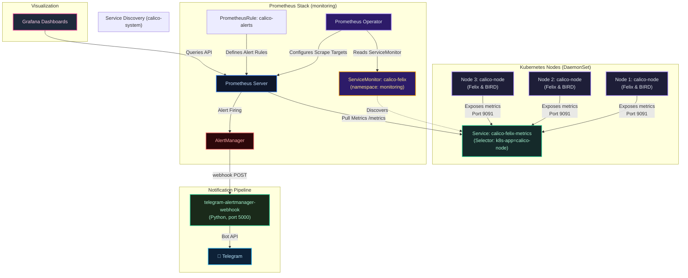

# Lab Tập 23: Calico Observability — Prometheus + Grafana + AlertManager + Telegram

Tập này dựng stack observability đầy đủ cho Calico: Felix metrics → Prometheus → Grafana → AlertManager → Telegram alerts.

### Sơ đồ kiến trúc giám sát: Calico Observability Flow



---

## Yêu cầu chuẩn bị

- Cụm K8s với Calico đang chạy (từ Tập 9+)
- Ít nhất 4GB RAM trống trên cluster
- Kết nối internet để pull Helm chart và images
- **Tài khoản Telegram** (để nhận alert thực tế)

---

## Thực nghiệm 1: Bật Felix metrics và verify

**SSH vào `controlplane`:**

```bash
multipass shell controlplane
```

1. Bật Felix metrics endpoint:
   ```bash
   kubectl patch felixconfiguration default \
     --type merge \
     --patch '{"spec": {"prometheusMetricsEnabled": true}}'
   ```

2. Verify FelixConfiguration:
   ```bash
   kubectl get felixconfiguration default -o yaml | grep prometheus
   # prometheusMetricsEnabled: true
   ```

3. Lưu IP worker1 (dùng nhiều lần trong lab):
   ```bash
   export WORKER1_IP=$(multipass info worker1 | grep IPv4 | awk '{print $2}')
   echo "Worker1 IP: $WORKER1_IP"
   ```

4. Chờ Felix reload (~10 giây) rồi scrape thủ công:
   ```bash
   curl -s http://$WORKER1_IP:9091/metrics | grep -E "^felix_|^bgp_" | head -15
   # felix_active_local_endpoints 2
   # felix_denied_packets_total{...} 0
   # felix_iptables_restore_calls_total 5
   # bgp_peers{status="Established",ip_version="IPv4"} 2
   ```
   *Nhận xét:* Felix expose metrics dạng Prometheus text format trên port 9091 mỗi node.

---

## Thực nghiệm 2: Chuẩn bị Telegram Bot

**Bước này thực hiện trên máy local (không cần SSH):**

1. Mở Telegram, chat với **@BotFather**:
   ```
   /newbot
   → Đặt tên hiển thị: Calico Lab Alerts
   → Đặt username: calico_lab_alerts_bot (phải kết thúc bằng _bot)
   → BotFather trả về token dạng: 7123456789:AAHdqTcvCH1vGWJxfSeofSs4tDqowbqUIiZE
   ```

2. **Trên `controlplane`** — lưu token vào biến môi trường:
   ```bash
   export TELEGRAM_BOT_TOKEN="7123456789:AAHdqTcvCH1vGWJxfSeofSs4tDqowbqUIiZE"
   # Thay bằng token thực của bạn
   ```

3. Lấy CHAT_ID:
   ```bash
   # Bước 1: Gửi bất kỳ tin nhắn nào cho bot trong Telegram app (ví dụ: "hello")
   # Bước 2: Lấy chat_id từ API:
   curl -s "https://api.telegram.org/bot${TELEGRAM_BOT_TOKEN}/getUpdates" \
     | python3 -c "
   import sys, json
   data = json.load(sys.stdin)
   if data['result']:
       print(data['result'][0]['message']['chat']['id'])
   else:
       print('Chưa có message! Hãy gửi tin nhắn cho bot trước.')
   "
   export TELEGRAM_CHAT_ID="123456789"  # Thay bằng số hiện ra
   ```

4. Test gửi message từ `controlplane`:
   ```bash
   curl -s -X POST "https://api.telegram.org/bot${TELEGRAM_BOT_TOKEN}/sendMessage" \
     -H "Content-Type: application/json" \
     -d "{\"chat_id\": \"${TELEGRAM_CHAT_ID}\", \"text\": \"✅ Calico Lab bot kết nối thành công từ cluster!\", \"parse_mode\": \"Markdown\"}" \
     | python3 -m json.tool | grep '"ok"'
   # "ok": true  ← Bot hoạt động
   ```
   *Kiểm tra Telegram:* Phải thấy message ngay lập tức.

---

## Thực nghiệm 3: Cài Helm và deploy kube-prometheus-stack

**Trên `controlplane`:**

1. Cài Helm nếu chưa có:
   ```bash
   which helm || curl https://raw.githubusercontent.com/helm/helm/main/scripts/get-helm-3 | bash
   helm version
   ```

2. Thêm Prometheus community repo:
   ```bash
   helm repo add prometheus-community https://prometheus-community.github.io/helm-charts
   helm repo update
   ```

3. Tạo values file với AlertManager config trỏ về Telegram webhook:
   ```bash
   cat > /tmp/monitoring-values.yaml <<'EOF'
   grafana:
     adminPassword: admin123
     resources:
       requests:
         memory: 128Mi
       limits:
         memory: 256Mi

   prometheus:
     prometheusSpec:
       serviceMonitorSelectorNilUsesHelmValues: false
       resources:
         requests:
           memory: 512Mi
         limits:
           memory: 1Gi

   alertmanager:
     alertmanagerSpec:
       resources:
         requests:
           memory: 64Mi
     config:
       global:
         resolve_timeout: 5m
       route:
         group_by: ['alertname', 'node']
         group_wait: 10s
         group_interval: 30s
         repeat_interval: 2h
         receiver: telegram
       receivers:
       - name: telegram
         webhook_configs:
         - url: http://telegram-alertmanager-webhook.monitoring.svc.cluster.local:5000
           send_resolved: true
   EOF
   ```

4. Deploy stack (mất 3-5 phút):
   ```bash
   helm install monitoring prometheus-community/kube-prometheus-stack \
     --namespace monitoring --create-namespace \
     -f /tmp/monitoring-values.yaml
   ```

5. Theo dõi pods:
   ```bash
   watch kubectl -n monitoring get pods
   # Chờ tất cả Running/Completed:
   # monitoring-grafana-xxx                  3/3   Running
   # monitoring-kube-prometheus-prometheus-0  2/2   Running
   # alertmanager-monitoring-kube-prom-...   2/2   Running
   # monitoring-kube-state-metrics-xxx       1/1   Running
   # monitoring-prometheus-node-exporter-xxx  1/1   Running  (mỗi node)
   ```

---

## Thực nghiệm 4: Deploy Telegram Webhook Receiver

**Trên `controlplane`:**

Webhook này là một Python server đơn giản nhận POST từ AlertManager và gửi message lên Telegram Bot API. Dùng Python stdlib (không cần pip install thêm gì).

1. Tạo Secret chứa credentials (không hardcode vào YAML):
   ```bash
   kubectl create secret generic telegram-credentials \
     --namespace monitoring \
     --from-literal=bot-token="${TELEGRAM_BOT_TOKEN}" \
     --from-literal=chat-id="${TELEGRAM_CHAT_ID}"

   kubectl -n monitoring get secret telegram-credentials
   # telegram-credentials   Opaque   2   5s
   ```

2. Deploy webhook receiver (ConfigMap + Deployment + Service):
   ```bash
   kubectl apply -f - <<'EOF'
   ---
   apiVersion: v1
   kind: ConfigMap
   metadata:
     name: telegram-webhook-script
     namespace: monitoring
   data:
     app.py: |
       import os, json
       from http.server import HTTPServer, BaseHTTPRequestHandler
       import urllib.request

       BOT_TOKEN = os.environ['TELEGRAM_BOT_TOKEN']
       CHAT_ID   = os.environ['TELEGRAM_CHAT_ID']

       def send_telegram(text):
           body = json.dumps({
               "chat_id": CHAT_ID,
               "text": text,
               "parse_mode": "Markdown"
           }).encode()
           req = urllib.request.Request(
               f"https://api.telegram.org/bot{BOT_TOKEN}/sendMessage",
               data=body,
               headers={"Content-Type": "application/json"}
           )
           try:
               urllib.request.urlopen(req, timeout=10)
           except Exception as e:
               print(f"[ERROR] Telegram API: {e}")

       class AlertHandler(BaseHTTPRequestHandler):
           def do_POST(self):
               length = int(self.headers.get('Content-Length', 0))
               body   = json.loads(self.rfile.read(length))
               for alert in body.get('alerts', []):
                   status   = alert['status'].upper()
                   name     = alert['labels'].get('alertname', 'Unknown')
                   node     = alert['labels'].get('node',
                              alert['labels'].get('instance', 'N/A'))
                   severity = alert['labels'].get('severity', '?')
                   summary  = alert.get('annotations', {}).get('summary', name)
                   emoji    = '🔴' if status == 'FIRING' else '✅'
                   msg = (
                       f"{emoji} *\\[{status}\\]* `{name}`\n"
                       f"*Severity:* {severity}\n"
                       f"*Node:* `{node}`\n"
                       f"{summary}"
                   )
                   print(f"[{status}] {name} → {node}")
                   send_telegram(msg)
               self.send_response(200)
               self.end_headers()
               self.wfile.write(b'ok')

           def log_message(self, fmt, *args):
               pass

       print("[INFO] Telegram webhook receiver listening on :5000")
       HTTPServer(('0.0.0.0', 5000), AlertHandler).serve_forever()
   ---
   apiVersion: apps/v1
   kind: Deployment
   metadata:
     name: telegram-alertmanager-webhook
     namespace: monitoring
   spec:
     replicas: 1
     selector:
       matchLabels:
         app: telegram-alertmanager-webhook
     template:
       metadata:
         labels:
           app: telegram-alertmanager-webhook
       spec:
         containers:
         - name: webhook
           image: python:3.11-slim
           command: ["python3", "/app/app.py"]
           env:
           - name: TELEGRAM_BOT_TOKEN
             valueFrom:
               secretKeyRef:
                 name: telegram-credentials
                 key: bot-token
           - name: TELEGRAM_CHAT_ID
             valueFrom:
               secretKeyRef:
                 name: telegram-credentials
                 key: chat-id
           ports:
           - containerPort: 5000
           volumeMounts:
           - name: script
             mountPath: /app
         volumes:
         - name: script
           configMap:
             name: telegram-webhook-script
   ---
   apiVersion: v1
   kind: Service
   metadata:
     name: telegram-alertmanager-webhook
     namespace: monitoring
   spec:
     selector:
       app: telegram-alertmanager-webhook
     ports:
     - port: 5000
       targetPort: 5000
   EOF
   ```

3. Verify webhook đang chạy và log bình thường:
   ```bash
   kubectl -n monitoring wait --for=condition=Ready \
     pod -l app=telegram-alertmanager-webhook --timeout=120s

   kubectl -n monitoring logs -l app=telegram-alertmanager-webhook
   # [INFO] Telegram webhook receiver listening on :5000
   ```

4. Test webhook thủ công bằng cách giả lập payload từ AlertManager:
   ```bash
   WEBHOOK_POD=$(kubectl -n monitoring get pod \
     -l app=telegram-alertmanager-webhook -o jsonpath='{.items[0].metadata.name}')

   kubectl -n monitoring exec -it $WEBHOOK_POD -- python3 -c "
   import urllib.request, json
   payload = json.dumps({
     'alerts': [{
       'status': 'firing',
       'labels': {'alertname': 'TestAlert', 'severity': 'warning', 'node': 'controlplane'},
       'annotations': {'summary': 'Test message từ webhook receiver'}
     }]
   }).encode()
   req = urllib.request.Request('http://localhost:5000', data=payload,
         headers={'Content-Type': 'application/json'})
   print(urllib.request.urlopen(req).read())
   "
   # Kiểm tra Telegram: phải thấy message 🔴 [FIRING] TestAlert
   ```

---

## Thực nghiệm 5: Cấu hình ServiceMonitor và Service cho Felix

**Trên `controlplane`:**

1. Tạo Service expose Felix metrics trong namespace `calico-system`:
   ```bash
   kubectl apply -n calico-system -f - <<'EOF'
   apiVersion: v1
   kind: Service
   metadata:
     name: calico-felix-metrics
     labels:
       k8s-app: calico-node
   spec:
     selector:
       k8s-app: calico-node
     ports:
     - name: metrics
       port: 9091
       targetPort: 9091
   EOF
   ```

2. Tạo ServiceMonitor trong namespace `monitoring`:
   ```bash
   kubectl apply -n monitoring -f - <<'EOF'
   apiVersion: monitoring.coreos.com/v1
   kind: ServiceMonitor
   metadata:
     name: calico-felix
     namespace: monitoring
     labels:
       release: monitoring
   spec:
     namespaceSelector:
       matchNames:
       - calico-system
     selector:
       matchLabels:
         k8s-app: calico-node
     endpoints:
     - port: metrics
       interval: 15s
       path: /metrics
   EOF
   ```

3. Verify Service và ServiceMonitor:
   ```bash
   kubectl -n calico-system get svc calico-felix-metrics
   # calico-felix-metrics   ClusterIP   10.x.x.x   <none>   9091/TCP

   kubectl -n monitoring get servicemonitor calico-felix
   # calico-felix   ... 10s
   ```

4. Port-forward Prometheus và verify target status:
   ```bash
   kubectl -n monitoring port-forward svc/monitoring-kube-prometheus-prometheus 9090:9090 &
   PROM_PF_PID=$!
   echo "Prometheus PID: $PROM_PF_PID"

   # Chờ ~30 giây để Prometheus reload config
   sleep 30

   # Verify target calico-felix đang UP (tất cả 3 nodes):
   curl -s 'http://localhost:9090/api/v1/targets' \
     | python3 -c "
   import sys, json
   data = json.load(sys.stdin)
   for t in data['data']['activeTargets']:
       if 'calico' in t.get('labels', {}).get('job', ''):
           print(t['labels']['instance'], '->', t['health'])
   "
   # 10.x.x.x:9091 -> up
   # 10.x.x.x:9091 -> up
   # 10.x.x.x:9091 -> up
   ```
   *Nhận xét:* `serviceMonitorSelectorNilUsesHelmValues=false` cho phép Prometheus pickup ServiceMonitor từ bất kỳ namespace nào.

---

## Thực nghiệm 6: Query metrics trong Prometheus

**Trên `controlplane`:**

1. Query BGP sessions đang UP:
   ```bash
   curl -s 'http://localhost:9090/api/v1/query?query=bgp_peers%7Bstatus%3D%22Established%22%7D' \
     | python3 -c "
   import sys, json
   r = json.load(sys.stdin)
   for m in r['data']['result']:
       print(m['metric']['instance'], '=', m['value'][1], 'established BGP peers')
   "
   # 10.x.x.1:9091 = 2 established BGP peers   (controlplane)
   # 10.x.x.2:9091 = 2 established BGP peers   (worker1)
   # 10.x.x.3:9091 = 2 established BGP peers   (worker2)
   ```

2. Query active endpoints per node:
   ```bash
   curl -s 'http://localhost:9090/api/v1/query?query=felix_active_local_endpoints' \
     | python3 -c "
   import sys, json
   r = json.load(sys.stdin)
   for m in r['data']['result']:
       print(m['metric']['instance'], '->', m['value'][1], 'endpoints')
   "
   ```

3. Query policy calculation time p99:
   ```bash
   curl -s 'http://localhost:9090/api/v1/query?query=histogram_quantile(0.99%2Cfelix_calc_graph_update_time_seconds_bucket)' \
     | python3 -c "
   import sys, json
   r = json.load(sys.stdin)
   for m in r['data']['result']:
       print(m['metric'].get('instance','?'), '-> p99:', m['value'][1], 's')
   "
   # Bình thường: < 0.01s
   ```

   *Browser:* `http://localhost:9090` → Graph → paste PromQL query để xem graph trực quan.

---

## Thực nghiệm 7: Tạo Alert rules

**Trên `controlplane`:**

1. Tạo PrometheusRule với 3 alerts:
   ```bash
   kubectl apply -n monitoring -f - <<'EOF'
   apiVersion: monitoring.coreos.com/v1
   kind: PrometheusRule
   metadata:
     name: calico-alerts
     namespace: monitoring
     labels:
       release: monitoring
   spec:
     groups:
     - name: calico.rules
       rules:
       - alert: CalicoBGPSessionDown
         expr: bgp_peers{status="Established"} < 1
         for: 2m
         labels:
           severity: critical
         annotations:
           summary: "BGP session down trên {{ $labels.instance }}"
           description: "Không có established BGP peers trong 2+ phút"

       - alert: CalicoHighDeniedPackets
         expr: rate(felix_denied_packets_total[1m]) > 0.5
         for: 10s
         labels:
           severity: warning
         annotations:
           summary: "Packet drop rate cao trên {{ $labels.instance }}"
           description: "{{ $value | humanize }} packets/sec bị NetworkPolicy DROP"

       - alert: CalicoEndpointDrop
         expr: felix_active_local_endpoints < 1
         for: 5m
         labels:
           severity: warning
         annotations:
           summary: "Không có active endpoints trên {{ $labels.instance }}"
           description: "Node {{ $labels.instance }} không có Calico endpoints trong 5+ phút"
   EOF
   ```

2. Verify rules được Prometheus load:
   ```bash
   sleep 15  # Chờ reload

   curl -s 'http://localhost:9090/api/v1/rules' \
     | python3 -c "
   import sys, json
   r = json.load(sys.stdin)
   for group in r['data']['groups']:
       if 'calico' in group['name']:
           for rule in group['rules']:
               print(f\"  {rule['name']}: {rule.get('state', 'ok')}\")
   "
   # CalicoBGPSessionDown: inactive
   # CalicoHighDeniedPackets: inactive
   # CalicoEndpointDrop: inactive
   ```

---

## Thực nghiệm 8: Trigger alert và xem Telegram notification

**Trên `controlplane`:**

### Phần A: Setup môi trường

```bash
kubectl create namespace production 2>/dev/null || true

# Default deny toàn bộ ingress và egress
kubectl apply -n production -f - <<'EOF'
apiVersion: networking.k8s.io/v1
kind: NetworkPolicy
metadata:
  name: default-deny
spec:
  podSelector: {}
  policyTypes:
  - Ingress
  - Egress
EOF

# Target pod: nginx (ổn định, không crash khi bị deny)
kubectl run target -n production --image=nginx --port=80
# Attacker pod
kubectl run attacker -n production --image=nicolaka/netshoot -- sleep infinity

kubectl -n production wait --for=condition=Ready pod/target pod/attacker --timeout=90s

export TARGET_IP=$(kubectl -n production get pod target -o jsonpath='{.status.podIP}')
echo "Target IP: $TARGET_IP"
```

### Phần B: Baseline — xem denied_packets trước

```bash
curl -s http://$WORKER1_IP:9091/metrics | grep felix_denied_packets_total
# felix_denied_packets_total{...} 0   ← baseline
```

### Phần C: Generate traffic bị deny liên tục

Cần duy trì > 0.5 packets/sec trong ít nhất 10 giây để alert FIRING. Script chạy ~5 req/sec trong 90 giây:

```bash
kubectl -n production exec attacker -- bash -c "
echo 'Bắt đầu generate denied traffic (~5 req/sec trong 90s)...'
END=\$((SECONDS+90))
COUNT=0
while [ \$SECONDS -lt \$END ]; do
  for i in 1 2 3 4 5; do
    nc -zv -w 1 ${TARGET_IP} 80 &>/dev/null &
  done
  COUNT=\$((COUNT+5))
  sleep 1
done
wait
echo \"Xong! Tổng: \$COUNT connection attempts\"
" &

TRAFFIC_PID=$!
echo "Traffic generator PID: $TRAFFIC_PID"
```

### Phần D: Theo dõi metrics tăng

```bash
# Terminal 1: watch denied packets tăng
watch -n 3 "curl -s http://$WORKER1_IP:9091/metrics | grep felix_denied_packets_total"

# Terminal 2: watch alert state
watch -n 5 "curl -s 'http://localhost:9090/api/v1/alerts' \
  | python3 -c \"
import sys,json; r=json.load(sys.stdin)
alerts = r['data']['alerts']
calico = [a for a in alerts if 'Calico' in a['labels'].get('alertname','')]
if calico:
    for a in calico: print(a['labels']['alertname'], '->', a['state'])
else:
    print('Chưa có Calico alerts')
\""
```

**Timeline kỳ vọng:**
```
T+0s:   Traffic bắt đầu, denied_packets tăng
T+15s:  Prometheus scrape → CalicoHighDeniedPackets = PENDING
T+25s:  Alert PENDING → FIRING (for: 10s thỏa mãn)
T+30s:  AlertManager gửi POST đến webhook
T+35s:  📱 Telegram nhận message!
```

### Phần E: Verify toàn pipeline

```bash
# 1. Xem alert FIRING trong Prometheus
curl -s 'http://localhost:9090/api/v1/alerts' \
  | python3 -c "
import sys,json; r=json.load(sys.stdin)
for a in r['data']['alerts']:
    if 'Calico' in a['labels'].get('alertname',''):
        print('ALERT:', a['labels']['alertname'])
        print('STATE:', a['state'])
        print('VALUE:', a.get('value',''))
        print()
"

# 2. Xem log webhook receiver
kubectl -n monitoring logs -l app=telegram-alertmanager-webhook --tail=20
# [FIRING] CalicoHighDeniedPackets → 10.x.x.2:9091

# 3. Kiểm tra Telegram
# Phải thấy message dạng:
# 🔴 [FIRING] `CalicoHighDeniedPackets`
# Severity: warning
# Node: `10.x.x.2:9091`
# Packet drop rate cao trên 10.x.x.2:9091
```

### Phần F: Xem RESOLVED khi traffic dừng

Sau khi script traffic chạy xong (~90s), chờ thêm vài phút:

```bash
# AlertManager sẽ gửi resolved notification
# Telegram nhận:
# ✅ [RESOLVED] `CalicoHighDeniedPackets`
# Severity: warning
# ...
```

---

## Thực nghiệm 9: Truy cập Grafana và import dashboard

**Trên `controlplane`:**

1. Port-forward Grafana:
   ```bash
   kubectl -n monitoring port-forward svc/monitoring-grafana 3000:80 &
   GRAFANA_PF_PID=$!
   echo "Grafana PID: $GRAFANA_PF_PID"
   # Browser: http://localhost:3000
   # Login: admin / admin123
   ```

2. Verify Prometheus datasource tự động configured:
   ```bash
   curl -s -u admin:admin123 http://localhost:3000/api/datasources \
     | python3 -c "
   import sys,json; ds=json.load(sys.stdin)
   for d in ds: print(d['name'], '->', d['url'], '->', d['type'])
   "
   # Prometheus -> http://monitoring-kube-prometheus-prometheus:9090 -> prometheus
   ```

3. Import Calico Felix dashboard từ Grafana.com:
   ```
   Grafana → + → Import → Nhập ID: 12175 → Load
   → Chọn datasource Prometheus → Import
   ```

4. Tạo custom panel BGP Sessions:
   ```
   Grafana → + → New Dashboard → Add visualization
   Query: bgp_peers{status="Established"}
   Legend: {{instance}}
   Title: BGP Sessions per Node
   Visualization: Stat (hiển thị số)
   Save dashboard
   ```

5. Tạo panel Deny Rate:
   ```
   Add visualization
   Query: rate(felix_denied_packets_total[1m])
   Legend: {{instance}}
   Title: Packet Deny Rate (pkts/sec)
   Visualization: Time series
   Alert threshold: 0.5 (vẽ đường ngang)
   Save
   ```

---

## Dọn dẹp

```bash
# Dừng tất cả port-forward background
kill $PROM_PF_PID $GRAFANA_PF_PID 2>/dev/null
pkill -f "port-forward" 2>/dev/null || true

# Giữ lại stack nếu muốn dùng tiếp cho lab sau,
# hoặc xóa để giải phóng tài nguyên:
helm uninstall monitoring -n monitoring
kubectl delete namespace monitoring production

kubectl patch felixconfiguration default \
  --type merge \
  --patch '{"spec": {"prometheusMetricsEnabled": false}}'
```

---

## Tổng kết

1. **Felix tự expose metrics:** Chỉ cần patch `prometheusMetricsEnabled: true` → port 9091 active trên mỗi node.
2. **ServiceMonitor = discovery config:** Prometheus Operator đọc ServiceMonitor → tự config scrape jobs — không sửa Prometheus config thủ công.
3. **AlertManager → Telegram:** Pipeline: Alert FIRING → AlertManager webhook POST → Python receiver → Telegram Bot API. Python stdlib đủ, không cần thư viện ngoài.
4. **4 metrics cốt lõi:** BGP peers established, denied packets rate, active endpoints, policy calc time.
5. **Alert priority:** BGP down (critical, 2m) > High deny rate (warning, 10s) > No endpoints (warning, 5m).
6. **Limitation:** Calico cần tự setup toàn bộ stack. Cilium (Tập 24+) có Hubble built-in — flow visibility không cần setup thêm gì.
