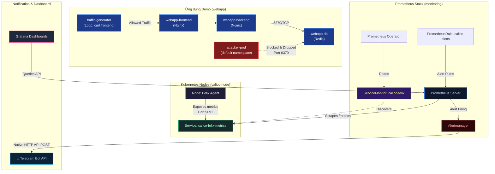
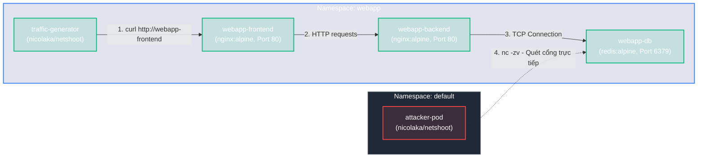
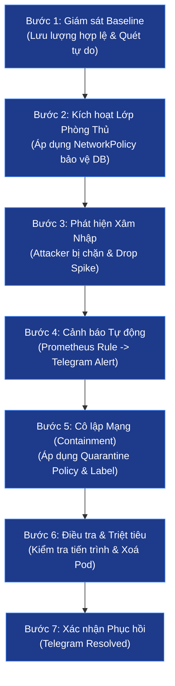

# Lab Tập 23: Calico Observability — Prometheus + Grafana + Alertmanager (Native Telegram Alerts)

Tập này dựng hệ thống giám sát và cảnh báo bảo mật cấp độ doanh nghiệp (Production-grade) cho cụm mạng Calico. Hệ thống sử dụng Prometheus Operator thu thập metrics, Alertmanager tích hợp trực tiếp để gửi cảnh báo Telegram, và Grafana trực quan hóa lưu lượng mạng hợp lệ (Allowed) đối chiếu với lưu lượng bị chặn (Denied).

### Sơ đồ kiến trúc giám sát & Kịch bản thực tế:



---

## Yêu cầu chuẩn bị

- Ít nhất 4GB RAM trống trên cụm lab (hoặc máy host).
- Kết nối Internet để pull Helm chart & docker images.
- **Tài khoản Telegram** và **Telegram Bot** để nhận tin nhắn alert.
- **Cụm Kubernetes 3 Node chạy Calico CNI (Tập 9+)**:

> [!NOTE]
> **Góc nhìn Production - Định kích thước (Sizing) Hệ thống Giám sát:**
> - **Trong môi trường Lab**: Chúng ta cấu hình Prometheus và Grafana với mức tài nguyên tối giản (Prometheus: 512Mi RAM, Grafana: 128Mi RAM, sử dụng `emptyDir` làm ổ cứng tạm thời) để chạy mượt mà trên các máy ảo Multipass có dung lượng RAM hạn chế.
> - **Trong thực tế (Production)**:
>   - **Tài nguyên**: Prometheus Server là hệ thống rất ngốn RAM do lưu trữ Timeseries Database (TSDB) phục vụ truy vấn thời gian thực. Cần cấp tối thiểu **4GB - 32GB RAM** (hoặc hơn) và **2 - 8 CPU** cho Prometheus replica tùy thuộc vào số lượng metrics cào về (Active Series Count).
>   - **Lưu trữ (Persistence)**: Bắt buộc sử dụng `PersistentVolumeClaim` (PVC) gắn với `StorageClass` lưu trữ ngoài hiệu năng cao (như AWS EBS `gp3`, Azure SSD, hoặc Ceph/SAN trong On-premise) có kích thước lớn (**100GB - 2TB**), thiết lập chính sách lưu trữ (Retention Policy) từ **15 - 90 ngày** để phục vụ phân tích xu hướng và sự cố.
  
> [!TIP]
> **Nếu bạn chưa có cụm Lab hoặc muốn dựng mới từ đầu sạch hoàn toàn:**
>
> Chúng tôi đã chuẩn bị sẵn một script tự động hoá toàn bộ quá trình dựng VM, khởi tạo K8s cluster, cài Calico CNI, kích hoạt Felix Metrics và cài Helm chỉ trong **1 cú click**.
>
> Bạn chỉ cần mở Terminal trên máy host, di chuyển đến thư mục bài lab này (`tap-23-calico-observability`) và chạy:
> ```bash
> chmod +x setup-lab.sh
> ./setup-lab.sh
> ```
> *Script sẽ tự động nhận diện cấu trúc chip (ARM vs Intel/AMD) để cấp phát tài nguyên RAM/CPU tối ưu và hoàn thành toàn bộ công đoạn setup. Bạn có thể bỏ qua tất cả các bước thủ công dưới đây và tiến thẳng đến **Thực nghiệm 2**!*
>
> Nếu bạn muốn tự chạy thủ công từng bước để học bản chất, hãy tham khảo các bước bên dưới:
>
> **Bước 1: Khởi tạo 3 máy ảo VM (controlplane, worker1, worker2) trên máy host (Mac/Windows/Linux):**
> ```bash
> # Di chuyển tới thư mục cài đặt lab 00
> cd kubernetes-networking/k8s-lab/tap-00-setup-lab/
> chmod +x setup-lab.sh
> ./setup-lab.sh
> ```
>
> **Bước 2: Khởi tạo cụm Kubernetes trên Node `controlplane`:**
> ```bash
> # SSH vào controlplane
> multipass shell controlplane
> 
> # Khởi tạo Control Plane
> sudo kubeadm init --pod-network-cidr=10.244.0.0/16 --apiserver-advertise-address=$(ip route get 1.1.1.1 | awk '{print $7}')
> 
> # Cấu hình quyền truy cập kubectl
> mkdir -p $HOME/.kube
> sudo cp -i /etc/kubernetes/admin.conf $HOME/.kube/config
> sudo chown $(id -u):$(id -g) $HOME/.kube/config
> ```
> *Lưu ý: Copy câu lệnh `kubeadm join ...` xuất ra ở cuối quá trình khởi tạo.*
>
> **Bước 3: Tham gia các Node Worker vào cụm:**
> Mở terminal mới trên máy host và chạy:
> - SSH vào `worker1` và chạy lệnh join:
>   ```bash
>   multipass shell worker1
>   sudo kubeadm join <APISERVER_IP>:6443 --token <token> --discovery-token-ca-cert-hash sha256:<hash>
>   exit
>   ```
> - SSH vào `worker2` và chạy lệnh join:
>   ```bash
>   multipass shell worker2
>   sudo kubeadm join <APISERVER_IP>:6443 --token <token> --discovery-token-ca-cert-hash sha256:<hash>
>   exit
>   ```
>
> **Bước 4: Cài đặt Calico CNI qua Tigera Operator (Chạy trên `controlplane`):**
> ```bash
> # SSH lại vào controlplane
> multipass shell controlplane
>
> # Cài đặt Operator
> kubectl create -f https://raw.githubusercontent.com/projectcalico/calico/v3.32.0/manifests/tigera-operator.yaml
> 
> # Chờ Tigera Operator Pod sẵn sàng và đăng ký xong các CRD (tránh lỗi mapping CRD)
> kubectl wait --for=condition=Ready pod -l k8s-app=tigera-operator -n tigera-operator --timeout=60s
> 
> # Khởi tạo Custom Resource cho mạng Calico
> kubectl create -f - <<'EOF'
> apiVersion: operator.tigera.io/v1
> kind: Installation
> metadata:
>   name: default
> spec:
>   calicoNetwork:
>     ipPools:
>     - blockSize: 26
>       cidr: 10.244.0.0/16
>       encapsulation: VXLANCrossSubnet
>       natOutgoing: Enabled
>       nodeSelector: all()
> EOF
> 
> # Theo dõi cho đến khi các node chuyển sang Ready
> watch kubectl get nodes
> ```
>
> **Bước 5: Cài đặt công cụ `calicoctl` (Chạy trên `controlplane`):**
> ```bash
> # Xác định kiến trúc chip và tải calicoctl
> ARCH=$(uname -m)
> if [[ "$ARCH" == "x86_64" ]]; then CLI_ARCH="amd64"; else CLI_ARCH="arm64"; fi
> curl -L "https://github.com/projectcalico/calico/releases/download/v3.32.0/calicoctl-linux-${CLI_ARCH}" -o calicoctl
> chmod +x calicoctl
> sudo mv calicoctl /usr/local/bin/
> 
> # Xác minh hoạt động
> calicoctl version
> ```

---

## Thực nghiệm 1: Kích hoạt Felix metrics và kiểm tra thủ công

Theo mặc định, Calico Felix (agent quản lý data plane trên mỗi Node) tắt endpoints xuất metrics để tiết kiệm tài nguyên. Ta cần kích hoạt lên.

**SSH vào `controlplane`:**
```bash
multipass shell controlplane
```

1. Cập nhật FelixConfiguration mặc định của cụm để bật Prometheus metrics:

   *Cách 1: Sử dụng lệnh patch nhanh (Phù hợp cho Lab/Ad-hoc):*
   ```bash
   kubectl patch felixconfiguration default \
     --type merge \
     --patch '{"spec": {"prometheusMetricsEnabled": true}}'
   ```

   *Cách 2: Sử dụng File Manifest khai báo (Bắt buộc trong Production/GitOps):*
   ```bash
   kubectl apply -f - <<'EOF'
   apiVersion: projectcalico.org/v3
   kind: FelixConfiguration
   metadata:
     name: default
   spec:
     prometheusMetricsEnabled: true
   EOF
   ```
   *Giải thích:* Trong môi trường doanh nghiệp, chúng ta tuyệt đối tránh việc gõ lệnh `patch` trực tiếp trên cluster. Thay vào đó, tệp cấu hình YAML khai báo trên sẽ được lưu trữ trong Git repository và triển khai tự động thông qua CI/CD hoặc các công cụ GitOps (như Argo CD/Flux CD) để đảm bảo tính minh bạch và lịch sử thay đổi cấu hình hạ tầng mạng.

2. Xác minh cấu hình đã được áp dụng:
   ```bash
   kubectl get felixconfiguration default -o yaml | grep prometheus
   # Kết quả kỳ vọng: prometheusMetricsEnabled: true
   ```

3. Lấy IP của `worker1` để kiểm tra kết nối:
   ```bash
   export WORKER1_IP=$(kubectl get node worker1 -o jsonpath='{.status.addresses[?(@.type=="InternalIP")].address}')
   echo "Worker1 IP: $WORKER1_IP"
   ```

4. Chờ 10-15 giây để Felix reload cấu hình, sau đó scrape thử metrics thủ công:
   ```bash
   curl -s http://$WORKER1_IP:9091/metrics | grep -E "^felix_|^bgp_" | head -15
   ```
   *Giải thích:* Bạn sẽ thấy các metrics định dạng Prometheus xuất hiện trên cổng `9091`. Ví dụ:
   - `felix_active_local_endpoints`: Số lượng Pod đang chạy trên node đó.
   - `felix_denied_packets_total`: Số lượng gói tin bị chặn bởi NetworkPolicy (hiện tại bằng 0).
   - `bgp_peers{status="Established"}`: Trạng thái kết nối BGP với các Node khác.

---

## Thực nghiệm 2: Tạo Telegram Bot & lấy thông tin cấu hình

Ta sẽ chuẩn bị một kênh cảnh báo bảo mật qua Telegram.

1. Truy cập Telegram trên điện thoại/máy tính và tìm kiếm **@BotFather**.
2. Chat lệnh `/newbot` để tạo bot mới:
   - Đặt tên hiển thị: `Calico Security Alerts`
   - Đặt username: `calico_alerts_yourname_bot` (phải kết thúc bằng `_bot`).
   - Copy mã **Token** được BotFather cấp (ví dụ: `7123456789:AAHdqTcv...`).
3. Nhấp vào link bot vừa tạo và nhấn **Start** hoặc gửi một tin nhắn bất kỳ (ví dụ: `hello`).
4. Trên máy `controlplane`, lưu token này vào biến môi trường:
   ```bash
   export TELEGRAM_BOT_TOKEN="7123456789:AAHdqTcv..." # Điền token thực tế của bạn
   ```

> [!NOTE]
> **Góc nhìn Production:**
> Trong môi trường Lab, chúng ta sử dụng `export` vào biến môi trường tạm thời để shell tự động điền vào tệp cấu hình `values.yaml` ở bước tiếp theo. 
> Tuy nhiên ở môi trường **Production thực tế**, tuyệt đối không dùng shell export hoặc hardcode Token dạng plain-text vào Git. Thay vào đó, bạn nên quản lý theo các chuẩn doanh nghiệp:
> 1. **Kubernetes Secret:** Lưu thông tin bảo mật vào một Secret và tham chiếu động tới cấu hình Alertmanager.
> 2. **Secret Manager / GitOps:** Sử dụng HashiCorp Vault, AWS Secrets Manager tích hợp với **External Secrets Operator** hoặc mã hóa tệp cấu hình bằng **SOPS/Sealed Secrets** trước khi đẩy lên Git.

5. Thực hiện lấy **Chat ID** của bạn để bot biết gửi tin nhắn về đâu:
   ```bash
   curl -s "https://api.telegram.org/bot${TELEGRAM_BOT_TOKEN}/getUpdates" | python3 -c "
   import sys, json
   data = json.load(sys.stdin)
   chat_id = None
   for update in data.get('result', []):
       chat = update.get('message', {}).get('chat') or update.get('my_chat_member', {}).get('chat')
       if chat:
           chat_id = chat['id']
           break
   if chat_id:
       print('CHAT_ID:', chat_id)
   else:
       print('LỖI: Chưa có message! Hãy nhấn Start và gửi tin nhắn bất kỳ cho Bot trước.')
   "
   ```
6. Lưu ID nhận được vào biến môi trường (ví dụ: `123456789`):
   ```bash
   export TELEGRAM_CHAT_ID="123456789" # Thay bằng số Chat ID thực tế
   ```
7. Test thử xem Bot Telegram hoạt động không:
   ```bash
   curl -s -X POST "https://api.telegram.org/bot${TELEGRAM_BOT_TOKEN}/sendMessage" \
     -d "chat_id=${TELEGRAM_CHAT_ID}" \
     -d "text=🔔 Cảnh báo thử nghiệm: Kết nối thành công từ Kubernetes cluster!"
   ```

---

## Thực nghiệm 3: Triển khai kube-prometheus-stack qua Helm

Chúng ta sử dụng Helm để triển khai nhanh toàn bộ Stack giám sát, đồng thời cấu hình trực tiếp Alertmanager sử dụng tính năng gửi Telegram gốc (Native Integration).

1. Cài đặt Helm trên `controlplane` (nếu chưa có):
   ```bash
   which helm || curl https://raw.githubusercontent.com/helm/helm/main/scripts/get-helm-3 | bash
   ```

2. Thêm Prometheus Community repository và cập nhật:
   ```bash
   helm repo add prometheus-community https://prometheus-community.github.io/helm-charts
   helm repo update
   ```

3. Tạo file cấu hình `values.yaml` sử dụng shell substitution để tự động điền Token và Chat ID:
   ```bash
   cat <<EOF > /tmp/monitoring-values.yaml
    grafana:
      adminPassword: admin123
      service:
        type: NodePort
        nodePort: 32300
      sidecar:
        dashboards:
          enabled: true
          label: grafana_dashboard
          labelValue: "1"
      resources:
        requests:
          memory: 128Mi
        limits:
          memory: 256Mi

    prometheus:
      service:
        type: NodePort
        nodePort: 30090
      prometheusSpec:
        serviceMonitorSelectorNilUsesHelmValues: false
        resources:
          requests:
            memory: 512Mi
          limits:
            memory: 1Gi

   alertmanager:
     alertmanagerSpec:
       resources:
         requests:
           memory: 64Mi
     config:
       global:
         resolve_timeout: 5m
       route:
         group_by: ['alertname', 'instance']
         group_wait: 10s
         group_interval: 30s
         repeat_interval: 1h
         receiver: telegram
       receivers:
       - name: telegram
         telegram_configs:
         - bot_token: "${TELEGRAM_BOT_TOKEN}"
           chat_id: ${TELEGRAM_CHAT_ID}
           send_resolved: true
           parse_mode: HTML
           message: |
             {{ if eq .Status "firing" }}🔴 <b>[ALARM: FIRING] Calico Security Triggered</b>
             {{ else }}✅ <b>[ALARM: RESOLVED] Network Restored</b>
             {{ end }}
             <b>Tên cảnh báo:</b> <code>{{ .CommonLabels.alertname }}</code>
             <b>Mức độ nguy hại:</b> <code>{{ .CommonLabels.severity }}</code>
             <b>Đối tượng bị ảnh hưởng:</b> <code>{{ .CommonLabels.instance }}</code>
             
             <b>Mô tả chi tiết:</b>
             <i>{{ .CommonAnnotations.description }}</i>
   EOF
   ```

4. Thực hiện cài đặt Prometheus Operator stack trong namespace `monitoring`:
   ```bash
   helm install monitoring prometheus-community/kube-prometheus-stack \
     --namespace monitoring --create-namespace \
     -f /tmp/monitoring-values.yaml
   ```

5. Theo dõi cho đến khi các Pod chạy trạng thái `Running` (mất khoảng 2-3 phút):
   ```bash
   kubectl get pods -n monitoring
   ```

> [!NOTE]
> **Góc nhìn Production: Triển khai GitOps & Bảo mật Secrets**
>
> 1. **Triển khai GitOps (Argo CD Blueprint)**:
>    Trong môi trường thực tế, việc cài đặt thủ công bằng lệnh `helm install` trên máy cá nhân bị cấm để tránh "cấu hình trôi dạt" (Configuration Drift). Đội ngũ vận hành khai báo qua công cụ GitOps (như **Argo CD**). Dưới đây là tệp tin mẫu `Application` cấu hình đồng bộ tự động:
>    ```yaml
>    apiVersion: argoproj.io/v1alpha1
>    kind: Application
>    metadata:
>      name: monitoring-stack
>      namespace: argocd
>    spec:
>      project: default
>      source:
>        chart: kube-prometheus-stack
>        repoURL: https://prometheus-community.github.io/helm-charts
>        targetRevision: 61.3.0 # Luôn khóa cứng phiên bản Helm Chart để tránh lỗi không tương thích
>        helm:
>          valueFiles:
>          - values.yaml
>      destination:
>        server: https://kubernetes.default.svc
>        namespace: monitoring
>      syncPolicy:
>        automated:
>          prune: true
>          selfHeal: true
>    ```
>
> 2. **Bảo mật Credentials qua AlertmanagerConfig CRD & Kubernetes Secrets**:
>    Hardcode mã token Telegram dạng plain-text vào `values.yaml` và lưu lên Git là một lỗ hổng bảo mật nghiêm trọng. Trong sản xuất, chúng ta sử dụng Custom Resource **`AlertmanagerConfig`** kết hợp với **Kubernetes Secret**:
>    - **Bước A: Khởi tạo Secret lưu thông tin bảo mật nhạy cảm (Được mã hóa qua Vault/SOPS trước khi đẩy lên Git):**
>      ```yaml
>      apiVersion: v1
>      kind: Secret
>      metadata:
>        name: alertmanager-telegram-secret
>        namespace: monitoring
>      type: Opaque
>      stringData:
>        token: "7123456789:AAHdqTcv..." # Điền token thật
>      ```
>    - **Bước B: Khai báo tài nguyên AlertmanagerConfig trỏ động tới Secret:**
>      ```yaml
>      apiVersion: monitoring.coreos.com/v1alpha1
>      kind: AlertmanagerConfig
>      metadata:
>        name: telegram-security-alerts
>        namespace: monitoring
>        labels:
>          release: monitoring # Label để Prometheus Operator tự động nạp cấu hình
>      spec:
>        route:
>          groupBy: ['alertname', 'instance']
>          groupWait: 30s
>          groupInterval: 5m
>          repeatInterval: 12h
>          receiver: telegram-secops
>        receivers:
>        - name: telegram-secops
>          telegramConfigs:
>          - botToken:
>              name: alertmanager-telegram-secret
>              key: token
>            chatId: -1001234567890 # Trong sản xuất thường bắn cảnh báo về Group Chat ID của SecOps
>            sendResolved: true
>            parseMode: HTML
>            message: |
>              {{ if eq .Status "firing" }}🔴 <b>[ALARM: FIRING] Calico Security Triggered</b>
>              {{ else }}✅ <b>[ALARM: RESOLVED] Network Restored</b>
>              {{ end }}
>              <b>Tên cảnh báo:</b> <code>{{ .CommonLabels.alertname }}</code>
>              <b>Mức độ nguy hại:</b> <code>{{ .CommonLabels.severity }}</code>
>              <b>Mô tả:</b> <i>{{ .CommonAnnotations.description }}</i>
>      ```

---

## Thực nghiệm 4: Triển khai Ứng dụng Demo (Microservices) & Traffic Generator

Để mô phỏng môi trường sản xuất thực tế, ta triển khai một ứng dụng 3 tầng đơn giản trong namespace `webapp` và thiết lập giả lập traffic.

### Mô hình luồng dữ liệu của ứng dụng Demo:



1. Tạo namespace và deploy các pod ứng dụng:
   ```bash
   kubectl create namespace webapp

   kubectl apply -n webapp -f - <<'EOF'
   apiVersion: apps/v1
   kind: Deployment
   metadata:
     name: webapp-db
   spec:
     replicas: 1
     selector:
       matchLabels:
         app: webapp-db
     template:
       metadata:
         labels:
           app: webapp-db
       spec:
         containers:
         - name: redis
           image: redis:alpine
           ports:
           - containerPort: 6379
           resources:
             requests:
               cpu: 50m
               memory: 64Mi
             limits:
               cpu: 100m
               memory: 128Mi
   ---
   apiVersion: v1
   kind: Service
   metadata:
     name: webapp-db
   spec:
     ports:
     - port: 6379
       targetPort: 6379
     selector:
       app: webapp-db
   ---
   apiVersion: apps/v1
   kind: Deployment
   metadata:
     name: webapp-backend
   spec:
     replicas: 1
     selector:
       matchLabels:
         app: webapp-backend
     template:
       metadata:
         labels:
           app: webapp-backend
       spec:
         containers:
         - name: backend
           image: nginx:alpine
           ports:
           - containerPort: 80
           resources:
             requests:
               cpu: 50m
               memory: 32Mi
             limits:
               cpu: 100m
               memory: 64Mi
   ---
   apiVersion: v1
   kind: Service
   metadata:
     name: webapp-backend
   spec:
     ports:
     - port: 80
       targetPort: 80
     selector:
       app: webapp-backend
   ---
   apiVersion: apps/v1
   kind: Deployment
   metadata:
     name: webapp-frontend
   spec:
     replicas: 1
     selector:
       matchLabels:
         app: webapp-frontend
     template:
       metadata:
         labels:
           app: webapp-frontend
       spec:
         containers:
         - name: frontend
           image: nginx:alpine
           ports:
           - containerPort: 80
           resources:
             requests:
               cpu: 50m
               memory: 32Mi
             limits:
               cpu: 100m
               memory: 64Mi
   ---
   apiVersion: v1
   kind: Service
   metadata:
     name: webapp-frontend
   spec:
     ports:
     - port: 80
       targetPort: 80
     selector:
       app: webapp-frontend
   EOF
   ```

2. Tạo **Traffic Generator** gửi yêu cầu hợp lệ liên tục từ Frontend sang Backend (giả lập người dùng thật):
   ```bash
   kubectl apply -n webapp -f - <<'EOF'
   apiVersion: apps/v1
   kind: Deployment
   metadata:
     name: traffic-generator
   spec:
     replicas: 1
     selector:
       matchLabels:
         app: traffic-generator
     template:
       metadata:
         labels:
           app: traffic-generator
       spec:
         containers:
         - name: generator
           image: nicolaka/netshoot
           resources:
             requests:
               cpu: 20m
               memory: 32Mi
             limits:
               cpu: 50m
               memory: 64Mi
           command: ["/bin/sh", "-c"]
           args:
           - |
             echo "Bắt đầu sinh healthy traffic..."
             while true; do
               curl -s -o /dev/null -w "%{http_code}" http://webapp-frontend
               echo " -> Truy cập Frontend thành công"
               sleep 0.5
             done
   EOF
   ```

3. Tạo **Attacker Pod** (Rogue Scanner) ở namespace `default` liên tục cố gắng truy cập trái phép cổng Database của ứng dụng:
   ```bash
   kubectl run attacker-pod -n default --image=nicolaka/netshoot -- /bin/sh -c "
   echo 'Bắt đầu scan cổng DB...'
   while true; do
     nc -zv -w 1 webapp-db.webapp 6379
     sleep 0.2
   done
   "
   ```

4. Theo dõi log của `attacker-pod`:
   ```bash
   kubectl logs attacker-pod -f
   # Bạn sẽ thấy: webapp-db.webapp (10.x.x.x:6379) open!
   # Hiện tại chưa áp dụng Network Policy bảo vệ nên kết nối vẫn THÀNH CÔNG.
   ```

---

## Thực nghiệm 5: Cấu hình Service & ServiceMonitor cho Felix

Ta cần chỉ ra cho Prometheus biết cách tìm kiếm và kéo dữ liệu metrics từ endpoint của Calico Felix trên các node.

1. Tạo một Service đại diện cho Felix metrics trong namespace `calico-system` (nơi chứa các thành phần Calico):
   ```bash
   kubectl apply -n calico-system -f - <<'EOF'
   apiVersion: v1
   kind: Service
   metadata:
     name: calico-felix-metrics
     labels:
       k8s-app: calico-node
   spec:
     selector:
       k8s-app: calico-node
     ports:
     - name: metrics
       port: 9091
       targetPort: 9091
   EOF
   ```

2. Tạo ServiceMonitor trong namespace `monitoring` để Prometheus Operator tự động nạp cấu hình cào dữ liệu (scrape):
   ```bash
   kubectl apply -n monitoring -f - <<'EOF'
   apiVersion: monitoring.coreos.com/v1
   kind: ServiceMonitor
   metadata:
     name: calico-felix
     namespace: monitoring
     labels:
       release: monitoring
   spec:
     namespaceSelector:
       matchNames:
       - calico-system
     selector:
       matchLabels:
         k8s-app: calico-node
     endpoints:
     - port: metrics
       interval: 15s
       path: /metrics
   EOF
   ```

> [!NOTE]
> **Góc nhìn Production: Cơ chế Tự động Phát hiện (Auto-Discovery) qua Custom Resources**
> 
> Trong mô hình giám sát truyền thống, mỗi khi thêm một ứng dụng mới cần cào metrics, kỹ sư vận hành phải sửa thủ công tệp cấu hình tĩnh `prometheus.yml` và reload lại Prometheus Server. Trong môi trường Kubernetes lớn, cách làm này không khả thi.
> 
> **Prometheus Operator** giải quyết triệt để vấn đề này qua cơ chế tự động phát hiện dựa trên nhãn:
> 1. **Label Selector Matching**: Nhãn `release: monitoring` gắn trên `ServiceMonitor` đóng vai trò là điều kiện lọc. Prometheus Operator liên tục theo dõi (watch) Kubernetes API. Khi phát hiện bất kỳ `ServiceMonitor` nào có nhãn này khớp với cấu hình `serviceMonitorSelector` của Prometheus Instance, nó sẽ tự động cập nhật cấu hình cào và kích hoạt hot-reload Prometheus Server ngay lập tức.
> 2. **Phạm vi bảo mật (Isolation)**:
>    - `namespaceSelector.matchNames`: Giới hạn Prometheus chỉ tìm kiếm Service nằm trong namespace `calico-system` (chứa các pod Calico), tăng cường tính bảo mật và giảm tải hiệu năng quét.
>    - `selector.matchLabels`: Trỏ chính xác đến các Kubernetes Service đại diện có nhãn `k8s-app: calico-node` để lấy danh sách IP endpoints của các node.

3. Kiểm tra xem cấu hình ServiceMonitor đã được Prometheus load thành công chưa qua cổng NodePort `30090`:
   ```bash
   # Chờ 15s để Prometheus Operator nạp lại config
   sleep 15
   
   # Truy vấn API của Prometheus kiểm tra Target calico-felix
   curl -s 'http://localhost:30090/api/v1/targets' \
     | python3 -c "
   import sys, json
   data = json.load(sys.stdin)
   targets = [t for t in data['data']['activeTargets'] if 'calico' in t.get('labels', {}).get('job', '')]
   for t in targets:
       print(t['labels']['instance'], '-> Status:', t['health'])
   "
   # Kết quả kỳ vọng thấy 3 Node của cụm K8s đều báo -> Status: up
   ```

---

## Thực nghiệm 6: Kiểm tra metrics cơ bản trên Prometheus

Chúng ta sẽ thực hiện kiểm tra nhanh dữ liệu metrics thô thu thập được từ Calico trên Prometheus.

1. Truy vấn số lượng phiên BGP đang hoạt động tốt (Established):
   ```bash
   curl -s 'http://localhost:30090/api/v1/query?query=bgp_peers%7Bstatus%3D%22Established%22%7D' \
     | python3 -c "
   import sys, json
   r = json.load(sys.stdin)
   for m in r['data']['result']:
       print(m['metric']['instance'], 'có BGP Peers Established =', m['value'][1])
   "
   ```
   > [!NOTE]
   > **Lưu ý về kết quả rỗng (result: []):**
   > Nếu cụm lab của bạn được dựng bằng cấu hình `VXLAN` hoặc `VXLANCrossSubnet` ở bước chuẩn bị (mặc định), Calico sẽ định tuyến qua đường hầm VXLAN và **tắt định tuyến BGP (BIRD)**. 
   > Do đó, câu lệnh trên ```curl -s 'http://localhost:30090/api/v1/query?query=bgp_peers%7Bstatus%3D%22Established%22%7D'``` sẽ trả về kết quả rỗng `{"status":"success","data":{"resultType":"vector","result":[]}}` (không in ra gì). Bạn có thể kiểm tra bằng lệnh: `sudo calicoctl node status` (sẽ báo BGP chưa cấu hình hoặc disabled). Đây là hiện tượng bình thường!

2. Truy vấn số lượng packet bị chặn hiện tại (đang là 0):
   ```bash
   curl -s 'http://localhost:30090/api/v1/query?query=sum(rate(felix_denied_packets_total%5B1m%5D))' \
     | python3 -c "
   import sys, json
   r = json.load(sys.stdin)
   result = r['data']['result']
   if result:
       print('Tốc độ packet drop hiện tại:', result[0]['value'][1], 'packets/giây')
   else:
       print('Tốc độ packet drop hiện tại: 0 packets/giây (Chưa phát sinh packet drop)')
   "
   ```

---

## Thực nghiệm 7: Cấu hình PrometheusRule để định nghĩa các Cảnh báo bảo mật

Ta định nghĩa các luật cảnh báo thông qua resource `PrometheusRule`. Khi thỏa mãn biểu thức PromQL, Alertmanager sẽ gửi tin nhắn Telegram.

1. Tạo file định nghĩa luật cảnh báo trong namespace `monitoring`:
   ```bash
   kubectl apply -n monitoring -f - <<'EOF'
   apiVersion: monitoring.coreos.com/v1
   kind: PrometheusRule
   metadata:
     name: calico-security-alerts
     namespace: monitoring
     labels:
       release: monitoring
   spec:
     groups:
     - name: calico.security.rules
       rules:
       - alert: CalicoBGPSessionDown
         expr: bgp_peers{status="Established"} < 1
         for: 1m
         labels:
           severity: critical
         annotations:
           summary: "BGP Session Down trên node {{ $labels.instance }}"
           description: "Mất kết nối định tuyến BGP giữa node {{ $labels.instance }} và các node lân cận trong 1+ phút."
           runbook_url: "https://kb.yourdomain.com/ops/calico-bgp-down"

       - alert: CalicoHighDeniedPackets
         expr: sum by (instance) (rate(felix_denied_packets_total[1m])) > 0.5
         for: 10s
         labels:
           severity: warning
         annotations:
           summary: "Lưu lượng bị DROP tăng cao bất thường trên Node {{ $labels.instance }}"
           description: "Có thiết bị mạng hoặc Pod đang quét cổng hoặc cố truy cập trái phép. Tỷ lệ drop: {{ $value | printf \"%.2f\" }} packets/s bị chặn bởi Calico NetworkPolicy."
           runbook_url: "https://kb.yourdomain.com/security/calico-high-denied"
           dashboard_url: "http://192.168.252.67:32300/d/calico-felix"

       - alert: CalicoEndpointDrop
         expr: felix_active_local_endpoints < 1
         for: 5m
         labels:
           severity: warning
         annotations:
           summary: "Không còn Pod hoạt động trên Node {{ $labels.instance }}"
           description: "Node {{ $labels.instance }} không chạy bất cứ ứng dụng (WorkloadEndpoint) nào quản lý bởi Calico trong 5+ phút."
           runbook_url: "https://kb.yourdomain.com/ops/calico-endpoint-drop"
   EOF
   ```

> [!NOTE]
> **Góc nhìn Production: Phòng tránh Alert Fatigue (Kiệt quệ Cảnh báo)**
> Trong môi trường sản xuất lớn, các luật cảnh báo thô sơ như `CalicoEndpointDrop` và `CalicoBGPSessionDown` rất dễ gây ra hiện tượng cảnh báo giả liên tục (Alert Fatigue) nếu không được thiết kế tối ưu:
> 1. **BGP Session Down**: Nếu mạng Calico được cấu hình ở chế độ `VXLAN` (không sử dụng BIRD BGP), metric `bgp_peers` sẽ không trả về dữ liệu (rỗng). Do đó trong thực tế, cảnh báo này chỉ nên được kích hoạt khi hệ thống sử dụng định tuyến BGP thật (ví dụ: Peering trực tiếp với Switch Top-of-Rack trong On-premise Data Center).
> 2. **Endpoint Drop**: Biểu thức `felix_active_local_endpoints < 1` sẽ cảnh báo ngay lập tức nếu một node worker không chạy bất cứ Pod nào (do cụm tự động scale-down, hoặc node đang ở trạng thái bảo trì Cordon/Drain). Để tránh cảnh báo giả, SecOps thường kết hợp thêm nhãn trạng thái Node (`kubernetes_node_ready` từ Kube-State-Metrics) hoặc tính toán tỷ lệ sụt giảm đột ngột thay vì so sánh giá trị tuyệt đối.
> 3. **Tích hợp Runbook & Dashboard URL**: Ở môi trường doanh nghiệp, mỗi cảnh báo luôn đính kèm trường `runbook_url` (hướng dẫn quy trình xử lý sự cố chuẩn SOP) và `dashboard_url` (đường dẫn trỏ thẳng đến biểu đồ giám sát của Node bị lỗi) để Kỹ sư trực ca (SRE/SecOps) có thể phản ứng và điều tra ngay lập tức.

2. Chờ 15 giây, kiểm tra xem Prometheus đã nhận diện các Rules mới chưa thông qua dịch vụ NodePort `30090`:
   ```bash
   curl -s 'http://localhost:30090/api/v1/rules' \
     | python3 -c "
   import sys, json
   r = json.load(sys.stdin)
   for group in r['data']['groups']:
       if 'calico' in group['name']:
           print('Group:', group['name'])
           for rule in group['rules']:
               print(f\"  - Cảnh báo: {rule['name']} | Trạng thái: {rule.get('state', 'ok')}\")
   "
   # Trạng thái sẽ là "inactive" vì chưa có sự cố nào xảy ra.
   ```

---

## Thực nghiệm 8: Giả lập Sự cố Bảo mật & Quy trình Xử lý (Incident Response Simulation)

Trong môi trường Production thực tế, chúng ta không ngồi "watch" log thủ công. Khi có cuộc tấn công hoặc truy cập trái phép bị chặn bởi NetworkPolicy, hệ thống giám sát phải tự động phát hiện thông qua Telemetry (chỉ số mạng) và đẩy cảnh báo tức thì về kênh chat của đội ngũ DevSecOps.

Ta sẽ thực hiện giả lập kịch bản ứng phó sự cố bảo mật (Security Incident Response) theo đúng quy trình 7 bước chuẩn doanh nghiệp:



### Bước 1: Giám sát Baseline (Trước khi áp dụng Policy)

1. Xác nhận **Traffic Generator** (người dùng thật) truy cập thành công Frontend:
   ```bash
   kubectl logs -n webapp -l app=traffic-generator --tail=10
   # Kết quả: -> Truy cập Frontend thành công
   ```

2. Xác nhận **Attacker Pod** (Rogue Scanner) quét cổng Database thành công:
   ```bash
   kubectl exec attacker-pod -n default -- nc -zv -w 2 webapp-db.webapp 6379
   # Kết quả: webapp-db.webapp (10.x.x.x:6379) open!
   ```

### Bước 2: Kích hoạt Lớp Phòng Thủ (Enforce Policy)

Áp dụng chính sách bảo mật Zero-Trust cho tầng Database. Chỉ chấp nhận các kết nối đi từ Pod Backend (`app: webapp-backend`), toàn bộ các kết nối từ namespace khác (bao gồm cả `attacker-pod` ở namespace `default`) sẽ bị chặn đứng:

```bash
kubectl apply -n webapp -f - <<'EOF'
apiVersion: networking.k8s.io/v1
kind: NetworkPolicy
metadata:
  name: restrict-db-access
  namespace: webapp
spec:
  podSelector:
    matchLabels:
      app: webapp-db
  policyTypes:
  - Ingress
  ingress:
  - from:
    - podSelector:
        matchLabels:
          app: webapp-backend
    ports:
    - protocol: TCP
      port: 6379
EOF
```

### Bước 3: Phát hiện Xâm Nhập (Telemetry Drop Spike)

1. Kiểm tra lại kết nối từ **Attacker Pod**:
   ```bash
   kubectl exec attacker-pod -n default -- nc -zv -w 2 webapp-db.webapp 6379
   # Kết quả: nc: connect to webapp-db.webapp (10.x.x.x) port 6379 (tcp) timed out: Operation in progress
   ```
   *Nhận xét:* Gói tin quét của Attacker đã bị Calico Felix chặn đứng hoàn toàn (Silent Drop - Timeout).

2. **Theo dõi Telemetry (Chỉ số mạng):** Do Attacker liên tục thực hiện vòng lặp quét cổng (mỗi 0.2s), số lượng packet bị drop sẽ tích lũy liên tục. Hãy truy vấn thẳng **Counter thô** trên Prometheus Server (qua dịch vụ NodePort `30090` đã mở ở Thực nghiệm 3):
   ```bash
   curl -s 'http://localhost:30090/api/v1/query?query=sum(felix_denied_packets_total)' | python3 -m json.tool
   ```
   *Kết quả:* Trả về giá trị tăng liên tục (ví dụ: `15`, `32`, `55`...). Điều này xác nhận Calico đã bắt đầu ghi nhận dữ liệu xâm nhập trái phép.

### Bước 4: Nhận Cảnh báo Tự động qua Telegram

1. Theo dõi tốc độ packet drop tăng vọt (pkt/s) thời gian thực trên các Node:
   ```bash
   watch -n 2 "curl -s 'http://localhost:30090/api/v1/query?query=sum+by+(instance)+(rate(felix_denied_packets_total%5B1m%5D))' \
     | python3 -c \"import sys,json; r=json.load(sys.stdin); \
       [print(m['metric'].get('instance','?'), '->', round(float(m['value'][1]),3), 'pkt/s') for m in r['data']['result']] \
       or print('Drop rate: 0 pkt/s') if not r['data']['result'] else None\""
   ```
   *Chờ khoảng 30s-45s để hàm rate tích luỹ đủ dữ liệu.* Bạn sẽ thấy chỉ số nhảy vọt vượt qua ngưỡng `0.5 pkt/s`.

2. Kiểm tra trạng thái Alert trong Prometheus:
   ```bash
   curl -s 'http://localhost:30090/api/v1/alerts' \
     | python3 -c "
   import sys, json; data = json.load(sys.stdin)
   alerts = [a for a in data['data']['alerts'] if 'Calico' in a['labels'].get('alertname', '')]
   if alerts:
       for a in alerts:
           print(a['labels']['alertname'], '-> State:', a['state'])
   else:
       print('Chưa có cảnh báo nào.')
   "
   ```
   *Trạng thái sẽ chuyển từ `pending` sang `firing` sau 10 giây.*

3. **Kiểm tra điện thoại / Telegram của bạn:**
   Khi Alert ở trạng thái `firing`, Alertmanager sẽ kích hoạt cơ chế gửi tin nhắn HTML trực tiếp đến Bot Telegram của bạn:
   
   > 🔴 **[ALARM: FIRING] Calico Security Triggered**
   > **Tên cảnh báo:** `CalicoHighDeniedPackets`
   > **Mức độ nguy hại:** `warning`
   > **Đối tượng bị ảnh hưởng:** `10.x.x.x:9091`
   > 
   > **Mô tả chi tiết:**
   > *Có thiết bị mạng hoặc Pod đang quét cổng hoặc cố truy cập trái phép. Tỷ lệ drop: 4.85 packets/s bị chặn bởi Calico NetworkPolicy.*

---

### Bước 5: Cô lập Mạng (Containment & Quarantine - Chuẩn Production)

> [!WARNING]
> **Tư duy Vận hành Doanh nghiệp:**
> Khi phát hiện máy chủ/container bị xâm nhập, hành động xóa ngay lập tức (`kubectl delete pod`) là một **lỗi nghiêm trọng** vì:
> 1. Nếu container bị dính mã độc chạy dưới dạng ReplicaSet/Deployment, nó sẽ tự động được tạo lại và tiếp tục tấn công.
> 2. Xóa pod sẽ tiêu hủy## Thực nghiệm 9: Tích hợp GitOps Dashboard & Giám sát Trực quan trên Grafana

Trong môi trường Production chuyên nghiệp, chúng ta không tải file cấu hình lên giao diện Grafana bằng tay (Manual Import). Thay vào đó, chúng ta lưu trữ Dashboard dưới dạng mã (Dashboard-as-Code) thông qua Kubernetes ConfigMap. Một container sidecar của Grafana sẽ tự động phát hiện và đồng bộ hóa Dashboard này.

### Bước 1: Triển khai Calico Dashboard qua GitOps (ConfigMap)

1. Tải tệp JSON Dashboard chính thức của Calico Felix (Dashboard ID: `12175`) từ thư viện Grafana.com về máy controlplane:
   ```bash
   curl -sL https://grafana.com/api/dashboards/12175/revisions/1/download -o /tmp/calico-dashboard.json
   ```

2. Tạo một ConfigMap chứa file JSON này trong namespace `monitoring`:
   ```bash
   kubectl create configmap calico-dashboard \
     --from-file=calico-dashboard.json=/tmp/calico-dashboard.json \
     -n monitoring
   ```

3. Gán nhãn (label) để tính năng Grafana Sidecar tự động nhận diện và nạp Dashboard vào giao diện:
   ```bash
   kubectl label configmap calico-dashboard -n monitoring grafana_dashboard="1"
   ```
   *Giải thích:* Bộ lọc sidecar của Grafana (đã được bật trong Helm values ở Thực nghiệm 3) sẽ tự động quét các ConfigMap có nhãn `grafana_dashboard="1"` và import vào giao diện quản trị mà không cần khởi động lại Pod.

### Bước 2: Truy cập Grafana từ Trình duyệt Laptop

Do dịch vụ Grafana đã được phơi ra ngoài vĩnh viễn qua cổng NodePort **`32300`**, bạn không cần sử dụng lệnh `kubectl port-forward` nữa.

1. Lấy địa chỉ IP của máy ảo `controlplane`:
   ```bash
   export CP_IP=$(ip route get 1.1.1.1 | awk '{print $7}')
   echo "Địa chỉ đăng nhập Grafana: http://${CP_IP}:32300"
   ```

2. Mở trình duyệt trên laptop và truy cập địa chỉ IP nhận được ở cổng `32300` (Ví dụ: `http://192.168.252.67:32300`).
   - Đăng nhập với tài khoản: Username: `admin` | Password: `admin123` (được định nghĩa trong Helm values).

> [!IMPORTANT]
> **Troubleshooting khi gặp lỗi kết nối (Timeout / No Route to Host) trên macOS:**
>
> Nếu bạn đang bật **VPN doanh nghiệp** hoặc các ứng dụng proxy mạng (GlobalProtect, Cisco AnyConnect, Cloudflare WARP...) trên máy host laptop, các công cụ này thường sẽ chặn định tuyến (routing block) đến dải IP bridge ảo hóa của Multipass (`192.168.252.x`).
> - **Giải pháp**: Hãy tạm thời ngắt kết nối VPN/Proxy trên máy laptop của bạn để máy có thể định tuyến trực tiếp vào mạng nội bộ của Multipass.

### Bước 3: Kiểm tra Dashboard Calico Felix tự động nạp

1. Tại thanh menu bên trái của Grafana, nhấp vào biểu tượng **Dashboards**.
2. Tìm kiếm và chọn Dashboard có tên **Calico Felix**.
3. Dashboard này cung cấp đầy đủ các biểu đồ chuyên sâu về Felix Agent:
   - *Felix Active Endpoints*: Số lượng Pod đang chạy.
   - *Policy Calculation Time*: Thời gian Felix tính toán và biên dịch các NetworkPolicy thành các rule của iptables/eBPF.
   - *BGP status*: (Nếu BGP bị tắt do cấu hình mạng VXLAN, chỉ số này báo 0 hoặc rỗng, đây là hiện tượng bình thường).

### Bước 4: Tạo Custom Security Incident Dashboard

Để giúp nhóm phân tích bảo mật (SecOps) phản ứng nhanh, chúng ta sẽ tạo một Dashboard tùy biến trực quan hóa kịch bản ngăn chặn tấn công:

1. Click vào biểu tượng **+** (New) ở góc trên bên phải -> Chọn **Dashboard** -> Nhấp **Add visualization**.
2. Chọn nguồn dữ liệu (Data Source) là **Prometheus**.
3. **Thiết lập Panel 1: Giám sát lưu lượng bị chặn (Denied Traffic Spike)**:
   - Nhập biểu thức PromQL: `sum by (instance) (rate(felix_denied_packets_total[1m]))`
   - Nhập ô **Legend**: `Denied - {{instance}}`
   - Tại thanh cấu hình Panel bên phải:
     - **Title**: `⚠️ Dropped Packets by Node (Calico NetworkPolicy block)`
     - **Standard options** -> **Unit**: Chọn `packets/sec (pps)`.
     - **Thresholds**: Đặt ngưỡng `0.5` tương ứng với màu đỏ (Alerting state).
   - Nhấp **Apply** ở góc trên bên phải.
4. **Thiết lập Panel 2: Giám sát trạng thái hoạt động của Workloads (Allowed Status)**:
   - Nhấp **Add** -> **Visualization**. Chọn data source **Prometheus**.
   - Nhập biểu thức PromQL: `felix_active_local_endpoints`
   - Nhập ô **Legend**: `Endpoints - {{instance}}`
   - Tại thanh cấu hình Panel bên phải:
     - **Title**: `✅ Active Workloads (Endpoints) per Node`
     - **Panel type**: Chọn **Stat** hoặc **Gauge**.
     - **Standard options** -> **Unit**: Chọn `short` (số lượng).
   - Nhấp **Apply**.
5. Kéo thả và sắp xếp 2 panel cạnh nhau. Nhấp **Save dashboard** và đặt tên là `Calico Security Monitor`.

> [!TIP]
> **Ý nghĩa thực tiễn:**
> Khi xảy ra cuộc tấn công quét cổng dịch vụ Database, biểu đồ **Panel 1** (Denied Traffic) sẽ dựng cột đứng (spike) thể hiện các nỗ lực xâm nhập đang bị chặn. Trong khi đó, biểu đồ **Panel 2** (Workloads) vẫn hoàn toàn đi ngang ổn định. Điều này minh chứng cho khả năng cô lập lỗi mạng của Calico: chặn đứng kẻ xấu mà không gây ảnh hưởng đến hiệu năng các ứng dụng hợp lệ.

---

## Dọn dẹp tài nguyên

Sau khi hoàn thành bài lab, chạy các lệnh sau trên máy `controlplane` để dọn dẹp và trả lại tài nguyên cho cụm:

```bash
# Tắt các port-forward chạy ngầm (nếu có)
pkill -f "port-forward" 2>/dev/null || true

# Xóa các Helm release và namespace
helm uninstall monitoring -n monitoring
kubectl delete namespace monitoring webapp

# Khôi phục cấu hình mặc định của Felix (tắt metrics)
kubectl patch felixconfiguration default \
  --type merge \
  --patch '{"spec": {"prometheusMetricsEnabled": false}}'
```

---

## Tổng kết bài học

1. **Zero-Trust Networking**: Kịch bản thực tế chứng minh việc áp dụng Network Policy chuẩn giúp các luồng traffic trái phép bị chặn đứng âm thầm ở cấp độ hạt nhân (kernel/eBPF) mà không gây gián đoạn hay ảnh hưởng đến hiệu năng các Pod hợp lệ khác.
2. **Native Alertmanager Integration & GitOps**: Tích hợp trực tiếp webhook Telegram giúp tinh gọn kiến trúc vận hành. Kết hợp với GitOps Dashboard-as-Code (ConfigMap sidecar) giúp tự động hóa hoàn toàn quy trình đồng bộ hóa hạ tầng giám sát.
3. **Quy trình ứng phó sự cố DevSecOps**: Giữ nguyên trạng thái của Pod bị xâm nhập bằng phương pháp **Cách ly mạng (Network Quarantine)** là kỹ năng sống còn giúp SecOps điều tra Forensic trước khi xóa bỏ hoàn toàn lỗ hổng bảo mật.
4. **Phòng tránh Alert Fatigue**: Thiết kế Alert Rule cần có độ trễ thời gian (`for: 1m`) và các metadata (`runbook_url`, `dashboard_url`) để nâng cao năng suất xử lý của đội ngũ trực vận hành.
