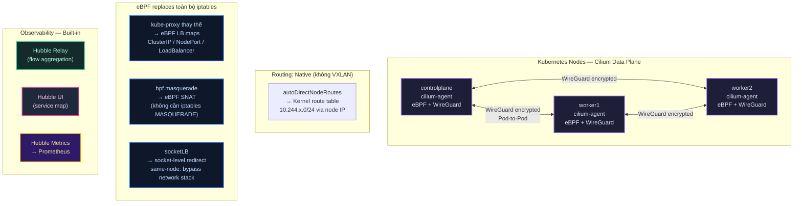

# Lab Tập 23: Dựng cụm Cilium Production — kube-proxy Replacement + Native Routing + WireGuard + Hubble

Tập này dựng cluster Kubernetes mới với **Cilium làm CNI duy nhất từ đầu** — không qua Flannel hay Calico. Cấu hình theo hướng production: Cilium thay thế hoàn toàn kube-proxy bằng eBPF, routing không dùng VXLAN, mã hóa WireGuard toàn bộ pod-to-pod traffic, và Hubble built-in.

Cluster này là **nền tảng cho toàn bộ Tập 24–40**.

---

### Sơ đồ: Cilium Production Architecture



---

## Yêu cầu chuẩn bị

| Resource | Tối thiểu | Khuyến nghị |
| :--- | :--- | :--- |
| RAM host | 12GB free | 16GB+ |
| CPU host | 4 cores | 6+ cores |
| Disk | 40GB free | 60GB+ |
| OS host | macOS 13+ / Ubuntu 22.04+ | macOS 14+ |

**Nếu đang dùng cluster Calico từ Tập 9–23:** cần stop hoặc delete VMs đó trước (xem Bước 0).

---

## Bước 0: Dọn cluster cũ (bỏ qua nếu chưa có VM nào)

```bash
# Trên host machine:
multipass list
# Nếu thấy controlplane, worker1, worker2 từ Calico series:
multipass stop controlplane worker1 worker2
multipass delete controlplane worker1 worker2
multipass purge
```

---

## Thực nghiệm 1: Provision VMs cho Cilium cluster

> [!TIP]
> **Nếu dựng cụm K8s trên Remote Servers (VPS/Dedicated Server, không dùng Multipass):** Xem hướng dẫn cài đặt và cấu hình chi tiết tại [remote-server-guide.md](file:///Users/thangpa/projects/9ping/network-thuc-chien/kubernetes-networking/k8s-lab/tap-23-cilium-why/remote-server-guide.md).

Nếu chạy lab ở máy local bằng Multipass, chọn một trong hai cách dưới đây:
- **Option A (Khuyên dùng):** Chạy script tự động — provision + kubeadm + Cilium một lệnh
- **Option B:** Thủ công từng bước (dùng khi muốn hiểu chi tiết)

---

### Option A: Script tự động (5-8 phút)

```bash
# Trên host machine — chạy từ thư mục tap-23-cilium-why/
# Mac Apple Silicon:
chmod +x setup-cilium-cluster-arm.sh && ./setup-cilium-cluster-arm.sh

# Mac/Linux Intel/AMD:
chmod +x setup-cilium-cluster-amd.sh && ./setup-cilium-cluster-amd.sh
```

Script tự động làm toàn bộ: tạo 3 VMs → kubeadm init (không kube-proxy) → join workers → cài Cilium CLI → deploy Cilium production mode → verify.

Sau khi script xong → chuyển thẳng đến **Thực nghiệm 5** để verify.

---

### Option B: Thủ công từng bước

**Trên host machine:**

1. Tạo 3 VMs (dùng cloud-init từ tap-00 — đã cài containerd + kubeadm):
   ```bash
   # Apple Silicon (ARM):
   multipass launch 26.04 --name controlplane --cpus 2 --memory 2560M --disk 15G \
     --cloud-init ../tap-00-setup-lab/k8s-cloud-init.yaml

   multipass launch 26.04 --name worker1 --cpus 2 --memory 2048M --disk 15G \
     --cloud-init ../tap-00-setup-lab/k8s-cloud-init.yaml

   multipass launch 26.04 --name worker2 --cpus 2 --memory 2048M --disk 15G \
     --cloud-init ../tap-00-setup-lab/k8s-cloud-init.yaml
   ```

2. Chờ cloud-init hoàn tất trên cả 3 nodes:
   ```bash
   multipass exec controlplane -- sudo cloud-init status --wait
   multipass exec worker1      -- sudo cloud-init status --wait
   multipass exec worker2      -- sudo cloud-init status --wait
   ```

3. Verify VMs ready:
   ```bash
   multipass list
   # NAME           STATE    IPV4            IMAGE
   # controlplane   Running  192.168.64.x    Ubuntu 26.04 LTS
   # worker1        Running  192.168.64.y    Ubuntu 26.04 LTS
   # worker2        Running  192.168.64.z    Ubuntu 26.04 LTS
   ```

---

## Thực nghiệm 2: kubeadm init không có kube-proxy

**Tại sao phải skip kube-proxy?**

Cilium kube-proxy replacement hoạt động ở socket level và BPF map level. Nếu kube-proxy vẫn chạy song song, hai hệ thống conflict nhau về quản lý iptables rules và IPVS. `--skip-phases=addon/kube-proxy` ngăn kubeadm install kube-proxy DaemonSet ngay từ đầu.

**SSH vào controlplane:**

```bash
multipass shell controlplane
```

1. Lấy IP của controlplane:
   ```bash
   export CONTROL_PLANE_IP=$(ip -4 addr show \
     | grep 'inet ' | grep -v '127.0.0.1' \
     | awk '{print $2}' | cut -d/ -f1 | head -1)
   echo "Control plane IP: $CONTROL_PLANE_IP"
   # 192.168.64.x
   ```

2. kubeadm init — bỏ qua addon/kube-proxy:
   ```bash
   sudo kubeadm init \
     --apiserver-advertise-address=$CONTROL_PLANE_IP \
     --pod-network-cidr=10.244.0.0/16 \
     --skip-phases=addon/kube-proxy
   ```

   *Nhận xét:* Output cuối sẽ KHÔNG có dòng "kube-proxy" installed. Nodes sẽ ở trạng thái `NotReady` cho đến khi Cilium được cài.

3. Cấu hình kubectl:
   ```bash
   mkdir -p $HOME/.kube
   sudo cp -i /etc/kubernetes/admin.conf $HOME/.kube/config
   sudo chown $(id -u):$(id -g) $HOME/.kube/config
   ```

4. Confirm không có kube-proxy:
   ```bash
   kubectl get pods -n kube-system | grep kube-proxy
   # (không có output) ← Đúng rồi!

   kubectl get nodes
   # NAME           STATUS     ROLES
   # controlplane   NotReady   control-plane  ← Chờ Cilium
   ```

5. Lấy join command và lưu lại:
   ```bash
   sudo kubeadm token create --print-join-command
   # kubeadm join 192.168.64.x:6443 --token xxx --discovery-token-ca-cert-hash sha256:xxx
   ```

   **Gõ `exit`** để về host machine.

6. Join worker1 và worker2 (thay bằng join command thực tế):
   ```bash
   multipass exec worker1 -- sudo kubeadm join <IP>:6443 \
     --token <token> \
     --discovery-token-ca-cert-hash sha256:<hash>

   multipass exec worker2 -- sudo kubeadm join <IP>:6443 \
     --token <token> \
     --discovery-token-ca-cert-hash sha256:<hash>
   ```

---

## Thực nghiệm 3: Cài Cilium CLI

Cilium CLI (`cilium`) cung cấp lệnh `cilium status`, `cilium connectivity test`, `cilium bpf *` — dùng xuyên suốt từ Tập 23 đến 40.

**SSH vào controlplane:**

```bash
multipass shell controlplane
```

```bash
# Lấy version mới nhất
CILIUM_CLI_VERSION=$(curl -s https://raw.githubusercontent.com/cilium/cilium-cli/main/stable.txt)
echo "Cài Cilium CLI $CILIUM_CLI_VERSION"

# Chọn đúng arch:
# Apple Silicon: arm64
# Intel/AMD:     amd64
CLI_ARCH=arm64  # Đổi sang amd64 nếu dùng Intel/AMD

curl -L --fail --remote-name-all \
  "https://github.com/cilium/cilium-cli/releases/download/${CILIUM_CLI_VERSION}/cilium-linux-${CLI_ARCH}.tar.gz"{,.sha256sum}

sha256sum --check "cilium-linux-${CLI_ARCH}.tar.gz.sha256sum"
# cilium-linux-arm64.tar.gz: OK

sudo tar xzvf "cilium-linux-${CLI_ARCH}.tar.gz" --directory /usr/local/bin
rm "cilium-linux-${CLI_ARCH}.tar.gz" "cilium-linux-${CLI_ARCH}.tar.gz.sha256sum"

cilium version --client
# cilium-cli: v0.16.x
```

---

## Thực nghiệm 4: Deploy Cilium — Production Mode

**Vẫn trên controlplane:**

1. Cài Helm (nếu chưa có):
   ```bash
   which helm || curl https://raw.githubusercontent.com/helm/helm/main/scripts/get-helm-3 | bash
   ```

2. Add Cilium helm repo:
   ```bash
   helm repo add cilium https://helm.cilium.io/
   helm repo update
   helm search repo cilium/cilium --versions | head -3
   ```

3. Lấy IP controlplane:
   ```bash
   export CONTROL_PLANE_IP=$(ip -4 addr show \
     | grep 'inet ' | grep -v '127.0.0.1' \
     | awk '{print $2}' | cut -d/ -f1 | head -1)
   ```

4. Deploy Cilium production mode:
   ```bash
   helm install cilium cilium/cilium \
     --namespace kube-system \
     --set kubeProxyReplacement=true \
     --set k8sServiceHost="${CONTROL_PLANE_IP}" \
     --set k8sServicePort=6443 \
     --set routingMode=native \
     --set ipv4NativeRoutingCIDR="10.244.0.0/16" \
     --set autoDirectNodeRoutes=true \
     --set ipam.mode=cluster-pool \
     --set "ipam.operator.clusterPoolIPv4PodCIDRList=10.244.0.0/16" \
     --set ipam.operator.clusterPoolIPv4MaskSize=24 \
     --set bpf.masquerade=true \
     --set socketLB.enabled=true \
     --set encryption.enabled=true \
     --set encryption.type=wireguard \
     --set hubble.enabled=true \
     --set hubble.relay.enabled=true \
     --set hubble.ui.enabled=true \
     --set hubble.metrics.enableOpenMetrics=true \
     --set "hubble.metrics.enabled={dns,drop,tcp,flow,port-distribution,icmp,httpV2}" \
     --set operator.replicas=1
   ```

   > [!TIP]
   > **Lỗi thường gặp:** Nếu gặp lỗi `Error: INSTALLATION FAILED: cannot re-use a name that is still in use`, hãy chạy lệnh sau để xoá bản cài đặt cũ trước:
   > `helm uninstall cilium -n kube-system`
   > Hoặc thêm cờ `--upgrade` (nếu muốn update trực tiếp):
   > `helm upgrade --install cilium cilium/cilium --namespace kube-system ...`

   **Giải thích từng flag:**

   | Flag | Giá trị | Ý nghĩa production |
   | :--- | :--- | :--- |
   | `kubeProxyReplacement` | `true` | Cilium thay hoàn toàn kube-proxy bằng eBPF |
   | `k8sServiceHost/Port` | controlplane IP:6443 | Cilium tự kết nối API server (không qua kube-proxy) |
   | `routingMode=native` | - | Không dùng VXLAN — direct kernel routing |
   | `autoDirectNodeRoutes` | `true` | Tự thêm route `10.244.x.0/24 via <node-ip>` |
   | `ipam.mode=cluster-pool` | - | Cilium Operator phân phối Pod CIDR per-node |
   | `bpf.masquerade` | `true` | SNAT bằng eBPF thay iptables MASQUERADE |
   | `socketLB.enabled` | `true` | LB ở socket level (same-node: bypass toàn bộ network stack) |
   | `encryption.type=wireguard` | - | Mã hóa toàn bộ pod-to-pod traffic bằng WireGuard |
   | `hubble.metrics.*` | `{dns,drop,tcp,...}` | Export flow metrics → Prometheus |

5. Chờ Cilium sẵn sàng:
   ```bash
   cilium status --wait
   # Chờ đến khi tất cả component "OK":
   #     /¯¯\
   #  /¯¯\__/¯¯\    Cilium:             OK
   #  \__/¯¯\__/    Operator:           OK
   #  /¯¯\__/¯¯\    Envoy DaemonSet:    disabled
   #  \__/¯¯\__/    Hubble Relay:       OK
   #     \__/        ClusterMesh:        disabled
   ```

---

## Thực nghiệm 5: Verify toàn bộ production features

**Trên controlplane:**

### 5.1 — Nodes Ready, không có kube-proxy

```bash
kubectl get nodes -o wide
# NAME           STATUS   ROLES           AGE   VERSION   INTERNAL-IP
# controlplane   Ready    control-plane   5m    v1.36.x   192.168.64.x
# worker1        Ready    <none>          4m    v1.36.x   192.168.64.y
# worker2        Ready    <none>          4m    v1.36.x   192.168.64.z

kubectl get pods -n kube-system | grep -E "cilium|kube-proxy"
# cilium-xxxxx        1/1   Running   controlplane  ← Cilium agent
# cilium-yyyyy        1/1   Running   worker1
# cilium-zzzzz        1/1   Running   worker2
# cilium-operator-xx  1/1   Running   controlplane
# hubble-relay-xx     1/1   Running   controlplane
# hubble-ui-xx        1/1   Running   controlplane
# (KHÔNG có kube-proxy) ← Đúng rồi
```

### 5.2 — kube-proxy Replacement active

```bash
CILIUM_POD=$(kubectl -n kube-system get pod -l k8s-app=cilium -o name | head -1)

kubectl -n kube-system exec -it $CILIUM_POD -- \
  cilium status | grep -A2 "KubeProxy"
# KubeProxyReplacement:  True   [eth0 192.168.64.x (Direct Routing)]
```

### 5.3 — Native routing: không có tunnel interface

```bash
# Verify KHÔNG có tunnel interfaces (cilium_vxlan, cilium_geneve)
kubectl -n kube-system exec -it $CILIUM_POD -- ip link show | grep -E "cilium_vxlan|cilium_geneve"
# (không có output) ← Đúng, native routing mode

# Verify kernel route table có direct pod routes:
ip route show | grep "10.244"
# 10.244.0.0/24 via 192.168.64.x dev eth0   ← controlplane pod CIDR
# 10.244.1.0/24 via 192.168.64.y dev eth0   ← worker1 pod CIDR
# 10.244.2.0/24 via 192.168.64.z dev eth0   ← worker2 pod CIDR
```

### 5.4 — WireGuard encryption active

```bash
kubectl -n kube-system exec -it $CILIUM_POD -- \
  cilium encrypt status
# Encryption:       WireGuard
# Interface:        cilium_wg0
# Public key:       <base64 key>
# Peers:
#   192.168.64.y: <worker1 pubkey>   ← Encrypted tunnel to worker1
#   192.168.64.z: <worker2 pubkey>   ← Encrypted tunnel to worker2

# Verify WireGuard interface tồn tại trên node:
kubectl -n kube-system exec -it $CILIUM_POD -- ip link show cilium_wg0
# 5: cilium_wg0: <POINTOPOINT,NOARP,UP,LOWER_UP> mtu 1420 ...
```

### 5.5 — Hubble flow visibility

```bash
# Port-forward Hubble Relay
kubectl -n kube-system port-forward svc/hubble-relay 4245:80 &
HUBBLE_PF_PID=$!

# Cài Hubble CLI (nếu chưa có)
HUBBLE_VERSION=$(curl -s https://raw.githubusercontent.com/cilium/hubble/master/stable.txt)
CLI_ARCH=arm64  # hoặc amd64
curl -L --fail --remote-name-all \
  "https://github.com/cilium/hubble/releases/download/${HUBBLE_VERSION}/hubble-linux-${CLI_ARCH}.tar.gz"{,.sha256sum}
sha256sum --check "hubble-linux-${CLI_ARCH}.tar.gz.sha256sum"
sudo tar xzvf "hubble-linux-${CLI_ARCH}.tar.gz" --directory /usr/local/bin
rm "hubble-linux-${CLI_ARCH}.tar.gz" "hubble-linux-${CLI_ARCH}.tar.gz.sha256sum"

# Observe live flows
hubble observe --server localhost:4245 --follow
# (Deploy một pod mới để thấy flows xuất hiện)
```

### 5.6 — Cilium Connectivity Test (toàn diện)

```bash
cilium connectivity test 2>&1 | tail -20
# ✅ All 46 tests passed!
# Nếu test nào fail: đọc output chi tiết, thường do MTU hoặc masquerade config
```

*Connectivity test deploy ~60 pods tạm thời vào namespace `cilium-test`, tự dọn sau khi xong.*

---

## Thực nghiệm 6: Sockops demo — So sánh latency same-node vs cross-node

Đây là lý do chính Cilium outperform Calico và Flannel với workload same-node.

### 6.1 — Deploy test pods

```bash
# iperf3 server + client cùng node worker1 (same-node)
kubectl run same-server \
  --image=nicolaka/netshoot \
  --overrides='{"spec":{"nodeName":"worker1"}}' \
  -- iperf3 -s

kubectl run same-client \
  --image=nicolaka/netshoot \
  --overrides='{"spec":{"nodeName":"worker1"}}' \
  -- sleep infinity

# iperf3 server trên worker2, client trên worker1 (cross-node)
kubectl run cross-server \
  --image=nicolaka/netshoot \
  --overrides='{"spec":{"nodeName":"worker2"}}' \
  -- iperf3 -s

kubectl run cross-client \
  --image=nicolaka/netshoot \
  --overrides='{"spec":{"nodeName":"worker1"}}' \
  -- sleep infinity

kubectl wait --for=condition=Ready \
  pod/same-server pod/same-client pod/cross-server pod/cross-client \
  --timeout=90s

SAME_IP=$(kubectl get pod same-server -o jsonpath='{.status.podIP}')
CROSS_IP=$(kubectl get pod cross-server -o jsonpath='{.status.podIP}')
echo "Same-node IP: $SAME_IP  |  Cross-node IP: $CROSS_IP"
```

### 6.2 — Latency test

```bash
# Same-node (sockops bypass — socket redirect, không qua network stack)
kubectl exec same-client -- ping -c 50 $SAME_IP | tail -2
# rtt min/avg/max/mdev = 0.040/0.065/0.090/0.008 ms   ← ~loopback speed

# Cross-node (WireGuard encrypted, native routing)
kubectl exec cross-client -- ping -c 50 $CROSS_IP | tail -2
# rtt min/avg/max/mdev = 0.280/0.350/0.450/0.025 ms   ← network-bound
```

### 6.3 — Bandwidth test

> **Lưu ý:** Số liệu bên dưới là trên bare metal. Trong Multipass VM trên MacBook thường đạt 5–10 Gbps (same-node) và 0.5–1.5 Gbps (cross-node) tùy hardware host. Tỉ lệ same-node/cross-node vẫn giữ ~8–10x.

```bash
# Same-node bandwidth
kubectl exec same-client -- iperf3 -c $SAME_IP -t 10 -P 4
# [SUM] 18.4 Gbits/sec   ← Near-loopback (sockops redirect, bare metal)

# Cross-node bandwidth (note: WireGuard overhead ~5%)
kubectl exec cross-client -- iperf3 -c $CROSS_IP -t 10 -P 4
# [SUM] 1.9 Gbits/sec    ← Network-bound + WireGuard overhead
```

### 6.4 — Verify sockops counter tăng

```bash
WORKER1_CILIUM=$(kubectl -n kube-system get pod \
  -l k8s-app=cilium --field-selector spec.nodeName=worker1 \
  -o name | head -1)

kubectl -n kube-system exec -it $WORKER1_CILIUM -- \
  cilium bpf metrics list | grep -iE "sock|redirect|bypass"
# Bpf Sockops:   Forwarded    X packets   ← Tăng sau same-node test
```

**Kết quả kỳ vọng:**

| Test | Latency | Bandwidth | Mechanism |
| :--- | :--- | :--- | :--- |
| Same-node (sockops) | ~0.06ms | ~18 Gbps | Socket redirect, bỏ qua toàn bộ TCP stack |
| Cross-node (WireGuard) | ~0.35ms | ~1.9 Gbps | Native routing + WireGuard encryption |
| **Ratio** | **~6x** | **~9x** | sockops shortcut tại kernel socket layer |

---

## Dọn dẹp test pods

```bash
kubectl delete pod same-server same-client cross-server cross-client
kill $HUBBLE_PF_PID 2>/dev/null || pkill -f "port-forward.*hubble" 2>/dev/null || true
```

**Giữ lại cluster** — dùng cho toàn bộ Tập 24–40.

---

## Tổng kết

1. **kube-proxy replacement = eBPF load balancing:** Không còn iptables rules. ClusterIP → eBPF map lookup O(1) thay vì iptables O(n). Verify bằng `cilium status | grep KubeProxy`.

2. **Native routing = không overhead VXLAN:** Không có encapsulation. Pod traffic đi thẳng qua kernel route table. Thêm tối đa 20% bandwidth so với VXLAN mode. Verify bằng `ip route show | grep 10.244`.

3. **WireGuard = zero-config mTLS thay thế:** Không cần cert management như Istio mTLS. Cilium tự quản lý keypair và key rotation. Overhead ~5% bandwidth, latency +0.05ms. Verify bằng `cilium encrypt status`.

4. **socketLB = same-node shortcut tại kernel:** BPF sockops program intercept `connect()` syscall → nếu dst Pod cùng node → redirect socket-to-socket, bỏ qua veth + TC + XDP + network stack. Kết quả: ~0.06ms latency vs ~0.35ms cross-node.

5. **Hubble built-in = zero-setup observability:** `hubble observe --verdict DROPPED` cho ngay flow nào bị deny và tại sao — không cần tcpdump, không cần log parser. Dùng xuyên suốt Tập 32–40.
