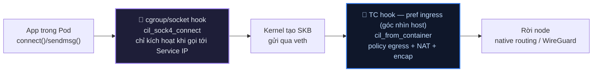
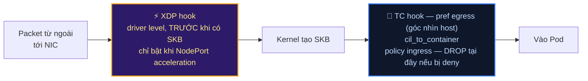

# Lab Tập 26: 3 Hook Points của eBPF — XDP, TC và Cgroup/Socket hooks

Tập này quan sát BPF programs được Cilium attach tại từng hook point: XDP (trước SKB), TC (ingress/egress trên veth), và cgroup/socket hooks (socket layer — connect/sendmsg/recvmsg). Lưu ý: tính năng `sockops`/`sk_msg` (TCP splice cũ) đã bị Cilium loại bỏ từ v1.14 — cơ chế socket-layer hiện tại dùng `BPF_PROG_TYPE_CGROUP_SOCK_ADDR` (xem Thực nghiệm 3).

### Sơ đồ: 3 hook point trên đường đi của packet

**Chiều RA — Pod gửi đi (outbound):**



**Chiều VÀO — Pod nhận (inbound):**



**Điểm dễ nhầm nhất:** tên `ingress`/`egress` của TC filter là theo **góc nhìn host/veth**, không phải góc nhìn Pod. Packet Pod gửi ra lại nằm ở filter `ingress` (`cil_from_container`); packet vào Pod nằm ở filter `egress` (`cil_to_container`). Cgroup/socket hook chỉ chạy phía **gửi** (trước khi packet tồn tại), không có hook tương ứng phía nhận.

## 🛠 Yêu cầu chuẩn bị
- Cilium đang chạy trên cluster (từ Tập 23).
- `bpftool` và `tc` có sẵn (trong cilium-agent container và trên host).

---

## 🔬 Thực nghiệm 1: List BPF programs theo hook type

**SSH vào `controlplane`:**

```bash
multipass shell controlplane
```

1. Xem tất cả BPF programs với type:
   ```bash
   CILIUM_POD=$(kubectl -n kube-system get pod -l k8s-app=cilium \
     -o name | head -1)

   kubectl -n kube-system exec -it $CILIUM_POD -- \
     bpftool prog list | grep -E "^[0-9]+:"
   # 23: sched_cls        ← TC programs (ingress/egress trên veth)
   # 24: sched_cls
   # 45: cgroup_sock_addr ← socket hook (connect/sendmsg/recvmsg — Socket LB)
   # 46: cgroup_sock_addr
   # 67: xdp              ← XDP program (nếu NodePort acceleration enabled)
   ```

   **💡 Giải thích output:** Cột đầu (`23:`, `24:`...) là Program ID — định danh duy nhất trong kernel, tăng dần mỗi lần load program mới. Cột thứ hai là **prog type** — `sched_cls` (TC), `cgroup_sock_addr` (socket hook), `xdp` (XDP) — ánh xạ đúng 1-1 với 3 hook point đang học ở tập này.

   **🎯 Dùng khi nào trong thực tế:** Lệnh đầu tiên chạy sau khi cilium-agent restart/upgrade để xác nhận đủ cả 3 loại program được load lại. Thiếu hẳn `sched_cls` → agent chưa attach TC, mọi pod trên node đó NotReady hoặc mất policy enforcement. Không thấy `xdp` là **bình thường** (chỉ bật khi cấu hình NodePort acceleration) — đừng nhầm với lỗi.

2. Xem riêng từng loại:
   ```bash
   # Xem TC programs (sched_cls):
   kubectl -n kube-system exec -it $CILIUM_POD -- \
     bpftool prog list | grep -B1 "sched_cls" | grep "name"
   # name cil_from_container  ← TC ingress (packet RA từ pod, từ pod ra ngoài)
   # name cil_to_container    ← TC egress (packet VÀO pod, từ ngoài vào)
   # name cil_from_host       ← TC từ host network
   # name cil_to_host         ← TC lên host network

   # Xem cgroup/socket hook programs:
   kubectl -n kube-system exec -it $CILIUM_POD -- \
     bpftool prog list | grep -B1 "cgroup_sock_addr" | grep "name"
   # name cil_sock4_connect   ← rewrite IP đích tại connect() cho service (Socket LB)
   # name cil_sock4_sendmsg   ← rewrite cho UDP sendmsg
   # name cil_sock4_recvmsg   ← reverse rewrite khi nhận response
   ```
   > **💡 Lưu ý version (đã kiểm chứng trên Cilium v1.19.5):** tính năng `sockops`/`sk_msg` (prog type `sock_ops`/`sk_msg`, tên `bpf_sockops`/`bpf_redir_proxy`) đã bị **loại bỏ hoàn toàn từ v1.14** (grep source v1.19.5 cho `sockops`/`sockmap` ra 0 kết quả). Cơ chế socket-layer hiện tại nằm trong `bpf/bpf_sock.c`, attach ở `cgroup/connect4`, `cgroup/sendmsg4`, `cgroup/recvmsg4`... (prog type `cgroup_sock_addr`), tên hàm `cil_sock4_connect`/`cil_sock4_sendmsg`/`cil_sock4_recvmsg` (và bản `_sock6_` cho IPv6). Đây là cơ chế rewrite IP:port service→backend tại `connect()` (Socket LB / kube-proxy replacement), không phải "TCP splice bypass" như sockops cũ.

   **🎯 Dùng khi nào trong thực tế:** Tra tên program cụ thể (`cil_from_container`, `cil_sock4_connect`...) khi cần đọc source code Cilium tương ứng để hiểu chính xác logic nào đang chạy — hữu ích khi báo bug hoặc đọc release note thấy đổi tên hàm giữa các version (như `sockops` → `cgroup_sock_addr` ở trên).

3. Đếm tổng số BPF programs per type:
   ```bash
   kubectl -n kube-system exec -it $CILIUM_POD -- \
     bpftool prog list | awk '{print $2}' | sort | uniq -c | sort -rn
   # 18 sched_cls          ← 1 TC ingress + 1 TC egress per endpoint/interface
   # 12 cgroup_sock_addr   ← connect4/6, sendmsg4/6, recvmsg4/6, bind4/6, post_bind4/6...
   #  1 xdp
   ```

   **🎯 Dùng khi nào trong thực tế:** `sched_cls` tăng tuyến tính theo số pod trên node (mỗi endpoint thêm ~2 program) — dùng con số này cho capacity estimate tương tự đếm BPF map ở Tập 24. Cũng dùng phát hiện **program leak**: pod bị xoá liên tục nhưng số `sched_cls` không giảm tương ứng → cilium-agent không dọn program khi endpoint mất, cần báo bug.

---

## 🔬 Thực nghiệm 2: Xem TC programs gắn trên veth của Pod

**Trên `controlplane`:**

1. Deploy một test pod và tìm veth interface của nó:
   ```bash
   kubectl run hook-test --image=nicolaka/netshoot -- sleep infinity
   kubectl wait --for=condition=Ready pod/hook-test --timeout=60s

   # Lấy Pod IP để tìm veth tương ứng
   POD_IP=$(kubectl get pod hook-test -o jsonpath='{.status.podIP}')
   echo "Pod IP: $POD_IP"
   ```

2. Tìm veth trên worker node (pod chạy trên node nào):
   ```bash
   NODE=$(kubectl get pod hook-test -o jsonpath='{.spec.nodeName}')
   echo "Pod running on: $NODE"

   # SSH vào node đó và tìm veth
   multipass exec $NODE -- ip link show type veth
   # Tìm veth có ifindex tương ứng với Pod
   # hoặc:
   multipass exec $NODE -- ip route show | grep $POD_IP
   # 10.244.1.5 dev veth3a4b5c6d scope link
   VETH=$(multipass exec $NODE -- ip route show | grep $POD_IP | awk '{print $3}')
   echo "Veth interface: $VETH"
   ```

3. Xem TC qdisc (Cilium thêm `clsact` qdisc):
   ```bash
   multipass exec $NODE -- tc qdisc show dev $VETH
   # qdisc clsact ffff: dev veth3a4b5c6d parent ffff:fff1
   # ← Cilium attach clsact qdisc để có thể gắn TC programs
   ```

   **💡 Giải thích output:** `clsact` là qdisc đặc biệt — không có hàng đợi/shaping thật (khác `htb`/`tbf`), chỉ tồn tại để làm chỗ neo cho `tc filter` gắn BPF program vào cả 2 chiều ingress/egress trên cùng 1 interface. `ffff:` là handle của qdisc, `parent ffff:fff1` là giá trị cố định luôn đi kèm `clsact`.

   **🎯 Dùng khi nào trong thực tế:** Bước xác nhận bắt buộc trước khi tin `tc filter show` — nếu `clsact` chưa attach (thường do race condition lúc pod vừa tạo, agent chưa kịp cấu hình), lệnh `tc filter show` ở bước sau trả về **rỗng**, dễ hiểu nhầm là "chưa có policy" trong khi thực chất là interface chưa kịp init.

4. Xem TC filter (BPF programs) trên ingress và egress:
   ```bash
   # TC ingress: packet RA từ pod (từ pod ra ngoài)
   multipass exec $NODE -- tc filter show dev $VETH ingress
   # filter protocol all pref 1 bpf chain 0
   # filter protocol all pref 1 bpf ... handle 0x1 cil_from_container [...]

   # TC egress: packet VÀO pod (từ ngoài vào)
   multipass exec $NODE -- tc filter show dev $VETH egress
   # filter protocol all pref 1 bpf chain 0
   # filter protocol all pref 1 bpf ... handle 0x1 cil_to_container [...]
   ```

   *Nhận xét:* `cil_from_container` chạy khi pod gửi packet ra (egress của pod = ingress của veth nhìn từ host). Đây là nơi policy enforcement xảy ra.

   **💡 Giải thích output:** `pref 1` là độ ưu tiên filter (số nhỏ chạy trước — quan trọng nếu có nhiều tool cùng gắn filter trên 1 interface, vd Cilium + 1 CNI chain khác). `chain 0` là BPF filter chain mặc định. `handle 0x1` định danh riêng của instance filter này (khác Program ID ở `bpftool prog list`) — dùng để `tc filter del` đúng filter nếu cần gỡ thủ công.

   **🎯 Dùng khi nào trong thực tế:** So khớp `pref`/`handle` khi nghi ngờ có filter khác (không phải của Cilium) đang chạy trước và can thiệp traffic — tình huống gặp khi cluster có 2 CNI plugin cùng lúc hoặc service mesh gắn thêm TC hook riêng. Cũng dùng sau khi Cilium upgrade để xác nhận filter cũ đã được thay bằng filter mới (khác `handle`), không phải bị trùng/leftover.

   ```mermaid
   graph LR
     POD["Pod<br/>(network namespace riêng)"]
     subgraph veth ["veth phía host — vd veth3a4b5c6d"]
       ING["tc filter ingress<br/>= packet Pod GỬI RA<br/>program: cil_from_container"]
       EGR["tc filter egress<br/>= packet VÀO Pod<br/>program: cil_to_container"]
     end

     POD -->|"Pod gửi packet"| ING --> HOST_OUT["Rời node"]
     HOST_IN["Từ node khác / bên ngoài"] --> EGR -->|"Pod nhận packet"| POD

     style ING fill:#152a2a,stroke:#34d399,stroke-width:2px,color:#a7f3d0
     style EGR fill:#0f172a,stroke:#3b82f6,stroke-width:2px,color:#bfdbfe
   ```

---

## 🔬 Thực nghiệm 3: Verify cgroup/socket hook active (Socket LB)

**Trên `controlplane`:**

1. Verify cgroup/socket BPF program được load:
   ```bash
   kubectl -n kube-system exec -it $CILIUM_POD -- \
     bpftool prog show name cil_sock4_connect
   # 45: cgroup_sock_addr  name cil_sock4_connect  tag xxxx  gpl
   #     loaded_at 2024-01-01T00:00:00+0000  uid 0
   #     xlated 2KB  jited 1KB  memlock 4KB
   ```

   **💡 Giải thích output:** `tag` là hash của bytecode — 2 node chạy đúng cùng version Cilium với cùng config phải cho **cùng giá trị tag**. `loaded_at` là timestamp program được load (thường trùng lúc cilium-agent pod start). `xlated` là kích thước bytecode BPF gốc, `jited` là kích thước sau khi JIT-compile sang native machine code (luôn ≤ `xlated`).

   **🎯 Dùng khi nào trong thực tế:** So `tag` giữa các node để phát hiện **rollout dở dang** — node nào có `tag` khác các node còn lại nghĩa là đang chạy version/config Cilium cũ, chưa được agent restart áp policy mới. Đối chiếu `loaded_at` với thời điểm sự cố network để xác nhận có phải do agent vừa restart (loaded lại toàn bộ program) gây gián đoạn hay không.

2. Verify program attached vào cgroup (toàn bộ host):
   ```bash
   kubectl -n kube-system exec -it $CILIUM_POD -- \
     bpftool cgroup show /run/cilium/cgroupv2
   # ID  AttachType  AttachFlags  Name
   # 45  connect4    multi        cil_sock4_connect
   # 46  sendmsg4    multi        cil_sock4_sendmsg
   # 47  recvmsg4    multi        cil_sock4_recvmsg
   # ← Attach vào root cgroup → áp dụng cho TẤT CẢ sockets trên node
   ```

   **💡 Giải thích output:** `AttachFlags: multi` nghĩa là nhiều program có thể cùng chain vào 1 attach type (`connect4`...) mà không ghi đè lẫn nhau — khác `override` (chỉ 1 program tồn tại, cái sau đè cái trước). `AttachType` (`connect4`/`sendmsg4`/`recvmsg4`) khớp đúng tên syscall/hook trong kernel, không phải tên tuỳ ý.

   **🎯 Dùng khi nào trong thực tế:** Kiểm tra `multi` để xác nhận không bị tool khác (Istio CNI, Calico eBPF dataplane...) override mất program của Cilium — 2 dataplane cùng attach `override` vào cùng attach type là nguyên nhân kinh điển gây "Service LB chập chờn, lúc được lúc không" khi cluster chạy song song nhiều CNI/mesh.

3. Xem cilium status để confirm Socket LB enabled:
   ```bash
   kubectl -n kube-system exec -it $CILIUM_POD -- \
     cilium status --verbose | grep -A1 "Socket LB"
   # Socket LB:            Enabled
   # Socket LB Coverage:   Full  ← Active
   ```
   > ⚠️ **Lưu ý version (đã kiểm chứng trên Cilium v1.19.5):** field `Sockops: Enabled` chỉ có ở bản Cilium cũ (<1.11). Từ đó về sau, tính năng này gộp vào **`Socket LB`** trong mục `KubeProxyReplacement Details` — phải thêm `--verbose` mới thấy, `cilium status` (không verbose) chỉ show 1 dòng tổng `KubeProxyReplacement: True`.

   **💡 Giải thích output:** `Coverage: Full` nghĩa là socket hook xử lý được cả ClusterIP lẫn NodePort/ExternalIP tại tầng `connect()`. Giá trị khác (`Partial`) xảy ra khi kernel thiếu tính năng BPF cần thiết (kernel quá cũ, hoặc chạy trong môi trường ảo hoá giới hạn) — lúc đó một phần traffic phải rơi về path TC-only để load-balance, chậm hơn.

   **🎯 Dùng khi nào trong thực tế:** Nếu Coverage chỉ `Partial` mà đang debug hiệu năng Service không như kỳ vọng — đây chính là nguyên nhân, không phải do NetworkPolicy hay routing sai. Kiểm tra kernel version của node trước khi nghi ngờ config Cilium.

   ```mermaid
   sequenceDiagram
     participant App as App trong Pod
     participant Hook as cgroup_sock_addr hook<br/>cil_sock4_connect
     participant LBMap as eBPF LB Map<br/>ClusterIP → backend Pod IPs
     participant Kernel as Kernel TCP stack

     App->>Hook: connect(ClusterIP:Port)
     Hook->>LBMap: lookup backend theo ClusterIP:Port
     LBMap-->>Hook: chọn 1 backend Pod IP (load balance)
     Hook->>Kernel: rewrite dest = backend Pod IP:Port
     Kernel->>Kernel: 3-way handshake thẳng tới Pod backend
     Note over App,Kernel: App tưởng đang connect tới ClusterIP —<br/>không hề biết bị rewrite, không cần iptables/kube-proxy
   ```

   **Vì sao attach ở root cgroup:** hook này áp cho **tất cả** sockets trên node ngay tại syscall `connect()`, trước khi packet đầu tiên tồn tại — khác hẳn TC hook chỉ thấy được packet sau khi SKB đã tạo xong.

---

## 💥 Thực nghiệm 4: Quan sát TC program xử lý packet thực tế

**Trên `controlplane`:**

1. Deploy client-server để tạo traffic:
   ```bash
   kubectl run hook-server --image=nicolaka/netshoot \
     --overrides='{"spec":{"nodeName":"worker2"}}' \
     -- nc -lk -p 9090

   SERVER_IP=$(kubectl get pod hook-server -o jsonpath='{.status.podIP}')
   echo "Server IP: $SERVER_IP"
   ```

2. Gửi traffic từ hook-test đến hook-server (cross-node → TC path):
   ```bash
   kubectl exec hook-test -- bash -c "
     for i in \$(seq 1 10); do
       echo 'hello' | nc -w 1 $SERVER_IP 9090 2>/dev/null
       sleep 0.5
     done
     echo 'Done'
   " &
   ```

3. Xem TC drop counter tăng (nếu có NetworkPolicy):
   ```bash
   kubectl -n kube-system exec -it $CILIUM_POD -- \
     cilium bpf metrics list | grep -E "Success|denied|Policy"
   # Success         EGRESS   XXX   → Tăng theo traffic được forward
   # Policy denied   INGRESS  0     → 0 nếu chưa có policy chặn
   ```
   > **💡 Lưu ý:** `REASON` chỉ có 2 nhóm giá trị thật — mã `0 = "Success"` cho packet forward thành công (không có text "Forwarded" riêng), và các mã ≥130 là lý do DROP cụ thể (`"Policy denied"`...). Không tồn tại reason `"CT: New connection"` — muốn xem connection mới dùng `cilium bpf ct list global` (Tập 24).

4. So sánh path: apply NetworkPolicy để xem TC DROP:
   ```bash
   kubectl apply -f - <<'EOF'
   apiVersion: networking.k8s.io/v1
   kind: NetworkPolicy
   metadata:
     name: deny-hook-server
   spec:
     podSelector:
       matchLabels:
         run: hook-server
     policyTypes:
     - Ingress
     ingress: []
   EOF

   # Test bị block — TC BPF program thực hiện DROP:
   kubectl exec hook-test -- nc -zv -w 2 $SERVER_IP 9090
   # (timeout) ← TC cil_to_container (trên veth của hook-server) DROP trước khi vào pod
   # Lưu ý: NetworkPolicy Ingress áp cho pod ĐÍCH (hook-server) → enforce ở hook
   # "to-container" (packet VÀO pod), không phải "from-container" (packet RA pod nguồn).
   ```

   ```mermaid
   graph LR
     subgraph nodeA ["Node chạy hook-test (client)"]
       CLIENT["hook-test"] --> TCFROM["TC cil_from_container<br/>(egress policy) — Allow,<br/>không có rule chặn chiều ra"]
     end
     TCFROM -->|"native routing / WireGuard"| nodeB

     subgraph nodeB ["Node chạy hook-server = worker2"]
       TCTO{"TC cil_to_container<br/>(ingress policy)<br/>tra cilium_policy map"}
       TCTO -->|"Deny"| DROPPED["❌ DROP tại đây<br/>packet không tới process nc"]
       TCTO -.->|"nếu Allow"| SERVER["hook-server<br/>nc -lk -p 9090"]
     end

     style TCFROM fill:#0f172a,stroke:#3b82f6,stroke-width:2px,color:#bfdbfe
     style TCTO fill:#152a2a,stroke:#34d399,stroke-width:2px,color:#a7f3d0
     style DROPPED fill:#3f1d1d,stroke:#f87171,stroke-width:2px,color:#fecaca
   ```

   Client không hề hay biết gói tin đã đi trót lọt tới đúng node đích — chỉ bị chặn ở bước cuối cùng, ngay trước khi vào Pod. Đây là lý do `nc -zv` timeout thay vì báo connection refused ngay.

   **💡 Timeout vs Refused — phân biệt khi debug:** `Connection refused` nghĩa là packet **tới được** kernel đích và có TCP RST trả về (thường do không process nào lắng nghe port đó). `Timeout` (như ở đây) nghĩa là packet bị **DROP hoàn toàn**, không có bất kỳ phản hồi nào — đúng hành vi của TC BPF `DROP` (Cilium cố tình không trả RST để tránh lộ thông tin cho traffic bị chặn bởi policy). Thấy `refused` thay vì `timeout` khi test NetworkPolicy deny → dấu hiệu policy **chưa** thật sự áp dụng ở kernel, cần check lại `cilium bpf policy list` (Tập 24) thay vì tin `kubectl get networkpolicy`.

   ```bash
   # Xem drop counter trong metrics:
   kubectl -n kube-system exec -it $CILIUM_POD -- \
     cilium bpf metrics list | grep -i "denied\|drop"
   # Policy denied  ingress  X  ← Tăng

   kubectl delete networkpolicy deny-hook-server
   ```

---

## 🧹 Dọn dẹp

```bash
kubectl delete pod hook-test hook-server
```

---

## ✅ Tổng kết

1. **3 hook points, 3 vai trò rõ ràng:** XDP (trước SKB — DDoS/NodePort, tốc độ tối đa), TC (có SKB — policy/NAT/encap, đầy đủ tính năng), cgroup/socket hooks (socket layer — Socket LB, rewrite IP đích tại `connect()` cho service).
2. **TC dùng `clsact` qdisc:** Cilium thêm `clsact` qdisc vào mỗi veth → gắn `cil_from_container` (ingress, packet ra khỏi pod) và `cil_to_container` (egress, packet vào pod) → policy enforcement xảy ra ở đây cho cross-node traffic.
3. **cgroup/socket hook gắn vào root cgroup:** Áp dụng cho tất cả sockets trên node → intercept `connect()`/`sendmsg()`/`recvmsg()` syscall → rewrite IP:port service→backend ngay tại socket layer (Socket LB, thay kube-proxy) — same-node fast path thật sự (bỏ iptables/netfilter, vẫn qua TC BPF) nằm ở cơ chế BPF host-routing (`bpf_redirect_peer()`), xem Tập 27.
4. **Cilium auto-select:** Agent tự detect topology, tự attach đúng BPF program vào đúng hook — không cần config thủ công, không cần restart để apply thay đổi.
