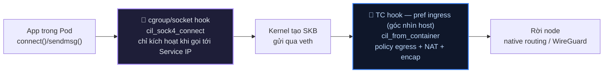
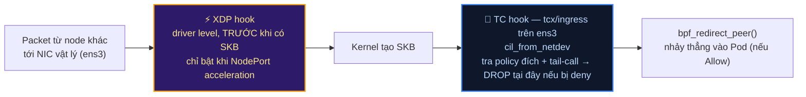

# Lab Tập 26: 3 Hook Points của eBPF — XDP, TC và Cgroup/Socket hooks

Tập này quan sát BPF programs được Cilium attach tại từng hook point: XDP (trước SKB), TC (ingress/egress trên veth), và cgroup/socket hooks (socket layer — connect/sendmsg/recvmsg). Lưu ý: tính năng `sockops`/`sk_msg` (TCP splice cũ) đã bị Cilium loại bỏ từ v1.14 — cơ chế socket-layer hiện tại dùng `BPF_PROG_TYPE_CGROUP_SOCK_ADDR` (xem Thực nghiệm 3).

### Sơ đồ: 3 hook point trên đường đi của packet

**Chiều RA — Pod gửi đi (outbound):**



**Chiều VÀO — Pod nhận (inbound, cross-node):**



> **⚠️ Đã kiểm chứng thực tế trên kernel 6.8 (Ubuntu 26.04) + Cilium v1.19.5 — khác đáng kể so với mô hình cũ:** hook `cil_to_container` (packet đi VÀO pod) **không attach trực tiếp lên veth của pod đích** như tài liệu Cilium đời cũ mô tả. `sudo bpftool net show` trên node thật cho thấy mỗi `lxcXXXX` chỉ có **1** hook duy nhất: `tcx/ingress cil_from_container`. Policy cho packet đi vào 1 pod được enforce ngay tại hook **đầu tiên chạm packet**, rồi tail-call nội bộ + `bpf_redirect_peer()` thẳng vào pod đích — không có hook riêng chạy trên veth của pod nhận:
> - **Same-node** (2 pod cùng node): hook đầu tiên chạm packet chính là `cil_from_container` của **pod nguồn** — nó tự tra cả 2 chiều policy (nguồn + đích) rồi mới quyết định redirect hay drop.
> - **Cross-node** (như sơ đồ trên): hook đầu tiên là `cil_from_netdev` trên NIC vật lý (`ens3`) của node đích.
> - **Traffic qua WireGuard**: hook đầu tiên là `cil_from_wireguard` trên `cilium_wg0`, sau khi gói đã được giải mã.
>
> **Đính chính:** `cil_to_container` **không xuất hiện** trong `bpftool prog list` (đã kiểm chứng thực tế — `grep cil_to_container` ra 0 kết quả trên cả 3 node). Logic của nó không tồn tại như 1 BPF program riêng biệt được tail-call — compiler của Cilium v1.19.5 đã inline logic này thẳng vào bên trong các hook `cil_from_container`/`cil_from_netdev`/`cil_from_wireguard`. Xem bằng chứng thực tế + chi tiết ở Thực nghiệm 2.

**Điểm dễ nhầm nhất:** tên `ingress`/`egress` của TC filter là theo **góc nhìn host/veth**, không phải góc nhìn Pod. Cgroup/socket hook chỉ chạy phía **gửi** (trước khi packet tồn tại), không có hook tương ứng phía nhận. Và như lưu ý trên — "hook nhận" cho pod đích, về bản chất, thường không tồn tại như 1 điểm attach riêng.

## 🛠 Yêu cầu chuẩn bị
- Cilium đang chạy trên cluster (từ Tập 23).
- `bpftool` và `tc` có sẵn (trong cilium-agent container và trên host).

---

## 🔬 Thực nghiệm 1: List BPF programs theo hook type

**SSH vào `controlplane`:**

```bash
multipass shell controlplane
```

1. Xem tất cả BPF programs với type:
   ```bash
   CILIUM_POD=$(kubectl -n kube-system get pod -l k8s-app=cilium \
     -o name | head -1)

   kubectl -n kube-system exec -it $CILIUM_POD -- \
     bpftool prog list | grep -E "^[0-9]+:"
   # 23: sched_cls        ← TC programs (ingress/egress trên veth)
   # 24: sched_cls
   # 45: cgroup_sock_addr ← socket hook (connect/sendmsg/recvmsg — Socket LB)
   # 46: cgroup_sock_addr
   # 67: xdp              ← XDP program (nếu NodePort acceleration enabled)
   ```

   **💡 Giải thích output:** Cột đầu (`23:`, `24:`...) là Program ID — định danh duy nhất trong kernel, tăng dần mỗi lần load program mới. Cột thứ hai là **prog type** — `sched_cls` (TC), `cgroup_sock_addr` (socket hook), `xdp` (XDP) — ánh xạ đúng 1-1 với 3 hook point đang học ở tập này.

   **🎯 Dùng khi nào trong thực tế:** Lệnh đầu tiên chạy sau khi cilium-agent restart/upgrade để xác nhận đủ cả 3 loại program được load lại. Thiếu hẳn `sched_cls` → agent chưa attach TC, mọi pod trên node đó NotReady hoặc mất policy enforcement. Không thấy `xdp` là **bình thường** (chỉ bật khi cấu hình NodePort acceleration) — đừng nhầm với lỗi.

2. Xem riêng từng loại:
   ```bash
   # Xem TC programs (sched_cls):
   kubectl -n kube-system exec -it $CILIUM_POD -- \
     bpftool prog list | grep -B1 "sched_cls" | grep "name"
   # name cil_from_container  ← attach trực tiếp trên veth mỗi pod (packet RA từ pod)
   # (KHÔNG có name cil_to_container trong output thật — đã kiểm chứng, 0 kết quả.
   #  Logic được inline thẳng vào cil_from_container/cil_from_netdev/cil_from_wireguard,
   #  không tồn tại như 1 program riêng để tail-call — xem Thực nghiệm 2)
   # name cil_from_host       ← TC từ host network
   # name cil_to_host         ← TC lên host network

   # Xem cgroup/socket hook programs:
   kubectl -n kube-system exec -it $CILIUM_POD -- \
     bpftool prog list | grep -B1 "cgroup_sock_addr" | grep "name"
   # name cil_sock4_connect   ← rewrite IP đích tại connect() cho service (Socket LB)
   # name cil_sock4_sendmsg   ← rewrite cho UDP sendmsg
   # name cil_sock4_recvmsg   ← reverse rewrite khi nhận response
   ```
   > **💡 Lưu ý version (đã kiểm chứng trên Cilium v1.19.5):** tính năng `sockops`/`sk_msg` (prog type `sock_ops`/`sk_msg`, tên `bpf_sockops`/`bpf_redir_proxy`) đã bị **loại bỏ hoàn toàn từ v1.14** (grep source v1.19.5 cho `sockops`/`sockmap` ra 0 kết quả). Cơ chế socket-layer hiện tại nằm trong `bpf/bpf_sock.c`, attach ở `cgroup/connect4`, `cgroup/sendmsg4`, `cgroup/recvmsg4`... (prog type `cgroup_sock_addr`), tên hàm `cil_sock4_connect`/`cil_sock4_sendmsg`/`cil_sock4_recvmsg` (và bản `_sock6_` cho IPv6). Đây là cơ chế rewrite IP:port service→backend tại `connect()` (Socket LB / kube-proxy replacement), không phải "TCP splice bypass" như sockops cũ.

   **🎯 Dùng khi nào trong thực tế:** Tra tên program cụ thể (`cil_from_container`, `cil_sock4_connect`...) khi cần đọc source code Cilium tương ứng để hiểu chính xác logic nào đang chạy — hữu ích khi báo bug hoặc đọc release note thấy đổi tên hàm giữa các version (như `sockops` → `cgroup_sock_addr` ở trên).

3. Đếm tổng số BPF programs per type:
   ```bash
   kubectl -n kube-system exec -it $CILIUM_POD -- \
     bpftool prog list | grep -E "^[0-9]+:" | awk '{print $2}' | sort | uniq -c | sort -rn
   # 18 sched_cls          ← đa số là 1 program/pod (mỗi lxcXXXX chỉ 1 hook
   #                          cil_from_container) + vài program 2 chiều trên
   #                          interface hạ tầng (ens3, cilium_wg0, cilium_host)
   # 12 cgroup_sock_addr   ← connect4/6, sendmsg4/6, recvmsg4/6, bind4/6, post_bind4/6...
   #  1 xdp
   ```

   > **💡 Con số thật không còn "2× per endpoint" như bản cũ:** với kernel hỗ trợ tcx (≥6.6), mỗi pod chỉ cần **1** program netdev-attached (`cil_from_container`), không phải 2 — xem Thực nghiệm 2 để thấy bằng chứng `bpftool net show` thật. Công thức capacity ở mục dưới cần đọc lại theo hướng này.

   **🎯 Dùng khi nào trong thực tế:** `sched_cls` tăng tuyến tính theo số pod trên node (mỗi endpoint thêm ~1 program trên kernel hỗ trợ tcx — xem lưu ý trên) — dùng con số này cho capacity estimate tương tự đếm BPF map ở Tập 24. Cũng dùng phát hiện **program leak**: pod bị xoá liên tục nhưng số `sched_cls` không giảm tương ứng → cilium-agent không dọn program khi endpoint mất, cần báo bug.

---

## 🔬 Thực nghiệm 2: Xem TC programs gắn trên veth của Pod

**Bước 1 trên `controlplane`, bước 2 trở đi SSH sang node đang chạy pod:**

1. Deploy một test pod, lấy Pod IP + tên Node, rồi tra `ifindex` thật của veth qua chính map của Cilium (KHÔNG dùng kernel route — xem lý do ở lưu ý ngay dưới):
   ```bash
   kubectl run hook-test --image=nicolaka/netshoot -- sleep infinity
   kubectl wait --for=condition=Ready pod/hook-test --timeout=60s

   POD_IP=$(kubectl get pod hook-test -o jsonpath='{.status.podIP}')
   NODE=$(kubectl get pod hook-test -o jsonpath='{.spec.nodeName}')

   CILIUM_POD=$(kubectl -n kube-system get pod -l k8s-app=cilium \
     --field-selector spec.nodeName=$NODE -o name)

   IFINDEX=$(kubectl -n kube-system exec -i $CILIUM_POD -- \
     cilium bpf endpoint list | awk -v ip="$POD_IP:0" '$1==ip' | grep -oP 'ifindex=\K[0-9]+')

   echo "Pod IP: $POD_IP   |   Node: $NODE   |   ifindex: $IFINDEX"
   ```

   > **⚠️ Vì sao `awk` so `"$POD_IP:0"` chứ không phải `"$POD_IP"`:** Cột đầu của `cilium bpf endpoint list` có dạng `<IP>:<port>` (vd `10.244.2.112:0`), không phải IP trần. So trực tiếp `$1==ip` với `ip="$POD_IP"` (không `:0`) sẽ **không bao giờ khớp** — đã kiểm chứng thực tế, `$IFINDEX` ra rỗng nếu thiếu `:0`.

   > **⚠️ Vì sao KHÔNG dùng `ip route get $POD_IP` hay `ip route show | grep`:** Cluster này chạy `routingMode=native` + BPF host-routing (Tập 23/24) — kernel route table **không có** route riêng cho từng pod IP, chỉ có 1 route cấp subnet `10.244.x.0/24 via ... dev cilium_host`. `ip route get <podIP>` luôn trả về `dev cilium_host`, không bao giờ ra đúng `lxcXXXX` — vì quyết định forward same-node nằm hoàn toàn trong eBPF (map `cilium_lxc`), kernel FIB bị bỏ qua. Muốn biết chính xác veth của 1 pod, phải hỏi thẳng `cilium_lxc` map qua `cilium bpf endpoint list` (đã dùng ở Tập 24 TN3.4) để lấy `ifindex`, rồi đối chiếu ifindex đó với `ip link` ngay trên node.

   **Ghi lại 3 giá trị `$POD_IP`, `$NODE`, `$IFINDEX`** — cần gõ tay ở bước sau vì SSH sang node khác sẽ mở session mới, không giữ được biến môi trường của session hiện tại.

   **Gõ `exit`** để thoát về host machine.

2. SSH trực tiếp vào node đang chạy pod (thay `<NODE>` bằng giá trị vừa ghi):
   ```bash
   multipass shell <NODE>
   ```

3. Trên chính node đó, tìm veth bằng cách match đúng `ifindex` đã lấy ở bước 1 (thay `<IFINDEX>`):
   ```bash
   ip link show type veth
   # Host-side interface Cilium tạo có prefix "lxc", KHÔNG phải "veth":
   # 16: lxcdf5aa5243d29@if17: <BROADCAST,MULTICAST,UP,LOWER_UP> mtu 1500 ...

   VETH=$(ip -o link show | awk -F': ' -v idx="<IFINDEX>" '$1==idx {print $2}' | cut -d@ -f1)
   echo "Veth interface: $VETH"
   ```

   > **💡 Vì sao match theo số đứng đầu dòng (`$1`), không `grep`:** Số ifindex có thể là số 1-2 chữ số (vd `16`), nếu dùng `grep 16` sẽ match nhầm cả ifindex `160`, `216`... — lỗi substring y hệt lỗi IP đã sửa ở trên. `awk -F': ' '$1==idx'` so khớp chính xác toàn bộ token đầu dòng, không bị lẫn.

4. Thử cách cũ trước — `tc qdisc show` — để tự thấy vì sao nó KHÔNG dùng được trên kernel này:
   ```bash
   tc qdisc show dev $VETH
   # qdisc noqueue 0: root refcnt 2
   ```

   > **⚠️ Đã kiểm chứng thực tế (kernel 6.8.0-124-generic, Ubuntu 26.04, Cilium v1.19.5):** Output ra `noqueue` — nghĩa là **không có `clsact` qdisc**, không có gì cho `tc filter show` bám vào cả. Đây KHÔNG phải lỗi cấu hình. Kernel ≥ 6.6 hỗ trợ **tcx** (`BPF_MPROG`, cơ chế attach BPF mới thay thế `tc`/`clsact` cổ điển), và Cilium tự động dùng tcx khi kernel hỗ trợ. tcx attach thẳng vào interface qua `bpf_link`, không cần qdisc trung gian — nên toàn bộ họ lệnh `tc qdisc`/`tc filter` cổ điển **mù hoàn toàn** với chương trình BPF thật đang chạy. Nếu chạy lab này trên kernel < 6.6, bạn vẫn sẽ thấy `clsact`/`tc filter` như tài liệu Cilium đời cũ mô tả — cách kiểm tra đúng cho cả 2 trường hợp là `bpftool net show` ở bước dưới.

5. Xem BPF program thật sự đang attach — dùng `bpftool net show` (nhận diện được cả tc cổ điển lẫn tcx):
   ```bash
   sudo bpftool net show dev $VETH
   # xdp:
   #
   # tc:
   # lxcdf5aa5243d29(17) tcx/ingress cil_from_container prog_id 488 link_id 36
   #
   # flow_dissector:
   #
   # netfilter:
   ```

   **💡 Giải thích output:** `lxcdf5aa5243d29(17)` = tên interface + ifindex trong ngoặc (khớp `$IFINDEX` đã tra ở bước 1). `tcx/ingress` = attach type thật (bpftool gộp hiển thị dưới heading `tc:` cho quen mắt, nhưng cơ chế bên dưới là tcx). Chỉ có **1 dòng** — mỗi pod chỉ có `cil_from_container` (packet Pod gửi ra) attach trực tiếp; **không có** dòng `cil_to_container` nào ở đây.

   **🎯 Dùng khi nào trong thực tế:** Đây là lệnh đáng tin cậy duy nhất để verify BPF program đang chạy trên 1 interface, bất kể kernel dùng tc cổ điển hay tcx — dùng thay hẳn `tc filter show` từ giờ. Nếu output rỗng ở cả 2 heading `xdp:`/`tc:` cho 1 pod đang chạy → dấu hiệu cilium-agent chưa attach xong (race condition lúc pod vừa tạo, giống lưu ý `clsact` ở bản cũ).

6. Xem toàn cảnh trên node — vì sao không có `cil_to_container` nào cả:
   ```bash
   sudo bpftool net show
   # tc:
   # ens3(2) tcx/ingress cil_from_netdev prog_id 442 link_id 24
   # ens3(2) tcx/egress cil_to_netdev prog_id 445 link_id 25
   # cilium_wg0(3) tcx/ingress cil_from_wireguard prog_id 365 link_id 15
   # cilium_wg0(3) tcx/egress cil_to_wireguard prog_id 367 link_id 14
   # cilium_net(4) tcx/ingress cil_to_host prog_id 431 link_id 23
   # cilium_host(5) tcx/ingress cil_to_host prog_id 404 link_id 21
   # cilium_host(5) tcx/egress cil_from_host prog_id 368 link_id 22
   # lxc9c404ca58f44(9) tcx/ingress cil_from_container prog_id 409 link_id 16
   # lxcdf5aa5243d29(17) tcx/ingress cil_from_container prog_id 488 link_id 36
   # ... (mỗi lxcXXXX khác đều chỉ có đúng 1 dòng tcx/ingress cil_from_container)
   ```

   **💡 Giải thích kiến trúc thật:** `cil_to_container` **không tồn tại** như 1 program riêng (đã kiểm chứng — `bpftool prog list` không có tên này) và cũng **không attach netdev ở đâu cả** trong toàn bộ output trên. Logic của nó được compiler inline thẳng vào bên trong hook đầu tiên chạm packet, không phải gọi qua tail call tới 1 program riêng:
   - Same-node: `cil_from_container` của **pod nguồn** tự tra policy cả 2 chiều rồi `bpf_redirect_peer()` thẳng vào pod đích — hook riêng trên veth pod đích không cần tồn tại.
   - Cross-node inbound: `cil_from_netdev` (tcx/ingress trên `ens3`) — nơi packet từ node khác chạm vào đầu tiên.
   - Qua WireGuard: `cil_from_wireguard` (tcx/ingress trên `cilium_wg0`) — sau khi giải mã.
   - Traffic host ↔ pod: cặp `cil_to_host`/`cil_from_host` trên `cilium_host`/`cilium_net`.

   **🎯 Dùng khi nào trong thực tế:** Khi debug "packet vào pod bị chặn ở đâu", đừng tìm hook trên veth của pod đích — tìm ở hook **đầu vào** tương ứng loại traffic (NIC vật lý cho cross-node, `cilium_wg0` cho traffic mã hoá, hoặc veth pod nguồn cho same-node). Xem minh hoạ cụ thể ở Thực nghiệm 4.

   ```mermaid
   graph LR
     POD["Pod<br/>(network namespace riêng)"]
     LXC["lxcXXXX — veth phía host<br/>CHỈ có 1 hook: tcx/ingress<br/>cil_from_container"]
     TAILCALL{{"tail-call nội bộ<br/>(policy 2 chiều + chọn hành động)"}}

     POD -->|"Pod gửi packet ra"| LXC --> TAILCALL
     TAILCALL -->|"đích là pod local khác"| REDIRECT["bpf_redirect_peer()<br/>nhảy thẳng, KHÔNG qua hook riêng<br/>của pod đích"]
     TAILCALL -->|"đích ở node khác"| OUT["Rời node qua ens3<br/>(cil_to_netdev)"]
     TAILCALL -->|"Deny"| DROP["❌ DROP ngay tại đây"]

     NETDEV["ens3 — tcx/ingress<br/>cil_from_netdev"] -->|"packet từ node khác tới"| TAILCALL2{{"tail-call: policy đích + redirect"}}
     TAILCALL2 -->|"Allow"| REDIRECT2["bpf_redirect_peer()<br/>vào đúng lxcXXXX của pod đích"]
     TAILCALL2 -->|"Deny"| DROP2["❌ DROP tại ens3,<br/>chưa từng chạm tới lxcXXXX"]

     style LXC fill:#152a2a,stroke:#34d399,stroke-width:2px,color:#a7f3d0
     style NETDEV fill:#0f172a,stroke:#3b82f6,stroke-width:2px,color:#bfdbfe
     style DROP fill:#3f1d1d,stroke:#f87171,stroke-width:2px,color:#fecaca
     style DROP2 fill:#3f1d1d,stroke:#f87171,stroke-width:2px,color:#fecaca
   ```

---

## 🔬 Thực nghiệm 3: Verify cgroup/socket hook active (Socket LB)

**Gõ `exit`** để rời node worker, quay lại host machine, rồi `multipass shell controlplane` để vào lại controlplane — các lệnh dưới đây cần `kubectl` và biến `$CILIUM_POD` (khai báo lại nếu session mới):

```bash
CILIUM_POD=$(kubectl -n kube-system get pod -l k8s-app=cilium -o name | head -1)
```

**Trên `controlplane`:**

1. Verify cgroup/socket BPF program được load:
   ```bash
   kubectl -n kube-system exec -it $CILIUM_POD -- \
     bpftool prog show name cil_sock4_connect
   # 45: cgroup_sock_addr  name cil_sock4_connect  tag xxxx  gpl
   #     loaded_at 2024-01-01T00:00:00+0000  uid 0
   #     xlated 2KB  jited 1KB  memlock 4KB
   ```

   **💡 Giải thích output:** `tag` là hash của bytecode — 2 node chạy đúng cùng version Cilium với cùng config phải cho **cùng giá trị tag**. `loaded_at` là timestamp program được load (thường trùng lúc cilium-agent pod start). `xlated` là kích thước bytecode BPF gốc, `jited` là kích thước sau khi JIT-compile sang native machine code (luôn ≤ `xlated`).

   **🎯 Dùng khi nào trong thực tế:** So `tag` giữa các node để phát hiện **rollout dở dang** — node nào có `tag` khác các node còn lại nghĩa là đang chạy version/config Cilium cũ, chưa được agent restart áp policy mới. Đối chiếu `loaded_at` với thời điểm sự cố network để xác nhận có phải do agent vừa restart (loaded lại toàn bộ program) gây gián đoạn hay không.

2. Verify program attached vào cgroup (toàn bộ host):
   ```bash
   kubectl -n kube-system exec -it $CILIUM_POD -- \
     bpftool cgroup show /run/cilium/cgroupv2
   # ID   AttachType             AttachFlags  Name
   # 332  cgroup_inet4_connect   multi        cil_sock4_connect
   # 326  cgroup_udp4_sendmsg    multi        cil_sock4_sendmsg
   # 328  cgroup_udp4_recvmsg    multi        cil_sock4_recvmsg
   # ← Attach vào root cgroup → áp dụng cho TẤT CẢ sockets trên node
   ```
   > **💡 Lưu ý version bpftool (đã kiểm chứng bpftool v7.7.0):** tên `AttachType` hiển thị dạng dài `cgroup_inet4_connect`/`cgroup_udp4_sendmsg`/`cgroup_udp4_recvmsg`, không phải alias ngắn `connect4`/`sendmsg4`/`recvmsg4` như một số tài liệu/bản bpftool cũ. Cột `ID` cũng là Program ID thật (tăng dần theo lần load), không cố định `45`/`46`/`47`.

   **💡 Giải thích output:** `AttachFlags: multi` nghĩa là nhiều program có thể cùng chain vào 1 attach type mà không ghi đè lẫn nhau — khác `override` (chỉ 1 program tồn tại, cái sau đè cái trước). `AttachType` khớp đúng tên syscall/hook trong kernel, không phải tên tuỳ ý.

   **🎯 Dùng khi nào trong thực tế:** Kiểm tra `multi` để xác nhận không bị tool khác (Istio CNI, Calico eBPF dataplane...) override mất program của Cilium — 2 dataplane cùng attach `override` vào cùng attach type là nguyên nhân kinh điển gây "Service LB chập chờn, lúc được lúc không" khi cluster chạy song song nhiều CNI/mesh.

3. Xem cilium status để confirm Socket LB enabled:
   ```bash
   kubectl -n kube-system exec -it $CILIUM_POD -- \
     cilium status --verbose | grep -A1 "Socket LB"
   # Socket LB:            Enabled
   # Socket LB Coverage:   Full  ← Active
   ```
   > ⚠️ **Lưu ý version (đã kiểm chứng trên Cilium v1.19.5):** field `Sockops: Enabled` chỉ có ở bản Cilium cũ (<1.11). Từ đó về sau, tính năng này gộp vào **`Socket LB`** trong mục `KubeProxyReplacement Details` — phải thêm `--verbose` mới thấy, `cilium status` (không verbose) chỉ show 1 dòng tổng `KubeProxyReplacement: True`.

   **💡 Giải thích output:** `Coverage: Full` nghĩa là socket hook xử lý được cả ClusterIP lẫn NodePort/ExternalIP tại tầng `connect()`. Giá trị khác (`Partial`) xảy ra khi kernel thiếu tính năng BPF cần thiết (kernel quá cũ, hoặc chạy trong môi trường ảo hoá giới hạn) — lúc đó một phần traffic phải rơi về path TC-only để load-balance, chậm hơn.

   **🎯 Dùng khi nào trong thực tế:** Nếu Coverage chỉ `Partial` mà đang debug hiệu năng Service không như kỳ vọng — đây chính là nguyên nhân, không phải do NetworkPolicy hay routing sai. Kiểm tra kernel version của node trước khi nghi ngờ config Cilium.

   ```mermaid
   sequenceDiagram
     participant App as App trong Pod
     participant Hook as cgroup_sock_addr hook<br/>cil_sock4_connect
     participant LBMap as eBPF LB Map<br/>ClusterIP → backend Pod IPs
     participant Kernel as Kernel TCP stack

     App->>Hook: connect(ClusterIP:Port)
     Hook->>LBMap: lookup backend theo ClusterIP:Port
     LBMap-->>Hook: chọn 1 backend Pod IP (load balance)
     Hook->>Kernel: rewrite dest = backend Pod IP:Port
     Kernel->>Kernel: 3-way handshake thẳng tới Pod backend
     Note over App,Kernel: App tưởng đang connect tới ClusterIP —<br/>không hề biết bị rewrite, không cần iptables/kube-proxy
   ```

   **Vì sao attach ở root cgroup:** hook này áp cho **tất cả** sockets trên node ngay tại syscall `connect()`, trước khi packet đầu tiên tồn tại — khác hẳn TC hook chỉ thấy được packet sau khi SKB đã tạo xong.

---

## 💥 Thực nghiệm 4: Quan sát TC program xử lý packet thực tế

**Trên `controlplane`:**

1. Deploy client-server để tạo traffic:
   ```bash
   kubectl run hook-server --image=nicolaka/netshoot \
     --overrides='{"spec":{"nodeName":"worker2"}}' \
     -- nc -lk -p 9090

   SERVER_IP=$(kubectl get pod hook-server -o jsonpath='{.status.podIP}')
   echo "Server IP: $SERVER_IP"
   ```

2. Gửi traffic từ hook-test đến hook-server (cross-node → TC path):
   ```bash
   kubectl exec hook-test -- bash -c "
     for i in \$(seq 1 10); do
       echo 'hello' | nc -w 1 $SERVER_IP 9090 2>/dev/null
       sleep 0.5
     done
     echo 'Done'
   " &
   ```

3. Xem TC drop counter tăng (nếu có NetworkPolicy):
   ```bash
   kubectl -n kube-system exec -it $CILIUM_POD -- \
     cilium bpf metrics list | grep -E "Success|denied|Policy"
   # Success         EGRESS   XXX   → Tăng theo traffic được forward
   # (chưa apply NetworkPolicy nên chưa có dòng "Policy denied" nào cả — xem lưu ý dưới)
   ```
   > **💡 Lưu ý:** `REASON` chỉ có 2 nhóm giá trị thật — mã `0 = "Success"` cho packet forward thành công (không có text "Forwarded" riêng), và các mã ≥130 là lý do DROP cụ thể (`"Policy denied"`...). Không tồn tại reason `"CT: New connection"` — muốn xem connection mới dùng `cilium bpf ct list global` (Tập 24). Khi chưa có packet nào bị drop, dòng `Policy denied` **không xuất hiện** trong output (không phải hiện ra với giá trị `0`) — đã kiểm chứng thực tế.

4. So sánh path: apply NetworkPolicy để xem TC DROP:
   ```bash
   kubectl apply -f - <<'EOF'
   apiVersion: networking.k8s.io/v1
   kind: NetworkPolicy
   metadata:
     name: deny-hook-server
   spec:
     podSelector:
       matchLabels:
         run: hook-server
     policyTypes:
     - Ingress
     ingress: []
   EOF

   # Test bị block — cross-node nên DROP xảy ra ở cil_from_netdev trên ens3
   # của worker2 (node đích), KHÔNG phải ở 1 hook riêng trên veth hook-server —
   # hook đó không tồn tại, xem bằng chứng bpftool net show ở Thực nghiệm 2.
   kubectl exec hook-test -- nc -zv -w 2 $SERVER_IP 9090
   # (timeout)
   # Lưu ý: NetworkPolicy Ingress áp cho pod ĐÍCH (hook-server), nhưng nơi enforce
   # thật sự là hook ĐẦU TIÊN chạm packet trên node đích — ở đây là cil_from_netdev
   # trên NIC vật lý, tail-call vào policy check trước khi kịp redirect vào lxc.
   ```

   ```mermaid
   graph LR
     subgraph nodeA ["Node chạy hook-test (client)"]
       CLIENT["hook-test"] --> TCFROM["tcx/ingress trên lxc client<br/>cil_from_container<br/>Allow — không có rule chặn chiều ra"]
     end
     TCFROM -->|"native routing qua ens3"| nodeB

     subgraph nodeB ["Node chạy hook-server = worker2"]
       NETDEV{"tcx/ingress trên ens3<br/>cil_from_netdev<br/>tail-call tra policy của pod đích"}
       NETDEV -->|"Deny"| DROPPED["❌ DROP ngay tại ens3<br/>chưa từng chạm lxc của hook-server"]
       NETDEV -.->|"Allow"| REDIRECT["bpf_redirect_peer()<br/>vào lxc hook-server"] -.-> SERVER["hook-server<br/>nc -lk -p 9090"]
     end

     style TCFROM fill:#152a2a,stroke:#34d399,stroke-width:2px,color:#a7f3d0
     style NETDEV fill:#0f172a,stroke:#3b82f6,stroke-width:2px,color:#bfdbfe
     style DROPPED fill:#3f1d1d,stroke:#f87171,stroke-width:2px,color:#fecaca
   ```

   Client không hề hay biết gói tin đã đi trót lọt tới đúng node đích — chỉ bị chặn ở bước cuối cùng trên node đích, ngay tại cửa vào (`ens3`), trước khi kịp redirect vào pod. Đây là lý do `nc -zv` timeout thay vì báo connection refused ngay.

   **💡 Timeout vs Refused — phân biệt khi debug:** `Connection refused` nghĩa là packet **tới được** kernel đích và có TCP RST trả về (thường do không process nào lắng nghe port đó). `Timeout` (như ở đây) nghĩa là packet bị **DROP hoàn toàn**, không có bất kỳ phản hồi nào — đúng hành vi của TC BPF `DROP` (Cilium cố tình không trả RST để tránh lộ thông tin cho traffic bị chặn bởi policy). Thấy `refused` thay vì `timeout` khi test NetworkPolicy deny → dấu hiệu policy **chưa** thật sự áp dụng ở kernel, cần check lại `cilium bpf policy list` (Tập 24) thay vì tin `kubectl get networkpolicy`.

   ```bash
   # Xem drop counter trong metrics — PHẢI check agent trên node ĐÍCH (worker2),
   # không phải $CILIUM_POD cũ (agent controlplane) — vì drop enforce tại
   # cil_from_netdev trên worker2, agent node khác không thấy counter này:
   CILIUM_POD_W2=$(kubectl -n kube-system get pod -l k8s-app=cilium \
     --field-selector spec.nodeName=worker2 -o name)

   kubectl -n kube-system exec -it $CILIUM_POD_W2 -- \
     cilium bpf metrics list | grep -i "denied\|drop"
   # Policy denied  EGRESS   X  ← Tăng (traffic ra khỏi hook-server tới hook-test bị drop 2 chiều)
   # Policy denied  INGRESS  X  ← Tăng

   kubectl delete networkpolicy deny-hook-server
   ```
   > **⚠️ Đã kiểm chứng thực tế:** chạy lệnh trên với `$CILIUM_POD` cũ (declare ở Thực nghiệm 3, trỏ agent controlplane) cho **output rỗng** dù NetworkPolicy đang chặn — dễ khiến hiểu nhầm là drop không xảy ra/counter không hoạt động. Metrics `cilium bpf metrics list` là **per-node** (đọc map cục bộ của từng agent), không tổng hợp toàn cluster — luôn phải trỏ đúng node nơi enforce xảy ra.

---

## 🧹 Dọn dẹp

```bash
kubectl delete pod hook-test hook-server
```

---

## ✅ Tổng kết

1. **3 hook points, 3 vai trò rõ ràng:** XDP (trước SKB — DDoS/NodePort, tốc độ tối đa), TC (có SKB — policy/NAT/encap, đầy đủ tính năng), cgroup/socket hooks (socket layer — Socket LB, rewrite IP đích tại `connect()` cho service).
2. **TC hook trên kernel mới dùng tcx, không phải `clsact` qdisc:** kernel ≥ 6.6 (đã kiểm chứng trên 6.8, Cilium v1.19.5) attach BPF qua **tcx/bpf_mprog**, `tc qdisc`/`tc filter` cổ điển không thấy được gì — phải dùng `bpftool net show`. Mỗi pod chỉ có **1** hook netdev-attached (`cil_from_container`, tcx/ingress trên chính veth pod đó); `cil_to_container` vẫn tồn tại như program nhưng chỉ chạy qua **tail call** từ hook đầu tiên chạm packet — same-node là veth pod nguồn, cross-node là `cil_from_netdev` trên NIC vật lý, qua WireGuard là `cil_from_wireguard` trên `cilium_wg0`. Policy cho pod đích vì vậy enforce ở cửa vào của node đích, không phải ở 1 hook riêng trên veth pod đích.
3. **cgroup/socket hook gắn vào root cgroup:** Áp dụng cho tất cả sockets trên node → intercept `connect()`/`sendmsg()`/`recvmsg()` syscall → rewrite IP:port service→backend ngay tại socket layer (Socket LB, thay kube-proxy) — same-node fast path thật sự (bỏ iptables/netfilter, vẫn qua TC BPF) nằm ở cơ chế BPF host-routing (`bpf_redirect_peer()`), xem Tập 27.
4. **Cilium auto-select:** Agent tự detect topology, tự attach đúng BPF program vào đúng hook — không cần config thủ công, không cần restart để apply thay đổi.
