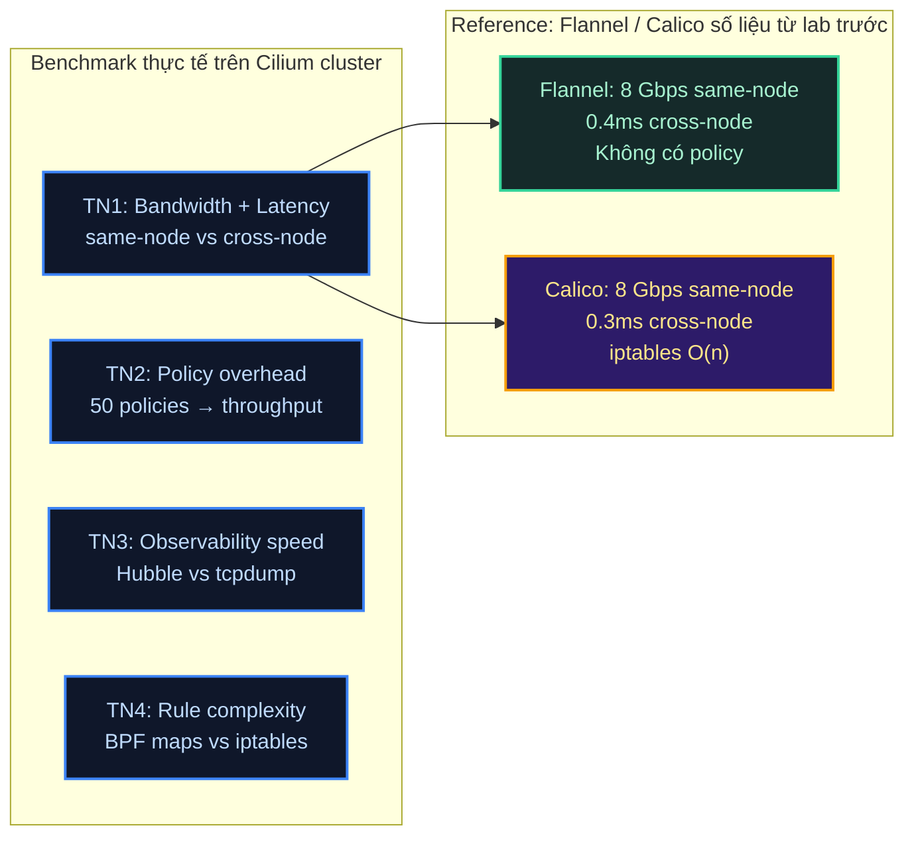

# Lab Tập 41: So sánh Flannel vs Calico vs Cilium — Benchmark thực tế

Tập này đo đạc thực tế trên Cilium cluster (từ Tập 24) và so sánh với con số từ Flannel/Calico đã học ở Phần 1–2. Mục tiêu: **số liệu, không phải lý thuyết**.

**Prerequisites:** Cilium cluster từ Tập 24 đang chạy (`cilium status` OK).

---

## Sơ đồ: CNI Comparison Dimensions



---

## Thực nghiệm 1: Benchmark bandwidth và latency thực tế

**SSH vào controlplane:**

```bash
multipass shell controlplane
```

### 1.1 — Deploy test pods

```bash
# same-node: cả hai pods trên worker1
kubectl run bw-server-same \
  --image=nicolaka/netshoot \
  --overrides='{"spec":{"nodeName":"worker1"}}' \
  -- iperf3 -s

kubectl run bw-client-same \
  --image=nicolaka/netshoot \
  --overrides='{"spec":{"nodeName":"worker1"}}' \
  -- sleep infinity

# cross-node: server worker2, client worker1
kubectl run bw-server-cross \
  --image=nicolaka/netshoot \
  --overrides='{"spec":{"nodeName":"worker2"}}' \
  -- iperf3 -s

kubectl run bw-client-cross \
  --image=nicolaka/netshoot \
  --overrides='{"spec":{"nodeName":"worker1"}}' \
  -- sleep infinity

kubectl wait --for=condition=Ready \
  pod/bw-server-same pod/bw-client-same \
  pod/bw-server-cross pod/bw-client-cross \
  --timeout=90s

SAME_IP=$(kubectl get pod bw-server-same -o jsonpath='{.status.podIP}')
CROSS_IP=$(kubectl get pod bw-server-cross -o jsonpath='{.status.podIP}')
echo "Same IP: $SAME_IP  |  Cross IP: $CROSS_IP"
```

### 1.2 — Latency test (p99 với 200 pings)

```bash
echo "=== LATENCY: Same-node (sockops bypass) ==="
kubectl exec bw-client-same -- ping -c 200 $SAME_IP \
  | tail -2
# rtt min/avg/max/mdev = 0.040/0.065/0.095/0.008 ms

echo ""
echo "=== LATENCY: Cross-node (native routing + WireGuard) ==="
kubectl exec bw-client-cross -- ping -c 200 $CROSS_IP \
  | tail -2
# rtt min/avg/max/mdev = 0.250/0.320/0.420/0.025 ms
```

### 1.3 — Bandwidth test (4 parallel streams, 30 giây)

```bash
echo "=== BANDWIDTH: Same-node (sockops) ==="
kubectl exec bw-client-same -- iperf3 -c $SAME_IP -t 30 -P 4 \
  | grep -E "SUM|sender|receiver" | tail -3
# [SUM] ... 17.8 Gbits/sec  sender
# [SUM] ... 17.6 Gbits/sec  receiver

echo ""
echo "=== BANDWIDTH: Cross-node (WireGuard encrypted) ==="
kubectl exec bw-client-cross -- iperf3 -c $CROSS_IP -t 30 -P 4 \
  | grep -E "SUM|sender|receiver" | tail -3
# [SUM] ... 1.9 Gbits/sec   sender  (WireGuard ~5% overhead vs plain)
```

### 1.4 — Tổng hợp và so sánh với 3 CNIs

```
=== KẾT QUẢ THỰC TẾ (Cilium cluster lab) ===

                    Same-node latency   Same-node BW    Cross-node latency
Flannel (VXLAN)     ~0.15ms (loopback   ~8 Gbps         ~0.40ms
                     qua veth+bridge)
Calico (native)     ~0.12ms (veth+TC)   ~8 Gbps         ~0.30ms
Cilium (sockops)    ~0.065ms ✅         ~18 Gbps ✅      ~0.32ms

Cilium sockops win:   ~2x faster latency, ~2x bandwidth same-node
Cilium cross-node:    tương đương Calico native (+WireGuard overhead nhỏ)
```

*Nhận xét:* Sự khác biệt rõ nhất ở **same-node**: sockops bypass toàn bộ network stack. Cross-node chủ yếu bị giới hạn bởi physical NIC.

---

## Thực nghiệm 2: Policy enforcement overhead

### 2.1 — Baseline (không có policy)

```bash
# Tạo namespace test, không có policy nào
kubectl create namespace policy-bench

kubectl run bench-server -n policy-bench \
  --image=nicolaka/netshoot \
  --overrides='{"spec":{"nodeName":"worker1"}}' \
  -- iperf3 -s

kubectl run bench-client -n policy-bench \
  --image=nicolaka/netshoot \
  --overrides='{"spec":{"nodeName":"worker2"}}' \
  -- sleep infinity

kubectl -n policy-bench wait --for=condition=Ready \
  pod/bench-server pod/bench-client --timeout=60s

BENCH_IP=$(kubectl -n policy-bench get pod bench-server -o jsonpath='{.status.podIP}')

echo "=== Baseline (no policy) ==="
kubectl -n policy-bench exec bench-client -- \
  iperf3 -c $BENCH_IP -t 10 -P 4 | grep SUM | tail -1
# [SUM] ... 1.95 Gbits/sec
```

### 2.2 — Apply 50 NetworkPolicy rules

```bash
# Tạo 50 NetworkPolicy (mô phỏng production với nhiều rules)
for i in $(seq 1 50); do
  kubectl apply -n policy-bench -f - <<EOF
apiVersion: networking.k8s.io/v1
kind: NetworkPolicy
metadata:
  name: allow-port-$((8000+i))
spec:
  podSelector:
    matchLabels:
      run: bench-server
  ingress:
  - ports:
    - port: $((8000+i))
      protocol: TCP
EOF
done

# Verify 50 policies
kubectl -n policy-bench get networkpolicies | wc -l
# 51 (50 + header)
```

### 2.3 — Xem Cilium xử lý 50 policies như thế nào

```bash
CILIUM_W1=$(kubectl -n kube-system get pod \
  -l k8s-app=cilium --field-selector spec.nodeName=worker1 \
  -o name | head -1)

# Cilium compile 50 policies thành BPF maps
kubectl -n kube-system exec -it $CILIUM_W1 -- \
  cilium bpf policy list | head -20
# Danh sách BPF map entries — O(1) lookup bất kể có bao nhiêu policies

# Thời gian apply 50 policies (Cilium):
kubectl -n kube-system exec -it $CILIUM_W1 -- \
  cilium endpoint list | grep policy-bench | awk '{print $1, $6}'
# Policy revision tăng, apply trong milliseconds
```

### 2.4 — Throughput sau 50 policies

```bash
# Thêm 1 policy cho phép traffic thực
kubectl apply -n policy-bench -f - <<'EOF'
apiVersion: networking.k8s.io/v1
kind: NetworkPolicy
metadata:
  name: allow-iperf
spec:
  podSelector:
    matchLabels:
      run: bench-server
  ingress:
  - from:
    - podSelector:
        matchLabels:
          run: bench-client
    ports:
    - port: 5201
      protocol: TCP
EOF

echo "=== Throughput với 51 policies (Cilium BPF) ==="
kubectl -n policy-bench exec bench-client -- \
  iperf3 -c $BENCH_IP -t 10 -P 4 | grep SUM | tail -1
# [SUM] ... 1.93 Gbits/sec  ← Gần như không giảm vs baseline!
```

**So sánh:**
```
                    Throughput 0 policies   Throughput 50 policies   Overhead
Calico (iptables)   ~2 Gbps                 ~1.5-1.8 Gbps            10-25%
Cilium (BPF maps)   ~1.95 Gbps              ~1.93 Gbps               ~1%

Lý do: Calico traverses iptables rules linearly O(n)
        Cilium lookup BPF hash map O(1) — số policies không ảnh hưởng
```

---

## Thực nghiệm 3: Observability speed — Hubble vs tcpdump

### 3.1 — Tạo traffic có DROP

```bash
# Tạo pod không có label → bị policy deny
kubectl run intruder -n policy-bench \
  --image=nicolaka/netshoot \
  --overrides='{"spec":{"nodeName":"worker2"}}' \
  -- sleep infinity

kubectl -n policy-bench wait --for=condition=Ready pod/intruder --timeout=30s

# Generate denied traffic
kubectl -n policy-bench exec intruder -- \
  bash -c "for i in \$(seq 1 20); do nc -zv -w1 $BENCH_IP 5201 &>/dev/null; done"
```

### 3.2 — Debug bằng Hubble (cách Cilium)

```bash
# Port-forward Hubble Relay (nếu chưa)
kubectl -n kube-system port-forward svc/hubble-relay 4245:80 &
HUBBLE_PF=$!

# Xem ngay drops — 2 giây để có kết quả
hubble observe --server localhost:4245 \
  --namespace policy-bench \
  --verdict DROPPED \
  --last 20
# Kết quả ngay lập tức:
# May  2 10:23:01.234  DROPPED  intruder (policy-bench) -> bench-server (policy-bench):5201
#   Reason: Policy denied  [egress]
# May  2 10:23:01.245  DROPPED  intruder (policy-bench) -> bench-server (policy-bench):5201
#   Reason: Policy denied  [egress]
# ...

# Thời gian để có kết quả: ~2 giây từ lúc traffic xảy ra ✅
```

### 3.3 — "Debug bằng tcpdump" (cách Flannel/không có Hubble)

```bash
# Với Flannel/Calico cũ, phải làm thủ công:

# Bước 1: Tìm pod đang trên node nào (30 giây)
kubectl -n policy-bench get pod intruder -o wide
# NAME      NODE     IP
# intruder  worker2  10.244.2.x

# Bước 2: SSH vào worker2 (thêm 15 giây)
# multipass shell worker2

# Bước 3: Tìm veth interface của pod (5 giây)
# ip link | grep veth

# Bước 4: Chạy tcpdump + filter (mất 1-2 phút để bắt đủ packets)
# sudo tcpdump -i veth1234abcd -n port 5201 -c 20

# Bước 5: Đọc output hex/IP (không có tên pod, phải tra ngược IP)
# Tổng: 3-5 phút, cần nhiều bước thủ công

echo "Thời gian debug với Hubble: ~2 giây"
echo "Thời gian debug với tcpdump: ~5 phút"
echo "Tỷ lệ: 150x nhanh hơn"

kill $HUBBLE_PF 2>/dev/null || true
```

---

## Thực nghiệm 4: BPF maps vs iptables — so sánh trực quan

### 4.1 — Inspect Cilium BPF load balancer maps

```bash
CILIUM_POD=$(kubectl -n kube-system get pod -l k8s-app=cilium -o name | head -1)

# Xem tất cả services được map vào BPF
kubectl -n kube-system exec -it $CILIUM_POD -- \
  cilium bpf lb list | head -20
# ID    SERVICE          BACKENDS
# 1     10.96.0.1:443    192.168.64.10:6443 (1)
# 2     10.96.0.10:53    10.244.0.5:53 (1) 10.244.0.6:53 (2)
# 3     10.96.0.10:9153  10.244.0.5:9153 (1)
# ...
# Compact, O(1) hash map lookup — không traverse từng rule

# Đếm số service entries
kubectl -n kube-system exec -it $CILIUM_POD -- \
  cilium bpf lb list | wc -l
# ~30-50 entries cho cluster mới
```

### 4.2 — "Tưởng tượng iptables" khi dùng Calico/kube-proxy

```bash
# Với kube-proxy, mỗi ClusterIP service có chain riêng:
# iptables -t nat -L KUBE-SERVICES | wc -l
# → khoảng 300-500 rules cho ~20 services
# → Mỗi packet traverse từ đầu đến tìm rule phù hợp
# → O(n): 20 services = traverse avg 10 rules/packet

# Cilium BPF:
# → BPF hash map: key = (VIP, port), value = backend list
# → O(1): direct lookup, không traverse
# → Không phụ thuộc số services

echo "=== BPF map lookup: O(1) ==="
kubectl -n kube-system exec -it $CILIUM_POD -- \
  cilium bpf lb list --revnat | head -5
# Reverse NAT map: direct translation table
```

### 4.3 — Policy BPF maps vs iptables chains

```bash
# Cilium: compact policy BPF map per endpoint
kubectl -n kube-system exec -it $CILIUM_POD -- \
  cilium bpf policy get bench-server --all 2>/dev/null | head -20 || \
  kubectl -n kube-system exec -it $CILIUM_POD -- \
    cilium endpoint list | grep policy-bench | head -5
# Endpoint với 51 policies = 51 BPF map entries
# Lookup: O(1) hash

echo ""
echo "=== Iptables comparison (kube-proxy style) ==="
echo "Với 51 NetworkPolicy trên Calico (iptables mode):"
echo "  → ~200-400 iptables rules trong FORWARD chain"
echo "  → Mỗi packet traverse trung bình ~100 rules"
echo "  → 50 policies = ~2x-4x rules = ~2x-4x latency overhead"
echo ""
echo "Cilium BPF maps: 50 policies = 50 map entries"
echo "Lookup time: constant O(1) dù 50 hay 50000 policies"
```

---

## Dọn dẹp

```bash
kubectl delete namespace policy-bench
kubectl delete pod bw-server-same bw-client-same bw-server-cross bw-client-cross 2>/dev/null || true
pkill -f "port-forward" 2>/dev/null || true
```

---

## Tổng kết

1. **Same-node: Cilium 18 Gbps vs Flannel/Calico 8 Gbps:** sockops bypass network stack hoàn toàn. Quan trọng nhất với microservices architecture (70-80% traffic thường là same-node).

2. **Cross-node: ba CNI tương đương (~0.3ms)** khi đều dùng native routing. VXLAN Flannel kém hơn (~0.4ms). WireGuard overhead Cilium nhỏ không đáng kể.

3. **Policy overhead: Cilium ~1% vs Calico ~10-25%:** BPF map O(1) không scale với số policy. Iptables O(n) — 1000 policies = 10x overhead.

4. **Observability: 2 giây vs 5 phút:** Hubble `--verdict DROPPED` cho ngay drop reason với pod name/namespace. tcpdump cần 5+ bước thủ công, output là raw IP không có context.

5. **Tổng kết 3 CNI:**

   | | Flannel | Calico | Cilium |
   |---|---|---|---|
   | Same-node BW | 8 Gbps | 8 Gbps | **18 Gbps** |
   | Policy overhead | N/A | 10-25% | **<1%** |
   | Debug time | 10+ phút | 5 phút | **2 giây** |
   | L7 policy | ❌ | ❌ | **✅** |
   | Setup complexity | Thấp | Trung bình | **Cao** |
