# Lab Tập 42: Cilium LB IPAM + Egress Gateway — On-prem LoadBalancer & Fixed Egress IP

Tập này giải quyết hai vấn đề phổ biến nhất khi triển khai Cilium on-prem:
1. **LoadBalancer type Service không có cloud provider** → Cilium tự cấp phát IP và announce qua L2 ARP
2. **Traffic ra ngoài cần đi qua IP cố định** → Egress Gateway route toàn bộ egress của namespace qua một node cụ thể

**Prerequisites:** Cilium cluster từ Tập 23. Không cần MetalLB hay cloud LB.

---

### Sơ đồ kiến trúc

```mermaid
graph TD
  subgraph lb_ipam ["LB IPAM — L2 Announcement"]
    SVC["Service type=LoadBalancer"] -->|"CiliumLoadBalancerIPPool\n192.168.64.200/29"| IP["EXTERNAL-IP: 192.168.64.200"]
    IP -->|"CiliumL2AnnouncementPolicy\nARP reply từ leader node"| HOST["Host Machine\n(curl 192.168.64.200)"]
  end

  subgraph egress_gw ["Egress Gateway"]
    POD["Pod (namespace: egress-demo)\nworker1"] -->|"CiliumEgressGatewayPolicy"| EGW["worker2\n(egress gateway node)\nIP: 192.168.64.z"]
    EGW -->|"SNAT source = 192.168.64.z"| EXT["External Server\n(sees worker2 IP)"]
  end

  style SVC fill:#0f172a,stroke:#3b82f6,color:#bfdbfe
  style IP fill:#152a2a,stroke:#34d399,color:#a7f3d0
  style HOST fill:#1e293b,stroke:#ec4899,color:#fbcfe8
  style POD fill:#1e1e38,stroke:#a78bfa,color:#e2e8f0
  style EGW fill:#2d080a,stroke:#f87171,color:#fca5a5
  style EXT fill:#2d1b69,stroke:#f59e0b,color:#fde68a
```



---

## Chuẩn bị: Enable LB IPAM + Egress Gateway trong Cilium

**SSH vào controlplane:**

```bash
multipass shell controlplane
```

1. Xác nhận dải IP Multipass (dùng làm LB pool):
   ```bash
   # IP của các nodes
   kubectl get nodes -o custom-columns="NAME:.metadata.name,IP:.status.addresses[0].address"
   # controlplane  192.168.64.x
   # worker1       192.168.64.y
   # worker2       192.168.64.z

   # LB pool sẽ dùng: 192.168.64.200-207 (nằm trong cùng subnet /24)
   # Verify range này chưa bị dùng:
   ping -c1 192.168.64.200 && echo "IN USE!" || echo "Free ✅"
   ```

2. Upgrade Cilium thêm 3 features: L2 Announcement + Egress Gateway + k8sServiceUpdateRate:
   ```bash
   export CONTROL_PLANE_IP=$(ip -4 addr show \
     | grep 'inet ' | grep -v '127.0.0.1' \
     | awk '{print $2}' | cut -d/ -f1 | head -1)

   helm upgrade cilium cilium/cilium \
     --namespace kube-system \
     --reuse-values \
     --set l2announcements.enabled=true \
     --set l2announcements.leaseDuration=3s \
     --set l2announcements.leaseRenewDeadline=1s \
     --set l2announcements.leaseRetryPeriod=200ms \
     --set k8sServiceUpdateRate=1 \
     --set egressGateway.enabled=true
   ```

3. Chờ Cilium restart:
   ```bash
   kubectl -n kube-system rollout status daemonset/cilium --timeout=120s
   cilium status | grep -E "L2|Egress|KubeProxy"
   # KubeProxyReplacement: True
   # Egress Gateway: Enabled  ← mới
   ```

---

## Thực nghiệm 1: Cilium LB IPAM — LoadBalancer không cần cloud

**Vấn đề:** `kubectl expose --type=LoadBalancer` → EXTERNAL-IP = `<pending>` mãi mãi trên bare-metal/on-prem.

**Giải pháp:** CiliumLoadBalancerIPPool cấp IP từ pool + CiliumL2AnnouncementPolicy announce ARP trên L2.

### 1.1 — Tạo LB IP Pool

```bash
kubectl apply -f - <<'EOF'
apiVersion: "cilium.io/v2alpha1"
kind: CiliumLoadBalancerIPPool
metadata:
  name: lab-lb-pool
spec:
  blocks:
  - cidr: "192.168.64.200/29"
  serviceSelector:
    matchExpressions:
    - key: "io.cilium/lb-ipam-ips"
      operator: NotIn
      values: ["exclude"]
EOF

kubectl get ciliumloadbalancerippool lab-lb-pool
# NAME          DISABLED   CONFLICTING   IPS AVAILABLE   AGE
# lab-lb-pool   false      False         8               5s
```

### 1.2 — Tạo L2 Announcement Policy

```bash
kubectl apply -f - <<'EOF'
apiVersion: "cilium.io/v2alpha1"
kind: CiliumL2AnnouncementPolicy
metadata:
  name: default-l2
spec:
  nodeSelector:
    matchExpressions:
    - key: node-role.kubernetes.io/control-plane
      operator: DoesNotExist
  interfaces:
  - ^eth[0-9]+
  externalIPs: false
  loadBalancerIPs: true
EOF

# Workers sẽ announce LB IPs (không dùng controlplane)
kubectl get ciliuml2announcementpolicy
```

### 1.3 — Deploy service và verify nhận EXTERNAL-IP

```bash
# Deploy HTTP server
kubectl run lb-demo --image=nginx --port=80
kubectl expose pod lb-demo --type=LoadBalancer --port=80

# Chờ nhận IP (thường < 10 giây)
kubectl get svc lb-demo -w
# NAME      TYPE           CLUSTER-IP    EXTERNAL-IP       PORT(S)
# lb-demo   LoadBalancer   10.96.x.x     192.168.64.200    80:xxxxx/TCP ✅

# Verify IP đã assigned từ pool
kubectl get ciliumloadbalancerippool lab-lb-pool -o jsonpath='{.status}' | python3 -m json.tool
# "allocatedIPs": ["192.168.64.200"]
```

### 1.4 — Access từ host machine (ngoài cluster)

```bash
# Thoát khỏi VM, test từ host:
# exit  (về host machine)

curl -s http://192.168.64.200/
# <!DOCTYPE html> ... Welcome to nginx! ... ✅

# Verify ARP: host biết IP này qua worker1 hoặc worker2
# arp -n 192.168.64.200
# 192.168.64.200 (192.168.64.y)  at xx:xx:xx:xx:xx:xx  ← worker1 đang "own" IP này
```

### 1.5 — Leader election: thay đổi khi node fail

```bash
# Từ trong cluster:
multipass shell controlplane

# Xem node nào đang "own" LB IP (leader election)
kubectl -n kube-system get ciliuminternallbippool 2>/dev/null || \
kubectl get lease -n kube-system | grep lb

# Simulate worker1 fail: drain node → IP chuyển sang worker2
kubectl drain worker1 --ignore-daemonsets --delete-emptydir-data

# Từ host: curl vẫn work (IP chuyển sang worker2 qua ARP)
# curl http://192.168.64.200/  → still works ✅ (failover < 5s)

kubectl uncordon worker1
```

*Nhận xét:* Cilium LB IPAM thay thế hoàn toàn MetalLB. L2 announcement dùng leader election — node nào được chọn sẽ reply ARP cho LB IP. Khi node fail, leader mới được bầu trong vòng `leaseDuration` (3s trong lab).

---

## Thực nghiệm 2: Egress Gateway — Fixed Source IP ra ngoài

**Vấn đề production:** Firewall rules yêu cầu traffic từ namespace `payment` phải đi qua IP cụ thể. Nhưng Pod IP thay đổi mỗi lần restart → firewall rules phải update liên tục.

**Giải pháp:** CiliumEgressGatewayPolicy route toàn bộ egress của pod selector qua một node cụ thể. Source IP = IP của egress node (ổn định).

### 2.1 — Chuẩn bị

```bash
# Designate worker2 làm egress gateway node
kubectl label node worker2 role=egress-gateway

# Lấy IP của worker2 (sẽ là egress IP)
EGRESS_NODE_IP=$(kubectl get node worker2 \
  -o jsonpath='{.status.addresses[?(@.type=="InternalIP")].address}')
echo "Egress Gateway IP: $EGRESS_NODE_IP"
# 192.168.64.z

# Deploy external HTTP recorder (simulate external server)
# Dùng httpbin trên controlplane với hostNetwork để nó thấy real source IP
kubectl apply -f - <<'EOF'
apiVersion: v1
kind: Pod
metadata:
  name: http-recorder
  namespace: default
spec:
  nodeName: controlplane
  hostNetwork: true
  containers:
  - name: recorder
    image: kennethreitz/httpbin
    ports:
    - containerPort: 80
      hostPort: 80
EOF

kubectl wait --for=condition=Ready pod/http-recorder --timeout=60s
RECORDER_IP=$(kubectl get node controlplane \
  -o jsonpath='{.status.addresses[?(@.type=="InternalIP")].address}')
echo "Recorder IP: $RECORDER_IP"
```

### 2.2 — Baseline: xem source IP mặc định

```bash
# Deploy pod trên worker1 (không có egress policy)
kubectl create namespace egress-demo
kubectl run test-pod -n egress-demo \
  --image=nicolaka/netshoot \
  --overrides='{"spec":{"nodeName":"worker1"}}' \
  -- sleep infinity

kubectl -n egress-demo wait --for=condition=Ready pod/test-pod --timeout=30s

# Gọi recorder và xem source IP
kubectl -n egress-demo exec test-pod -- \
  curl -s http://${RECORDER_IP}/ip
# {"origin": "10.244.1.x"}  ← Pod IP của test-pod trên worker1 (thay đổi mỗi restart)
```

### 2.3 — Apply Egress Gateway Policy

```bash
cat <<EOF | kubectl apply -f -
apiVersion: cilium.io/v2
kind: CiliumEgressGatewayPolicy
metadata:
  name: payment-egress
spec:
  selectors:
  - podSelector:
      matchLabels:
        io.kubernetes.pod.namespace: egress-demo
  destinationCIDRs:
  - 0.0.0.0/0
  egressGateway:
    nodeSelector:
      matchLabels:
        role: egress-gateway
    egressIP: ${EGRESS_NODE_IP}
EOF

kubectl get ciliumegressgatewaypolicy payment-egress
# payment-egress   1m
```

### 2.4 — Verify: source IP đổi sang egress node IP

```bash
# Gọi lại recorder
kubectl -n egress-demo exec test-pod -- \
  curl -s http://${RECORDER_IP}/ip
# {"origin": "192.168.64.z"}  ← IP của worker2 (stable!) ✅

# Verify với nhiều lần gọi: source IP luôn = worker2 IP
for i in 1 2 3 4 5; do
  kubectl -n egress-demo exec test-pod -- \
    curl -s http://${RECORDER_IP}/ip | grep origin
done
# {"origin": "192.168.64.z"}  ← consistent

# Pod mới restart → source IP vẫn stable
kubectl -n egress-demo delete pod test-pod
kubectl run test-pod -n egress-demo \
  --image=nicolaka/netshoot \
  --overrides='{"spec":{"nodeName":"worker1"}}' \
  -- sleep infinity
kubectl -n egress-demo wait --for=condition=Ready pod/test-pod --timeout=30s

kubectl -n egress-demo exec test-pod -- \
  curl -s http://${RECORDER_IP}/ip
# {"origin": "192.168.64.z"}  ← vẫn worker2 IP sau restart ✅
```

### 2.5 — Xem Egress Gateway trong Hubble

```bash
kubectl -n kube-system port-forward svc/hubble-relay 4245:80 &

# Observe egress flows
hubble observe --server localhost:4245 \
  --namespace egress-demo \
  --type trace \
  --follow &

# Generate traffic
kubectl -n egress-demo exec test-pod -- curl -s http://${RECORDER_IP}/ip

# Hubble output:
# egress-demo/test-pod → controlplane/http-recorder:80
# → verdict: FORWARDED via EgressGateway worker2

kill %2 %1 2>/dev/null || true
```

---

## Dọn dẹp

```bash
kubectl delete namespace egress-demo
kubectl delete pod lb-demo http-recorder
kubectl delete svc lb-demo
kubectl delete ciliumegressgatewaypolicy payment-egress
kubectl delete ciliumloadbalancerippool lab-lb-pool
kubectl delete ciliuml2announcementpolicy default-l2
kubectl label node worker2 role-
```

---

## Tổng kết

1. **Cilium LB IPAM = MetalLB replacement:** CiliumLoadBalancerIPPool cấp IP từ CIDR pool. CiliumL2AnnouncementPolicy announce ARP trên L2. Không cần MetalLB, không cần cloud provider. Leader election failover < leaseDuration (3s).

2. **L2 Announcement chỉ dùng được khi nodes cùng L2 segment:** Multipass/bare-metal đều OK. Cloud (VPC routing) cần BGP announcement thay vì L2 (xem Tập 45).

3. **Egress Gateway = stable source IP cho firewall rules:** Pod IP thay đổi mỗi restart → CiliumEgressGatewayPolicy SNAT tất cả egress traffic qua egress node IP. Firewall rule cố định theo node IP, không cần update.

4. **Egress Gateway vs Pod CIDR masquerade:** Default masquerade dùng node IP ngẫu nhiên (pod có thể schedule trên bất kỳ node). Egress Gateway force traffic qua node cụ thể → source IP deterministic → firewall whitelisting ổn định.
