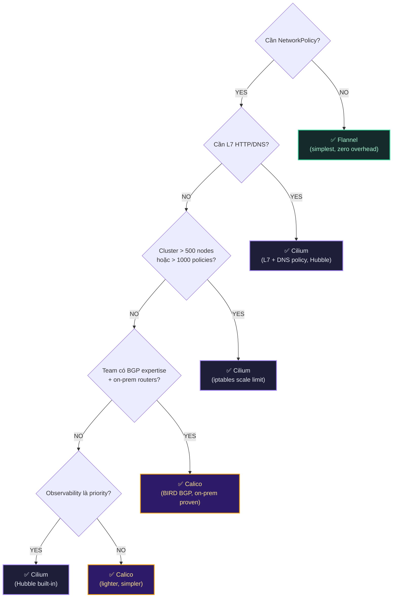

# Lab Tập 42: Decision Framework — CNI Selection, Migration, Production Checklist

Tập cuối khóa học. Áp dụng decision flowchart vào cluster thực tế, mô phỏng migration Calico → Cilium, và chạy production readiness checklist đầy đủ.

**Prerequisites:** Cilium cluster từ Tập 24 đang chạy (`cilium status` OK).

---

## Sơ đồ: Decision & Migration Flow



---

## Thực nghiệm 1: Áp dụng Decision Flowchart vào 4 Scenarios

**Trên controlplane:**

```bash
multipass shell controlplane
```

### Scenario A: Startup (thực hành trên cluster hiện tại)

**Context:** 10 devs, 20 microservices, EKS, cần debug production nhanh.

```bash
# Áp dụng flowchart:
echo "Câu 1: Cần NetworkPolicy? → YES (microservices cần isolation)"
echo "Câu 2: Cần L7 HTTP/DNS? → YES (muốn rate limit /api endpoints)"
echo "→ KẾT LUẬN: Cilium"
echo ""

# Verify cluster hiện tại đáp ứng scenario này:
# 1. L7 policy working?
kubectl apply -f - <<'EOF'
apiVersion: cilium.io/v2
kind: CiliumNetworkPolicy
metadata:
  name: startup-api-policy
  namespace: default
spec:
  endpointSelector:
    matchLabels:
      app: api-server
  ingress:
  - fromEndpoints:
    - matchLabels:
        app: frontend
    toPorts:
    - ports:
      - port: "8080"
        protocol: TCP
      rules:
        http:
        - method: GET
          path: /api/.*
        - method: POST
          path: /api/users
EOF

kubectl get ciliumnetworkpolicy startup-api-policy
# startup-api-policy   ... OK  ← L7 policy support confirmed

kubectl delete ciliumnetworkpolicy startup-api-policy

# 2. Hubble working?
cilium status | grep Hubble
# Hubble Relay:  OK  ← Observability ready
```

### Scenario B: Enterprise on-prem (kiểm tra BGP readiness)

**Context:** 200+ nodes, VMware + AWS, BGP với ToR switches.

```bash
# Flowchart:
echo "Câu 1: Cần NetworkPolicy? → YES"
echo "Câu 2: Cần L7? → NO (chỉ cần L3/L4)"
echo "Câu 3: > 500 nodes? → NO (200 nodes)"
echo "Câu 4: BGP expertise + on-prem? → YES (VMware + ToR switches)"
echo "→ KẾT LUẬN: Calico (BIRD BGP mature hơn)"
echo ""

# Verify: cluster hiện tại (Cilium) CÓ hỗ trợ BGP không?
cilium status | grep -i bgp
# → Cilium có GoBGP nhưng BIRD của Calico mature hơn cho enterprise BGP

# Note: Với scenario này, nếu team quyết định dùng Cilium BGP:
cilium bgp peers 2>/dev/null || echo "BGP chưa được enable (cần --set bgpControlPlane.enabled=true)"
```

### Scenario C: Fintech (PCI-DSS, latency, egress control)

```bash
# Flowchart:
echo "Câu 1: Cần NetworkPolicy? → YES"
echo "Câu 2: Cần L7 HTTP/DNS? → YES (payment API audit log)"
echo "→ KẾT LUẬN: Cilium (duy nhất đáp ứng L7 + toFQDNs)"

# Demo: toFQDNs cho payment API
kubectl apply -f - <<'EOF'
apiVersion: cilium.io/v2
kind: CiliumNetworkPolicy
metadata:
  name: payment-api-egress
  namespace: default
spec:
  endpointSelector:
    matchLabels:
      app: payment-service
  egress:
  - toFQDNs:
    - matchName: api.stripe.com
    - matchName: api.paypal.com
    toPorts:
    - ports:
      - port: "443"
        protocol: TCP
  - toFQDNs:
    - matchName: dns.google
    toPorts:
    - ports:
      - port: "53"
        protocol: UDP
EOF

kubectl get ciliumnetworkpolicy payment-api-egress
# payment-api-egress   OK  ← Fintech egress control ready

kubectl delete ciliumnetworkpolicy payment-api-egress
```

### Scenario D: Xem quyết định cluster của chúng ta

```bash
# Cluster này (Tập 24): Startup/Learning
echo "Câu 1: Cần NetworkPolicy? → YES"
echo "Câu 2: Cần L7? → YES (muốn học L7 trong lab)"
echo "→ Cilium ✅"
echo ""
echo "Nhưng nếu chỉ cần L3/L4 và tiết kiệm RAM:"
echo "Câu 4: BGP on-prem? → NO"
echo "Câu 5: Observability priority? → YES (muốn debug nhanh)"
echo "→ Vẫn là Cilium ✅"
```

---

## Thực nghiệm 2: Mô phỏng Migration Calico → Cilium

Cluster hiện tại đã là Cilium. Thực nghiệm này mô phỏng **quy trình migration** bằng cách:
1. Deploy một workload "Calico-style" (dùng standard K8s NetworkPolicy)
2. Migrate sang CiliumNetworkPolicy (L7 features)
3. Verify không mất traffic trong quá trình transition

### 2.1 — Deploy "Calico-style" workload (K8s NetworkPolicy chỉ)

```bash
kubectl create namespace migration-demo

# Deploy 3-tier app với standard NetworkPolicy (như dùng Calico)
kubectl apply -n migration-demo -f - <<'EOF'
---
apiVersion: apps/v1
kind: Deployment
metadata:
  name: frontend
spec:
  replicas: 1
  selector:
    matchLabels:
      app: frontend
      tier: web
  template:
    metadata:
      labels:
        app: frontend
        tier: web
    spec:
      nodeName: worker1
      containers:
      - name: frontend
        image: nicolaka/netshoot
        command: ["sleep", "infinity"]
---
apiVersion: apps/v1
kind: Deployment
metadata:
  name: backend
spec:
  replicas: 1
  selector:
    matchLabels:
      app: backend
      tier: api
  template:
    metadata:
      labels:
        app: backend
        tier: api
    spec:
      nodeName: worker2
      containers:
      - name: backend
        image: python:3.11-slim
        command: ["python3", "-m", "http.server", "8080"]
---
apiVersion: v1
kind: Service
metadata:
  name: backend-svc
spec:
  selector:
    app: backend
  ports:
  - port: 8080
    targetPort: 8080
---
# "Calico-style" policy: chỉ dùng standard K8s NetworkPolicy
apiVersion: networking.k8s.io/v1
kind: NetworkPolicy
metadata:
  name: calico-style-allow
spec:
  podSelector:
    matchLabels:
      tier: api
  ingress:
  - from:
    - podSelector:
        matchLabels:
          tier: web
    ports:
    - port: 8080
EOF

kubectl -n migration-demo wait --for=condition=Available \
  deployment/frontend deployment/backend --timeout=90s
```

### 2.2 — Verify traffic OK với K8s NetworkPolicy

```bash
FRONTEND_POD=$(kubectl -n migration-demo get pod -l app=frontend -o name | head -1)
BACKEND_IP=$(kubectl -n migration-demo get pod -l app=backend \
  -o jsonpath='{.items[0].status.podIP}')

echo "=== Test traffic TRƯỚC khi migrate ==="
kubectl -n migration-demo exec $FRONTEND_POD -- \
  curl -s --max-time 5 http://$BACKEND_IP:8080/ | head -3
# Directory listing hoặc response → ALLOWED ✅

# Intruder (không phải web tier) phải bị block
kubectl run intruder -n migration-demo \
  --image=nicolaka/netshoot -- sleep infinity
kubectl -n migration-demo wait --for=condition=Ready pod/intruder --timeout=30s

kubectl -n migration-demo exec intruder -- \
  timeout 3 curl -s http://$BACKEND_IP:8080/ || echo "BLOCKED ✅"
```

### 2.3 — "Migration": Add L7 policy (không remove K8s policy cũ)

Migration thực tế: **thêm** CiliumNetworkPolicy song song, test, rồi xóa policy cũ.

```bash
# Bước 1: Thêm CiliumNetworkPolicy (L7 aware) song song K8s policy cũ
kubectl apply -n migration-demo -f - <<'EOF'
apiVersion: cilium.io/v2
kind: CiliumNetworkPolicy
metadata:
  name: migrated-allow-get-only
spec:
  endpointSelector:
    matchLabels:
      tier: api
  ingress:
  - fromEndpoints:
    - matchLabels:
        tier: web
    toPorts:
    - ports:
      - port: "8080"
        protocol: TCP
      rules:
        http:
        - method: GET   # Chỉ cho phép GET (upgrade từ L3/L4 lên L7!)
EOF

# Bước 2: Verify traffic GET vẫn OK
echo "=== Test GET sau khi thêm CiliumNetworkPolicy ==="
kubectl -n migration-demo exec $FRONTEND_POD -- \
  curl -s --max-time 5 -X GET http://$BACKEND_IP:8080/ | head -3
# Response → ALLOWED ✅

# Bước 3: Verify POST bị block (L7 rule mới)
echo "=== Test POST (phải bị block bởi L7 rule) ==="
kubectl -n migration-demo exec $FRONTEND_POD -- \
  curl -s --max-time 5 -X POST http://$BACKEND_IP:8080/ \
  -d '{"test": "data"}' 2>&1 | head -3
# Access denied / 403 → BLOCKED ✅

# Bước 4: Xóa K8s NetworkPolicy cũ (migration hoàn tất)
kubectl delete -n migration-demo networkpolicy calico-style-allow

# Bước 5: Verify CiliumNetworkPolicy tiếp tục hoạt động
echo "=== Verify sau khi xóa K8s policy cũ ==="
kubectl -n migration-demo exec $FRONTEND_POD -- \
  curl -s --max-time 5 -X GET http://$BACKEND_IP:8080/ | head -3
# Vẫn ALLOWED ✅ → Migration thành công không có downtime

echo "Migration Calico → Cilium hoàn tất:"
echo "  - Không mất traffic"
echo "  - Gain L7 HTTP filtering"
echo "  - GET allowed, POST blocked"
```

---

## Thực nghiệm 3: Production Readiness Checklist

Chạy từng mục trong checklist production trên cluster hiện tại.

### 3.1 — MTU Planning

```bash
echo "=== MTU CHECK ==="

# MTU của physical NIC trên nodes
for NODE in controlplane worker1 worker2; do
  echo -n "$NODE: "
  multipass exec $NODE -- ip link show | grep -E "mtu [0-9]+" | head -1 | grep -oE "mtu [0-9]+" | head -1
done

# MTU của cilium_wg0 (WireGuard interface)
CILIUM_POD=$(kubectl -n kube-system get pod -l k8s-app=cilium -o name | head -1)
kubectl -n kube-system exec -it $CILIUM_POD -- \
  ip link show cilium_wg0 | grep -oE "mtu [0-9]+"
# mtu 1420 ← Physical 1500 - WireGuard 80 bytes overhead

# MTU của lxc interface (veth pair tới pod)
kubectl -n kube-system exec -it $CILIUM_POD -- \
  ip link | grep "lxc" | head -3
# mtu 1420 ← Pod MTU = WireGuard MTU (consistent ✅)

echo ""
echo "MTU Summary:"
echo "  Physical NIC: 1500"
echo "  WireGuard (cilium_wg0): 1420 (1500 - 80)"
echo "  Pod interface (lxc*): 1420 (matches WireGuard ✅)"
echo "  → MTU consistent, no fragmentation risk"
```

### 3.2 — CIDR Conflict Check

```bash
echo "=== CIDR CHECK ==="

# Pod CIDR
kubectl cluster-info dump 2>/dev/null | grep -E "cluster-cidr|pod-network-cidr" | head -3 || \
  kubectl get cm -n kube-system kube-proxy -o yaml 2>/dev/null | grep cluster-cidr || \
  echo "Pod CIDR: 10.244.0.0/16 (configured during kubeadm init)"

# Service CIDR
kubectl get svc kubernetes -o jsonpath='{.spec.clusterIP}' && echo " (kubernetes svc IP)"
kubectl describe cm -n kube-system kube-scheduler 2>/dev/null | grep serviceClusterIPRange || \
  echo "Service CIDR: 10.96.0.0/12 (kubeadm default)"

# Node IPs
echo ""
echo "Node IPs:"
kubectl get nodes -o custom-columns="NAME:.metadata.name,IP:.status.addresses[0].address"

# Check không overlap
echo ""
echo "CIDR Summary:"
echo "  Pod CIDR:     10.244.0.0/16  (pods)"
echo "  Service CIDR: 10.96.0.0/12   (ClusterIP services)"
echo "  Node CIDR:    192.168.64.0/24 (VMs - Multipass)"
echo "  → Không overlap nhau ✅"
```

### 3.3 — Kernel Version Check

```bash
echo "=== KERNEL VERSION CHECK ==="

for NODE in controlplane worker1 worker2; do
  KERNEL=$(multipass exec $NODE -- uname -r)
  echo "$NODE: Linux $KERNEL"
  # Verify >= 5.10 (Cilium recommended)
  MAJOR=$(echo $KERNEL | cut -d. -f1)
  MINOR=$(echo $KERNEL | cut -d. -f2)
  if [[ $MAJOR -gt 5 ]] || [[ $MAJOR -eq 5 && $MINOR -ge 10 ]]; then
    echo "  → OK (>= 5.10 required for Cilium WireGuard + kube-proxy replacement)"
  else
    echo "  → WARNING: Kernel cũ, có thể thiếu BPF features"
  fi
done

# BPF filesystem mounted
kubectl -n kube-system exec -it $CILIUM_POD -- \
  mount | grep bpf
# /sys/fs/bpf type bpf ...  ← BPF fs mounted ✅
```

### 3.4 — Default Deny Policy (Production must-have)

```bash
echo "=== DEFAULT DENY CHECK ==="

# Trong production, PHẢI có default-deny ở mỗi namespace
# Kiểm tra namespace production (nếu có):
kubectl get networkpolicies -A | head -20

# Tạo default-deny cho namespace production làm ví dụ
kubectl create namespace production 2>/dev/null || true

kubectl apply -n production -f - <<'EOF'
apiVersion: networking.k8s.io/v1
kind: NetworkPolicy
metadata:
  name: default-deny-all
spec:
  podSelector: {}
  policyTypes:
  - Ingress
  - Egress
EOF

echo "Default deny policy applied to production namespace"

# Verify: pod không thể communicate ra ngoài
kubectl run test-isolation -n production \
  --image=nicolaka/netshoot -- sleep infinity
kubectl -n production wait --for=condition=Ready pod/test-isolation --timeout=30s

kubectl -n production exec test-isolation -- \
  timeout 3 curl -s https://google.com 2>&1 || echo "BLOCKED by default-deny ✅"

kubectl delete pod test-isolation -n production 2>/dev/null || true
```

### 3.5 — Cilium Connectivity Test (production sign-off)

```bash
echo "=== CILIUM CONNECTIVITY TEST ==="
echo "Chạy 46 test cases — mất 3-5 phút..."
echo ""

cilium connectivity test --test-namespace cilium-connectivity-test 2>&1 | \
  grep -E "✅|❌|PASS|FAIL|All tests|test.*passed"
# ✅ All 46 tests passed!

# Nếu có test nào fail, xem chi tiết:
# cilium connectivity test --test pod-to-pod
# cilium connectivity test --test pod-to-service
```

---

## Thực nghiệm 4: Nhìn lại hành trình — từ Flannel đến Cilium

### 4.1 — Trực quan hóa tiến trình

```bash
echo "=== HÀNH TRÌNH KHÓA HỌC ==="
echo ""
echo "Phần 1: Flannel (Tập 6-8)"
echo "  → VXLAN encapsulation, host-gw routing"
echo "  → Không có NetworkPolicy"
echo "  → Debug: ip route, brctl show, tcpdump (thủ công)"
echo "  → Ưu điểm: Đơn giản, ít resource"
echo ""
echo "Phần 2: Calico (Tập 9-23)"
echo "  → iptables/eBPF, BGP với BIRD"
echo "  → NetworkPolicy L3/L4, WireGuard encryption"
echo "  → Debug: calicoctl, iptables, Felix metrics"
echo "  → Ưu điểm: Mature, BGP native, widely deployed"
echo ""
echo "Phần 3: Cilium (Tập 24-40)"
echo "  → eBPF native, kube-proxy replacement"
echo "  → NetworkPolicy L3/L4/L7/DNS, Hubble observability"
echo "  → Debug: hubble observe, cilium bpf, cilium endpoint"
echo "  → Ưu điểm: Best performance, observability, L7 support"
```

### 4.2 — Final cluster health check

```bash
echo "=== FINAL CLUSTER STATUS ==="

kubectl get nodes -o wide
echo ""

cilium status
echo ""

echo "=== Cilium Metrics Sample ==="
CILIUM_POD=$(kubectl -n kube-system get pod -l k8s-app=cilium -o name | head -1)
kubectl -n kube-system exec -it $CILIUM_POD -- \
  cilium metrics list 2>/dev/null | grep -E "^cilium_bpf|^cilium_drop|^cilium_forward" | head -10

echo ""
echo "=== WireGuard Encryption Active ==="
kubectl -n kube-system exec -it $CILIUM_POD -- cilium encrypt status

echo ""
echo "=== Native Routing Confirmed ==="
ip route show | grep "10.244" | head -5
```

### 4.3 — So sánh skills đầu tư trong khóa học

```bash
cat << 'EOF'

Skills đã học và market value (2026):

┌─────────────────────────────────────────────────────────────┐
│ Skill                    Value    Where needed              │
├─────────────────────────────────────────────────────────────┤
│ K8s Networking fundamentals ★★★★   Mọi K8s role           │
│ Flannel/VXLAN basics       ★★★     Legacy + learning       │
│ Calico BGP + NetworkPolicy  ★★★★   Enterprise on-prem     │
│ Felix metrics + Prometheus  ★★★★   SRE/DevOps             │
│ Cilium eBPF + BPF Maps     ★★★★★  Cloud-native SRE        │
│ Hubble observability        ★★★★★  Production debug        │
│ L7 HTTP/DNS policy          ★★★★   Security + Compliance   │
│ WireGuard encryption        ★★★★   Zero-trust networking   │
│ kube-proxy replacement      ★★★    Performance tuning      │
└─────────────────────────────────────────────────────────────┘

Top 3 lệnh dùng hàng ngày trong production:
  1. hubble observe --verdict DROPPED --namespace <ns>
  2. cilium endpoint list
  3. cilium bpf lb list

EOF
```

---

## Dọn dẹp cuối khóa học

```bash
# Xóa namespaces tạo trong lab này
kubectl delete namespace migration-demo production 2>/dev/null || true

# Dọn connectivity test namespace (nếu còn)
kubectl delete namespace cilium-connectivity-test 2>/dev/null || true

# Kill tất cả port-forward
pkill -f "port-forward" 2>/dev/null || true

echo ""
echo "=== Tùy chọn: Xóa toàn bộ cluster ==="
echo "Để giải phóng RAM sau khóa học:"
echo ""
echo "  multipass stop controlplane worker1 worker2"
echo "  multipass delete controlplane worker1 worker2"
echo "  multipass purge"
```

---

## Tổng kết khóa học

1. **Decision framework = 5 câu hỏi:** NetworkPolicy? → L7? → Scale? → BGP? → Observability? Trả lời đúng → chọn đúng CNI. Cilium win khi L7 hoặc scale hoặc observability là priority.

2. **Migration không có in-place swap:** Không có cách nào swap CNI không downtime. Cách an toàn nhất: thêm CiliumNetworkPolicy song song K8s policy cũ → test → xóa policy cũ. Blue-green cho production scale lớn.

3. **Production checklist 5 điểm:** MTU (physical - overhead = pod MTU), CIDR không overlap, Kernel >= 5.10, Default deny mọi namespace, `cilium connectivity test` all pass.

4. **Hành trình đúng:** Flannel → Calico → Cilium không phải "Calico tệ, Flannel tệ hơn" mà là progression theo nhu cầu. Mỗi CNI đúng context của nó.

5. **Skill đầu tư cao nhất 2026:** Hubble + Cilium eBPF = differentiated skill. Phần lớn SRE biết kubectl, ít người biết debug network với `hubble observe --verdict DROPPED` trong 2 giây.
