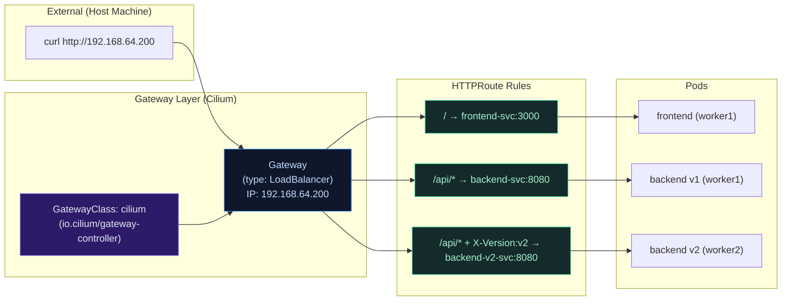

# Lab Tập 43: Gateway API + Cilium Ingress — North-South Traffic

Tập này xây dựng north-south traffic path đầy đủ: traffic từ bên ngoài cluster vào đến Pods. Cilium tích hợp Gateway API natively — không cần Nginx Ingress hay Istio cho routing đơn giản.

**Prerequisites:** Cilium cluster từ Tập 23, LB IPAM từ Tập 42 (cần EXTERNAL-IP).

---

### Sơ đồ: North-South Traffic Flow



---

## Chuẩn bị: Install Gateway API CRDs + Enable trong Cilium

**SSH vào controlplane:**

```bash
multipass shell controlplane
```

1. Install Gateway API CRDs (standard channel):
   ```bash
   kubectl apply -f https://raw.githubusercontent.com/kubernetes-sigs/gateway-api/v1.1.0/config/crd/standard/gateway.networking.k8s.io_gatewayclasses.yaml
   kubectl apply -f https://raw.githubusercontent.com/kubernetes-sigs/gateway-api/v1.1.0/config/crd/standard/gateway.networking.k8s.io_gateways.yaml
   kubectl apply -f https://raw.githubusercontent.com/kubernetes-sigs/gateway-api/v1.1.0/config/crd/standard/gateway.networking.k8s.io_httproutes.yaml
   kubectl apply -f https://raw.githubusercontent.com/kubernetes-sigs/gateway-api/v1.1.0/config/crd/standard/gateway.networking.k8s.io_referencegrants.yaml
   kubectl apply -f https://raw.githubusercontent.com/kubernetes-sigs/gateway-api/v1.1.0/config/crd/experimental/gateway.networking.k8s.io_tlsroutes.yaml 2>/dev/null || true
   kubectl apply -f https://raw.githubusercontent.com/kubernetes-sigs/gateway-api/v1.1.0/config/crd/experimental/gateway.networking.k8s.io_grpcroutes.yaml 2>/dev/null || true

   kubectl get crd | grep gateway
   # gatewayclasses.gateway.networking.k8s.io
   # gateways.gateway.networking.k8s.io
   # httproutes.gateway.networking.k8s.io
   # referencegrants.gateway.networking.k8s.io
   ```

2. Enable Cilium Gateway API controller:
   ```bash
   helm upgrade cilium cilium/cilium \
     --namespace kube-system \
     --reuse-values \
     --set gatewayAPI.enabled=true \
     --set gatewayAPI.hostNetwork.enabled=false

   kubectl -n kube-system rollout status daemonset/cilium --timeout=120s
   cilium status | grep -i gateway
   # Gateway API: Enabled ✅
   ```

3. Verify GatewayClass Cilium tự động tạo:
   ```bash
   kubectl get gatewayclass
   # NAME     CONTROLLER                    ACCEPTED   AGE
   # cilium   io.cilium/gateway-controller  True       30s
   ```

---

## Thực nghiệm 1: Basic Gateway + HTTPRoute

### 1.1 — Deploy ứng dụng demo

```bash
kubectl create namespace gateway-demo

kubectl apply -n gateway-demo -f - <<'EOF'
---
# Frontend
apiVersion: apps/v1
kind: Deployment
metadata:
  name: frontend
spec:
  replicas: 1
  selector:
    matchLabels:
      app: frontend
  template:
    metadata:
      labels:
        app: frontend
    spec:
      nodeName: worker1
      containers:
      - name: frontend
        image: hashicorp/http-echo
        args: ["-text=frontend v1", "-listen=:3000"]
        ports:
        - containerPort: 3000
---
apiVersion: v1
kind: Service
metadata:
  name: frontend-svc
spec:
  selector:
    app: frontend
  ports:
  - port: 3000
    targetPort: 3000
---
# Backend v1
apiVersion: apps/v1
kind: Deployment
metadata:
  name: backend-v1
spec:
  replicas: 1
  selector:
    matchLabels:
      app: backend
      version: v1
  template:
    metadata:
      labels:
        app: backend
        version: v1
    spec:
      nodeName: worker1
      containers:
      - name: backend
        image: hashicorp/http-echo
        args: ["-text=backend API v1", "-listen=:8080"]
        ports:
        - containerPort: 8080
---
apiVersion: v1
kind: Service
metadata:
  name: backend-v1-svc
spec:
  selector:
    app: backend
    version: v1
  ports:
  - port: 8080
    targetPort: 8080
---
# Backend v2
apiVersion: apps/v1
kind: Deployment
metadata:
  name: backend-v2
spec:
  replicas: 1
  selector:
    matchLabels:
      app: backend
      version: v2
  template:
    metadata:
      labels:
        app: backend
        version: v2
    spec:
      nodeName: worker2
      containers:
      - name: backend
        image: hashicorp/http-echo
        args: ["-text=backend API v2 - NEW", "-listen=:8080"]
        ports:
        - containerPort: 8080
---
apiVersion: v1
kind: Service
metadata:
  name: backend-v2-svc
spec:
  selector:
    app: backend
    version: v2
  ports:
  - port: 8080
    targetPort: 8080
EOF

kubectl -n gateway-demo wait --for=condition=Available \
  deployment/frontend deployment/backend-v1 deployment/backend-v2 \
  --timeout=90s
```

### 1.2 — Tạo Gateway

```bash
kubectl apply -n gateway-demo -f - <<'EOF'
apiVersion: gateway.networking.k8s.io/v1
kind: Gateway
metadata:
  name: lab-gateway
spec:
  gatewayClassName: cilium
  listeners:
  - name: http
    port: 80
    protocol: HTTP
    allowedRoutes:
      namespaces:
        from: Same
EOF

# Chờ Gateway được assign IP từ LB IPAM pool (Tập 42)
kubectl -n gateway-demo get gateway lab-gateway -w
# NAME          CLASS    ADDRESS           PROGRAMMED   AGE
# lab-gateway   cilium   192.168.64.200    True         15s ✅

GW_IP=$(kubectl -n gateway-demo get gateway lab-gateway \
  -o jsonpath='{.status.addresses[0].value}')
echo "Gateway IP: $GW_IP"
```

### 1.3 — Tạo HTTPRoute với path-based routing

```bash
kubectl apply -n gateway-demo -f - <<'EOF'
apiVersion: gateway.networking.k8s.io/v1
kind: HTTPRoute
metadata:
  name: lab-routes
spec:
  parentRefs:
  - name: lab-gateway
  rules:
  # /api/* → backend-v1
  - matches:
    - path:
        type: PathPrefix
        value: /api
    backendRefs:
    - name: backend-v1-svc
      port: 8080
  # / → frontend (default)
  - matches:
    - path:
        type: PathPrefix
        value: /
    backendRefs:
    - name: frontend-svc
      port: 3000
EOF

kubectl -n gateway-demo get httproute lab-routes
# NAME         HOSTNAMES   AGE   PARENTS
# lab-routes               10s   lab-gateway/...
```

### 1.4 — Test từ host machine

```bash
# Thoát khỏi VM
# exit

# Test path routing
curl -s http://192.168.64.200/
# frontend v1

curl -s http://192.168.64.200/api/users
# backend API v1

curl -s http://192.168.64.200/api/products
# backend API v1
```

---

## Thực nghiệm 2: Advanced Routing — Header-based Canary

### 2.1 — Thêm header-based routing (canary deployment)

```bash
multipass shell controlplane

kubectl apply -n gateway-demo -f - <<'EOF'
apiVersion: gateway.networking.k8s.io/v1
kind: HTTPRoute
metadata:
  name: canary-route
spec:
  parentRefs:
  - name: lab-gateway
  rules:
  # X-Version: v2 header → backend-v2 (canary)
  - matches:
    - path:
        type: PathPrefix
        value: /api
      headers:
      - type: Exact
        name: X-Version
        value: v2
    backendRefs:
    - name: backend-v2-svc
      port: 8080
  # Default /api → backend-v1
  - matches:
    - path:
        type: PathPrefix
        value: /api
    backendRefs:
    - name: backend-v1-svc
      port: 8080
  # Default / → frontend
  - matches:
    - path:
        type: PathPrefix
        value: /
    backendRefs:
    - name: frontend-svc
      port: 3000
EOF
```

Từ host machine:
```bash
# Normal traffic → v1
curl -s http://192.168.64.200/api/test
# backend API v1

# Canary traffic với header → v2
curl -s http://192.168.64.200/api/test -H "X-Version: v2"
# backend API v2 - NEW ✅

# Verify: không có header → v1
curl -s http://192.168.64.200/api/test
# backend API v1
```

### 2.2 — Traffic splitting (weighted routing)

```bash
multipass shell controlplane

kubectl apply -n gateway-demo -f - <<'EOF'
apiVersion: gateway.networking.k8s.io/v1
kind: HTTPRoute
metadata:
  name: weighted-route
spec:
  parentRefs:
  - name: lab-gateway
  rules:
  - matches:
    - path:
        type: PathPrefix
        value: /api
    backendRefs:
    - name: backend-v1-svc
      port: 8080
      weight: 80   # 80% traffic → v1
    - name: backend-v2-svc
      port: 8080
      weight: 20   # 20% traffic → v2
EOF
```

Test phân phối:
```bash
# Từ host machine:
for i in $(seq 1 20); do
  curl -s http://192.168.64.200/api/test
done | sort | uniq -c
#  16 backend API v1       ← ~80%
#   4 backend API v2 - NEW ← ~20%
```

---

## Thực nghiệm 3: HTTPS với TLS Termination

### 3.1 — Tạo self-signed certificate

```bash
multipass shell controlplane

kubectl create namespace gateway-demo 2>/dev/null || true

# Tạo cert cho lab.local
openssl req -x509 -newkey rsa:4096 -sha256 -days 365 \
  -nodes -keyout lab-tls.key -out lab-tls.crt \
  -subj "/CN=lab.local" \
  -addext "subjectAltName=DNS:lab.local,IP:192.168.64.200"

kubectl create secret tls lab-tls \
  --cert=lab-tls.crt \
  --key=lab-tls.key \
  -n gateway-demo

rm lab-tls.key lab-tls.crt
```

### 3.2 — Tạo HTTPS Gateway

```bash
kubectl apply -n gateway-demo -f - <<'EOF'
apiVersion: gateway.networking.k8s.io/v1
kind: Gateway
metadata:
  name: lab-gateway-https
spec:
  gatewayClassName: cilium
  listeners:
  - name: https
    port: 443
    protocol: HTTPS
    tls:
      mode: Terminate
      certificateRefs:
      - kind: Secret
        name: lab-tls
    allowedRoutes:
      namespaces:
        from: Same
  - name: http-redirect
    port: 80
    protocol: HTTP
    allowedRoutes:
      namespaces:
        from: Same
---
apiVersion: gateway.networking.k8s.io/v1
kind: HTTPRoute
metadata:
  name: https-route
spec:
  parentRefs:
  - name: lab-gateway-https
    sectionName: https
  rules:
  - matches:
    - path:
        type: PathPrefix
        value: /
    backendRefs:
    - name: frontend-svc
      port: 3000
---
# HTTP → HTTPS redirect
apiVersion: gateway.networking.k8s.io/v1
kind: HTTPRoute
metadata:
  name: http-to-https
spec:
  parentRefs:
  - name: lab-gateway-https
    sectionName: http-redirect
  rules:
  - filters:
    - type: RequestRedirect
      requestRedirect:
        scheme: https
        statusCode: 301
EOF

# Chờ HTTPS gateway IP
kubectl -n gateway-demo get gateway lab-gateway-https -w
# NAME                  ADDRESS         PROGRAMMED
# lab-gateway-https     192.168.64.201  True ✅
```

Test từ host:
```bash
HTTPS_IP=$(kubectl -n gateway-demo get gateway lab-gateway-https \
  -o jsonpath='{.status.addresses[0].value}' 2>/dev/null)

# HTTPS với cert
curl -sk https://${HTTPS_IP}/
# frontend v1 ✅

# HTTP redirect
curl -v http://${HTTPS_IP}/ 2>&1 | grep "< HTTP\|< Location"
# < HTTP/1.1 301 Moved Permanently
# < Location: https://192.168.64.201/ ✅
```

---

## Thực nghiệm 4: Hubble observe Gateway traffic

```bash
multipass shell controlplane

kubectl -n kube-system port-forward svc/hubble-relay 4245:80 &

# Observe north-south flows qua Gateway
hubble observe --server localhost:4245 \
  --namespace gateway-demo \
  --follow &

# Generate traffic (từ terminal khác hoặc host)
# curl http://192.168.64.200/api/test

# Hubble output:
# world → gateway-demo/frontend:3000   FORWARDED
# world → gateway-demo/backend-v1:8080 FORWARDED
# (Hubble show source IP = external client, destination = backend pod)

kill %2 %1 2>/dev/null || true
```

---

## Dọn dẹp

```bash
kubectl delete namespace gateway-demo
```

---

## Tổng kết

1. **Gateway API = Ingress evolution:** GatewayClass + Gateway + HTTPRoute tách biệt infrastructure (Gateway) và application routing (HTTPRoute). Flexible hơn Ingress — nhiều app có thể share một Gateway, mỗi app own HTTPRoute của mình.

2. **Cilium Gateway API = sidecar-less:** Không có Nginx/HAProxy pod riêng. Cilium compile routing rules vào BPF programs và Envoy proxy built-in. Tiết kiệm ~50-100MB RAM so với deploy Nginx Ingress Controller riêng.

3. **Path routing + Header routing + Weight routing:** Cả ba pattern có trong Gateway API spec, Cilium implement đầy đủ. Canary deployment chỉ cần thêm `weight` field trong backendRefs.

4. **TLS termination tại Gateway:** Certificate quản lý ở Gateway layer. Backend services communicate HTTP — không cần TLS certs trong từng pod. Đơn giản hơn so với Istio mTLS everywhere.

5. **Hubble vẫn visible qua Gateway:** North-south traffic hiện ra trong Hubble với source IP = external client. Debug gateway routing problems bằng `hubble observe --namespace` như bình thường.
