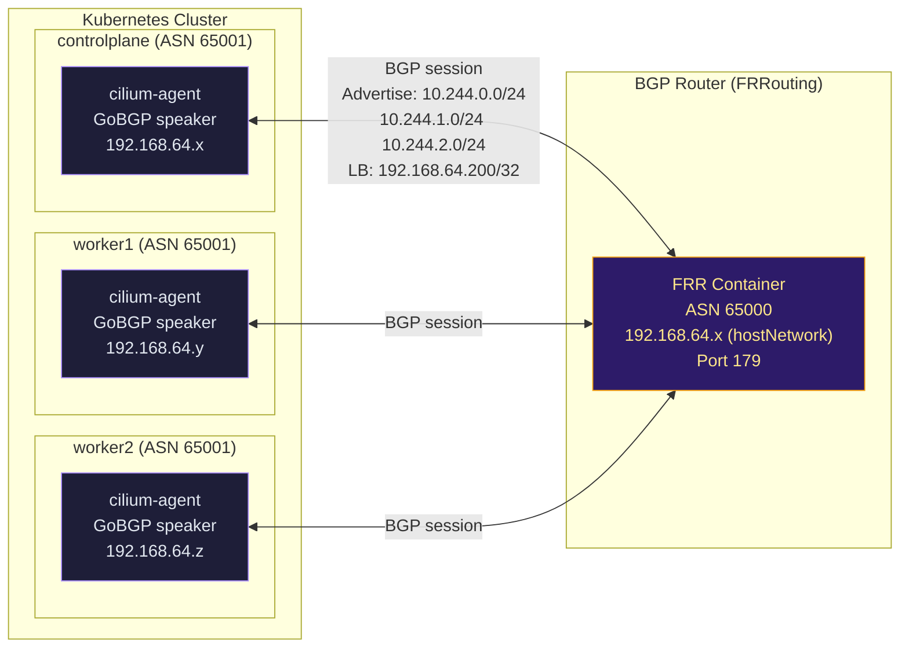

# Lab Tập 45: Cilium BGP Control Plane — Advertise Pod CIDRs và LoadBalancer IPs

BGP trong Cilium (GoBGP) giải quyết vấn đề on-prem: không có cloud LB, không có L2 broadcast domain đồng nhất. BGP advertise pod CIDRs và LoadBalancer IPs đến router, cho phép external traffic reach pods trực tiếp qua IP routing.

**Prerequisites:** Cilium cluster từ Tập 23. LB IPAM từ Tập 42 (tùy chọn nhưng nên có).

---

### Sơ đồ: BGP Control Plane



---

## Chuẩn bị: Enable Cilium BGP Control Plane

**SSH vào controlplane:**

```bash
multipass shell controlplane
```

1. Enable BGP Control Plane:
   ```bash
   helm upgrade cilium cilium/cilium \
     --namespace kube-system \
     --reuse-values \
     --set bgpControlPlane.enabled=true

   kubectl -n kube-system rollout status daemonset/cilium --timeout=120s
   cilium status | grep BGP
   # BGP Control Plane: Enabled ✅
   ```

2. Lấy thông tin network:
   ```bash
   export CP_IP=$(multipass info controlplane | grep IPv4 | awk '{print $2}')
   export W1_IP=$(multipass info worker1     | grep IPv4 | awk '{print $2}')
   export W2_IP=$(multipass info worker2     | grep IPv4 | awk '{print $2}')
   echo "CP: $CP_IP | W1: $W1_IP | W2: $W2_IP"
   ```

---

## Thực nghiệm 1: Deploy FRRouting BGP Peer

FRRouting (FRR) là open-source routing stack, phổ biến nhất cho BGP trên Linux. Trong lab, deploy FRR với hostNetwork trên controlplane để nó cùng L3 với tất cả nodes.

### 1.1 — Tạo FRR config

```bash
cat > /tmp/frr.conf <<EOF
frr version 9.1
frr defaults traditional
hostname frr-lab
log syslog informational
no ipv6 forwarding
!
router bgp 65000
 bgp router-id ${CP_IP}
 bgp log-neighbor-changes
 no bgp ebgp-requires-policy
 !
 ! Peer với tất cả cilium nodes (ASN 65001)
 neighbor ${CP_IP} remote-as 65001
 neighbor ${CP_IP} description "controlplane cilium"
 neighbor ${W1_IP} remote-as 65001
 neighbor ${W1_IP} description "worker1 cilium"
 neighbor ${W2_IP} remote-as 65001
 neighbor ${W2_IP} description "worker2 cilium"
 !
 address-family ipv4 unicast
  neighbor ${CP_IP} activate
  neighbor ${CP_IP} soft-reconfiguration inbound
  neighbor ${W1_IP} activate
  neighbor ${W1_IP} soft-reconfiguration inbound
  neighbor ${W2_IP} activate
  neighbor ${W2_IP} soft-reconfiguration inbound
 exit-address-family
!
line vty
!
EOF
```

### 1.2 — Deploy FRR container

```bash
kubectl create configmap frr-config \
  --from-file=frr.conf=/tmp/frr.conf \
  -n kube-system

kubectl apply -f - <<EOF
apiVersion: v1
kind: Pod
metadata:
  name: frr-router
  namespace: kube-system
  labels:
    app: frr-router
spec:
  nodeName: controlplane
  hostNetwork: true
  tolerations:
  - key: node-role.kubernetes.io/control-plane
    effect: NoSchedule
  containers:
  - name: frr
    image: frrouting/frr:9.1.0
    command: ["/sbin/tini", "--", "/usr/lib/frr/docker-start"]
    securityContext:
      privileged: true
      capabilities:
        add: ["NET_ADMIN", "SYS_ADMIN"]
    volumeMounts:
    - name: frr-config
      mountPath: /etc/frr/
    - name: run
      mountPath: /var/run/frr
  volumes:
  - name: frr-config
    configMap:
      name: frr-config
  - name: run
    emptyDir: {}
EOF

kubectl -n kube-system wait --for=condition=Ready pod/frr-router --timeout=90s
echo "FRR router running ✅"
```

---

## Thực nghiệm 2: Cấu hình BGP Peering từ Cilium

### 2.1 — Tạo CiliumBGPClusterConfig

```bash
kubectl apply -f - <<EOF
apiVersion: "cilium.io/v2alpha1"
kind: CiliumBGPClusterConfig
metadata:
  name: cilium-bgp
spec:
  nodeSelector:
    matchLabels: {}
  bgpInstances:
  - name: "cilium-65001"
    localASN: 65001
    peers:
    - name: "frr-router"
      peerASN: 65000
      peerAddress: "${CP_IP}"
      peerConfigRef:
        name: "peer-config"
EOF
```

### 2.2 — Tạo BGP Peer Config

```bash
kubectl apply -f - <<'EOF'
apiVersion: "cilium.io/v2alpha1"
kind: CiliumBGPPeerConfig
metadata:
  name: peer-config
spec:
  gracefulRestart:
    enabled: true
    restartTimeSeconds: 120
  families:
  - afi: ipv4
    safi: unicast
    advertisements:
      matchLabels:
        advertise: bgp
EOF
```

### 2.3 — Verify BGP sessions

```bash
# Chờ BGP establish (có thể mất 10-30s)
sleep 15

cilium bgp peers
# Node             LocalASN   PeerASN   PeerAddress     State
# controlplane     65001      65000     192.168.64.x    Established ✅
# worker1          65001      65000     192.168.64.x    Established ✅
# worker2          65001      65000     192.168.64.x    Established ✅

# Verify từ FRR side
kubectl -n kube-system exec frr-router -- vtysh -c "show bgp summary"
# Neighbor        V  AS       MsgRcvd  MsgSent  Up/Down  State/PfxRcd
# 192.168.64.x    4  65001    10       10       00:01:00 Established
# 192.168.64.y    4  65001    10       10       00:01:00 Established
# 192.168.64.z    4  65001    10       10       00:01:00 Established ✅
```

---

## Thực nghiệm 3: Advertise Pod CIDRs

### 3.1 — Tạo advertisement cho Pod CIDRs

```bash
kubectl apply -f - <<'EOF'
apiVersion: "cilium.io/v2alpha1"
kind: CiliumBGPAdvertisement
metadata:
  name: pod-cidr-advertisement
  labels:
    advertise: bgp
spec:
  advertisements:
  - advertisementType: PodCIDR
    attributes:
      communities:
        standard: ["65001:100"]
EOF
```

### 3.2 — Verify routes được advertise

```bash
# Xem routes Cilium đang advertise
cilium bgp routes advertised ipv4 unicast
# VRouter   Peer            Prefix           NextHop
# 65001     192.168.64.x    10.244.0.0/24    192.168.64.x   ← controlplane pod CIDR
# 65001     192.168.64.x    10.244.1.0/24    192.168.64.y   ← worker1 pod CIDR
# 65001     192.168.64.x    10.244.2.0/24    192.168.64.z   ← worker2 pod CIDR

# Verify FRR đã nhận routes
kubectl -n kube-system exec frr-router -- \
  vtysh -c "show ip bgp"
# Network          Next Hop        Metric  LocPrf  Weight  Path
# 10.244.0.0/24   192.168.64.x    0       0       0       65001 i
# 10.244.1.0/24   192.168.64.y    0       0       0       65001 i
# 10.244.2.0/24   192.168.64.z    0       0       0       65001 i ✅

# FRR kernel routing table
kubectl -n kube-system exec frr-router -- ip route show
# 10.244.0.0/24 via 192.168.64.x ... proto bgp
# 10.244.1.0/24 via 192.168.64.y ... proto bgp
# 10.244.2.0/24 via 192.168.64.z ... proto bgp ✅
```

*Nhận xét:* Trong production, FRR là ToR switch. Routes được inject vào router → toàn bộ datacenter biết cách reach pod CIDRs. Không cần tunnel/overlay.

---

## Thực nghiệm 4: Advertise LoadBalancer IPs

### 4.1 — Setup LB IPAM (nếu chưa có từ Tập 42)

```bash
kubectl apply -f - <<'EOF'
apiVersion: "cilium.io/v2alpha1"
kind: CiliumLoadBalancerIPPool
metadata:
  name: bgp-lb-pool
spec:
  blocks:
  - cidr: "192.168.64.210/29"
EOF

# Deploy service với LoadBalancer
kubectl run bgp-test-app --image=nginx --port=80
kubectl expose pod bgp-test-app --type=LoadBalancer --port=80

# Chờ nhận IP
kubectl get svc bgp-test-app -w
# NAME           TYPE           EXTERNAL-IP       PORT(S)
# bgp-test-app   LoadBalancer   192.168.64.210    80:xxxxx/TCP ✅
```

### 4.2 — Tạo advertisement cho LB IPs

```bash
kubectl apply -f - <<'EOF'
apiVersion: "cilium.io/v2alpha1"
kind: CiliumBGPAdvertisement
metadata:
  name: lb-advertisement
  labels:
    advertise: bgp
spec:
  advertisements:
  - advertisementType: Service
    service:
      addresses:
      - LoadBalancerIP
    selector:
      matchExpressions:
      - key: somekey
        operator: NotIn
        values: ["never-match"]
EOF
```

### 4.3 — Verify LB IP được advertise qua BGP

```bash
# Cilium advertise LB IP
cilium bgp routes advertised ipv4 unicast | grep "192.168.64.210"
# 65001  192.168.64.x  192.168.64.210/32  192.168.64.x ✅

# FRR thấy route /32 cho LB IP
kubectl -n kube-system exec frr-router -- \
  vtysh -c "show ip bgp 192.168.64.210/32"
# BGP routing table entry for 192.168.64.210/32
# Path: 65001
# NextHop: 192.168.64.x
# Status: valid, best ✅

# Từ FRR (nếu có internet route), access LB IP
kubectl -n kube-system exec frr-router -- \
  curl -s --max-time 3 http://192.168.64.210/
# Welcome to nginx! ✅
```

### 4.4 — Graceful restart test

```bash
# Graceful restart: BGP session drop nhưng routes được giữ
# Simulate agent restart trên worker1

WORKER1_CILIUM=$(kubectl -n kube-system get pod \
  -l k8s-app=cilium --field-selector spec.nodeName=worker1 \
  -o name | head -1)

# Watch BGP routes trên FRR trong khi agent restart
kubectl -n kube-system exec frr-router -- \
  vtysh -c "show ip bgp" | grep "10.244.1" &

# Delete worker1 agent (simulated crash)
kubectl -n kube-system delete $WORKER1_CILIUM --grace-period=0 --force

# Graceful restart: route 10.244.1.0/24 vẫn còn trong FRR table
# (restartTimeSeconds: 120 → FRR giữ route 120s)
sleep 5
kubectl -n kube-system exec frr-router -- \
  vtysh -c "show ip bgp" | grep "10.244.1"
# 10.244.1.0/24  stale (during restart)  ← Kept by graceful restart

# Sau khi agent recover (~20s): route active lại
kubectl -n kube-system wait --for=condition=Ready \
  -l k8s-app=cilium --field-selector spec.nodeName=worker1 \
  pod --timeout=60s
cilium bgp peers | grep worker1
# worker1  65001  65000  192.168.64.x  Established ✅
```

---

## Dọn dẹp

```bash
kubectl delete pod bgp-test-app frr-router -n kube-system 2>/dev/null || true
kubectl delete pod bgp-test-app 2>/dev/null || true
kubectl delete svc bgp-test-app 2>/dev/null || true
kubectl delete ciliumloadbalancerippool bgp-lb-pool 2>/dev/null || true
kubectl delete ciliumloadbalancerippool bgp-lb-pool 2>/dev/null || true
kubectl delete ciliuml2announcementpolicy default-l2 2>/dev/null || true
kubectl delete ciliumegressgatewaypolicy payment-egress 2>/dev/null || true
kubectl delete configmap frr-config -n kube-system 2>/dev/null || true
kubectl delete ciliumBGPClusterConfig cilium-bgp 2>/dev/null || true
kubectl delete ciliumBGPPeerConfig peer-config 2>/dev/null || true
kubectl delete ciliumBGPAdvertisement pod-cidr-advertisement lb-advertisement 2>/dev/null || true

# Disable BGP nếu không dùng nữa
helm upgrade cilium cilium/cilium \
  --namespace kube-system \
  --reuse-values \
  --set bgpControlPlane.enabled=false
```

---

## Tổng kết

1. **BGP = L3 solution cho L2-not-guaranteed environments:** L2 Announcement (Tập 42) chỉ work khi nodes cùng broadcast domain. BGP work bất kể topology — cross-VLAN, cross-datacenter, hybrid cloud.

2. **Cilium GoBGP built-in, không cần Bird/FRR trên nodes:** Calico dùng Bird daemon riêng. Cilium tích hợp GoBGP vào cilium-agent — một process quản lý cả dataplane + routing protocol.

3. **Pod CIDR advertisement = direct pod reachability:** ToR router biết route đến từng pod CIDR qua node IP. Không cần overlay/tunnel. External services có thể reach pods trực tiếp qua IP routing.

4. **LB IP advertisement qua BGP = ECMP load balancing:** Cùng LB IP được advertise từ nhiều nodes → router dùng ECMP distribute traffic. Cilium xử lý consistent hashing để stick connection về đúng backend.

5. **Graceful restart = zero-downtime BGP reconvergence:** Khi agent restart, FRR giữ stale routes trong `restartTimeSeconds` (120s). Traffic tiếp tục flow trong khi agent reconnect.
