# Lab Tập 45: Cilium Upgrade + Day-2 Operations

Day-2 Operations là những câu hỏi đầu tiên mọi engineer hỏi trước khi deploy Cilium vào production: *"Upgrade như thế nào không downtime? Node fail thì sao? Agent crash thì pod có mất network không?"* — Tập này trả lời tất cả bằng lab thực tế.

**Prerequisites:** Cilium cluster từ Tập 24.

---

### Sơ đồ: Day-2 Operations Scenarios

```mermaid
graph TD
  subgraph upgrade ["Upgrade Path"]
    U1["Check current version"] --> U2["helm upgrade --reuse-values"]
    U2 --> U3["cilium status --wait"]
    U3 --> U4["Verify no downtime"]
  end

  subgraph node_ops ["Node Operations"]
    N1["kubectl drain <node>"] --> N2["Cilium agent terminates"]
    N2 --> N3["Existing pods: connections survive"]
    N3 --> N4["kubectl uncordon"] --> N5["Agent restarts, rejoins"]
  end

  subgraph agent_crash ["Agent Crash Recovery"]
    C1["Agent pod deleted/OOMKilled"] --> C2["DaemonSet restarts pod"]
    C2 --> C3["BPF programs persist in kernel"]
    C3 --> C4["Existing flows: unaffected"]
    C4 --> C5["New pods: created after agent ready"]
  end

  style U2 fill:#0f172a,stroke:#3b82f6,color:#bfdbfe
  style N2 fill:#2d1b69,stroke:#a78bfa,color:#e2e8f0
  style C3 fill:#152a2a,stroke:#34d399,color:#a7f3d0
```



---

## Thực nghiệm 1: Pre-upgrade Checks

**SSH vào controlplane:**

```bash
multipass shell controlplane
```

### 1.1 — Inventory hiện tại

```bash
# Version Cilium hiện tại
cilium version
# cilium-cli: v0.16.x
# Client: 1.16.x

helm list -n kube-system | grep cilium
# cilium   kube-system   1   ... deployed   cilium-1.16.x

# Version chi tiết từng component
kubectl -n kube-system get pods -l k8s-app=cilium \
  -o jsonpath='{range .items[*]}{.metadata.name}: {.spec.containers[0].image}{"\n"}{end}'
# cilium-xxxxx: quay.io/cilium/cilium:v1.16.x
```

### 1.2 — Kiểm tra compatibility matrix

```bash
# K8s version
kubectl version --short 2>/dev/null || kubectl version
# Server Version: v1.36.x

# Cilium compatibility:
# Cilium 1.16.x hỗ trợ: K8s 1.27 → 1.32
# Cilium 1.17.x hỗ trợ: K8s 1.28 → 1.33
# → Xem https://docs.cilium.io/en/stable/network/kubernetes/compatibility/

# Versions mới nhất có sẵn
helm search repo cilium/cilium --versions | head -10
```

### 1.3 — Snapshot trạng thái trước upgrade

```bash
# Save helm values hiện tại (rollback reference)
helm get values cilium -n kube-system > /tmp/cilium-values-backup.yaml
cat /tmp/cilium-values-backup.yaml

# Snapshot endpoint states
cilium endpoint list > /tmp/endpoints-before.txt
wc -l /tmp/endpoints-before.txt

# Snapshot connectivity
cilium status > /tmp/cilium-status-before.txt

# Deploy workload test để verify sau upgrade
kubectl run upgrade-test \
  --image=nicolaka/netshoot \
  --overrides='{"spec":{"nodeName":"worker1"}}' \
  -- sleep infinity

kubectl wait --for=condition=Ready pod/upgrade-test --timeout=30s
TEST_POD_IP=$(kubectl get pod upgrade-test -o jsonpath='{.status.podIP}')
echo "Test pod IP: $TEST_POD_IP"
```

---

## Thực nghiệm 2: Patch Version Upgrade (1.16.x → 1.16.y)

Patch upgrade (minor.patch) là safe nhất: chỉ bug fixes, không breaking changes. DaemonSet rolling update — một node tại một thời điểm.

### 2.1 — Kiểm tra patch version mới hơn

```bash
CURRENT=$(helm list -n kube-system | grep cilium | awk '{print $NF}' | cut -d- -f2)
echo "Current: $CURRENT"

# Tìm patch version mới hơn trong cùng minor
helm search repo cilium/cilium --versions | grep "^cilium/cilium" | \
  awk '{print $2}' | grep "^${CURRENT%.*}" | head -5
```

### 2.2 — Simulate upgrade (patch version)

```bash
# Lấy version mới nhất
LATEST=$(helm search repo cilium/cilium | grep "^cilium/cilium " | awk '{print $2}')
echo "Upgrading to: $LATEST"

# Bắt đầu monitor trong background
kubectl -n kube-system get pods -l k8s-app=cilium -w &
WATCH_PID=$!

# Thực hiện upgrade
helm upgrade cilium cilium/cilium \
  --namespace kube-system \
  --reuse-values \
  --version $LATEST \
  --atomic \
  --timeout 5m

# --reuse-values: giữ nguyên tất cả custom config (encryption, hubble, etc.)
# --atomic: rollback tự động nếu upgrade fail
# --timeout 5m: timeout sau 5 phút
```

### 2.3 — Monitor rolling update

```bash
# Quan sát rolling update (từ WATCH_PID background):
# NAME            READY   STATUS        RESTARTS
# cilium-xxxxx    1/1     Running       0   ← controlplane: untouched
# cilium-yyyyy    0/1     Terminating   0   ← worker1: đang upgrade
# cilium-yyyyy    1/1     Running       0   ← worker1: done
# cilium-zzzzz    0/1     Terminating   0   ← worker2: đang upgrade
# cilium-zzzzz    1/1     Running       0   ← worker2: done

kill $WATCH_PID 2>/dev/null

# Verify upgrade xong
cilium status --wait
helm list -n kube-system | grep cilium
```

### 2.4 — Verify không mất connectivity

```bash
# Test pod vẫn có network
kubectl exec upgrade-test -- ping -c 3 $TEST_POD_IP
# OK ✅

# Cross-node traffic
CROSS_IP=$(kubectl get nodes worker2 \
  -o jsonpath='{.status.addresses[0].address}')
kubectl exec upgrade-test -- \
  curl -s --max-time 3 http://kubernetes.default.svc.cluster.local
# OK ✅

# Endpoints count còn nguyên
cilium endpoint list | wc -l
diff <(cat /tmp/endpoints-before.txt | wc -l) \
     <(cilium endpoint list | wc -l) && echo "Endpoint count: same ✅"
```

---

## Thực nghiệm 3: Node Operations — Drain, Replace, Add

### 3.1 — Node Drain (maintenance)

```bash
# Drain worker1: evacuate pods, cordon node
kubectl drain worker1 \
  --ignore-daemonsets \
  --delete-emptydir-data \
  --grace-period=30

# Cilium DaemonSet pod vẫn chạy trên worker1 (--ignore-daemonsets)
kubectl -n kube-system get pod -l k8s-app=cilium -o wide | grep worker1
# cilium-xxxxx  1/1  Running  worker1  ← Cilium vẫn chạy

# Nhưng user workloads đã được evict:
kubectl get pods -o wide | grep worker1
# (không có pods user trên worker1)

# Verify: pods đã migrate sang worker2 vẫn có network
kubectl get pods -o wide
kubectl exec upgrade-test -- ping -c 3 8.8.8.8  # Nếu có internet
```

### 3.2 — Mô phỏng node replace (remove + add)

```bash
# Uncordon worker1 (bring back after maintenance)
kubectl uncordon worker1

# Verify worker1 healthy lại
kubectl get nodes
# NAME           STATUS   ROLES
# controlplane   Ready    control-plane
# worker1        Ready    <none>     ← Back ✅
# worker2        Ready    <none>

# Cilium đã re-establish BPF state trên worker1
WORKER1_CILIUM=$(kubectl -n kube-system get pod \
  -l k8s-app=cilium --field-selector spec.nodeName=worker1 \
  -o name | head -1)
kubectl -n kube-system exec $WORKER1_CILIUM -- cilium status | head -5
# Cilium: OK
# BPF:    OK
```

### 3.3 — Verify DaemonSet self-healing

```bash
# Simulate node restart bằng cách restart kubelet
multipass exec worker1 -- sudo systemctl restart kubelet

# Watch pods recover
kubectl get pods -n kube-system -l k8s-app=cilium -o wide -w &
WATCH_PID=$!
sleep 15
kill $WATCH_PID

# Verify worker1 cilium pod running lại
kubectl -n kube-system get pod \
  -l k8s-app=cilium --field-selector spec.nodeName=worker1
# cilium-xxxxx  1/1  Running  0  2m ✅
```

---

## Thực nghiệm 4: Agent Crash Recovery

Đây là câu hỏi quan trọng nhất: **"Nếu cilium-agent crash, pods đang chạy có mất network không?"**

Câu trả lời: **KHÔNG** — vì BPF programs đã được load vào kernel. Agent crash = control plane mất, data plane vẫn chạy.

### 4.1 — Deploy workloads liên tục generate traffic

```bash
# Deploy server
kubectl run crash-server \
  --image=nicolaka/netshoot \
  --overrides='{"spec":{"nodeName":"worker2"}}' \
  -- iperf3 -s

# Deploy client trên worker1
kubectl run crash-client \
  --image=nicolaka/netshoot \
  --overrides='{"spec":{"nodeName":"worker1"}}' \
  -- sleep infinity

kubectl wait --for=condition=Ready pod/crash-server pod/crash-client --timeout=60s

SERVER_IP=$(kubectl get pod crash-server -o jsonpath='{.status.podIP}')

# Start liên tục ping từ worker1 sang worker2 (cross-node)
kubectl exec crash-client -- bash -c \
  "while true; do ping -c 1 $SERVER_IP | tail -1; sleep 1; done" &
PING_PID=$!
echo "Continuous ping PID: $PING_PID (running in background)"
sleep 3
```

### 4.2 — Crash cilium-agent trên worker1

```bash
WORKER1_CILIUM=$(kubectl -n kube-system get pod \
  -l k8s-app=cilium --field-selector spec.nodeName=worker1 \
  -o name | head -1)
echo "Killing: $WORKER1_CILIUM"

# Kill agent
kubectl -n kube-system delete $WORKER1_CILIUM --grace-period=0 --force

echo "Agent killed. Watching recovery..."
kubectl -n kube-system get pod -l k8s-app=cilium -o wide -w &
WATCH_PID=$!
```

### 4.3 — Observe: data plane survive, control plane recover

```bash
# Trong khi agent đang restart, traffic vẫn chạy:
# (xem output ping từ background job)
# 64 bytes from 10.244.2.x: icmp_seq=5 ttl=63 time=0.345ms  ← Agent crashed
# 64 bytes from 10.244.2.x: icmp_seq=6 ttl=63 time=0.350ms  ← Still working!
# 64 bytes from 10.244.2.x: icmp_seq=7 ttl=63 time=0.348ms  ← BPF still in kernel
# ...
# (Agent restarts, DaemonSet creates new pod in ~10-15s)
# 64 bytes from 10.244.2.x: icmp_seq=15 ttl=63 time=0.341ms  ← Agent back, still working

sleep 30
kill $WATCH_PID 2>/dev/null

# Verify new agent pod running
kubectl -n kube-system get pod \
  -l k8s-app=cilium --field-selector spec.nodeName=worker1
# NEW cilium pod: Running ✅

# Verify BPF state còn nguyên
NEW_WORKER1_CILIUM=$(kubectl -n kube-system get pod \
  -l k8s-app=cilium --field-selector spec.nodeName=worker1 \
  -o name | head -1)
kubectl -n kube-system exec $NEW_WORKER1_CILIUM -- \
  cilium bpf policy list | wc -l
# > 0: BPF state reloaded ✅

kill $PING_PID 2>/dev/null
```

**Kết luận:**
```
Agent crash timeline:
  T+0s:  Agent pod deleted (crash simulated)
  T+0s:  BPF programs STAY in kernel (không bị remove)
  T+0s:  Existing TCP flows: unaffected ✅
  T+0s:  New pod creation: blocked (no agent to configure BPF)
  T+10s: DaemonSet creates new agent pod
  T+25s: Agent restart complete, BPF state resynced
  T+25s: New pod creation: works again ✅
```

---

## Thực nghiệm 5: Rollback (nếu upgrade fail)

```bash
# Xem helm history
helm history cilium -n kube-system
# REVISION  STATUS     CHART          DESCRIPTION
# 1         superseded cilium-1.16.0  Install complete
# 2         deployed   cilium-1.16.1  Upgrade complete

# Rollback về revision 1 nếu cần
# helm rollback cilium 1 -n kube-system --wait

# Verify với --dry-run trước
helm rollback cilium 1 -n kube-system --dry-run 2>&1 | tail -5
# (Simulated rollback output)

# Backup values trước mọi upgrade:
helm get values cilium -n kube-system -o yaml > cilium-values-$(date +%Y%m%d).yaml
```

---

## Dọn dẹp

```bash
kubectl delete pod upgrade-test crash-server crash-client 2>/dev/null || true
rm -f /tmp/cilium-values-backup.yaml /tmp/endpoints-before.txt /tmp/cilium-status-before.txt
```

---

## Tổng kết

1. **Patch upgrade an toàn, không cần maintenance window:** DaemonSet rolling update — một node tại một thời điểm. `--reuse-values` giữ mọi custom config. `--atomic` tự rollback nếu fail. Traffic không gián đoạn.

2. **Node drain không ảnh hưởng Cilium agent:** `--ignore-daemonsets` giữ Cilium chạy trên node đang drain để pods evicted có thể reconnect từ node mới. Agent tắt sau tất cả pods đã rời node.

3. **Agent crash = zero downtime cho existing flows:** BPF programs được load vào kernel một lần, tồn tại độc lập với agent process. Agent crash chỉ block việc tạo pod mới (~10-25s recovery time). Existing TCP connections unaffected.

4. **Luôn backup values trước upgrade:** `helm get values cilium -n kube-system -o yaml > backup.yaml`. Rollback: `helm rollback cilium <revision>`. Rollback nhanh hơn reinstall.

5. **Checklist upgrade production:**
   - Backup helm values
   - Check compatibility matrix (K8s version vs Cilium version)
   - Test trên staging cluster trước
   - Upgrade trong giờ thấp traffic
   - Monitor với `cilium status --wait` + Hubble metrics
