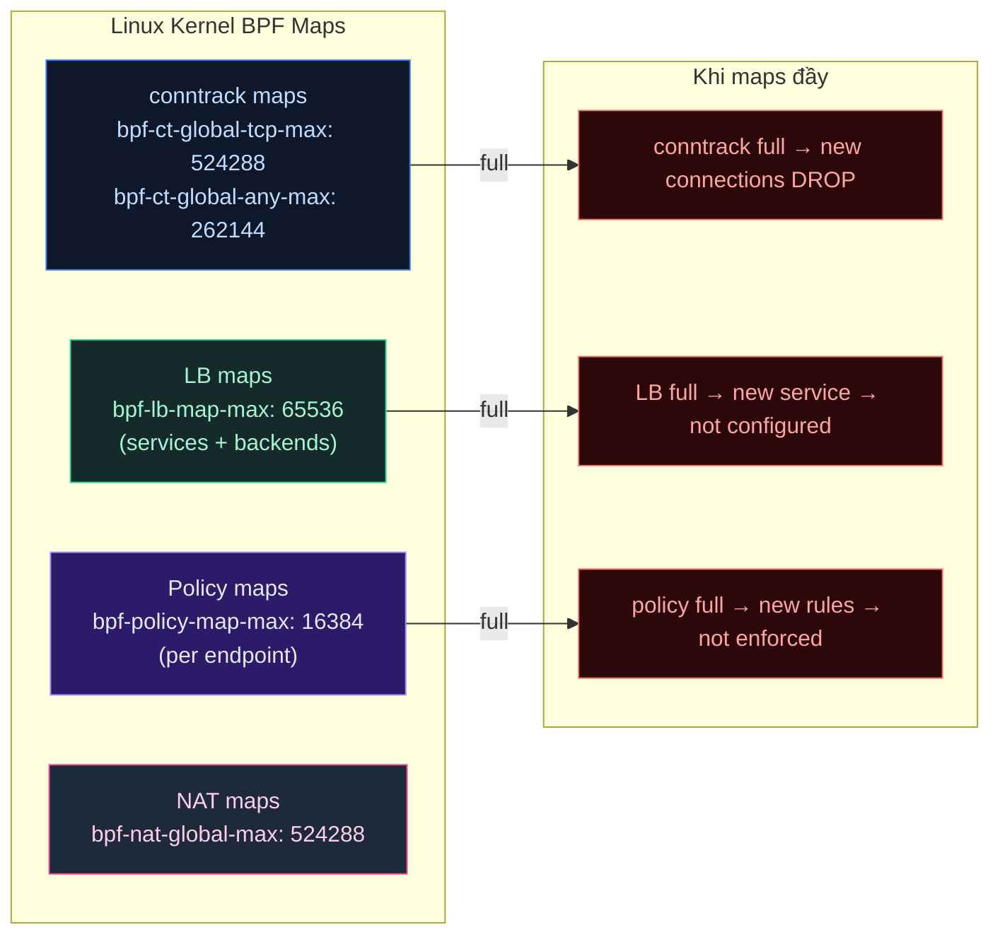

# Lab Tập 47: BPF Map Sizing + Resource Tuning

Khi cluster scale lên hàng trăm pods, hàng nghìn policies, BPF maps có thể đầy. Triệu chứng: pods đột ngột mất network, Hubble show drop reason `MAP_LB_BACKEND_SLOT_NO_MATCH` hoặc `POLICY_DENIED` không giải thích được. Tập này dạy cách inspect, tính toán, và tune BPF map sizes trước khi chạm giới hạn.

**Prerequisites:** Cilium cluster từ Tập 24.

---

### Sơ đồ: BPF Maps và giới hạn



---

## Thực nghiệm 1: Inspect BPF Map Usage

**SSH vào controlplane:**

```bash
multipass shell controlplane
```

### 1.1 — Xem tất cả BPF maps hiện tại

```bash
CILIUM_POD=$(kubectl -n kube-system get pod -l k8s-app=cilium -o name | head -1)

# Danh sách tất cả BPF maps Cilium đang dùng
kubectl -n kube-system exec -it $CILIUM_POD -- \
  bpftool map list | grep -E "name|entries|max_entries" | \
  paste - - - | head -30

# Compact view: tên map + max size
kubectl -n kube-system exec -it $CILIUM_POD -- \
  bpftool map list | awk '/^[0-9]/{id=$1} /name/{name=$2} /max_entries/{
    printf "%-40s max=%s\n", name, $2}' | sort | head -30
```

### 1.2 — Conntrack map usage

```bash
# Current TCP conntrack entries
CT_COUNT=$(kubectl -n kube-system exec -it $CILIUM_POD -- \
  cilium bpf ct list global 2>/dev/null | grep -c "TCP" || echo "0")
echo "Current TCP conntrack entries: $CT_COUNT"

# Max configured
kubectl -n kube-system exec -it $CILIUM_POD -- \
  cilium config | grep -i "ct\|conntrack"
# --bpf-ct-global-tcp-max: 524288  (default)
# --bpf-ct-global-any-max: 262144  (default)

# Usage percentage
CT_MAX=524288
echo "TCP CT usage: $CT_COUNT / $CT_MAX = $(( CT_COUNT * 100 / CT_MAX ))%"

# Eviction rate (high eviction = map pressure)
kubectl -n kube-system exec -it $CILIUM_POD -- \
  cilium metrics list 2>/dev/null | grep "ct_.*evict\|conntrack.*evict" | head -5
```

### 1.3 — LB map usage

```bash
# Số services + backends
SVC_COUNT=$(kubectl -n kube-system exec -it $CILIUM_POD -- \
  cilium bpf lb list 2>/dev/null | wc -l)
echo "LB entries (services + backends): $SVC_COUNT"

# K8s services count
kubectl get svc -A | wc -l
echo "K8s services: $(kubectl get svc -A | wc -l)"

# LB map max
kubectl -n kube-system exec -it $CILIUM_POD -- \
  cilium config | grep "lb-map-max"
# --bpf-lb-map-max: 65536

LB_MAX=65536
echo "LB map usage: $SVC_COUNT / $LB_MAX = $(( SVC_COUNT * 100 / LB_MAX ))%"
```

### 1.4 — Policy map usage per endpoint

```bash
# Xem policy map size của endpoint có nhiều rules nhất
kubectl -n kube-system exec -it $CILIUM_POD -- \
  cilium endpoint list -o json 2>/dev/null | \
  python3 -c "
import sys, json
eps = json.load(sys.stdin)
for ep in eps:
    pmap = ep.get('status', {}).get('policy', {})
    realized = pmap.get('realized', {}).get('ingress', [])
    print(f\"{ep['id']:6} {ep.get('labels', {}).get('k8s:io.kubernetes.pod.name', 'unknown')[:30]:30} {len(realized):4} ingress rules\")
" 2>/dev/null | sort -k3 -rn | head -10

# Policy map max per endpoint
kubectl -n kube-system exec -it $CILIUM_POD -- \
  cilium config | grep "policy-map-max"
# --bpf-policy-map-max: 16384
```

### 1.5 — Metrics dashboard (summary)

```bash
# Tổng hợp resource metrics
kubectl -n kube-system exec -it $CILIUM_POD -- cilium metrics list 2>/dev/null | \
  grep -E "bpf_map|drop|forward" | grep -v "#" | head -20

# Memory sử dụng bởi cilium-agent
kubectl -n kube-system top pod -l k8s-app=cilium 2>/dev/null || \
  kubectl -n kube-system exec -it $CILIUM_POD -- \
    cat /proc/self/status | grep -E "VmRSS|VmPeak"
# VmRSS: ~200-400MB thông thường
```

---

## Thực nghiệm 2: Tính toán Map Size Requirements

### 2.1 — Công thức tính cho production

```bash
cat << 'EOF'
=== BPF MAP SIZING FORMULAS ===

1. CONNTRACK MAP (TCP + UDP):
   Formula: connections_per_second × connection_duration_seconds × 2
   (×2: inbound + outbound tracking)

   Example production (1000 pods, 100 rps each):
   Peak TCP connections ≈ 1000 × 100 × 30s (avg duration) × 2 = 6,000,000
   → bpf-ct-global-tcp-max = 6,000,000
   Default 524,288 → KHÔNG ĐỦ cho cluster này!

2. LB MAP:
   Formula: services × (1 + avg_backends) × 2
   (×2: ClusterIP + NodePort each create entries)

   Example (500 services, avg 3 backends):
   500 × (1+3) × 2 = 4,000 entries
   Default 65,536 → ĐỦ

3. POLICY MAP (per endpoint):
   Formula: max_ingress_rules + max_egress_rules per pod
   Default 16,384 per endpoint → ĐỦ cho hầu hết use cases

4. NAT MAP:
   ≈ 2× conntrack map size
   --bpf-nat-global-max = bpf-ct-global-tcp-max × 2

EOF
```

### 2.2 — Tính toán cho cluster hiện tại

```bash
# Đo thực tế: tạo nhiều connections và đo tăng trưởng
kubectl run load-gen \
  --image=nicolaka/netshoot \
  -- bash -c "
    for i in \$(seq 1 50); do
      curl -s --max-time 1 http://kubernetes.default.svc.cluster.local &
    done
    wait
    sleep 30  # Giữ connections trong 30s
  "

kubectl wait --for=condition=Ready pod/load-gen --timeout=30s

# Đo CT table trước và sau
BEFORE=$(kubectl -n kube-system exec -it $CILIUM_POD -- \
  cilium bpf ct list global 2>/dev/null | wc -l)

kubectl wait --for=condition=Succeeded pod/load-gen --timeout=60s

AFTER=$(kubectl -n kube-system exec -it $CILIUM_POD -- \
  cilium bpf ct list global 2>/dev/null | wc -l)

echo "CT entries before: $BEFORE"
echo "CT entries after:  $AFTER"
echo "Growth from 50 connections: $((AFTER - BEFORE)) entries"

kubectl delete pod load-gen
```

---

## Thực nghiệm 3: Simulate Map Pressure và Detect Symptoms

### 3.1 — Tạo nhiều policies để xem policy map pressure

```bash
# Tạo namespace với nhiều policies
kubectl create namespace policy-pressure

kubectl run target -n policy-pressure \
  --image=nginx --port=80

# Tạo 100 NetworkPolicy rules
for i in $(seq 1 100); do
  kubectl apply -n policy-pressure -f - <<EOF
apiVersion: networking.k8s.io/v1
kind: NetworkPolicy
metadata:
  name: policy-${i}
spec:
  podSelector:
    matchLabels:
      run: target
  ingress:
  - ports:
    - port: $((9000+i))
      protocol: TCP
EOF
done

echo "Created 100 NetworkPolicy rules"

# Xem policy map entry count
TARGET_EP=$(kubectl -n kube-system exec -it $CILIUM_POD -- \
  cilium endpoint list 2>/dev/null | grep "policy-pressure" | head -1 | awk '{print $1}')

if [[ -n "$TARGET_EP" ]]; then
  kubectl -n kube-system exec -it $CILIUM_POD -- \
    cilium bpf policy list $TARGET_EP 2>/dev/null | wc -l
  echo "Policy map entries for target pod: above"
fi

# Clean up
kubectl delete namespace policy-pressure
```

### 3.2 — Xem Hubble drop reasons liên quan đến BPF maps

```bash
# Port-forward Hubble
kubectl -n kube-system port-forward svc/hubble-relay 4245:80 &
HUBBLE_PF=$!

sleep 3

# Xem drop reasons (có thể thấy BPF map related drops nếu cluster stressed)
hubble observe --server localhost:4245 \
  --verdict DROPPED \
  --last 50 2>/dev/null | head -20

# Drop reasons liên quan BPF maps:
# POLICY_DENIED: policy map không match
# CT_CLOSED: conntrack entry closed unexpectedly
# DROP_NO_TUNNEL_ENDPOINT: LB backend not found

# Xem metrics Cilium về drops
kubectl -n kube-system exec -it $CILIUM_POD -- \
  cilium metrics list 2>/dev/null | grep "drop" | \
  awk '$2 != "0"' | head -10

kill $HUBBLE_PF 2>/dev/null || true
```

---

## Thực nghiệm 4: Apply Tuning và Verify

### 4.1 — Tính toán và apply values mới

```bash
# Scenario: cluster sẽ scale lên 100 nodes, 1000 services, 10k connections/sec
# Tính toán:
# CT TCP max: 10000 rps × 30s avg × 2 = 600,000 → round up 1,048,576 (2^20)
# CT UDP max: 20% của TCP = 200,000 → 262,144 (2^18)
# LB map: 1000 services × 4 backends avg × 2 = 8,000 → 65,536 OK (default đủ)
# NAT max: 2× CT TCP = 2,097,152

# Apply tuning:
helm upgrade cilium cilium/cilium \
  --namespace kube-system \
  --reuse-values \
  --set bpf.ctTcpMax=1048576 \
  --set bpf.ctAnyMax=262144 \
  --set bpf.natMax=2097152 \
  --set bpf.lbMapMax=65536

# NOTE: Thay đổi BPF map size cần cilium-agent restart
kubectl -n kube-system rollout status daemonset/cilium --timeout=120s
```

### 4.2 — Verify thay đổi

```bash
CILIUM_POD=$(kubectl -n kube-system get pod -l k8s-app=cilium -o name | head -1)

# Confirm new values applied
kubectl -n kube-system exec -it $CILIUM_POD -- \
  cilium config | grep -E "ct-global|nat-global|lb-map"
# --bpf-ct-global-tcp-max: 1048576  ✅ (tăng từ 524288)
# --bpf-ct-global-any-max: 262144   (unchanged)
# --bpf-nat-global-max:    2097152  ✅ (tăng từ 524288)
# --bpf-lb-map-max:        65536    (unchanged)

# Verify BPF map trong kernel được resize
kubectl -n kube-system exec -it $CILIUM_POD -- \
  bpftool map list | grep "ct\|nat" | grep "max_entries"
# cilium_ct_tcp4: max_entries=1048576  ✅
```

### 4.3 — Memory implications

```bash
# BPF maps chiếm kernel memory
# Estimate: mỗi CT entry ≈ 56 bytes (TCP CT map)
# 1,048,576 entries × 56 bytes = 58 MB per node (kernel space)
# Cộng với cilium-agent process memory (~200-400MB)

# Xem cilium-agent memory usage
kubectl -n kube-system exec -it $CILIUM_POD -- \
  cat /proc/self/status | grep -E "VmRSS|VmPeak|VmSize"
# VmRSS:  ~300MB  (resident memory)
# VmPeak: ~500MB  (peak usage)

# So sánh với limit hiện tại
kubectl -n kube-system get pod $CILIUM_POD \
  -o jsonpath='{.spec.containers[0].resources}' | python3 -m json.tool
# Nếu không có resource limits → cần add cho production

# Add resource limits cho Cilium agent:
# helm upgrade cilium cilium/cilium \
#   --namespace kube-system \
#   --reuse-values \
#   --set resources.requests.cpu=100m \
#   --set resources.requests.memory=512Mi \
#   --set resources.limits.memory=1Gi
```

### 4.4 — Monitoring alerts cho map capacity

```bash
# PrometheusRule để alert khi map usage > 80%
kubectl apply -f - <<'EOF'
apiVersion: monitoring.coreos.com/v1
kind: PrometheusRule
metadata:
  name: cilium-bpf-capacity
  namespace: monitoring
  labels:
    release: monitoring
spec:
  groups:
  - name: cilium.bpf.capacity
    rules:
    - alert: CiliumBPFConntrackHigh
      expr: |
        (cilium_bpf_map_ops_total{map_name=~".*ct.*"} /
         on(map_name) cilium_bpf_map_max_entries{map_name=~".*ct.*"}) > 0.8
      for: 5m
      labels:
        severity: warning
      annotations:
        summary: "BPF conntrack map > 80% full on {{ $labels.instance }}"
        description: "Current: {{ $value | humanizePercentage }}"

    - alert: CiliumBPFLBMapHigh
      expr: |
        (cilium_bpf_map_ops_total{map_name=~".*lb.*"} /
         on(map_name) cilium_bpf_map_max_entries{map_name=~".*lb.*"}) > 0.8
      for: 5m
      labels:
        severity: warning
      annotations:
        summary: "BPF LB map > 80% full on {{ $labels.instance }}"
EOF

kubectl -n monitoring get prometheusrule cilium-bpf-capacity 2>/dev/null || \
  echo "Apply monitoring stack từ Tập 35 trước"
```

---

## Cheat Sheet: Resource Tuning Reference

```bash
# XEM current config
kubectl -n kube-system exec -it $CILIUM_POD -- cilium config | grep "^--bpf"

# TÍNH TOÁN nhanh cho cluster size
python3 << 'CALC'
pods = int(input("Số pods tối đa: "))
services = int(input("Số services: "))
rps_per_pod = int(input("Requests/sec mỗi pod: "))
avg_conn_duration = 30  # giây

peak_connections = pods * rps_per_pod * avg_conn_duration
ct_tcp = max(524288, peak_connections * 2)
ct_udp = max(262144, ct_tcp // 4)
nat = ct_tcp * 2
lb = max(65536, services * 5 * 2)

print(f"\n=== RECOMMENDED BPF MAP SIZES ===")
print(f"bpf.ctTcpMax  = {ct_tcp:,}  ({ct_tcp//1024//1024:.0f}MB kernel)")
print(f"bpf.ctAnyMax  = {ct_udp:,}")
print(f"bpf.natMax    = {nat:,}")
print(f"bpf.lbMapMax  = {lb:,}")
print(f"\nTotal kernel memory: ~{(ct_tcp*56 + ct_udp*56 + nat*56)//1024//1024:.0f}MB per node")
CALC
```

---

## Dọn dẹp

```bash
# Reset về default values
helm upgrade cilium cilium/cilium \
  --namespace kube-system \
  --reuse-values \
  --set bpf.ctTcpMax=524288 \
  --set bpf.ctAnyMax=262144 \
  --set bpf.natMax=524288 \
  --set bpf.lbMapMax=65536

kubectl -n kube-system rollout status daemonset/cilium --timeout=120s
```

---

## Tổng kết

1. **BPF maps có fixed max size:** Phải set đủ lớn khi deploy. Resize cần restart agent. Không auto-grow như iptables. Đây là trade-off của BPF performance (O(1) hash map) vs flexibility.

2. **Conntrack là map quan trọng nhất:** Đầy → new TCP connections DROP. Formula: `peak_rps × avg_duration × 2`. Default 524k đủ cho ~10k concurrent connections — không đủ cho large clusters.

3. **LB map hiếm khi đầy:** Default 65k = 65k service+backend entries. Cluster 1000 services × 10 backends × 2 = 20k entries. Chỉ cần tăng khi > 3000 services.

4. **Policy map per-endpoint:** 16k entries/endpoint đủ cho hầu hết use cases. Nếu có CiliumClusterwideNetworkPolicy phức tạp cần review.

5. **Monitor proactively:** Thêm PrometheusRule alert khi usage > 80%. Resize map size trước khi đầy — sau khi đầy là đã có drops rồi.
