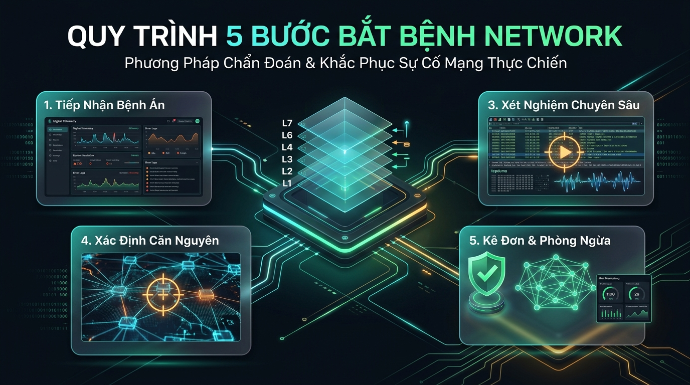

# 🩺 Network Bắt Bệnh — Chẩn Đoán & Khắc Phục Sự Cố Mạng Thực Tế

<p align="center">
  <a href="https://www.youtube.com/@NetworkThucChien">
    
  </a>
  <a href="https://github.com/thangphan205/network-thuc-chien">
    
  </a>
  
</p>

> **Triết lý series:** **1 Tập = 1 Ca Bệnh Thực Chiến Duy Nhất**.
> Bỏ qua lý thuyết trừu tượng và suy đoán mơ hồ — Kỹ sư mạng giỏi là một **Bác sĩ mạng**: Có quy trình khám bệnh khoa học, biết dùng công cụ xét nghiệm chính xác (Wireshark, tcpdump, ss, dig, iproute2) để bắt đúng **Nguyên nhân gốc rễ (Root Cause)** và kê đúng **Đơn thuốc xử lý**.

---

## 🎓 Điều Kiện Tiên Quyết: Nắm Vững Bộ Đồ Nghề Trước

Series này là **thực chiến** — mỗi tập giả định bạn đã biết **cầm** từng "dụng cụ khám bệnh" (đọc output `ss`, soi gói `tcpdump`, đọc chuỗi cert `openssl`...). Ở đây ta tập trung vào **tư duy chẩn đoán**, không dừng lại giải thích từng lệnh.

> 🧰 **Chưa quen các công cụ?** Học trước series **[Debug Mạng A-Z](https://www.youtube.com/playlist?list=PL-3AGuUf6HCoA9F33thf4aGNoJpVTUE9I)** — 9 công cụ CLI nền tảng, mỗi tập một dụng cụ, từ cách đọc output đến bẫy thường gặp. Nắm xong bộ này rồi quay lại đây "bắt bệnh" sẽ nhẹ nhàng hơn nhiều.

| Công cụ (Debug Mạng A-Z) | Tầng | Dùng để | Xuất hiện ở ca bệnh |
| :--- | :---: | :--- | :--- |
| **`ping`** | L3 | Kiểm tra reachability, phân biệt lỗi L3 vs L4+ | 01, 02, 04, 05, 10 |
| **`mtr`** | L3 | Soi từng hop, mất gói trên đường đi | (nền tảng định tuyến) |
| **`netcat` (nc)** | L4 | Test cổng mở/đóng, bắt tay TCP thủ công | 01, 07 |
| **`ss`** | L4 | Soi socket đang LISTEN, bind `127.0.0.1` vs `0.0.0.0` | 03, 09 |
| **`dig`** | L7 | Truy vấn DNS, phân giải tên miền | 06 |
| **`curl`** | L7 | Test HTTP/HTTPS, đọc mã trạng thái & verbose | hầu hết các tập |
| **`openssl`** | L5/6 | Soi chuỗi chứng chỉ, hạn cert, bắt tay TLS | 07, 08 |
| **`tcpdump`** | L2–L4 | Bắt gói tin (mở bằng Wireshark), soi cờ TCP/ICMP | mọi tập có bước bắt gói |
| **`iperf3`** | L4 | Đo băng thông, tìm nghẽn throughput | (nền tảng hiệu năng) |

> 💡 Ngắn gọn: **Debug Mạng A-Z dạy bạn *dùng dụng cụ*. Network Bắt Bệnh dạy bạn *chẩn đoán bệnh* bằng những dụng cụ đó.**

---

## 🧠 Quy Trình "Bắt Bệnh" Chuẩn 5 Bước (Troubleshooting Framework)

<p align="center">
  <a href="./quy-trinh-bat-benh.md">
    
  </a>
</p>

```
[1. Tiếp nhận bệnh án]  → Thu thập triệu chứng: Ai bị? Khi nào? Lỗi gì? Ứng dụng báo mã lỗi nào?
        ↓
[2. Bắt mạch phân tầng] → Kiểm tra từng tầng OSI từ L1 đến L7 để khoanh vùng điểm phân giới.
        ↓
[3. Xét nghiệm chuyên sâu] → Bắt gói tin (Wireshark / tcpdump), soi socket (`ss`), truy vấn DNS (`dig`).
        ↓
[4. Xác định căn nguyên] → Tìm ra Root Cause chính xác (Không chữa triệu chứng tạm thời).
        ↓
[5. Kê đơn & Phòng ngừa] → Sửa lỗi (Fix), kiểm thử lại, viết Post-mortem & bổ sung Monitoring/Alert.
```

> 📄 **Xem chi tiết sơ đồ tư duy & flowchart hoàn chỉnh:** [🧠 Sơ Đồ Tư Duy & Flowchart 5 Bước Bắt Bệnh](./quy-trinh-bat-benh.md)

---

## 📋 Danh Mục 10 Ca Bệnh Thực Chiến (Mỗi Tập 1 Lỗi)

| Tập | Mã Lỗi | Tên Ca Bệnh & Hiện Tượng | Tầng Mạng / Giao Thức | Tài Liệu & Thực Hành |
| :---: | :--- | :--- | :--- | :---: |
| **01** | `FW-DROP` | **Ping thông nhưng Web xoay tròn rồi Timeout** | L4 — TCP Port / Firewall Silent DROP | [📂 `tap-01-firewall-drop`](./tap-01-firewall-drop) |
| **02** | `FW-REJECT` | **Ping thông nhưng Web báo Connection Refused tức thì** | L4 — TCP RST / Active REJECT | [📂 `tap-02-firewall-reject`](./tap-02-firewall-reject) |
| **03** | `BIND-LOCAL` | **Đứng tại server vào được Web, máy khác cùng mạng thì không** | L4 — Socket Bind `127.0.0.1` vs `0.0.0.0` | [📂 `tap-03-bind-localhost`](./tap-03-bind-localhost) |
| **04** | `MTU-HOLE` | **Ping gói nhỏ OK, Web tải nửa chừng thì đơ (Treo trang)** | L3/L4 — Path MTU Discovery Blackhole | [📂 `tap-04-mtu-blackhole`](./tap-04-mtu-blackhole) |
| **05** | `ARP-STALE` | **Đổi IP máy chủ xong cả mạng nội bộ mất kết nối** | L2 — Stale ARP Cache / Gratuitous ARP | [📂 `tap-05-arp-stale-cache`](./tap-05-arp-stale-cache) |
| **06** | `DNS-CACHE` | **Truy cập IP được nhưng gõ Tên miền báo lỗi không tìm thấy** | L7 — DNS Resolver & `/etc/resolv.conf` | [📂 `tap-06-dns-resolution-failure`](./tap-06-dns-resolution-failure) |
| **07** | `TLS-CLOCK` | **Vào web HTTPS bị báo lỗi Chứng chỉ không hợp lệ** | L5/L6 — TLS Handshake & Clock Skew | [📂 `tap-07-tls-clock-skew`](./tap-07-tls-clock-skew) |
| **08** | `TLS-CHAIN` | **Máy tính vào web bình thường, điện thoại/curl báo lỗi SSL** | L5/L6 — Thiếu Intermediate CA Cert | [📂 `tap-08-tls-missing-intermediate-ca`](./tap-08-tls-missing-intermediate-ca) |
| **09** | `NAT-TIMEOUT` | **App đang dùng bình thường cứ sau 5 phút là bị ngắt kết nối** | L4 — NAT Session Idle Timeout | [📂 `tap-09-nat-session-timeout`](./tap-09-nat-session-timeout) |
| **10** | `ASYM-ROUTING` | **Ping 2 chiều thông suốt nhưng SSH/HTTP vừa vào là rớt** | L3 — Asymmetric Routing qua Stateful FW | [📂 `tap-10-asymmetric-routing`](./tap-10-asymmetric-routing) |

---

## 🚀 Hướng Dẫn Thực Hành Nhanh Cho Học Viên

Mọi bài lab trong series này đều được đóng gói độc lập bằng **Docker Compose** và tương thích 100% với macOS, Linux, Windows:

```bash
# 1. Di chuyển vào thư mục bài lab bạn muốn học (Ví dụ Tập 01)
cd tap-01-firewall-drop

# 2. Khởi động môi trường lab (--build vì một số tập có Dockerfile riêng)
docker compose up -d --build

# 3. Kích hoạt lỗi để bắt đầu bắt bệnh
./scripts/1-fault.sh

# 4. Chạy test để quan sát triệu chứng
./scripts/test.sh

# 5. Khắc phục lỗi và khôi phục hệ thống
./scripts/2-fix.sh
```

> **Lưu ý cấu hình:** Chứng chỉ TLS (Tập 07, 08) và file `nginx/nginx.conf` được **sinh tự động lúc `docker compose up`** (không commit vào repo), nên chạy lab **không làm bẩn cây git** và cert không bao giờ hết hạn. Mọi gói tool (`curl`, `dig`, `tcpdump`...) đã **bake sẵn trong image** — không cần Internet giữa chừng.

### 🦈 Bắt gói tin bằng Wireshark trên **mọi hệ điều hành**

Trên **macOS/Windows**, Docker chạy trong máy ảo nên **không có card `docker0`** để Wireshark bắt trực tiếp. Cách chạy được ở mọi nơi là bắt gói **ngay trong container** rồi mở file `.pcap` bằng Wireshark:

```bash
# Bắt gói trong container (mọi tập đều đã có sẵn tcpdump); Ctrl+C để dừng
docker compose exec client tcpdump -i eth0 -w /tmp/cap.pcap
#   (hoặc bắt phía server: docker compose exec server tcpdump -i eth0 -w /tmp/cap.pcap)

# Sao file pcap ra máy host rồi mở bằng Wireshark
docker compose cp client:/tmp/cap.pcap ./cap.pcap
wireshark ./cap.pcap    # hoặc mở bằng giao diện Wireshark
```

Display filter gợi ý cho từng tập nằm trong README của tập đó (ví dụ `tcp.port == 80 || icmp`, `tls`, `dns`).

---

## 🧭 Ma Trận Công Cụ Chẩn Đoán Theo Tầng OSI

| Tầng OSI | Câu Hỏi Khám Bệnh | Công Cụ Chẩn Đoán Tiêu Biểu |
| :--- | :--- | :--- |
| **L2 (Data Link)** | Địa chỉ MAC đích có đúng không? ARP có resolve không? | `ip neigh`, `arp -n`, `arping` |
| **L3 (Network)** | Route có đi đúng hướng không? MTU có bị nghẽn không? | `ping`, `mtr`, `ip route`, `traceroute` |
| **L4 (Transport)** | Cổng có mở không? Trạng thái Socket ra sao? Firewall chặn gì? | `ss -tulpn`, `nc -zvw`, `curl -Iv`, `iptables -L` |
| **L5-L6 (TLS/SSL)** | Chuỗi chứng chỉ có đủ không? Giờ hệ thống có chuẩn không? | `openssl s_client -showcerts`, `date`, `chronyc` |
| **L7 (Application)** | DNS trả về IP nào? Mã trạng thái HTTP trả về là gì? | `dig +trace`, `nslookup`, `curl -sI` |

---

## 📋 Sau Khi Chữa Xong: Viết Bệnh Án

Bước 5 của quy trình là **phòng ngừa tái diễn**. Sau mỗi sự cố thật ngoài production, hãy điền [**Mẫu Biên Bản Hậu Sự Cố (Post-mortem)**](./post-mortem-template.md) để cả team không mắc lại cùng một lỗi.

---

*Theo dõi các video bài giảng chi tiết tại kênh YouTube [Network Thực Chiến](https://www.youtube.com/@NetworkThucChien).*
