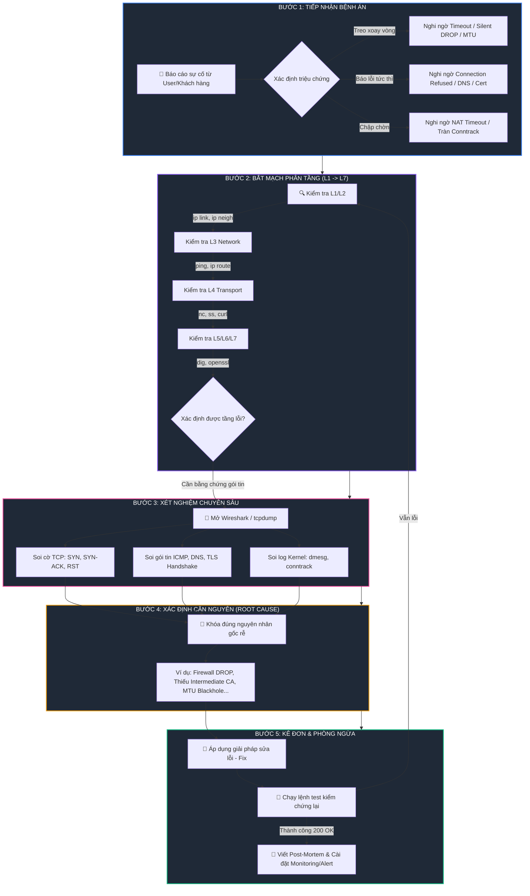

# 🧠 Sơ Đồ Tư Duy: Quy Trình 5 Bước "Bắt Bệnh" Network Thực Chiến

> **Triết lý:** Một kỹ sư mạng giỏi không bao giờ đoán mò. Họ có phương pháp, có tư duy của một bác sĩ và biết hỏi đúng câu hỏi ở đúng tầng OSI.

---

## 🗺️ 1. Sơ Đồ Tư Duy Tổng Thể (Mindmap)

```mermaid
mindmap
  root((🩺 5 BƯỚC<br/>BẮT BỆNH NETWORK))
    (1. Tiếp Nhận Bệnh Án)
      [Ghi nhận triệu chứng 5W1H]
        Ai bị? Khi nào?
        App báo mã lỗi gì?
      [Khoanh vùng phạm vi]
        1 người hay toàn công ty?
        Mạng nội bộ LAN hay Internet?
      [Tái hiện lỗi - Reproduce]
        Chạy thử từ client & server
    (2. Bắt Mạch Phân Tầng)
      [Tầng 1-2: Cáp & Data Link]
        ip link (Card có UP không?)
        ip neigh / arping (Bảng ARP đúng MAC không?)
      [Tầng 3: Network & Routing]
        ip route (Có Default Gateway không?)
        ping -s 1472 -M do (Có bị nghẽn MTU không?)
      [Tầng 4: Transport & Firewall]
        ss -tulpn (Socket bind 0.0.0.0 hay 127.0.0.1?)
        nc -zvw (Cổng mở hay bị DROP / REJECT?)
      [Tầng 5-6: TLS / Session]
        openssl s_client (Cert có đủ chuỗi Chain không?)
        date (Giờ hệ thống có bị lệch Clock Skew?)
      [Tầng 7: Application & DNS]
        dig +trace (DNS có resolve đúng IP không?)
        curl -Iv (HTTP status 200, 403, 502?)
    (3. Xét Nghiệm Chuyên Sâu)
      [Soi đáy gói tin]
        tcpdump / Wireshark
        Tìm cờ: SYN Retransmission, RST, ICMP Type 3
      [Soi Kernel & Network Stack]
        dmesg | grep conntrack (Tràn bảng?)
        sysctl / netstat (SYN Backlog full?)
      [Soi Log hệ thống]
        Firewall Drop Log
        Web Server error.log
    (4. Xác Định Căn Nguyên)
      [Khám nghiệm bằng chứng]
        Dựa trên Packet & Log, không đoán mò
      [Chẩn đoán phân biệt]
        DROP (Treo) vs REJECT (Từ chối)
        Lỗi mạng L3 vs Lỗi DNS L7
      [Chốt Root Cause]
    (5. Kê Đơn & Phòng Ngừa)
      [Kê đơn xử lý - Fix]
        Mở Firewall / MSS Clamping / Fullchain Cert
      [Tái khám - Verification]
        Chạy test kiểm chứng 200 OK
      [Phòng ngừa tái phát]
        Viết Post-mortem tài liệu hóa
        Bật Prometheus / Alerting giám sát
```

---

## 🧭 2. Quy Trình 5 Bước "Khám & Chữa Bệnh" (Flowchart Chi Tiết)



---

## 📋 3. Cẩm Nang Khám Nhanh (Cheat Sheet)

| Bước Khám Bệnh | Mục Tiêu Cốt Lõi | Câu Hỏi Cần Đặt Ra | Bộ Dụng Cụ Khám Nhanh (CLI) |
| :--- | :--- | :--- | :--- |
| **1. Tiếp nhận** | Nắm bắt triệu chứng chính xác | *Lỗi xảy ra từ bao giờ? Màn hình hiện thông báo gì? 1 người hay nhiều người bị?* | Ghi nhận HTTP Code, Browser Error Code (`ERR_...`) |
| **2. Bắt mạch** | Khoanh vùng tầng OSI bị đứt | *Cáp có cắm không? Ping có tới không? Port có mở không? Tên miền có resolve không?* | `ip link`, `ip route`, `ping`, `ss -tulpn`, `nc -zvw` |
| **3. Xét nghiệm** | Tìm bằng chứng vật lý dưới đáy gói tin | *Server có nhận được SYN không? Có trả lại RST không? Có bị mất gói to không?* | `Wireshark`, `tcpdump`, `dmesg`, `conntrack -L` |
| **4. Bắt bệnh** | Định danh chính xác Root Cause | *Tại sao lại bị như vậy? Lỗi cấu hình, lỗi hạ tầng hay do quá tải?* | Chẩn đoán phân biệt (Differential Diagnosis) |
| **5. Kê đơn** | Chữa khỏi dứt điểm & phòng ngừa | *Cần sửa config nào? Làm sao để không bao giờ tái phát ca bệnh này?* | `iptables`, `sysctl`, `nginx -s reload`, Prometheus/Alert |

---

*Kho tài liệu đồng hành cùng kênh [Network Thực Chiến](https://www.youtube.com/@NetworkThucChien).*
