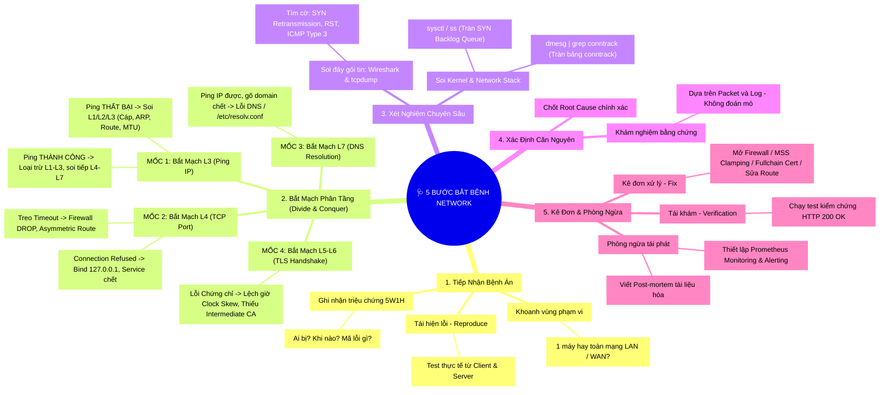
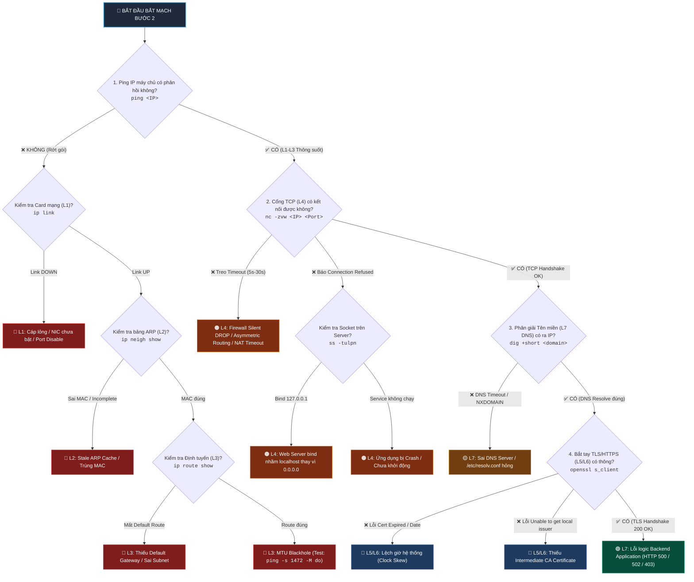

# 🧠 Sơ Đồ Tư Duy: Quy Trình 5 Bước "Bắt Bệnh" Network Thực Chiến

> **Triết lý:** Một kỹ sư mạng giỏi không bao giờ đoán mò. Họ có phương pháp, có tư duy của một bác sĩ và biết hỏi đúng câu hỏi ở đúng tầng OSI.

---

<p align="center">
  
</p>

---

## 🗺️ 1. Sơ Đồ Tư Duy Tổng Thể (Mindmap)



---

## 🧭 2. Cây Quyết Định Bắt Mạch Bước 2 (Divide & Conquer Decision Tree)

Chiến lược thông minh nhất trong Bước 2 là **Chia để trị (Divide & Conquer)** — Lấy **Tầng 3 (Ping IP)** làm ranh giới để cắt đôi không gian tìm kiếm, không test mò mẫm từ L1:



---

## 📋 3. Chi Tiết Các Trạm Khám Ở Bước 2 (Cheat Sheet Từng Tầng)

| Trạm Khám | Tầng OSI | Câu Hỏi Khám Bệnh | Câu Lệnh Bắt Mạch Nhanh | Dấu Hiệu Lỗi Thường Thấy |
| :--- | :--- | :--- | :--- | :--- |
| **Trạm 1: Vật lý** | **L1 — Physical** | *Card mạng có UP không? Có nhận link không?* | `ip link show`, `ethtool eth0` | `state DOWN`, `NO-CARRIER` (Cáp lỏng, driver lỗi) |
| **Trạm 2: Data Link** | **L2 — Data Link** | *Bảng ARP có học đúng địa chỉ MAC không?* | `ip neigh show`, `arping -I eth0 <IP>` | `FAILED`, `INCOMPLETE`, hoặc lưu địa chỉ MAC cũ |
| **Trạm 3: Định tuyến** | **L3 — Network** | *Ping IP có tới không? Có Default Route không?* | `ping -c 3 <IP>`, `ip route show` | `Network is unreachable`, `Destination Host Unreachable` |
| **Trạm 4: Kích thước gói** | **L3 — MTU** | *Gói tin to có bị rơi vào hố đen không?* | `ping -s 1472 -M do <IP>` | Ping nhỏ thông 100%, ping to mất gói 100% (MTU Blackhole) |
| **Trạm 5: Cổng dịch vụ** | **L4 — Transport** | *Cổng có mở không? Trạng thái kết nối ra sao?* | `nc -zvw3 <IP> <Port>`, `curl -Iv <URL>` | • `Connection timed out` (Firewall DROP)<br>• `Connection refused` (Port đóng / Bind 127.0.0.1) |
| **Trạm 6: Socket Server** | **L4 — Socket** | *Server bind trên IP nào?* | `ss -tulpn \| grep :<Port>` | `127.0.0.1:80` (Sai — Chỉ cho nội bộ) thay vì `0.0.0.0:80` |
| **Trạm 7: Tên miền** | **L7 — DNS** | *Domain có phân giải ra đúng IP không?* | `dig +short <Domain> @8.8.8.8`, `cat /etc/resolv.conf` | `Could not resolve host`, `NXDOMAIN`, `SERVFAIL` |
| **Trạm 8: Bảo mật TLS** | **L5/L6 — TLS** | *Chứng chỉ có đủ chuỗi và đúng ngày giờ không?* | `openssl s_client -connect <Host>:443 -showcerts` | `certificate has expired` (Sai giờ), `unable to get local issuer` (Thiếu Intermediate CA) |

---

## 🔬 4. Tổng Kết: 5 Bước Bắt Bệnh Network

```
[BƯỚC 1: TIẾP NHẬN]   → Thu thập triệu chứng 5W1H (Treo xoay vòng vs Báo lỗi tức thì vs Chập chờn).
         ↓
[BƯỚC 2: BẮT MẠCH]    → Dùng chiến lược Divide & Conquer (Ping L3 làm mốc) để khoanh vùng đúng tầng lỗi.
         ↓
[BƯỚC 3: XÉT NGHIỆM]  → Mở Wireshark / tcpdump soi cờ (SYN, RST, Retransmission) và soi dmesg Kernel.
         ↓
[BƯỚC 4: BẮT BỆNH]    → Xác định chính xác 1 trong 12 Root Cause (Không suy đoán mò mẫm).
         ↓
[BƯỚC 5: KÊ ĐƠN]      → Fix lỗi dứt điểm, kiểm thử lại 200 OK và viết tài liệu Post-mortem phòng ngừa.
```

---

*Kho tài liệu đồng hành cùng kênh [Network Thực Chiến](https://www.youtube.com/@NetworkThucChien).*
