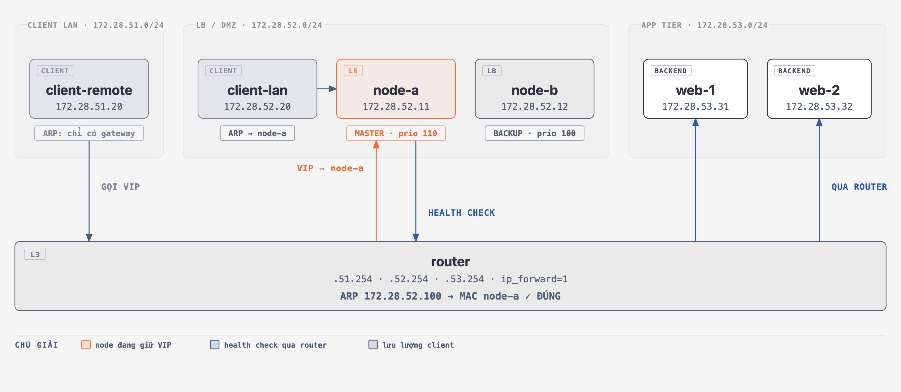

# 🩺 Ca Bệnh 05: Failover HA Thành Công Nhưng Dịch Vụ Vẫn Chết — Thủ Phạm Là Bảng ARP

> **Hồ sơ ca bệnh:**
> * **Hiện tượng:** Cụm HA vừa failover. Node MASTER chết, node BACKUP đã lên, đã cầm VIP, `HAProxy` vẫn chạy, backend vẫn khoẻ, cấu hình đúng 100%. **Nhưng client vẫn không truy cập được dịch vụ.**
> * **Bản chất lỗi:** **Stale ARP Cache ở Tầng 2**. Một thiết bị nào đó vẫn ôm địa chỉ MAC của node MASTER **đã tắt thở** cho IP của VIP. Node BACKUP cầm VIP rồi nhưng **không phát Gratuitous ARP (GARP)** để báo cho toàn LAN biết "VIP này giờ ứng với MAC của tôi".
> * **Chỗ khác biệt của tập này:** thiết bị ôm MAC chết **không phải là client**. Client nằm ở subnet khác nên nó chưa bao giờ hỏi ARP về VIP. Kẻ ôm MAC chết là **ROUTER** — và bạn có soi bảng ARP ở client cả ngày cũng không thấy gì bất thường.

> 🧪 **Lab dùng stack HA thật, topology 3 tầng như production:** client ở vùng người dùng, cặp **Keepalived + HAProxy** ở DMZ, backend nginx ở tầng app riêng, giữa các tầng là router. **12 kịch bản** chia 4 nhóm theo tình huống bạn thực sự gặp:
>
> | Nhóm | KB | Đo được |
> | :--- | :-- | :--- |
> | **A. Failover chạy đúng** | 1–2 | downtime **~2.8s**; nhưng phiên TCP đang mở vẫn đứt (`curl_exit=18`) |
> | **B. Ổ bệnh Tầng 2** | 3–7 | blackhole `curl (28)`; tự khỏi **32 giây** trên Linux, **4 tiếng** trên Cisco |
> | **C. Cụm HA tự đánh nhau** | 8–9 | 2 MAC cùng đáp 1 IP; `preempt` gây **2 lần** mất phiên thay vì 1 |
> | **D. Chết vì lý do KHÁC L2** | 10–12 | HTTP **503** (khác hẳn blackhole); `use_vmac` khiến MAC **không bao giờ đổi** |
>
> 👉 Chi tiết từng kịch bản: [**kich-ban.md**](./kich-ban.md)

> 📚 **Điều kiện tiên quyết:** Nắm được `ping`, `curl`, `ip neigh`, `ip route`, `tcpdump` ở mức cơ bản (xem series **Debug Mạng A-Z**). Đây là ca bệnh **Tầng 2** đầu tiên của series — mọi thứ ở L3/L4 đều đúng tuyệt đối, lỗi nằm dưới sâu hơn.

---

## 🔬 Sơ đồ Kiến trúc Lab

```text
  CLIENT LAN                 LB / DMZ                      APP TIER
  172.28.51.0/24             172.28.52.0/24                172.28.53.0/24
                             VIP 172.28.52.100

 +------------------+     +------------------------+     +------------------+
 | client-remote    |     | node-a .11  MASTER 110 |     | web-1  .53.31    |
 |     .51.20       |     | node-b .12  BACKUP 100 |     | web-2  .53.32    |
 |                  |     | HAProxy + Keepalived   |     | nginx            |
 |                  |     |                        |     |                  |
 |                  |     | client-lan  .52.20     |     |                  |
 +--------+---------+     +-----------+------------+     +--------+---------+
          |                           |                           |
          +---[ router  .51.254  |  .52.254  |  .53.254 ]----------+
                          ip_forward = 1
```

* `client-remote` là **nạn nhân thật**: khác subnet với VIP nên nó không bao giờ ARP hỏi VIP.
* `client-lan` là **đối chứng**: cùng subnet với VIP nên nó CÓ bảng ARP cho VIP. Cùng một sự cố, hai máy này khỏi ở hai thời điểm khác nhau.
* Health check của HAProxy xuống backend **phải đi qua router** — mở ra kịch bản 11 (mất backend → HTTP 503).
* Ổ bệnh ARP luôn nằm ở **chân `.52.254` của router**, bất kể tách bao nhiêu tầng.



> 🖼️ **Bản HTML tương tác** — 4 tab (bình thường / ca bệnh Tầng 2 / lỗi Tầng 3 / split-brain),
> mở thẳng trong trình duyệt: [`so-do-kien-truc.html`](./so-do-kien-truc.html)

> 🔑 Toàn bộ tập này gói gọn trong một câu: **IP đúng, route đúng, dịch vụ sống — nhưng khung tin Ethernet đang được gửi tới một địa chỉ MAC không còn tồn tại.**

---

## 🧭 Khi Có Router Ở Giữa, Triệu Chứng Đổi Thế Nào

Đây là phần khiến ca bệnh này khó lần hơn hẳn so với mô hình phẳng một subnet.

### 1. Bảng ARP của client trở nên VÔ NGHĨA

Client ở subnet khác không bao giờ ARP hỏi VIP — nó chỉ hỏi gateway. Bảng ARP
của nó **luôn sạch**, kể cả khi dịch vụ chết hoàn toàn:

```
$ docker exec lab05-client-remote ip neigh show
172.28.51.254 dev eth0 lladdr e6:80:aa:95:23:18 REACHABLE     ← chỉ có gateway
                                                              ← KHÔNG có dòng nào cho VIP
```

👉 Toàn bộ thao tác debug quen thuộc ở phía client — `ip neigh`, `arp -a`, xoá cache,
bắt gói ARP — đều là **ngõ cụt 100%**. Đây là lý do ticket kiểu này hay bị đóng
với dòng "kiểm tra máy khách không thấy vấn đề gì".

### 2. Chữ ký nhận dạng: LỖI MỘT CHIỀU

| Chiều | Kết quả | Vì sao |
| :--- | :--- | :--- |
| client → VIP | **CHẾT** | router forward frame tới MAC của máy đã chết |
| node → client | **THÔNG** | node biết đường ra, ARP gateway của nó vẫn đúng |

Thấy "ping từ server ra client thì được, từ client vào server thì không" là gần
như chắc chắn có stale ARP ở thiết bị L3 nằm giữa.

### 3. `traceroute` chết ngay sau hop cuối cùng

```
$ docker exec lab05-client-remote traceroute -n 172.28.52.100
 1  172.28.51.254  0.010 ms      ← router: sống
 2  * * *                        ← chết ngay tại đây
```

Hop cuối cùng còn trả lời chính là **thiết bị đang ôm bảng ARP sai**. Đó là chỗ
phải đi soi, không phải máy client.

### 4. `curl (28)` hay `curl (7)` — khác nhau hoàn toàn

| Mã | Ý nghĩa | Kết luận |
| :--- | :--- | :--- |
| **`(28)` timeout** | không có response nào, im lặng tuyệt đối | frame vào hư vô → **lỗi Tầng 2** |
| **`(7)` refused** | gói ĐẾN được đích, bị từ chối | đích sống, không ai nghe cổng → lỗi dịch vụ |
| **`HTTP 503`** | có response HTTP đàng hoàng | L2/L3 đều ổn → lỗi backend, xem KB11 |

👉 **"Có response hay không" là câu hỏi đầu tiên phải trả lời trong mọi sự cố.**

### 5. Mất luôn cơ chế "tự khỏi sau 30 giây"

Con số 30 giây quen thuộc là hành vi **NUD của Linux**, không phải của chuẩn ARP.
Thiết bị mạng chuyên dụng không có NUD:

| Thiết bị | ARP timeout | Có NUD? | Tự khỏi sau |
| :--- | :--- | :--- | :--- |
| Linux (host/router) | ~30–60 giây | **CÓ** | ~30–50 giây |
| Juniper JunOS | 1200 giây | KHÔNG | 20 phút |
| Cisco NX-OS | 1500 giây | KHÔNG | 25 phút |
| **Cisco IOS / IOS-XE** | **14400 giây** | KHÔNG | **4 TIẾNG** |

Tệ hơn: với **CEF adjacency** trên Cisco, gói bị drop **im lặng** — không log,
không tăng counter interface. Không có gì để bạn lần ra.

Lab tái hiện được cả hai (kịch bản 5) bằng cách chỉnh `neigh` sysctl trên chân
`.52` của router.

### 6. Cách chữa KHÔNG đổi — nhưng lý do thì đổi

`arping -U` vẫn là cách chữa đúng, vì GARP là broadcast trong subnet của VIP và
**router có một chân nằm trong subnet đó**. Nhưng phải hiểu cho chính xác:

👉 **GARP không sửa client remote. Nó sửa ROUTER.** Client remote được cứu gián
tiếp vì nó gửi mọi thứ qua router. Chứng minh bằng kịch bản 7: bắt gói đồng thời
ở hai chân router và ở client — GARP tới chân `.52` và **dừng lại ở đó**.

Ba lưu ý khi có router:
1. Bắn **5 gói** thay vì 3 (`arping -U -c 5`) — đường qua switch doanh nghiệp dễ mất gói hơn.
2. Dynamic ARP Inspection trên switch có thể nuốt gói GARP.
3. **Mọi** thiết bị L3 có chân trong subnet của VIP đều cần cập nhật: router chính,
   router dự phòng, firewall, LB ngoài, peer HSRP/VRRP. Thiếu một cái là còn một đường chết.

### 7. Quy trình chẩn đoán 3 pha khi nghi có router ở giữa

```
PHA 1 - Loai tru tang tren
        curl -> co response HTTP khong?
            CO  (503/200) -> KHONG phai loi ARP. Sang KB10/KB11.
            KHONG (28)    -> tiep tuc PHA 2.

PHA 2 - Xac dinh bien
        traceroute tu client -> hop cuoi cung con tra loi la thiet bi nghi van
        ping nguoc tu server -> client   -> thong = dung chu ky loi mot chieu

PHA 3 - Soi dung cho
        Tren thiet bi L3 do:  show ip arp <VIP>   /  ip neigh show <VIP>
        So MAC do voi MAC that cua node dang giu VIP.
        Lech = tim thay o benh.
```

---

## ❓ Vì Sao Node BACKUP Không Gửi GARP?

Câu hỏi đầu tiên ai cũng hỏi. Câu trả lời có ba tầng, và tầng nào cũng đáng biết.

### Tầng 1 — Trong lab: phải TẮT Keepalived thì bệnh mới xuất hiện

Đây là chi tiết quan trọng nhất, và nó tự nó đã là một bài học:

**Keepalived KHÔNG BAO GIỜ quên phát GARP.** Không có tuỳ chọn nào tắt được. Đo thực tế trên keepalived 2.2.8 — đặt toàn bộ nhóm `garp_master_*` về `0`:

```
garp_master_delay 0
garp_master_repeat 0
garp_master_refresh 0
garp_master_refresh_repeat 0
```

Bắt gói lúc failover vẫn thấy nó phát:

```
c2:a0:36:0a:ac:6e > ff:ff:ff:ff:ff:ff, ARP, Request who-has 172.29.9.100 tell 172.29.9.100
```

Số gói giảm từ 5 xuống 1, nhưng **không về 0**. Muốn dựng lại ca bệnh, `3-fault.sh` buộc phải **giết Keepalived trước**, rồi cướp VIP bằng đúng một dòng của script tự chế:

```bash
docker exec lab05-node-b ip addr replace 172.28.52.100/24 dev eth0
```

👉 Nói cách khác: **ca bệnh này chỉ tồn tại khi bạn KHÔNG dùng Keepalived.** Đó là kết luận mạnh nhất của cả tập.

### Tầng 2 — Vì sao kernel không tự gửi giùm

Đo trong lab: bắt ARP đồng thời ở **cả client lẫn node-b**, rồi chạy `ip addr replace` trên node-b:

```
[client thấy]:  (KHÔNG CÓ GÓI ARP NÀO)
[node-b thấy]:  (KHÔNG CÓ GÓI ARP NÀO)
```

Gán IP xong, kernel **im re**. Ba lý do chồng lên nhau:

1. **Chuẩn ARP không có khái niệm "công bố".** RFC 826 định nghĩa ARP là giao thức **hỏi-đáp theo yêu cầu**: ai cần thì hỏi, ai giữ IP thì đáp. Không điều khoản nào bắt máy vừa nhận IP mới phải thông báo. Gratuitous ARP là **quy ước bổ sung** nghĩ ra sau, không phải nghĩa vụ của giao thức.

2. **Linux mặc định `arp_notify = 0`.** Tự kiểm: `sysctl -n net.ipv4.conf.eth0.arp_notify`.

3. **Bật `arp_notify=1` cũng KHÔNG cứu được ca này.** Kernel chỉ bắn GARP ở hai sự kiện: **device UP** và **NETDEV_NOTIFY_PEERS** (bonding failover, VM live migration). Thêm secondary IP lên interface **đang UP sẵn** không sinh event nào → vẫn không có gói nào. Đừng khuyên "bật `arp_notify` là xong" cho case VIP — nó không đúng.

> 🆚 **Đối chiếu IPv6 — chỗ này IPv4 thua rõ ràng.** NDP **bắt buộc** DAD (gửi Neighbor Solicitation khi nhận địa chỉ mới) và gửi **unsolicited Neighbor Advertisement**. IPv6 tự announce **theo chuẩn**, không cần công cụ ngoài. IPv4 phải gọi `arping` bằng tay.
>
> Nói cách khác: ca bệnh này về bản chất là **lỗ hổng thiết kế của ARP**, không phải lỗi ai đó đãng trí.

### Tầng 3 — Ngoài đời, dùng keepalived rồi vẫn mất GARP

Phần này mới là thứ bạn gặp trong production:

| # | Nguyên nhân | Ghi chú |
|---|---|---|
| **a** | **Script tự viết** — bash / Ansible / systemd `ExecStartPost` chỉ có `ip addr add` | Nguyên nhân số 1 |
| **b** | **Gói GARP mất thật** — broadcast không ACK, không retransmit; switch bận hoặc storm-control là bay | Chỉnh `garp_master_repeat`, `garp_master_refresh`, `garp_master_delay` |
| **c** | **GARP bắn quá sớm, cổng switch chưa forward** | Xem dưới — ca kinh điển nhất |
| **d** | **Pacemaker** — `ocf:heartbeat:IPaddr2` *có* gửi (`arp_count`, `arp_bg`), nhưng `IPaddr` bản cũ / RA custom thì không | Kiểm `pcs resource config` |
| **e** | **Container / VM / cloud** — VIP nằm trong netns không ra khỏi host; anti-spoofing hoặc MAC learning tắt ở hypervisor/VPC drop gói | |
| **f** | **Switch nuốt gói** — Dynamic ARP Inspection, port security, chống ARP spoofing trên firewall | |
| **g** | **Split-brain** — thừa GARP chứ không thiếu | Xem kịch bản 8 |

**(c) Ca kinh điển — GARP bắn vào lúc STP chưa forward.**
Node lên MASTER ngay lúc boot hoặc link vừa up, GARP phóng ra khi cổng switch còn ở trạng thái **STP listening/learning** (tới 30 giây với STP truyền thống, nếu quên bật portfast / edge-port). Gói bắn vào hư không.

Nguy hiểm ở chỗ: **log phía server hoàn toàn sạch** — keepalived ghi rõ đã gửi GARP, `tcpdump` trên chính node đó cũng thấy gói đi ra. Nhưng không máy nào trong LAN nhận được. Muốn bắt được ca này **phải bắt gói ở máy thứ ba**, không phải ở node vừa failover.

**(g) Biến thể nguy hiểm hơn — split-brain.**
node-a chưa chết hẳn (chỉ đứt VRRP heartbeat), node-b vẫn lên MASTER. **Cả hai** cùng bắn GARP → bảng ARP toàn LAN **flapping** qua lại giữa hai MAC. Đây không phải "thiếu GARP" mà là "thừa GARP từ hai nguồn" — triệu chứng chập chờn, nặng và khó lần hơn nhiều. Xem kịch bản 8.

### 🔎 Verify trên hệ thống thật

Bắt gói ở **máy thứ ba** trong LAN (bắt trên node vừa failover là vô nghĩa — ở đó luôn thấy có gửi), rồi trigger failover:

```bash
# Lọc đúng Gratuitous ARP: Sender IP == Target IP (bắt cả dạng Request lẫn Reply)
tcpdump -i eth0 -n -e 'arp[14:4] = arp[24:4]'

# Chỉ muốn dạng Request (arping -U)? Thêm điều kiện opcode:
tcpdump -i eth0 -n -e 'arp[6:2] = 1 and arp[14:4] = arp[24:4]'
```

> ⚠️ Dùng bộ lọc **rộng** (không kèm opcode) khi đi soi hệ thống lạ. `arping -A` phát GARP dạng **Reply** (opcode 2) — thêm `arp[6:2] = 1` là lọc mất luôn, rồi kết luận nhầm "không có GARP nào".
>
> Wireshark có sẵn tương đương: `arp.isgratuitous == 1`.

Kiểm cấu hình:
```bash
grep -iE 'garp|vmac' /etc/keepalived/keepalived.conf    # keepalived
pcs resource config <ten-vip> | grep -i arp             # pacemaker
grep -rn 'ip addr add' /etc/systemd/ /usr/local/bin/    # script tự viết -> thủ phạm
```

---

## 🧩 Ba Kiểu "Dịch Vụ Chết" Trông Giống Hệt Nhau

Đây là giá trị chính của topology 3 tầng: nó cho phép dựng lại **ba** ca có cùng
một lời than "cụm HA vừa failover xong, dịch vụ không vào được" nhưng ổ bệnh ở
ba tầng khác nhau.

| Dấu hiệu | KB3 — ARP cũ | KB11 — mất backend | KB10 — HAProxy chết |
| :--- | :--- | :--- | :--- |
| `curl` trả về | **(28) timeout** | **HTTP 503** | 200 (sau ~7s) |
| **Có response HTTP?** | **KHÔNG** | **CÓ** | CÓ |
| VIP có chuyển không | đã chuyển rồi | **KHÔNG** | có, tự chuyển |
| Bảng ARP router | **SAI** (MAC chết) | ĐÚNG | ĐÚNG |
| HAProxy stats | **backend UP hết** | **backend DOWN hết** | node kia phục vụ |
| Ổ bệnh ở tầng | **2** | **3 / 7** | **7** |
| Sửa ở đâu | node đang giữ VIP | router / firewall | không cần sửa |

👉 Dòng **HAProxy stats** lật ngược trực giác:
- **KB3**: monitoring báo **xanh hết** mà dịch vụ chết. Monitoring bị mù, vì
  HAProxy chỉ nhìn **xuống** backend, không biết gì về bảng ARP ở phía **trên** nó.
- **KB11**: monitoring báo **đỏ đúng chỗ**. Ca dễ — nếu bạn chịu mở trang stats
  ra xem thay vì đoán.

---

## 🚀 Hướng Dẫn Thực Hành

Lab gồm **7 container**: `router`, `node-a` / `node-b` (HAProxy + Keepalived),
`web-1` / `web-2` (nginx backend), `client-remote`, `client-lan`.

```bash
cd network-bat-benh/tap-05-vip-failover-garp
./scripts/0-setup.sh
```

Mở đủ **ba terminal**:

```bash
# Terminal 2 — máy đo phía client (nạn nhân)
docker exec -it lab05-client-remote monitor.sh

# Terminal 3 — soi bảng ARP của router (ổ bệnh thật)
./scripts/xem-arp-router.sh
```

Trạng thái chuẩn phải như thế này:

```
✅ Trạng thái bình thường đã sẵn sàng.
   VIP 172.28.52.100 đang nằm trên: node-a
   Bảng ARP đang trỏ về đâu:
   router(.52):   c2:df:af:34:8a:99    -> node-a
   client-lan:    c2:df:af:34:8a:99    -> node-a
   client-remote: KHÔNG có entry ARP cho VIP — đúng như mong đợi.
```

### Bảng script

| Script | KB | Nội dung |
| :--- | :-- | :--- |
| `0-setup.sh` | — | Dựng lab + reset sạch về trạng thái bình thường |
| `test.sh` | — | **Chẩn đoán 8 bước** — đi từ ngoài vào trong |
| `xem-arp-router.sh` | — | Theo dõi bảng ARP của router theo thời gian thực |
| `bat-goi-garp.sh` | — | Bắt gói GARP (mặc định ở router — đúng chỗ) |
| `1-failover-chuan.sh` | 1 | Failover đúng chuẩn — đo downtime ở cả 2 client |
| `2-dut-phien-tcp.sh` | 2 | GARP cứu gói tin, **không** cứu phiên TCP |
| `3-fault.sh` | 3 | **Ca bệnh** — script tự chế cướp VIP, quên GARP |
| `4-fix.sh` | 4 | Chữa đúng bằng Gratuitous ARP |
| `5-tu-khoi.sh` | 5 | Linux tự khỏi 32s — Cisco thì 4 tiếng |
| `6-chua-tren-router.sh` | 6 | Chữa cháy phía router (`clear ip arp`) |
| `7-garp-khong-xuyen-router.sh` | 7 | GARP dừng ở biên L3 |
| `8-split-brain.sh` | 8 | **Thừa GARP** — hai node cùng giữ VIP |
| `9-preempt.sh` | 9 | Một sự cố, **hai lần** mất phiên |
| `10-dich-vu-chet.sh` | 10 | Dịch vụ chết nhưng máy vẫn sống (`track_script`) |
| `11-backend-qua-router.sh` | 11 | Mất backend sau router → HTTP 503 |
| `12-use-vmac.sh` | 12 | Chữa tận gốc: MAC ảo không bao giờ đổi |

> 🔁 **Sau MỖI kịch bản hãy chạy `./scripts/0-setup.sh`.** Nó dọn sạch mọi dấu vết
> (rule iptables của KB8 và KB11, cờ `nopreempt` của KB9, cờ `USE_VMAC` của KB12,
> ARP kiểu Cisco của KB5, HAProxy bị giết ở KB10, VIP gán tay ở KB3, và **route
> tĩnh bay mất sau mỗi lần container restart**) rồi dựng lại trạng thái chuẩn.

👉 **Hướng dẫn chi tiết từng kịch bản — bối cảnh, output thật, cách đọc kết quả:
[kich-ban.md](./kich-ban.md)**

---

## 🚧 Lab Này KHÔNG Thể Cho Bạn Thấy Gì

Trung thực về giới hạn cũng quan trọng như bản thân bài lab. Mạng của lab là các **Linux bridge của Docker** — không phải switch thật, và **thiếu đúng những thứ mà bảng nguyên nhân (a–g) ở trên đổ lỗi**:

| Thứ không có trong lab | Hậu quả |
| :--- | :--- |
| **STP / portfast** | Không tái hiện được nguyên nhân **(c)** — GARP bắn lúc cổng switch còn `listening/learning`. Bridge của Docker forward ngay lập tức. |
| **Dynamic ARP Inspection, port-security** | Không tái hiện được **(f)** — switch/firewall nuốt gói GARP. |
| **Storm control, switch quá tải** | Không tái hiện được **(b)** — GARP mất thật trên đường truyền. |
| **Hypervisor / VPC** | Không tái hiện được **(e)** — anti-spoofing của VMware/AWS drop gói. |
| **Router là Linux, không phải Cisco** | Kịch bản 5 **giả lập** ARP timeout 4 tiếng bằng `neigh` sysctl. Nó đúng về hành vi timer, nhưng không có CEF adjacency, không có DAI, không có ACL phần cứng. |

👉 Lab chứng minh **cơ chế** (ARP cache thiu → frame đi vào hư vô → GARP sửa được), nhưng **không** chứng minh được tần suất hay mức độ ngoài đời. Đừng suy diễn từ một Linux bridge ra một switch campus.

👉 Muốn thấy trên **thiết bị mạng thật** — Cisco IOS ôm cache sai đúng 4 tiếng, `show ip arp`, `clear ip arp`, cả bẫy STP nuốt GARP — xem hai lab bonus ở mục Cơm Thêm bên dưới.

---

## 🧠 Bác Sĩ Mạng Đúc Kết

1. **GARP là trách nhiệm của bên failover, không phải bên client.**
   Khi một máy nhận VIP mới, thay card mạng, hoặc lên làm MASTER, nó **PHẢI** chủ động broadcast Gratuitous ARP:
   ```bash
   arping -U -c 5 -I eth0 <VIP>      # -U = Unsolicited (thông báo, không phải hỏi)
   arping -A -c 5 -I eth0 <VIP>      # -A = gửi dạng ARP Reply, một số thiết bị chỉ nghe kiểu này
   ```
   Gửi **nhiều gói** (5 khi có router ở giữa): ARP chạy **thẳng trên Ethernet** (ethertype `0x0806`) — không có IP, không có UDP, **không ACK, không retransmit**. Mất là mất luôn, không ai báo.

2. **Khi có router ở giữa, GARP không sửa client — nó sửa ROUTER.**
   Client remote được cứu **gián tiếp** vì nó gửi mọi thứ qua router. Hệ quả: bắt gói GARP ở client remote là vô nghĩa, và **mọi** thiết bị L3 có chân trong subnet của VIP đều cần được cập nhật.

3. **Bảng ARP của client remote LUÔN SẠCH — đó không phải tin tốt.**
   Nó chỉ có nghĩa là bạn đang soi nhầm chỗ. Đi thẳng tới thiết bị L3 gần VIP nhất.

4. **Keepalived / VRRP / Pacemaker đã làm sẵn việc này — và không thể tắt.**
   Đo trong lab: đặt cả 4 tham số `garp_master_*` về `0`, Keepalived **vẫn** phát GARP (giảm từ 5 gói xuống 1, không về 0).
   👉 Rủi ro nằm **hoàn toàn** ở **script failover tự viết tay**. Nếu bạn đang tự động hoá failover bằng bash/Ansible, kiểm tra ngay xem có dòng `arping` không — hoặc tốt hơn: **vứt script đi, dùng Keepalived.**

5. **"Sao cụm HA chỗ tôi chưa bao giờ dính lỗi này?" — vì MAC ảo.**
   Chuẩn VRRP (RFC 5798) quy định router ảo dùng **MAC ảo** `00:00:5e:00:01:<VRID>`. MAC đó **nhảy theo VIP** sang node mới, nên bảng ARP vẫn đúng nguyên — không cần GARP, không có ca bệnh này.
   * Thiết bị phần cứng (Cisco/Juniper HSRP/VRRP) mặc định làm vậy.
   * **Keepalived trên Linux thì KHÔNG** — mặc định `use_vmac` tắt.

   👉 Kịch bản 12 bật `use_vmac` và chứng minh MAC không đổi qua failover. Đọc cả phần **giá phải trả** trước khi bật ở production.

6. **Con số "tự khỏi sau 30 giây" là hành vi của Linux, không phải của chuẩn ARP.**
   Đó là **NUD** — may mắn, không phải thiết kế. Cisco IOS mặc định **14400 giây = 4 tiếng**, và không có NUD. Test trên Linux rồi ship lên Cisco là sai lầm đắt nhất của tập này.

7. **Trên cloud, cách chữa này KHÔNG chạy.** VPC của AWS/Azure/GCP không flood Tầng 2 — GARP bắn ra không ai nghe. Ở đó phải gọi API dời secondary IP / gắn lại ENI, sửa route table, hoặc dùng thẳng Load Balancer của nhà cung cấp.

8. **GARP chỉ CẬP NHẬT entry có sẵn, không TẠO entry mới.** Linux mặc định `net.ipv4.conf.*.arp_accept = 0`. Không phải lỗi — đúng nhóm thiết bị **đang nói chuyện với VIP** mới cần chữa, và đúng nhóm đó được chữa. Cũng là lý do GARP không biến mạng thành thiên đường ARP spoofing.

9. **Đọc bảng ARP cho đúng:**
   ```bash
   ip neigh show                     # xem toàn bộ bảng
   ip neigh show 172.28.52.100       # xem 1 IP
   ```
   Trạng thái cần biết: `REACHABLE` (tin tưởng tuyệt đối — và đó là lúc nguy hiểm nhất), `STALE` (nghi ngờ, sẽ xác minh khi cần), `PERMANENT` (đóng đinh vĩnh viễn).

10. **Xoá cache ARP thủ công (chỉ khi chữa cháy):**
    ```bash
    ip neigh del 172.28.52.100 dev eth1      # xoá 1 IP  ≡ clear ip arp trên Cisco
    ip neigh flush dev eth1                  # xoá cache động của cả interface
    ip neigh flush dev eth1 nud permanent    # ⚠️ BẮT BUỘC có `nud permanent` mới xoá được entry tĩnh
    ```
    > 🪤 `ip neigh flush dev eth1` **KHÔNG** xoá được entry `PERMANENT`. Nhiều người gõ lệnh này, thấy không có lỗi báo về, rồi tưởng đã sạch — trong khi entry sai vẫn nằm nguyên đó.

11. **GARP cứu gói tin, KHÔNG cứu phiên TCP.** Failover dù hoàn hảo vẫn giết sạch mọi kết nối đang mở. Đo HA bằng `ping` sẽ cho con số đẹp và **sai**.

12. **Tắt `preempt` nếu hai node ngang nhau.** Mặc định `preempt` biến một sự cố thành **hai** lần mất phiên. Lần thứ hai hoàn toàn tự gây ra và gần như vô hình với `ping`.

13. **Health check nội bộ mù trước lỗi Tầng 2.** HAProxy stats xanh, Keepalived xanh, node exporter xanh — vì mọi phép đo đều chạy *bên trong* cụm. Chỉ một synthetic check **từ ngoài, gọi vào VIP, từ đúng subnet của người dùng** mới phát hiện được.

14. **Thừa GARP còn tệ hơn thiếu.** Split-brain gây lỗi *chập chờn*, không tự khỏi, và với dịch vụ có ghi dữ liệu thì hai MASTER cùng ghi = mất dữ liệu. Lệnh chẩn đoán: `arping -c 4 -I <iface> <VIP>` — **nhiều câu trả lời hơn số câu hỏi, từ hai MAC khác nhau**.

15. **Không phải "dịch vụ chết sau failover" nào cũng là lỗi ARP.** Ba ca ở mục 🧩 trông giống hệt nhau. Câu hỏi phân loại chỉ có một: **có response HTTP hay không.**

---

## 🍚 Cơm Thêm: Chạy Trên Thiết Bị Mạng Thật

Lab chính dùng router Linux nên phải **giả lập** ARP timeout của Cisco bằng sysctl.
Muốn thấy hàng thật:

| Lab | Router | Điểm mạnh riêng |
| :--- | :--- | :--- |
| [`com-them-containerlab/`](./com-them-containerlab) | **Cisco IOL** thật (hoặc Linux) | Dựng bằng mã nguồn (IaC), lên/xuống trong 1 lệnh, dễ lặp lại |
| [`com-them-eve-ng/`](./com-them-eve-ng) | **Cisco vIOS** + **vIOS-L2** switch | Có cả switch thật → tái hiện được bẫy **STP nuốt GARP**, `use_vmac` trên thiết bị thật |

Cả hai dùng **cùng sơ đồ IP với lab chính** (`172.28.51.20` client, `172.28.52.11/.12`
node, VIP `172.28.52.100`, VRID 51, priority 110/100) nên bạn không phải học lại
sơ đồ khi chuyển qua.

> ⚠️ Khác biệt duy nhất: hai lab bonus **không có tầng app `172.28.53.0/24`** —
> nginx chạy thẳng trên node HA, không qua HAProxy. Vì vậy chúng **không tái hiện
> được kịch bản 11** (mất backend → 503). Đổi lại chúng cho bạn thứ lab chính
> không thể có: hành vi thật của thiết bị mạng thật.

---

## 📝 Câu Hỏi Ôn Tập

1. Node BACKUP đã cầm VIP, dịch vụ vẫn chạy, IP/subnet/route đều đúng. Vậy gói tin của client **chết ở đâu**, và **vì sao**?
2. Client nằm ở subnet khác. Bảng ARP của nó hoàn toàn sạch, không có dòng nào cho VIP. Vì sao đó **không** có nghĩa là client khoẻ mạnh, và bạn phải đi soi ở đâu?
3. Nhìn vào Wireshark, làm sao phân biệt một gói **Gratuitous ARP** với một gói ARP Request bình thường?
4. Vì sao cách chữa đúng là chạy `arping` trên **node đang giữ VIP**, chứ không phải `ip neigh flush` trên từng client? Và khi có router ở giữa thì lệnh đó thực chất đang sửa cho **ai**?
5. Trong lab, chữa bảng ARP của router thì `client-remote` sống lại ngay nhưng `client-lan` vẫn chết. Điều đó chứng minh gì?
6. Cùng một sự cố: trên router Linux tự khỏi sau 32 giây, trên Cisco IOS thì 4 tiếng. Khác nhau ở cơ chế nào?
7. Cụm HA chạy trên router Cisco dùng VRRP chuẩn **không bao giờ** dính ca bệnh này, còn keepalived trên Linux thì có. Khác nhau ở đâu, và bật gì để keepalived hành xử giống Cisco?
8. Bạn bê nguyên mô hình VIP + `arping` này lên một VPC của AWS. Chuyện gì xảy ra, và vì sao?
9. Failover mất 3 giây theo `ping`. Vì sao người dùng đang upload file vẫn báo lỗi?
10. HAProxy stats xanh, Keepalived xanh, Prometheus xanh — nhưng khách hàng không vào được. Vì sao **không** hệ thống giám sát nào trong cụm báo động, và bạn phải thêm phép đo gì?
11. Một sự cố duy nhất (node chính chết rồi hồi phục) lại làm đứt kết nối **hai** lần. Vì sao, và sửa bằng tham số nào?
12. Bạn nghi ngờ split-brain. Gõ **một** lệnh duy nhất để xác nhận — lệnh gì, và nhìn vào dấu hiệu nào?
13. Hai ca: (A) `curl` timeout sau 4 giây không có gì trả về; (B) `curl` trả về `HTTP 503` trong 0.3 mili-giây. Ca nào là lỗi ARP, ca nào không, và vì sao chỉ cần nhìn chừng đó là đủ kết luận?

<details><summary>Gợi ý đáp án</summary>

1. Chết ở **Tầng 2**. Bảng ARP của thiết bị L3 gần VIP nhất (ở đây là router) vẫn map VIP → MAC của node-a đã tắt, nên khung Ethernet mang Destination MAC không còn tồn tại. Gói đi vào hư vô — không ai nhận, không ai báo lỗi. Mọi thứ từ L3 trở lên đều đúng nên `ping`/`traceroute`/route table đều "sạch".
2. Vì client khác subnet nên nó **chưa bao giờ ARP hỏi VIP** — nó chỉ ARP hỏi gateway, và entry đó luôn đúng. Bảng ARP sạch chỉ chứng minh bạn đang soi nhầm máy. Phải đi tới **thiết bị L3 cuối cùng còn trả lời trong `traceroute`** và xem bảng ARP ở đó (`show ip arp <VIP>` / `ip neigh show <VIP>`).
3. Dấu hiệu duy nhất cần nhớ: **broadcast** + **Sender IP = Target IP** (máy "hỏi" về chính địa chỉ của nó). Nó không hỏi, nó tuyên bố. Có **hai dạng** đều hợp lệ: ARP **Request** (`arping -U`) và ARP **Reply** (`arping -A`) — đừng lọc theo opcode kẻo sót dạng Reply. Wireshark: `arp.isgratuitous == 1`.
4. Vì căn nguyên nằm ở **bên vừa đổi MAC**, không phải bên client. Một lệnh `arping` sửa cho **toàn bộ broadcast domain cùng lúc**. Khi có router ở giữa, lệnh đó thực chất đang sửa cho **ROUTER** — client remote được cứu gián tiếp vì nó gửi mọi thứ qua router (kịch bản 7 chứng minh GARP không hề tới được client remote).
5. Chứng minh mỗi thiết bị trong broadcast domain ôm một bảng ARP **riêng** và ốm **độc lập**. Chữa một thiết bị không chữa cho những thiết bị còn lại. Đó chính là lý do cách chữa đúng phải là **GARP broadcast** — nó chữa tất cả cùng một lúc.
6. Linux có **NUD** (Neighbour Unreachability Detection): entry `REACHABLE` hết hạn → `STALE` → `DELAY` → `PROBE` (thăm dò unicast tới MAC cũ, thất bại) → `FAILED` → broadcast ARP → học lại đúng. Tổng ~30–50s. Thiết bị mạng chuyên dụng **không có NUD**, chỉ có timer đếm ngược, và Cisco IOS đặt timer đó ở 14400 giây.
7. VRRP chuẩn dùng **MAC ảo** `00:00:5e:00:01:<VRID>` — MAC nhảy sang node mới cùng với VIP nên bảng ARP vẫn đúng. Keepalived mặc định **không** dùng MAC ảo: nó chỉ gán VIP lên NIC thật nên failover **làm đổi MAC**. Bật `use_vmac` (+ `vmac_xmit_base`) để hành xử giống Cisco — xem kịch bản 12 và phần giá phải trả.
8. **Không failover được.** VPC không phải mạng Tầng 2 thật — nó không flood broadcast giữa các instance nên GARP không ai nghe, và IP bị ràng vào ENI. Trên cloud phải dời IP/ENI bằng **API**, sửa route table, hoặc dùng Load Balancer của nhà cung cấp.
9. Vì 3 giây chỉ là thời gian để một **kết nối MỚI** đi lọt trở lại. Phiên TCP đang mở lúc failover thì chết hẳn: seq/ack, cửa sổ và buffer nằm trong bộ nhớ node đã chết. GARP chỉ sửa Tầng 2, không di chuyển được phiên.
10. Vì mọi health check đều chạy **từ bên trong cụm** và không đi qua bảng ARP đang hỏng: HAProxy gọi backend bằng IP thật, Keepalived gọi `127.0.0.1`, Prometheus scrape IP thật của node. Cần thêm **synthetic check từ ngoài cụm, gọi vào VIP, và đặt ở đúng subnet của người dùng** — đặt trong cùng subnet với VIP sẽ bỏ sót đúng ca bệnh của tập này.
11. Vì Keepalived mặc định bật **preempt**. Sửa bằng `nopreempt` (chỉ hợp lệ khi `state BACKUP`) hoặc `preempt_delay`. Lần chuyển thứ hai gần như không rớt gói ICMP nên `ping` không phát hiện được — phải đo bằng kết nối đang mở.
12. `arping -c 4 -I <iface> <VIP>`. Dấu hiệu: **số câu trả lời nhiều hơn số câu hỏi**, và các reply đến từ **hai địa chỉ MAC khác nhau** cho cùng một IP.
13. (A) là lỗi ARP/Tầng 2, (B) thì không. Vì **có response HTTP nghĩa là gói đã đi tới nơi và về tới chốn** — Tầng 2 và Tầng 3 đều thông suốt, bảng ARP chắc chắn đúng. `503` là HAProxy tự sinh khi nó không còn backend nào UP, tức ổ bệnh nằm ở **phía sau** load balancer.

</details>

---

## 🧹 Dọn dẹp Lab
```bash
docker compose down                 # dừng và xoá 7 container + 3 mạng lab
docker compose down --rmi local     # xoá luôn image đã build
```

---

## 🧰 Phụ Lục: Cấu Hình Thật Trong Lab

**`lb/haproxy.cfg`** — backend nằm ở tầng app riêng, health check đi **qua router**:
```
frontend fe_web
    bind *:80                     # KHÔNG bind cứng vào 1 IP: VIP xuất hiện/biến mất bất kỳ lúc nào
    default_backend be_web

backend be_web
    balance roundrobin
    option httpchk GET /
    http-response set-header X-LB-Node "${LB_NAME}"
    server web-1 172.28.53.31:80 check inter 2s fall 2 rise 1
    server web-2 172.28.53.32:80 check inter 2s fall 2 rise 1
```

**`keepalived.conf`** (sinh ra bởi `lb/entrypoint.sh` từ biến môi trường):
```
vrrp_instance VI_LB {
    state MASTER                  # node-b là BACKUP
    interface eth0
    virtual_router_id 51
    priority 110                  # node-b là 100
    advert_int 1                  # -> VRRP phát hiện MASTER chết sau ~3s

    authentication {
        auth_type PASS
        auth_pass 9pingHA1        # VRRPv2 simple auth: TỐI ĐA 8 ký tự
    }

    # Các keyword garp_* thuộc vrrp_instance, KHÔNG phải global_defs.
    # Đặt nhầm chỗ -> "Unknown keyword 'garp_master_delay'" và bị bỏ qua.
    garp_master_delay 1
    garp_master_repeat 3

    virtual_ipaddress { 172.28.52.100/24 dev eth0 }
    track_script { chk_haproxy }
}
```

**Route tĩnh** — Docker chỉ cho mỗi container default route ra bridge gateway
của chính nó, nên `0-setup.sh` phải chỉ đường xuyên tầng bằng tay:

| Container | Route |
| :--- | :--- |
| `client-remote` | `172.28.52.0/24 via 172.28.51.254` |
| `node-a`, `node-b` | `172.28.51.0/24` **và** `172.28.53.0/24` `via 172.28.52.254` |
| `web-1`, `web-2` | `172.28.52.0/24 via 172.28.53.254` |
| `client-lan` | không cần — VIP on-link |

### 🪤 Năm cái bẫy khi tự dựng lại lab này

1. **`auth_pass` quá 8 ký tự** → `Truncating auth_pass to 8 characters`. Hai node vẫn khớp nhau nên lỗi bị bỏ qua, cho tới ngày bạn đổi mật khẩu và chỉ đổi ở một bên.
2. **Health-check script bind-mount từ host** → mang UID của host → Keepalived (bật `enable_script_security`) tắt luôn `track_script` **âm thầm**. Dịch vụ chết mà VIP vẫn nằm im. Phải bake vào image, `root:root 0755`.
3. **PID 1 không thu dọn tiến trình con.** Lab chạy HAProxy + Keepalived ở nền rồi `sleep infinity`. Nếu PID 1 là `sleep`, keepalived bị giết sẽ để lại **zombie** `<defunct>` — `pgrep keepalived` vẫn khớp, khiến script reset tưởng nhầm keepalived còn sống. Fix: `init: true` trong compose + lọc zombie khi kiểm tra.
4. **`ip_forward` trên node LB phải bằng 0.** Nếu node thua vẫn forward, nó sẽ chuyển tiếp frame sang node đang giữ VIP và **giấu mất blackhole** — ca bệnh không bao giờ hiện ra.
5. **Route tĩnh bay sạch sau `docker compose start`.** Route thêm bằng `ip route` chỉ sống trong netns đang chạy. Trong topology 3 tầng, node hồi sinh mà mất route về `.53` nghĩa là HAProxy của nó không với tới backend → nó lên MASTER và trả **503** thay vì phục vụ, mà không có thông báo lỗi nào. Mọi script restart container đều phải gọi lại `cai_route`.

> 🪤 **Bẫy thứ sáu, chỉ có trên Docker:** `/proc/sys` được mount **read-only** trong container, nên `sysctl -w` lúc chạy sẽ báo `Read-only file system`. Kịch bản 5 cần bật/tắt ARP timeout kiểu Cisco ngay trong lab, nên router được cấp thêm `cap_add: SYS_ADMIN` để `mount -o remount,rw /proc/sys`. Dùng `SYS_ADMIN` chứ **không** dùng `privileged: true` — privileged còn mở toàn bộ device của host và gỡ seccomp/apparmor, thừa và nguy hiểm.
