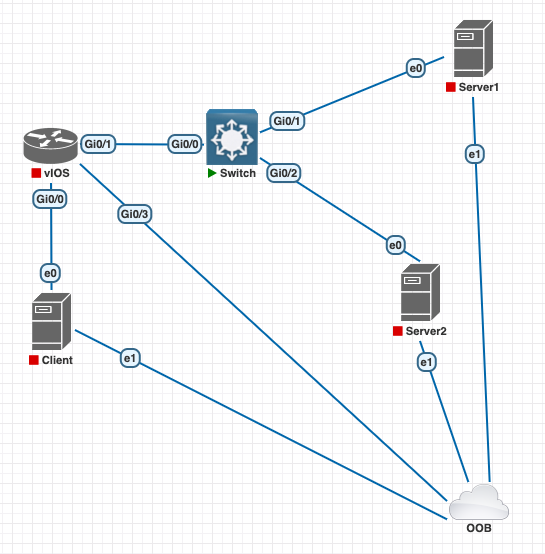

# 🚀 Lab EVE-NG: Triển Khai Cụm HA Chuẩn Production Trên Hạ Tầng Cisco & Keepalived

> 🎯 **Mục tiêu bài lab:**
> 1. Dựng mô hình High Availability (HA) chuẩn doanh nghiệp trên **EVE-NG** với Router **Cisco vIOS**, Switch **Cisco L2**, cụm Web Server chạy **Nginx + Keepalived**.
> 2. Kiểm chứng tận mắt hiện tượng **Cisco IOS ARP Cache Timeout 4 tiếng (14,400 giây)** khi failover không có Gratuitous ARP (GARP).
> 3. Cấu hình bảo vệ Tầng 2 trên Switch: **Spanning-Tree PortFast (Edge Port)** — giải mã nguyên nhân switch "nuốt chửng" gói GARP lúc server vừa khởi động.
> 4. Nâng cấp cụm HA lên chuẩn Enterprise với **Virtual MAC (RFC 5798 / `use_vmac`)** — loại bỏ hoàn toàn sự phụ thuộc vào việc cập nhật ARP của Router.


> 🔗 **Quan hệ với lab chính.** Lab này dùng **cùng sơ đồ IP với lab chính** ở
> [`../README.md`](../README.md): client `172.28.51.20`, node `172.28.52.11` /
> `172.28.52.12`, VIP `172.28.52.100`, router `172.28.51.254` / `172.28.52.254`,
> `virtual_router_id 51`, priority `110`/`100`, `auth_pass 9pingHA1`. Chuyển qua
> lại giữa hai lab không phải học lại sơ đồ.
>
> ⚠️ **Khác biệt có chủ ý:** lab này **không có tầng app `172.28.53.0/24`** —
> nginx chạy thẳng trên node HA, không qua HAProxy. Vì vậy nó **không tái hiện
> được kịch bản 11** (router chặn LB → backend, client nhận HTTP 503). Đổi lại,
> nó cho bạn thứ lab chính không thể có: hành vi thật của thiết bị mạng thật.

---

## 🔬 Sơ Đồ Kiến Trúc Lab Trên EVE-NG



### 📋 Bảng Đấu Nối Cổng & Quy Hoạch IP

| Thiết bị | Cổng | Kết nối tới | Địa chỉ IP / Subnet | Vai trò |
| :--- | :--- | :--- | :--- | :--- |
| **`vIOS`** (Router) | `Gi0/0` | `Client:e0` | `172.28.51.254/24` | Default Gateway mạng Client |
| | `Gi0/1` | `Switch:Gi0/0` | `172.28.52.254/24` | Default Gateway mạng Server |
| | `Gi0/3` | `OOB Cloud` | DHCP / Quản trị | Cổng Out-of-band Management |
| **`Switch`** (L2) | `Gi0/0` | `vIOS:Gi0/1` | - | Uplink lên Router (Access VLAN 1) |
| | `Gi0/1` | `node-a:e0` | - | Access VLAN 1 (PortFast Enabled) |
| | `Gi0/2` | `node-b:e0` | - | Access VLAN 1 (PortFast Enabled) |
| **`Client`** (Linux) | `e0` | `vIOS:Gi0/0` | `172.28.51.20/24` | Client test (GW: `172.28.51.254`) |
| | `e1` | `OOB Cloud` | DHCP / Quản trị | Quản trị OOB |
| **`node-a`** (MASTER) | `e0` | `Switch:Gi0/1` | `172.28.52.11/24`<br>**VIP:** `172.28.52.100/24` | HA Master node (GW: `172.28.52.254`) |
| | `e1` | `OOB Cloud` | DHCP / Quản trị | Quản trị OOB |
| **`node-b`** (BACKUP) | `e0` | `Switch:Gi0/2` | `172.28.52.12/24` | HA Backup node (GW: `172.28.52.254`) |
| | `e1` | `OOB Cloud` | DHCP / Quản trị | Quản trị OOB |

---

## 🛠️ Cấu Hình Thiết Bị Chuẩn Production

Tất cả file cấu hình mẫu hoàn chỉnh đã được đặt trong thư mục [`configs/`](./configs/). Dưới đây là hướng dẫn triển khai chi tiết cho từng thiết bị:

### 1. Router Cisco vIOS (`configs/vIOS.cfg`)
Đăng nhập vào console của `vIOS` và áp dụng cấu hình:

```cisco
enable
configure terminal
hostname vIOS

! 1. Cổng dữ liệu nối sang mạng Client
interface GigabitEthernet0/0
 description [DATA] Uplink to Client (e0)
 ip address 172.28.51.254 255.255.255.0
 no ip redirects
 no ip proxy-arp
 no shutdown

! 2. Cổng dữ liệu nối sang mạng Server (qua Switch)
interface GigabitEthernet0/1
 description [DATA] Uplink to Server Switch (Gi0/0)
 ip address 172.28.52.254 255.255.255.0
 no ip redirects
 no ip proxy-arp
 ! ARP timeout mặc định của Cisco IOS là 14400s (4 tiếng)
 no shutdown

! 3. Cổng quản trị Out-of-band (OOB)
interface GigabitEthernet0/3
 description [OOB] Management Network
 ip address dhcp
 no shutdown

ip routing
ip cef
end
write memory
```

> 🔍 **Kiểm tra timer ARP của interface:**
> ```cisco
> vIOS# show interfaces GigabitEthernet0/1 | include ARP
> ! Kết quả:
> ! ARP type: ARPA, ARP timeout 04:00:00  (ĐÚNG 4 TIẾNG)
> ```

---

### 2. Cisco Switch L2 (`configs/Switch.cfg`)
Trên switch kết nối các server HA, cấu hình Spanning-Tree đóng vai trò sống còn:

```cisco
enable
configure terminal
hostname Switch

spanning-tree mode rapid-pvst
spanning-tree extend system-id

! Uplink lên Router
interface GigabitEthernet0/0
 description [UPLINK] Connect to vIOS Router (Gi0/1)
 switchport mode access
 switchport access vlan 1
 switchport nonegotiate
 no shutdown

! Cổng nối Server 1 và Server 2
interface range GigabitEthernet0/1 - 2
 description [ACCESS] Connect to HA Servers
 switchport mode access
 switchport access vlan 1
 switchport nonegotiate
 ! BẮT BUỘC TRONG PRODUCTION: Bật PortFast (Edge Port) và BPDU Guard!
 spanning-tree portfast edge
 spanning-tree bpduguard enable
 no shutdown
end
write memory
```

> ⚠️ **Bẫy kinh điển: Quên cấu hình `portfast edge` trên cổng Switch nối Server**
> Nếu không có `portfast`, mỗi khi server khởi động lại hoặc card mạng bật/tắt (link flap), cổng switch phải mất **30 giây** trải qua trạng thái Listening $\rightarrow$ Learning trước khi chuyển sang Forwarding.
> Trong 30 giây này, **gói tin GARP do Keepalived phóng ra khi boot sẽ bị Switch DROP hoàn toàn!** Kết quả là cụm HA đã lên nhưng mạng bên ngoài không thể kết nối tới VIP.

---

### 3. Cấu hình Nginx & Keepalived trên `node-a` (MASTER)

#### A. Cấu hình mạng:
```bash
# Đặt IP thật eth0 (Data)
ip addr add 172.28.52.11/24 dev eth0
ip link set eth0 up
ip route add default via 172.28.52.254
```

#### B. Cấu hình Nginx:
Cài đặt Nginx (`apt install -y nginx` hoặc `apk add nginx`) và cấu hình trang hiển thị nhận diện node:
```bash
cat << 'EOF' > /etc/nginx/conf.d/vip-service.conf
server {
    listen 80 default_server;
    server_name _;
    location / {
        add_header X-Backend-Server "node-a-MASTER" always;
        add_header X-Server-IP "172.28.52.11" always;
        return 200 "<h1>TOI LA NODE-A (MASTER)</h1>\n";
    }
    location = /healthz {
        return 200 "OK\n";
    }
}
EOF
systemctl restart nginx
```

#### C. Cấu hình Keepalived (`/etc/keepalived/keepalived.conf`):
Copy nội dung từ [`configs/node-a/keepalived.conf`](./configs/node-a/keepalived.conf):
```keepalived
global_defs {
    router_id SERVER1_MASTER
    enable_script_security
    script_user root

    # Tinh chỉnh GARP Production:
    garp_master_delay 1
    garp_master_repeat 3
    garp_master_refresh 60
    garp_master_refresh_repeat 2
}

vrrp_script chk_nginx {
    script "/etc/keepalived/check_nginx.sh"
    interval 2
    timeout 2
    weight -20
    fall 2
    rise 2
}

vrrp_instance VI_SERVER {
    state MASTER
    interface eth0
    virtual_router_id 51
    priority 110
    advert_int 1

    authentication {
        auth_type PASS
        auth_pass 9pingHA1
    }

    virtual_ipaddress {
        172.28.52.100/24 dev eth0 label eth0:vip
    }

    track_script {
        chk_nginx
    }

    notify_master "/usr/sbin/arping -U -c 5 -I eth0 172.28.52.100"
}
```

Tạo script kiểm tra sức khỏe Nginx (`/etc/keepalived/check_nginx.sh`):
```bash
cat << 'EOF' > /etc/keepalived/check_nginx.sh
#!/usr/bin/env bash
curl -s --max-time 1 -o /dev/null http://127.0.0.1:80/healthz
EOF
chmod +x /etc/keepalived/check_nginx.sh
systemctl enable --now keepalived
```

---

### 4. Cấu hình Nginx & Keepalived trên `node-b` (BACKUP)

#### A. Cấu hình mạng:
```bash
ip addr add 172.28.52.12/24 dev eth0
ip link set eth0 up
ip route add default via 172.28.52.254
```

#### B. Cấu hình Nginx:
```bash
cat << 'EOF' > /etc/nginx/conf.d/vip-service.conf
server {
    listen 80 default_server;
    server_name _;
    location / {
        add_header X-Backend-Server "node-b-BACKUP" always;
        add_header X-Server-IP "172.28.52.12" always;
        return 200 "<h1>TOI LA NODE-B (BACKUP)</h1>\n";
    }
    location = /healthz {
        return 200 "OK\n";
    }
}
EOF
systemctl restart nginx
```

#### C. Cấu hình Keepalived (`/etc/keepalived/keepalived.conf`):
Copy nội dung từ [`configs/node-b/keepalived.conf`](./configs/node-b/keepalived.conf):
```keepalived
global_defs {
    router_id SERVER2_BACKUP
    enable_script_security
    script_user root

    garp_master_delay 1
    garp_master_repeat 3
    garp_master_refresh 60
    garp_master_refresh_repeat 2
}

vrrp_script chk_nginx {
    script "/etc/keepalived/check_nginx.sh"
    interval 2
    timeout 2
    weight -20
    fall 2
    rise 2
}

vrrp_instance VI_SERVER {
    state BACKUP
    interface eth0
    virtual_router_id 51
    priority 100                 # Nhỏ hơn 101 của node-a
    advert_int 1

    authentication {
        auth_type PASS
        auth_pass 9pingHA1
    }

    virtual_ipaddress {
        172.28.52.100/24 dev eth0 label eth0:vip
    }

    track_script {
        chk_nginx
    }

    notify_master "/usr/sbin/arping -U -c 5 -I eth0 172.28.52.100"
}
```

Tạo healthcheck script và khởi chạy dịch vụ:
```bash
cat << 'EOF' > /etc/keepalived/check_nginx.sh
#!/usr/bin/env bash
curl -s --max-time 1 -o /dev/null http://127.0.0.1:80/healthz
EOF
chmod +x /etc/keepalived/check_nginx.sh
systemctl enable --now keepalived
```

---

### 5. Cấu hình Máy Client & Chạy Giám Sát SLA

```bash
# Đặt IP mạng Client
ip addr add 172.28.51.20/24 dev eth0
ip link set eth0 up
ip route add default via 172.28.51.254
```

Tải và chạy script giám sát liên tục [`configs/client/monitor.sh`](./configs/client/monitor.sh):
```bash
chmod +x monitor.sh
./monitor.sh 172.28.52.100
```

---

## 🧪 4 Kịch Bản Thực Chiến Bắt Bệnh & Tối Ưu Hóa

### 🟢 Kịch bản 1: Hệ thống hoạt động bình thường (Baseline)

1. **Trên node-a:** Kiểm tra VIP đã gán vào card mạng:
   ```bash
   ip addr show dev eth0
   # Thấy dòng: inet 172.28.52.100/24 scope global secondary eth0:vip
   ```
2. **Trên Client:** Chạy curl:
   ```bash
   curl http://172.28.52.100
   # Trả về: <h1>TOI LA NODE-A (MASTER)</h1>
   ```
3. **Trên Router Cisco `vIOS`:**
   ```cisco
   vIOS# show ip arp | include 172.28.52.100
   Protocol  Address          Age (min)  Hardware Addr   Type   Interface
   Internet  172.28.52.100            0   5000.0003.0000  ARPA   GigabitEthernet0/1
   ```
   Router học đúng MAC của `node-a` (`5000.0003.0000`), `Age = 0`.

---

### 🚨 Kịch bản 2: Mô phỏng sự cố Outage 4 tiếng (Script tự viết quên GARP)

Giả sử quản trị viên tự động hóa failover bằng script bash/Ansible tự chế mà quên lệnh `arping`:

1. Tắt `node-a`:
   ```bash
   systemctl stop keepalived && ip addr del 172.28.52.100/24 dev eth0
   ```
2. Trên `node-b`, gán VIP thủ công (không phát GARP):
   ```bash
   ip addr add 172.28.52.100/24 dev eth0
   ```
3. **Quan sát từ Client:**
   * Script `monitor.sh` lập tức chuyển đỏ: `BLACKHOLE TIMEOUT (28)`.
   * Gói tin HTTP không có phản hồi vì router gửi frame vào MAC của `node-a` (đã tắt).
4. **Quan sát trên Cisco `vIOS`:**
   ```cisco
   vIOS# show ip arp | include 172.28.52.100
   Internet  172.28.52.100            2   5000.0003.0000  ARPA   GigabitEthernet0/1
   ```
   * Cột `Age` tăng dần: `1`, `2`, `5`, `10` phút...
   * **Thử chờ:** Khác với Docker Linux (tự khỏi sau 35s nhờ NUD), router Cisco **vẫn ôm MAC sai suốt 4 tiếng**!
   * Chiều từ `node-b` ping ra ngoài `172.28.51.20` vẫn thông 100% $\rightarrow$ Triệu chứng **đứt một chiều** kinh điển.

---

### 💊 Kịch bản 3: Sức mạnh của GARP Tuning trong Keepalived chuẩn Production

1. Bật lại Keepalived trên cả 2 node với đầy đủ cấu hình GARP tuning.
2. Tại `Client`, mở script `monitor.sh` để quan sát độ trễ failover.
3. Kích hoạt sự cố: Tắt Nginx trên `node-a` (MASTER):
   ```bash
   systemctl stop nginx
   ```
4. **Diễn biến tự động:**
   * Script `check_nginx.sh` phát hiện lỗi $\rightarrow$ trừ priority của `node-a` từ `101` xuống `81`.
   * `node-b` (priority `100`) nhận thấy priority đối phương thấp hơn $\rightarrow$ Tự động chuyển trạng thái lên `MASTER`.
   * Keepalived trên `node-b` lập tức kích hoạt:
     * Gán VIP `172.28.52.100`.
     * Bắn chùm **3 gói Gratuitous ARP liên tiếp** ra subnet `172.28.52.0/24`.
5. **Kết quả quan sát được:**
   * Trên Router `vIOS`: Gõ `show ip arp | include 172.28.52.100` $\rightarrow$ MAC đã lập tức nhảy sang `5000.0004.0000` của node-b, `Age` về `0`.
   * Trên màn hình `monitor.sh` của Client: Dịch vụ chuyển mượt mà sang `node-b-BACKUP`, downtime chỉ mất **dưới 1–2 giây**!

---

### 🏆 Kịch bản 4: Cấp độ Enterprise — Chuẩn VRRP Virtual MAC (`use_vmac`)

Để loại bỏ hoàn toàn rủi ro GARP bị switch nuốt hoặc router bỏ qua, cấu hình chuẩn RFC 5798 sử dụng **Virtual MAC**:

1. Chỉnh sửa `/etc/keepalived/keepalived.conf` trên cả 2 server:
   ```keepalived
   vrrp_instance VI_SERVER {
       ...
       use_vmac
       ...
   }
   ```
2. Khởi động lại Keepalived:
   ```bash
   systemctl restart keepalived
   ```
3. Kiểm tra interface ảo mới được sinh ra:
   ```bash
   ip link show vrrp.51
   # link/ether 00:00:5e:00:01:33  <-- MAC ẢO CHUẨN VRID 51!
   ```
4. **Cơ chế hoạt động:**
   * VIP `172.28.52.100` được gán trực tiếp vào interface ảo `vrrp.51`.
   * Khi failover xảy ra, **địa chỉ MAC của VIP KHÔNG BAO GIỜ ĐỔI** (vẫn là `00:00:5e:00:01:33`).
   * Router `vIOS` giữ nguyên bảng ARP. Chỉ có switch cập nhật lại MAC `00:00:5e:00:01:33` vừa di chuyển từ cổng `Gi0/1` sang `Gi0/2`.
   * Đạt mức độ HA hoàn hảo, không phụ thuộc vào ARP Cache Timeout của bất kỳ router hãng nào!

---

## 🩺 Cẩm Nang Chẩn Đoán Nhanh (Cheat Sheet)

### Trên Router Cisco IOS:
```cisco
show ip arp                          ! Xem toàn bộ bảng ARP
show ip arp 172.28.52.100            ! Xem chi tiết 1 IP (MAC, Age, Interface)
clear ip arp 172.28.52.100           ! Xoá entry sai (cách chữa cháy khi mất GARP)
clear ip arp *                       ! Xoá toàn bộ cache ARP
show mac address-table               ! Xem bảng CAM trên Switch (MAC -> Port)
debug arp                            ! Bật debug theo dõi gói ARP thời gian thực
```

### Trên Linux Server:
```bash
ip neigh show                        ! Xem bảng ARP
ip neigh flush dev eth0              ! Xoá động cache ARP của interface
ip neigh flush dev eth0 nud permanent! Xoá cả entry tĩnh (PERMANENT)
arping -U -c 5 -I eth0 <VIP>         ! Bắn Gratuitous ARP Request thủ công
arping -A -c 3 -I eth0 <VIP>         ! Bắn Gratuitous ARP Reply thủ công
tcpdump -i eth0 -n -e arp            ! Bắt gói tin ARP trên card mạng
```
